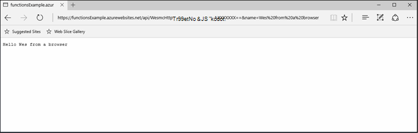

<properties
   pageTitle="Azure függvények tesztelése |} Microsoft Azure"
   description="Tesztelje a Postman, cURL és Node.js Azure függvények."
   services="functions"
   documentationCenter="na"
   authors="wesmc7777"
   manager="erikre"
   editor=""
   tags=""
   keywords="Azure függvények funkciók, esemény feldolgozása, webhooks, dinamikus számítási, kiszolgáló nélküli architektúrában tesztelése"/>

<tags
   ms.service="functions"
   ms.devlang="multiple"
   ms.topic="article"
   ms.tgt_pltfrm="multiple"
   ms.workload="na"
   ms.date="08/19/2016"
   ms.author="wesmc"/>

# Azure függvények tesztelése

## – Áttekintés

Ebben az oktatóanyagban fog végigvezetjük különböző módszerekkel teszteléséhez függvények. Azt határozza meg, hogy elfogadja a lekérdezési karakterlánc paraméter vagy összehívás törzsébe keresztül bevitelt http eseményindító függvényt. Az alapértelmezett **HttpTrigger Node.js függvény** sablon kód támogatja a `name` karakterlánc paraméteres lekérdezés. Azt is hozzáadja a kódot a támogatási mentén, az adott paraméter `address` információkat a felhasználó összehívás törzsébe.

## Létrehozása teszteléshez függvény

A legtöbb ebben az oktatóanyagban fogjuk használni a **HttpTrigger Nodejs függvény** elérhető sablonok létrehozása új függvényt is módosultak kissé verziójának.  Áttekintheti [az első Azure függvény oktatóprogram létrehozása](functions-create-first-azure-function.md) , ha egy új függvény segítséget nyújt.  Csak akkor válassza a **HttpTrigger Nodejs függvény** sablont, a próba függvény létrehozása az [Azure-portálon].

Az alapértelmezett függvény sablon alapjában véve echók ismét a nevét, és a kérelem body vagy a lekérdezési karakterlánc paraméter, Helló világ függvény `name=<your name>`.  A kódot is lehetővé teszi a nevet és címet adja meg a JSON tartalomként összehívás törzsében frissíteni fogjuk. Kattintson a függvény fog jeleníti meg ezeket a vissza az ügyfél, ha lehetséges.   

Frissítse a függvény a következő kódot, amely teszteléshez fogjuk használni:

    module.exports = function(context, req) {
        context.log("Node.js HTTP trigger function processed a request. RequestUri=%s", req.originalUrl);
        context.log("Request Headers = " + JSON.stringify(req.headers));    
    
        if (req.query.name || (req.body && req.body.name)) {
            if (typeof req.query.name != "undefined") {
                context.log("Name was provided as a query string param..."); 
                ProcessNewUserInformation(context, req.query.name);
            }
            else {
                context.log("Processing user info from request body..."); 
                ProcessNewUserInformation(context, req.body.name, req.body.address);
            }
        }
        else {
            context.res = {
                status: 400,
                body: "Please pass a name on the query string or in the request body"
            };
        }
        context.done();
    };
    
    function ProcessNewUserInformation(context, name, address)
    {    
        context.log("Processing User Information...");            
        context.log("name = " + name);            
        echoString = "Hello " + name;
        
        if (typeof address != "undefined")
        {
            echoString += "\n" + "The address you provided is " + address;
            context.log("address = " + address);            
        }
        
        context.res = {
                // status: 200, /* Defaults to 200 */
                body: echoString
            };
    }

## Tesztelje a eszközökkel függvény

### A cURL tesztelése

Gyakran szoftver tesztelésekor nem szükséges bármilyen további, mint a parancssori érdekében, hogy az alkalmazás hibakeresése kereséséhez, ez nem különbözik azokat a funkciókat.

A fenti függvény teszteléséhez **Függvény URL-cím** másolása a portálon. A következő formában lesz: 

    https://<Your Function App>.azurewebsites.net/api/<Your Function Name>?code=<your access code>
    
Ez a függvény el az URL-címét, azt is tesztelje ezt a cURL parancs használatával a parancssorban, hogy egy Get (`-G` vagy `--get`) kérelem szemben, a függvény:

    curl -G https://<Your Function App>.azurewebsites.net/api/<Your Function Name>?code=<your access code>
    
A fenti adott példa igényel egy lekérdezési karakterláncot, amelyeket adatként továbbíthatók (`-d`) a cURL parancsban:

    curl -G https://<Your Function App>.azurewebsites.net/api/<Your Function Name>?code=<your access code> -d name=<Enter a name here>
    
Találat adja meg, és a kimeneti, a függvény a parancssorban látni fogja.

A portál **Naplók** ablakban az alábbihoz hasonló kimeneti be van jelentkezve, a függvény végrehajtása során:

    2016-04-05T21:55:09  Welcome, you are now connected to log-streaming service.
    2016-04-05T21:55:30.738 Function started (Id=ae6955da-29db-401a-b706-482fcd1b8f7a)
    2016-04-05T21:55:30.738 Node.js HTTP trigger function processed a request. RequestUri=https://functionsExample.azurewebsites.net/api/HttpTriggerNodeJS1?code=XXXXXXX&name=Azure Functions
    2016-04-05T21:55:30.738 Function completed (Success, Id=ae6955da-29db-401a-b706-482fcd1b8f7a)

### Tesztelje a böngészővel

Funkciók, amelyek nem igényelnek paraméterek, vagy csak a lekérdezési karakterlánc paraméterei kell is vizsgálni böngészőt használ.

A fenti definiált függvény teszteléséhez **Függvény URL-cím** másolása a portálon. A következő formában lesz:

    https://<Your Function App>.azurewebsites.net/api/<Your Function Name>?code=<your access code>

Hozzáfűzés a `name` karakterláncot az alábbiak szerint lekérdezés használatával tényleges nevét a `<Enter a name here>` helyőrző.

    https://<Your Function App>.azurewebsites.net/api/<Your Function Name>?code=<your access code>&name=<Enter a name here>

Illessze be a böngészőben, és választ az alábbihoz hasonló kapja.

A portál **Naplók** ablakban az alábbihoz hasonló kimeneti be van jelentkezve, a függvény végrehajtása során:

    2016-03-23T07:34:59  Welcome, you are now connected to log-streaming service.
    2016-03-23T07:35:09.195 Function started (Id=61a8c5a9-5e44-4da0-909d-91d293f20445)
    2016-03-23T07:35:10.338 Node.js HTTP trigger function processed a request. RequestUri=https://functionsExample.azurewebsites.net/api/WesmcHttpTriggerNodeJS1?code=XXXXXXXXXX==&name=Wes from a browser
    2016-03-23T07:35:10.338 Request Headers = {"cache-control":"max-age=0","connection":"Keep-Alive","accept":"text/html","accept-encoding":"gzip","accept-language":"en-US"}
    2016-03-23T07:35:10.338 Name was provided as a query string param.
    2016-03-23T07:35:10.338 Processing User Information...
    2016-03-23T07:35:10.369 Function completed (Success, Id=61a8c5a9-5e44-4da0-909d-91d293f20445)

### A Postman tesztelése

Tesztelje a funkciók a legtöbb ajánlott eszköze Postman. Postman telepítéséhez, olvassa el a [Első Postman](https://www.getpostman.com/)című témakört. Postman Itt számos további attribútum HTTP-kérések szabályozható.

> [AZURE.TIP] A többi ügyfél, amelyben Ön kényelmes használja. Íme néhány alternatívája Postman:  
> 
> * [Fiddler](http://www.telerik.com/fiddler)  
> * [Paw](https://luckymarmot.com/paw)  

A kérés szervezetnél függvény Postman ellenőrzéséhez: 

1. Indítsa el a Postman bal felső sarkában Chrome böngészőablakban az **alkalmazások** gombjával.
2. A **Függvény URL-cím** másolása, és illessze be a Postman. A hozzáférési kódot lekérdezési karakterlánc paraméter tartalmazza.
3. Módosítsa a HTTP-metódus **BEJEGYZÉST**.
4. Kattintson a **szervezet** > **nyers** , és adja hozzá a JSON összehívás törzsébe az alábbihoz hasonló:

        {
            "name" : "Wes testing with Postman",
            "address" : "Seattle, W.A. 98101"
        }

5. Kattintson a **Küldés**gombra.

Az alábbi képen látható, az egyszerű halvány működésére tesztelése ebben az oktatóanyagban. 

A portál **Naplók** ablakban az alábbihoz hasonló kimeneti be van jelentkezve, a függvény végrehajtása során:

    2016-03-23T08:04:51  Welcome, you are now connected to log-streaming service.
    2016-03-23T08:04:57.107 Function started (Id=dc5db8b1-6f1c-4117-b5c4-f6b602d538f7)
    2016-03-23T08:04:57.763 Node.js HTTP trigger function processed a request. RequestUri=https://functions841def78.azurewebsites.net/api/WesmcHttpTriggerNodeJS1?code=XXXXXXXXXX==
    2016-03-23T08:04:57.763 Request Headers = {"cache-control":"no-cache","connection":"Keep-Alive","accept":"*/*","accept-encoding":"gzip","accept-language":"en-US"}
    2016-03-23T08:04:57.763 Processing user info from request body...
    2016-03-23T08:04:57.763 Processing User Information...
    2016-03-23T08:04:57.763 name = Wes testing with Postman
    2016-03-23T08:04:57.763 address = Seattle, W.A. 98101
    2016-03-23T08:04:57.795 Function completed (Success, Id=dc5db8b1-6f1c-4117-b5c4-f6b602d538f7)
    
### Tárterület Intézővel blob eseményindító tesztelése

[Microsoft Azure tároló](http://storageexplorer.com/)Intézővel blob eseményindító függvény tesztelheti.

1. Az [Azure-portált] a függvények alkalmazás hozzon létre új C#, F # vagy csomópont blob eseményindító függvény. Állítsa az elérési útját figyelheti a blob-tárolóhoz nevére. Példa:

        files

2. Kattintson a **+** kijelölése vagy a használni kívánt tárterület-fiók létrehozása gombra. Kattintson a **Létrehozás**gombra.

3. Hozzon létre egy szövegfájlt, a következő szöveggel, és mentse:

        A text file for blob trigger function testing.

4. [Microsoft Azure tároló Explorer](http://storageexplorer.com/) futtatása, és a megfigyelt tárhely fiók blob-tárolóhoz csatlakozzon.

5. Kattintson a **Feltöltés** gombra, és töltse fel a szöveget tartalmazó fájlt.

    

    Az alapértelmezett blob eseményindító függvény kód jelentést a blob az naplókban feldolgozása:

        2016-03-24T11:30:10  Welcome, you are now connected to log-streaming service.
        2016-03-24T11:30:34.472 Function started (Id=739ebc07-ff9e-4ec4-a444-e479cec2e460)
        2016-03-24T11:30:34.472 C# Blob trigger function processed: A text file for blob trigger function testing.
        2016-03-24T11:30:34.472 Function completed (Success, Id=739ebc07-ff9e-4ec4-a444-e479cec2e460)

## Tesztelje a függvények belül függvény

### Tesztelje a függvények Portal segítségével gomb

A portál **futtatása** gombra, amely lehetővé teszi, hogy bizonyos korlátozott tesztelje. Megadhat egy összehívás törzsébe használata a Futtatás gombra, de nem adja meg a lekérdezési karakterlánc paramétereket és frissíteni a kérelem fejléceket.

Tesztelje a HTTP eseményindító függvény, a következőhöz hasonló JSON karakterlánc hozzáadása a **szervezet kérése** mező által korábban létrehozott, majd kattintson a **Futtatás** gombra.

    {
        "name" : "Wes testing Run button",
        "address" : "USA"
    } 

A portál **Naplók** ablakban az alábbihoz hasonló kimeneti be van jelentkezve, a függvény végrehajtása során:

    2016-03-23T08:03:12  Welcome, you are now connected to log-streaming service.
    2016-03-23T08:03:17.357 Function started (Id=753a01b0-45a8-4125-a030-3ad543a89409)
    2016-03-23T08:03:18.697 Node.js HTTP trigger function processed a request. RequestUri=https://functions841def78.azurewebsites.net/api/wesmchttptriggernodejs1
    2016-03-23T08:03:18.697 Request Headers = {"connection":"Keep-Alive","accept":"*/*","accept-encoding":"gzip","accept-language":"en-US"}
    2016-03-23T08:03:18.697 Processing user info from request body...
    2016-03-23T08:03:18.697 Processing User Information...
    2016-03-23T08:03:18.697 name = Wes testing Run button
    2016-03-23T08:03:18.697 address = USA
    2016-03-23T08:03:18.744 Function completed (Success, Id=753a01b0-45a8-4125-a030-3ad543a89409)

### Az időzítőszolgáltatás eseményindító tesztelése

Egyes funkciók, a korábban említett eszközzel valóban nem vizsgálni. Például várólista eseményindító függvény, amely lefut, amikor az üzenet [Azure várólista](../storage/storage-dotnet-how-to-use-queues.md)tárolóba megszakad. Sikerült mindig kódírás helyezze a várólista egy üzenetet, és ilyen például a projekt konzol pontjait az alábbiakban. Azonban van egy másik megközelítés tesztelése funkcióval közvetlenül is használhatja.  

Használhatja a várólista konfigurált időzítő az eseményindító is kimeneti kötése. Az időzítőszolgáltatás eseményindító kódot a próba-üzenetek majd írni a várakozási sorban található. Ez a szakasz azt ismerteti, például keresztül. 

Részletesebb információt kötések használatáról az Azure-függvényekkel olvassa el a az [Azure függvények Fejlesztői segédlet](functions-reference.md)című témakört. 

#### Várólista eseményindító teszteléshez létrehozása

Ezt a megközelítést bemutatják, hogy először hozunk létre, amely szeretnénk tesztelése nevű várólista várólista eseményindító függvény `queue-newusers`. Ez a funkció dolgozza fel Azure várólista tárolóba kihagyott új felhasználó nevét és címét adatait. 

> [AZURE.NOTE] Ha egy másik várólista neve használ, ellenőrizze, használt név megfelel-e a [sorok elnevezéséről és a metaadatokat](https://msdn.microsoft.com/library/dd179349.aspx) szabályokat.  Ellenkező esetben a HTTP-állapotkód 400 kapja: Hibás kérés. 

1. Az [Azure-portált] a függvények alkalmazás kattintson az **Új függvénnyel** > **QueueTrigger - C#**.
2. Írja be a várólista nevet ellenőrizni kell a várólista függvény 

        queue-newusers 

3. Kattintson a **+** válasszon vagy hozzon létre a használni kívánt tárterület-fiókot (Hozzáadás) gombra. Kattintson a **Létrehozás**gombra.
4. A portál böngészőablak nyílt meg, hogy figyelheti a naplóbejegyzések, az alapértelmezett várólista függvény sablon kód hagyja.

#### Hozzon létre egy időzítő eseményindító közvetlen üzenetet a várakozási sorban található

1. Nyissa meg az [Azure-portálon] egy új böngészőablakban, és nyissa meg azt a függvény alkalmazás.
2. Kattintson az **Új függvénnyel** > **TimerTrigger - C#**. Írjon be egy beállításához, milyen gyakran az időzítő kód hajtja végre a várólista függvény tesztelése cron kifejezést. Kattintson a **Létrehozás**gombra. Ha azt szeretné, hogy a vizsgálat 30 másodpercenként futtatásához a következő [CRON kifejezés](https://wikipedia.org/wiki/Cron#CRON_expression)használható:

        */30 * * * * *

2. Kattintson az új időzítő eseményindító a **Integrate** fülre.
3. **Kimeneti**kattintson a **+ Új kimeneti** gombra. Kattintson a **várakozási sora** és a **Kijelölés** gombra.
4. Megjegyzés: a nevet, amelyet használ az **várólista üzenet-objektum** , használja az Ez a timer függvény kódot.

        myQueue

4. Írja be a várólista nevét, ahol az üzenetet küld: 

        queue-newusers 

3. Kattintson a **+** (Hozzáadás) gombra kattintva jelölje ki a tárterület-fiókot a várólista hatására a korábban használt. Ezután kattintson a **Mentés**gombra.
4. Kattintson az időzítő eseményindító a **fejlesztése** fülre.
5. A C# timer függvény a következő kódot használhatja, mindaddig, amíg az azonos várólista üzenet objektumnév fent látható használt. Kattintson a **Mentés**

        using System;
        
        public static void Run(TimerInfo myTimer, out String myQueue, TraceWriter log)
        {
            String newUser = 
            "{\"name\":\"User testing from C# timer function\",\"address\":\"XYZ\"}";
        
            log.Verbose($"C# Timer trigger function executed at: {DateTime.Now}");   
            log.Verbose($"{newUser}");   
            
            myQueue = newUser;
        }

Ezen a ponton C# timer függvény hajtja végre 30 másodpercenként a példa cron kifejezés használatakor. A naplók a timer függvény minden végrehajtás jelentést:

    2016-03-24T10:27:02  Welcome, you are now connected to log-streaming service.
    2016-03-24T10:27:30.004 Function started (Id=04061790-974f-4043-b851-48bd4ac424d1)
    2016-03-24T10:27:30.004 C# Timer trigger function executed at: 3/24/2016 10:27:30 AM
    2016-03-24T10:27:30.004 {"name":"User testing from C# timer function","address":"XYZ"}
    2016-03-24T10:27:30.004 Function completed (Success, Id=04061790-974f-4043-b851-48bd4ac424d1)

A böngésző ablakában, a várólista függvény feldolgozása az egyes üzenet jelenik meg:

    2016-03-24T10:27:06  Welcome, you are now connected to log-streaming service.
    2016-03-24T10:27:30.607 Function started (Id=e304450c-ff48-44dc-ba2e-1df7209a9d22)
    2016-03-24T10:27:30.607 C# Queue trigger function processed: {"name":"User testing from C# timer function","address":"XYZ"}
    2016-03-24T10:27:30.607 Function completed (Success, Id=e304450c-ff48-44dc-ba2e-1df7209a9d22)
    
## Tesztelje a kód függvény

### HTTP eseményindító függvény kóddal tesztelése: Node.js

Node.js kód segítségével tesztelje az Azure függvény a HTTP-kérés végrehajtása. 

Győződjön meg róla, hogy állítsa:

- A `host` a függvény alkalmazás állomáshoz a kérelem beállításai
- A függvény neve a `path`.
- A hozzáférési kódot (`<your code>`) a a `path`.

Példa:

    var http = require("http");
    
    var nameQueryString = "name=Wes%20Query%20String%20Test%20From%20Node.js";
    
    var nameBodyJSON = {
        name : "Wes testing with Node.JS code",
        address : "Dallas, T.X. 75201"
    };
    
    var bodyString = JSON.stringify(nameBodyJSON);
    
    var options = {
      host: "functions841def78.azurewebsites.net",
      //path: "/api/HttpTriggerNodeJS2?code=sc1wt62opn7k9buhrm8jpds4ikxvvj42m5ojdt0p91lz5jnhfr2c74ipoujyq26wab3wk5gkfbt9&" + nameQueryString,
      path: "/api/HttpTriggerNodeJS2?code=sc1wt62opn7k9buhrm8jpds4ikxvvj42m5ojdt0p91lz5jnhfr2c74ipoujyq26wab3wk5gkfbt9",
      method: "POST",
      headers : {
          "Content-Type":"application/json",
          "Content-Length": Buffer.byteLength(bodyString)
        }    
    };
    
    callback = function(response) {
      var str = ""
      response.on("data", function (chunk) {
        str += chunk;
      });
    
      response.on("end", function () {
        console.log(str);
      });
    }
    
    var req = http.request(options, callback);
    console.log("*** Sending name and address in body ***");
    console.log(bodyString);
    req.end(bodyString);

Kimenet:

    C:\Users\Wesley\testing\Node.js>node testHttpTriggerExample.js
    *** Sending name and address in body ***
    {"name" : "Wes testing with Node.JS code","address" : "Dallas, T.X. 75201"}
    Hello Wes testing with Node.JS code
    The address you provided is Dallas, T.X. 75201
        
A portál **Naplók** ablakban az alábbihoz hasonló kimeneti be van jelentkezve, a függvény végrehajtása során:

    2016-03-23T08:08:55  Welcome, you are now connected to log-streaming service.
    2016-03-23T08:08:59.736 Function started (Id=607b891c-08a1-427f-910c-af64ae4f7f9c)
    2016-03-23T08:09:01.153 Node.js HTTP trigger function processed a request. RequestUri=http://functionsExample.azurewebsites.net/api/WesmcHttpTriggerNodeJS1/?code=XXXXXXXXXX==
    2016-03-23T08:09:01.153 Request Headers = {"connection":"Keep-Alive","host":"functionsExample.azurewebsites.net"}
    2016-03-23T08:09:01.153 Name not provided as query string param. Checking body...
    2016-03-23T08:09:01.153 Request Body Type = object
    2016-03-23T08:09:01.153 Request Body = [object Object]
    2016-03-23T08:09:01.153 Processing User Information...
    2016-03-23T08:09:01.215 Function completed (Success, Id=607b891c-08a1-427f-910c-af64ae4f7f9c)
    

### Kóddal várólista eseményindító függvény tesztelése: C# #

Azt a korábbiak lehet tesztelni várólista az eseményindító üzenet húzni a várakozási sorban található kód segítségével. A következő példa kódot kikapcsolása a C# kód jelennek meg az [Ismerkedés az Azure várólista-tároló](../storage/storage-dotnet-how-to-use-queues.md) oktatóprogram alapul. Más nyelvek kódját is érhető el a hivatkozást.

Ez a kód tesztelése kell console-alkalmazásban:

- [A tároló kapcsolati karakterláncot az app.config fájl konfigurálása](../storage/storage-dotnet-how-to-use-queues.md#setup-a-storage-connection-string).
- Ez a kód elfogadja a neve és címe egy új felhasználóhoz parancssori argumentumként futtatókörnyezet. A sikeres egy `name` és `address` paraméterként az alkalmazásba. Ha például`C:\myQueueConsoleApp\test.exe "Wes testing queues" "in a console app"`

Példa a C# kód:

    static void Main(string[] args)
    {
        string name = null;
        string address = null;
        string queueName = "queue-newusers";
        string JSON = null;

        if (args.Length > 0)
        {
            name = args[0];
        }
        if (args.Length > 1)
        {
            address = args[1];
        }

        // Retrieve storage account from connection string
        CloudStorageAccount storageAccount = CloudStorageAccount.Parse(ConfigurationManager.AppSettings["StorageConnectionString"]);

        // Create the queue client
        CloudQueueClient queueClient = storageAccount.CreateCloudQueueClient();

        // Retrieve a reference to a queue
        CloudQueue queue = queueClient.GetQueueReference(queueName);

        // Create the queue if it doesn't already exist
        queue.CreateIfNotExists();

        // Create a message and add it to the queue.
        if (name != null)
        {
            if (address != null)
                JSON = String.Format("{{\"name\":\"{0}\",\"address\":\"{1}\"}}", name, address);
            else
                JSON = String.Format("{{\"name\":\"{0}\"}}", name);
        }

        Console.WriteLine("Adding message to " + queueName + "...");
        Console.WriteLine(JSON);

        CloudQueueMessage message = new CloudQueueMessage(JSON);
        queue.AddMessage(message);
    }

A böngésző ablakában, a várólista függvény feldolgozása az egyes üzenet jelenik meg:

    2016-03-24T10:27:06  Welcome, you are now connected to log-streaming service.
    2016-03-24T10:27:30.607 Function started (Id=e304450c-ff48-44dc-ba2e-1df7209a9d22)
    2016-03-24T10:27:30.607 C# Queue trigger function processed: {"name":"Wes testing queues","address":"in a console app"}
    2016-03-24T10:27:30.607 Function completed (Success, Id=e304450c-ff48-44dc-ba2e-1df7209a9d22)

<!-- URLs. -->

[Azure portál]: https://portal.azure.com
