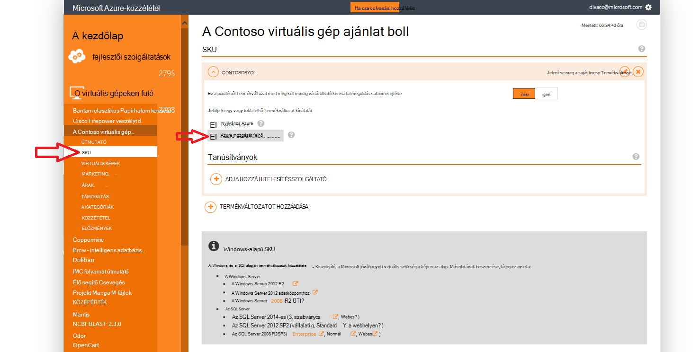
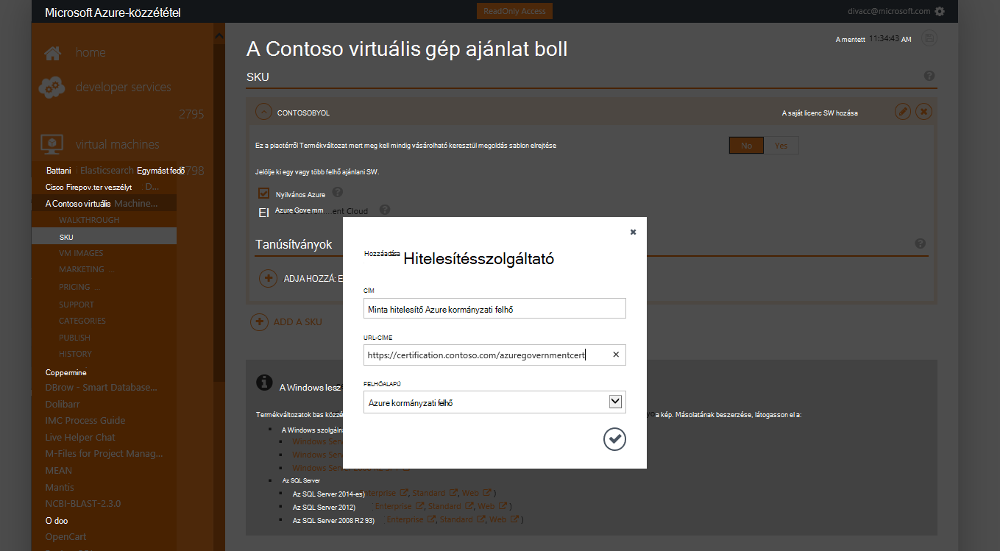
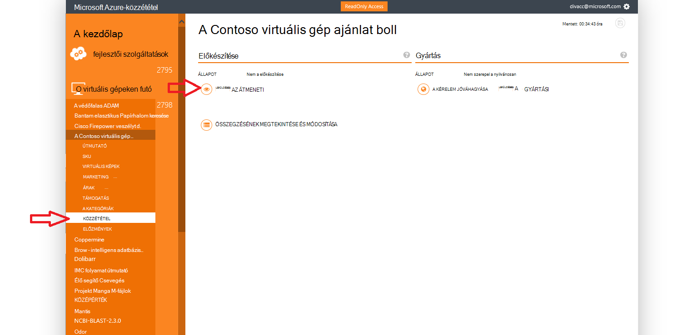
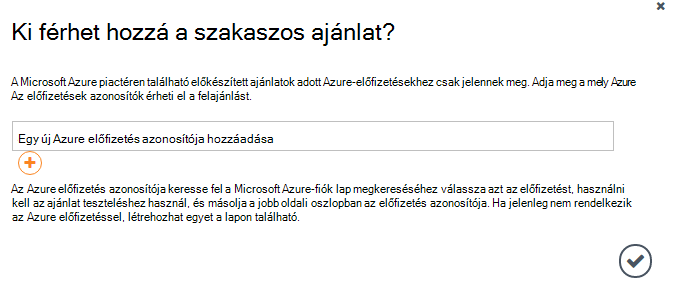
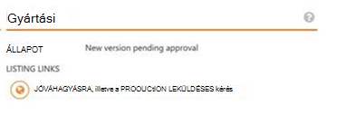

<properties
            pageTitle="Azure kormányzati dokumentáció |} Microsoft Azure"
            description="Ez biztosít, funkciók és útmutatást összehasonlítása Azure kormányzati alkalmazások fejlesztéséhez."
            services="Azure-Government"
            cloud="gov"
            documentationCenter=""
            authors="tsingh"
            manager="asimm"
            editor=""/>
 
<tags    ms.service="multiple"
            ms.devlang="na"
            ms.topic="article"
            ms.tgt_pltfrm="na"
            ms.workload="azure-government"
            ms.date="10/20/2016"
            ms.author="zakramer;tsingh;divacc"/> 

# Kormányzati Azure piactérről
A partnerek közzététele a ajánlataiban kormányzati Azure piactéren érdekli keresse meg a részleteket az alábbi.

## Közzététel
>[AZURE.NOTE] Ha Ön nem egy meglévő Azure tanúsítvánnyal piactérről partnernek, hajtsa végre az [alábbi](../marketplace-publishing/marketplace-publishing-getting-started.md) a folytatás előtt.

### Lépés: 1  
Jelentkezzen be a [https://publish.windowsazure.com](https://publish.windowsazure.com)

### Lépés: 2
Kattintson a közzétenni kívánt ajánlat

### 3 lépés
Kattintson a **Termékváltozatban** , és jelölje be az Azure kormányzati felhő

>[AZURE.NOTE] Csak az előbbre: A saját licenc (BYOL) termékváltozatok támogatottak.  Ez a beállítás nem érhető el az kirovó (PayG) termékváltozatok.

### Lépés: 4
Kattintson a + Hozzáadás hitelesítő hivatkozás hivatkozásokat szeretne felvenni a ajánlatra bármely tanúsítványok.

### 5 lépésben
Ahhoz, hogy a közzétételi portál tesztkép a próba-fiók a Microsoft Azure kormányzati felhőben kérelem: [https://azuregov.microsoft.com/trial/azuregovtrial](https://azuregov.microsoft.com/trial/azuregovtrial)

Amerikai szövetségi, állapot, helyi vagy törzsi szervezetek ellenőrzése és visszaigazoló e-mailek fog biztosítható szolgálja partnerként a jogosultságát.  A próbaidőszak fiók lesz elérhető belül a 3-5 üzleti napig tart.

### 6 lépés
Kattintson a Közzététel gombra, és kattintson az előkészítés leküldéses. 

A rendszer kéri, amelynek hozzáférése van a szakaszos kínálnak whitelisted előfizetés adja meg. Adja meg az előfizetés azonosítója újonnan megvásárolt kormányzati Azure próbaverzió fiókjából.

### Lépés 7
Miután sikeresen előkészített a az ajánlatra vonatkozó, a kép [https://portal.azure.us](https://portal.azure.us) a Azure kormányzati próba-fiókjával bejelentkezik tesztelheti.

### Lépés 8
Miután a kép használata a próba-előfizetésre van érvényesített, elérhetővé teheti az ajánlatra vonatkozó élő szerint közzététel parancsra, és nyissa meg a gyártási engedély kérése a. 

## Következő lépések

Kiegészítő információk és frissítések, az előfizetés a [Microsoft Azure kormányzati Blog](https://blogs.msdn.microsoft.com/azuregov/).
