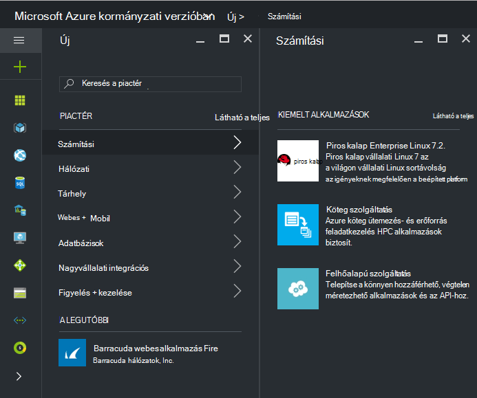
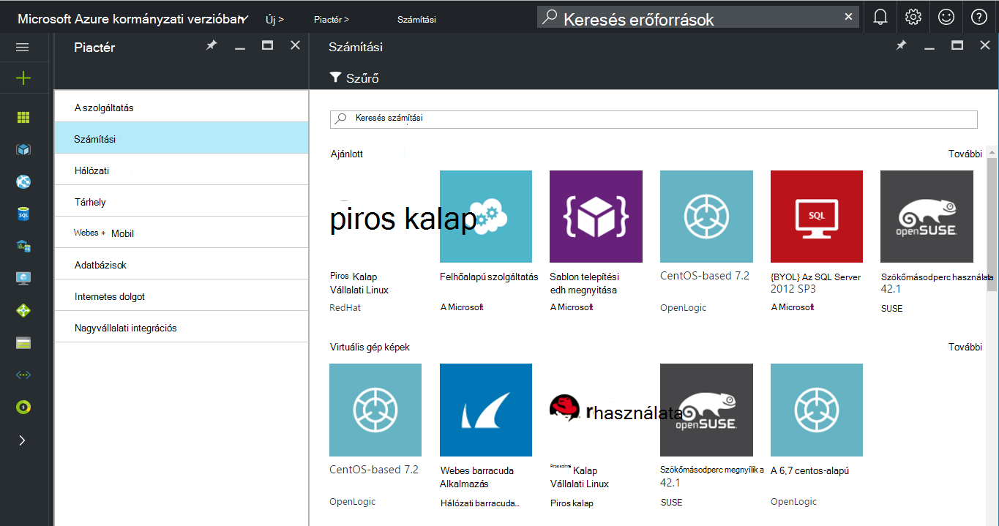
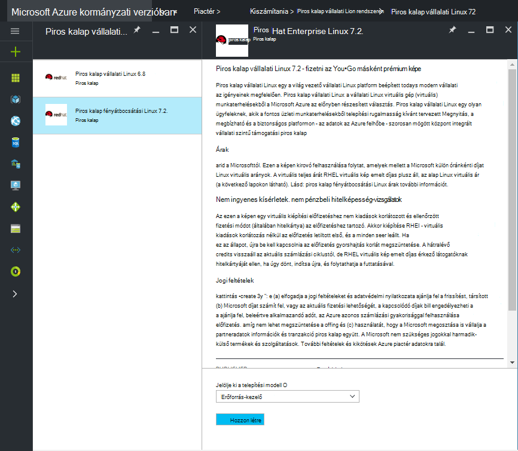
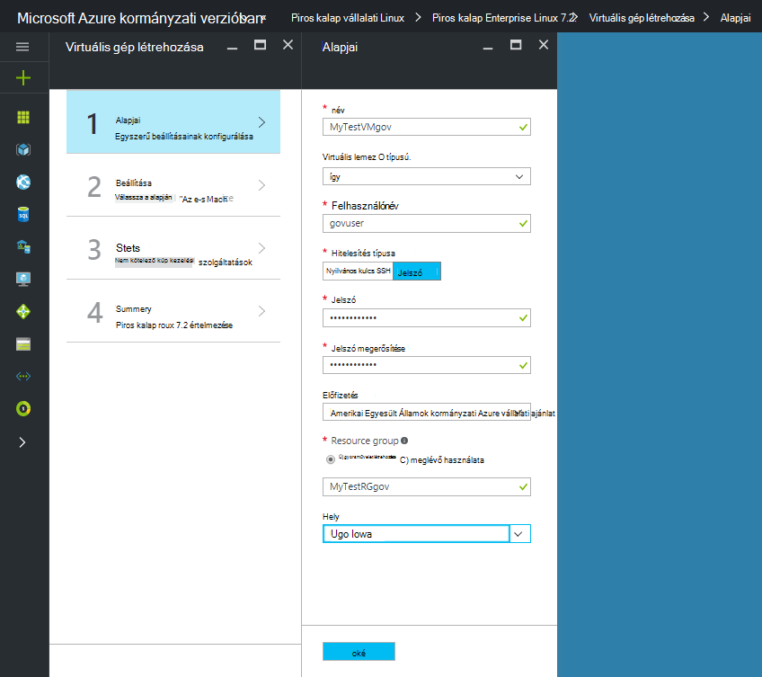
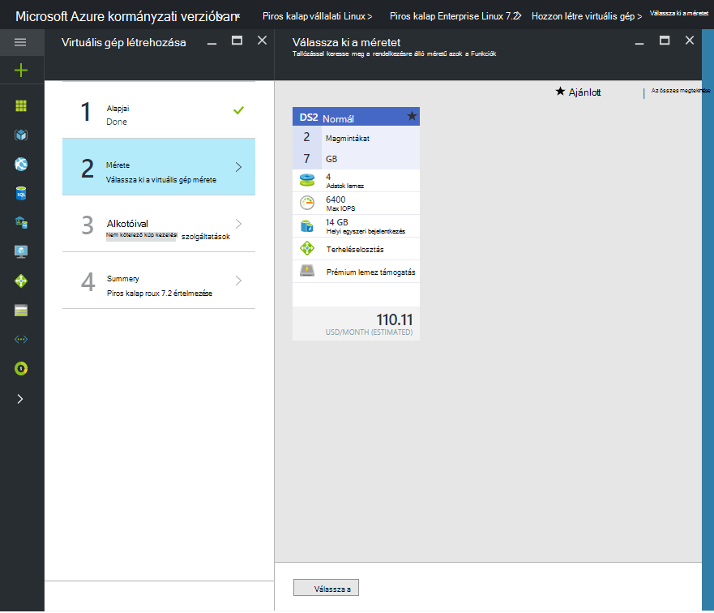

 <properties
    pageTitle="Azure kormányzati dokumentáció |} Microsoft Azure"
    description="Ez biztosít, funkciók és útmutatást összehasonlítása Azure kormányzati alkalmazások fejlesztéséhez."
    services="Azure-Government"
    cloud="gov"
    documentationCenter=""
    authors="VybavaRamadoss"
    manager="asimm"
    editor=""/>

<tags   ms.service="multiple"
    ms.devlang="na"
    ms.topic="article"
    ms.tgt_pltfrm="na"
    ms.workload="azure-government"
    ms.date="10/20/2016"
    ms.author="zakramer;vybavar"/>

# Kormányzati az Azure piactérről
A Microsoft Azure piactéren érhető el az Azure kormányzati képeit a piactér közzétevők frissített listáját. 

## Változatok
Kormányzati Azure piactéren elérhető használatakor az alábbiakban néhány megfontolások:

- Csak az előbbre: A saját licenc (BYOL) képek érhetők el. Nem tud hozzáférni a képet, hogy az Azure piactéren elérhető keresztül beszerzési tranzakció
- Képek csak egy részhalmazát jelenleg áll rendelkezésre a nyilvános marketplace képest. A rendelkezésre álló képek listáját megtalálhatja [az alábbi](../azure-government-image-gallery.md) 
- Kép kiépítési, mielőtt a vállalati rendszergazda engedélyeznie kell a piactér vásárlások Azure-előfizetéséhez
  - Jelentkezzen be a portálon, mint a vállalati rendszergazda
  - Nyissa meg azt a *kezelése*
  - *Regisztrációs részletei* csoportban kattintson a ceruza ikonra az *Azure piactéren elérhető* sor elem mellett
  - Váltás a *Engedélyezve/letiltott* szükség szerint
  - Kattintson a *Mentés* gombra.

>[AZURE.NOTE] Ha érdekli, hogy a Azure kormányzati érhető el a képek találhat további információt a [partner bevezetési irányelveket](documentation-government-manage-marketplace-partners.md) .

### Lépés: 1
Indítsa el a piactér

  

### Lépés: 2
Különböző termékek könnyebben megtalálhatja a keresett tallózásához.

A piactér publisher itt tanúsítványok listáját, a termék leírását, annak érdekében, hogy a megfelelő választás részeként. 

### 3 lépés
Válasszon egy product\image

### Lépés: 4
Indítsa el a létrehozási folyamat, és adja meg a szükséges paramétereket telepítéshez

>[AZURE.NOTE] A hely legördülő lista csak az Azure Government helyek láthatók

### 5 lépésben
Tekintse át az ár

### 6 lépés
Elvégzése, és kattintson az Ok gombra a kiépítési folyamat elindítása

## Következő lépések

Kiegészítő információk és frissítések, az előfizetés a [Microsoft Azure kormányzati Blog](https://blogs.msdn.microsoft.com/azuregov/).
