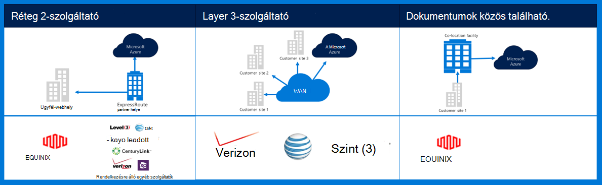
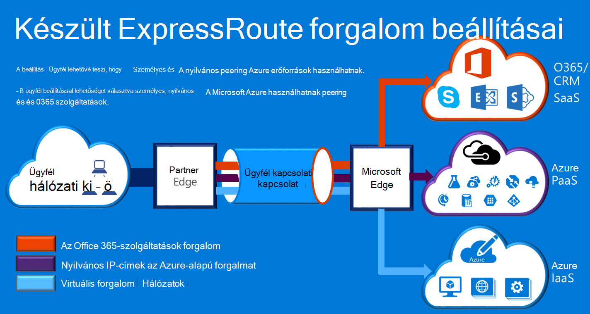

<properties
    pageTitle="Azure Governmenmt dokumentáció |} Microsoft Azure"
    description="Ez a funkció és a személyes elérhetőségének e kormányzati útmutatást összehasonlítása biztosít"
    services="Azure-Government"
    cloud="gov" 
    documentationCenter=""
    authors="ryansoc"
    manager="zakramer"
    editor=""/>

<tags
    ms.service="multiple"
    ms.devlang="na"
    ms.topic="article"
    ms.tgt_pltfrm="na"
    ms.workload="azure-government"
    ms.date="09/28/2016"
    ms.author="ryansoc"/>

#  Azure kormányzati hálózatok

##  Készült ExpressRoute (személyes Connectivity)

Készült ExpressRoute érhető el általában az Azure kormányzati. Többet (beleértve a partnerek és helyek peering) olvassa el a <a href="https://azure.microsoft.com/en-us/documentation/services/expressroute/">készült ExpressRoute nyilvános dokumentációt </a>.

###  Változatok

Készült ExpressRoute általában elérhető (kiadás) az Azure kormányzati. 

- Kormányzati ügyfelek csatlakoztatása fizikailag elszigetelt kapacitású dedikált Azure kormányzati (Gov) készült ExpressRoute (ER) kapcsolaton keresztül

- Azure gov – itt Increased elérhetőségét, és több régió párban használata révén tartóssági található 500 mérföld egymástól legalább 

- Alapértelmezés szerint minden Azure Gov ER kapcsolódási konfigurált aktív-aktív felszakítási támogatása a felesleges és legfeljebb 10 G áramkör kapacitás biztosítja (legkisebb érték 50MB)

- Azure Gov ER helyek ügyfelei és Azure Gov geo felesleges régiók szükséges optimalizált útjainak (legrövidebb Ugrás, kis késés, nagy teljesítményű, stb.)

- A magánjellegű Azure Gov ER kapcsolat nem csatlakozást, bejárása vagy attól függenek, az interneten

- Azure Gov fizikai, logikai és infrastruktúra fizikailag dedikált és elválasztott, és az access korlátozott USA-beli személyeknek

- A Microsoft tulajdonában van, és az összes optikai infrastruktúra Azure Gov régiók és Azure Gov ER értekezlet között működik-én helyek

- Azure Gov ER Microsoft Azure, az Office 365-ös és a CRM felhőszolgáltatások kapcsolatot biztosít.

### Megfontolandó szempontok

Nincsenek két alapvető szolgáltatások, amelyek az Azure kormányzati magánhálózati kapcsolatot biztosít: VPN (-webhelyek egy tipikus szervezet) és készült ExpressRoute.

Készült Azure ExpressRoute az Azure kormányzati adatközpontokkal és a helyszíni infrastruktúra, illetve colocation környezetben privát kapcsolatok létrehozására szolgál. Kapcsolatok készült ExpressRoute ne lépjen a nyilvános interneten keresztül – további megbízhatóság gyorsabb sebességének és alsó késések, mint a szokásos internetes kapcsolatok kínálnak. Egyes esetekben az adatátvitel között van rendszerek és Azure hozam jelentős előnyökkel jár költség készült ExpressRoute kapcsolatok használata.   

Készült ExpressRoute, az Azure-készült ExpressRoute helyen (például egy Exchange-szolgáltató létesítmény) kapcsolatok létrehozása, vagy közvetlenül csatlakozik Azure a meglévő WAN hálózatról (például egy multiprotocol címke csomagváltási (MPLS) VPN Használatát a hálózat szolgáltató által biztosított).

    

A hálózati szolgáltatások Azure kormányzati ügyfél-alkalmazások és a megoldások erősen ajánlott, hogy a készült ExpressRoute (magánjellegű connectivity) történik-e csatlakozni az Azure kormányzati. Ha a virtuális Magánhálózati kapcsolatot használ, az alábbi tekintendő:

- Vegye fel a kapcsolatot a engedélyező hivatalos/ügynökség határozza meg a személyes kapcsolat vagy más biztonságos kapcsolatot mechanizmusa szükség-e, és további korlátozások szempontok azonosítása.

- Ügyfelek kell, hogy a határozza meg, hogy a webhely VPN személyes kapcsolat zónán továbbít-e.

- Ügyfelek kell szerezze be az MPLS áramkör vagy a virtuális Magánhálózati egy licencelt személyes kapcsolat access-szolgáltatóval.

Az összes ügyfelek, akik a saját csatlakozási architektúra kell erősítenie, hogy egy megfelelő végrehajtása létrehozott és az ügyfél-kapcsolat a átjáró hálózat és Internet szeretne tartani (GN / e) útválasztó kijelölése pont él az Azure kormányzati. Hasonlóképpen a szervezet létre kell hoznia a helyszíni környezet és az átjáró hálózati/ügyfél (GN/C) él útválasztó kijelölése pont közötti hálózati kapcsolat az Azure kormányzati.

## Következő lépések

A kiegészítő információk és frissítések előfizetés adjon a <a href="https://blogs.msdn.microsoft.com/azuregov/">Microsoft Azure kormányzati Blog.</a>
