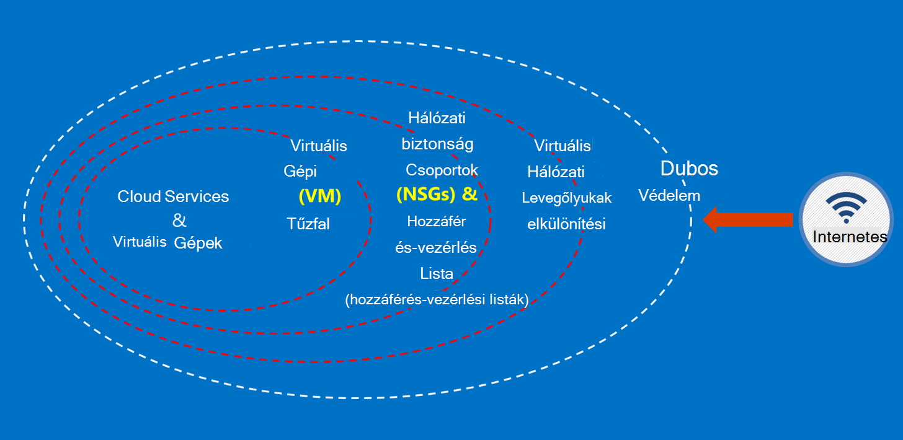

<properties
    pageTitle="Azure kormányzati dokumentáció |} Microsoft Azure"
    description="Ez ez a témakör a szolgáltatást, és útmutatást összehasonlítás Azure kormányzati alkalmazások fejlesztéséhez"
    services="Azure-Government"
    cloud="gov" 
    documentationCenter=""
    authors="ryansoc"
    manager="zakramer"
    editor=""/>

<tags
    ms.service="multiple"
    ms.devlang="na"
    ms.topic="article"
    ms.tgt_pltfrm="na"
    ms.workload="azure-government"
    ms.date="08/25/2016"
    ms.author="ryansoc"/>

#  Azure kormányzati dokumentáció áttekintése

##  Azure kormányzati dokumentáció – bevezetés

Ezen a webhelyen a [Microsoft Azure kormányzati](https://azure.microsoft.com/features/gov/) szolgáltatások funkcióinak ismerteti, és általános útmutatás minden ügyfélnek alkalmazandó. Kifejezetten szabályozott adatok elhelyezése az Azure kormányzati előfizetés, mielőtt megismerkedhet az Azure kormányzati funkciók és Ha kérdése van, olvassa el a fiók csoport.

Az adott jogosítvány és szabályok alá Azure kormányzati szolgáltatásokra vonatkozó legfrissebb információ a [Microsoft Azure adatvédelmi központ megfelelőségi lapon](http://www.microsoft.com/en-us/TrustCenter/Compliance/default.aspx) tekintse át. További Microsoft-szolgáltatások is elérhetők lesznek, de nem az Azure kormányzati érintett szolgáltatások hatálya alá, és a dokumentum nem foglalkozik. Előfordulhat, hogy Azure kormányzati szolgáltatások is lehetővé teszi olyan számos további források, alkalmazások vagy harmadik fél által biztosított szolgáltatások használata – vagy a Microsoft külön feltételek használata és adatvédelmi szabályok szerint – nem szerepelnek a dokumentum körét. Ön a felelős összes ilyen "bővítmény" szeretne rendelni, például piactér szeretne rendelni, annak érdekében, hogy azok az igényeknek megfelelően vonatkozó megfelelőségi feltételeinek áttekintése.

Azure kormányzati entitás, amely kezelni, hogy egyes kormányzati szabályzatát és a vonatkozó követelmények (például NIST 800.171 (DIB), ITAR, Adóhatóság 1075, DoD 4., és CJIS) hol felhasználása Azure kormányzati szabályzatát betartásához szükséges adatokat érhető el. Azure kormányzati leírtakat amelyekre adatérvényesítési jogosultság.

Személyek jogosultságát az Azure kormányzati kérdésekkel forduljon a fiók csoport.

##  Az Azure kormányzati ügyféladatok védelme alapelvei

Azure kormányzati tartalmaz egy cellatartomány funkciók és szolgáltatások, amely szabályozott/ellenőrzött adatok igényekhez felhő megoldások is használhatja. A kompatibilis ügyfél-megoldás nem semmi több, mint a hatékony végrehajtása ki-be az Azure kormányzati funkciók, folytonos adatok biztonsági ajánlott kapcsolódik ahhoz.
Ha Ön üzemelteti a kormányzati Azure megoldást, a Microsoft kezeli ezeknek a követelményeknek, felhőalapú infrastruktúrájának szintre számos.

Az alábbi ábra mutatja az Azure védelmet a z a modell. Ha például a Microsoft egyszerű felhőalapú infrastruktúrájának DDOS, együtt ügyfél lehetőségek, például biztonsági készülékek ügyfélnek szól alkalmazás DDOS van szüksége biztosít.

Ezen az oldalon ismertet a biztosítása érdekében a szolgáltatások és alkalmazások, hogyan alkalmazza a; nyújt útmutatást és a gyakorlati tanácsok a eligazodást elvek Ez azt jelenti hogyan ügyfelek kell használniuk intelligens Azure kormányzati megfeleljen a kötelezettségek és a szükséges információkat ITAR kezeli megoldás feladatkörök.

A átívelő alapelvei ügyféladatok védelme a következők:
* Titkosítással adatok védelme
* Titkos kulcsok kezelése
* Elkülönítési adatokhoz való hozzáférés korlátozása

##  Titkosítással ügyféladatok védelme

Kockázatcsökkentő, és az értekezlet-szabályozó kötelezettségek ösztönzése, a növekvő fókusz és adatok titkosítása fontosságát. Aktuális hálózati és az alkalmazás adatbiztonsági funkcióról növelése egy hatékony titkosítási végrehajtása használatával – és a felhő környezet teljes kockázat csökkentése.

### A többi titkosítás:
A titkosítást, a többi adatot a védelmet a lemez tárolt ügyfél tartalom vonatkozik. Ez akkor fordulhat több módja van:

### Tárterület szolgáltatás titkosítás:

Azure tároló szolgáltatás titkosítás engedélyezve tároló fiók szintre, de így blokk BLOB és Azure tárolóhoz írásakor az automatikusan titkosított, oldal BLOB. Azure-tárhelyről olvasni az adatokat, ha azt fogja fejthető vissza a tárterület-szolgáltatás által visszaküldött előtt. Ezzel az adatok biztonságos anélkül, hogy módosítsa vagy adja hozzá a kódot és más alkalmazások.

### Azure lemez titkosítás:
Az operációs rendszer lemezen és adatok lemezen az Azure virtuális gép által használt titkosítására használt Azure lemezen titkosítást. Integrálása az Azure kulcs tárolóból elemre lépve vezérlők, és lemezen a titkosítási kulcs kezeléséhez nyújt segítséget.

### Ügyféloldali titkosítás:
Ügyféloldali titkosítás beépített a Java- és a .NET tároló ügyfél tárai, amely használhat Azure kulcs tárolóra API-hoz, így túl bonyolult feladat végrehajtásához. Azure kulcs tárolóra segítségével hozzájuthat a titkos kulcsok, az Azure kulcs tárolóból elemre az Azure Active Directory használata egy konkrét munkatársnak.

### A hálózaton átvitt titkosítás:

A rendelkezésre álló Azure kormányzati elérhetőségének egyszerű titkosítás átviteli szint Security (TLS) 1.2-es protokoll és X.509 tanúsítványok támogatja. Szövetségi Information Processing Standard (FIPS) 140-2 1-es szintű titkosítási algoritmust is használja az infrastruktúra hálózati kapcsolatainak Azure kormányzati adatközpontokkal.  Windows Server 2012 R2 és a Windows 8-plus VMs és Azure fájlmegosztások kis-és Középvállalatok 3.0 használhatja a virtuális és fájlmegosztás között titkosításhoz. Az adatok titkosítása előtt átkerül a tároló ügyfélalkalmazás, és az adatok visszafejteni az azt követő átkerülnek tároló ki ügyféloldali-titkosítás használatára.

### Gyakorlati tanácsok a titkosítási

* IaaS VMs: Azure merevlemez-titkosítás használatára. Tárterület szolgáltatás titkosítás titkosítása a virtuális fájlokat, készítsen biztonsági másolatot az Azure-tárolóban lévő adott lemezt használt bekapcsolása, de csak titkosítja újonnan írt adatok. Ez azt jelenti, hogy ha hozzon létre egy virtuális, és a tárterület-fiók a virtuális fájlt tároló engedélyeznie kell a tároló szolgáltatás titkosítást, a változtatások csak titkosítva lesz, nem az eredeti virtuális fájlt.
* Ügyféloldali titkosítás: Ez a legbiztonságosabb mód az adataihoz titkosítására, mert titkosítja a hálózaton átvitt előtt, és az adatokat a többi titkosítja. Azonban kell hozzá kód hozzáadása a alkalmazások tárolására, előfordulhat, hogy nem szeretne tenni. Ebben az esetben is használhatja HTTPs az adatoknak a hálózaton átvitt és a tárhely szolgáltatás titkosítás titkosítása többi adatait. Ügyféloldali titkosítás is magában foglalja az ügyfél több terhelést – különösen akkor, ha titkosítása és átvitele az adatokat a méretezhetőség tervek a fiók kell.

A [Tároló biztonsági útmutató](/storage-security-guide)témakörben további információt a titkosítási Azure-ban.

##  Ügyféladatok védelme kezelésével titkos kulcsok

Biztonságos kulcskezelő elengedhetetlen adatvédelem a felhőben. Ügyfelek kell törekedjen leegyszerűsíti a kulcskezelő, és a felhő alkalmazások és szolgáltatások adatainak titkosítására használt kulcsok vezérlő karbantartásához.

### Gyakorlati tanácsok a titkos kulcsok kezelése

* Titkos kulcsok csomagolásukkor konfigurációs fájlokat parancsfájlok, vagy forráskód kitéve kockázatok csökkentése érdekében használja a kulcs tárolóból elemre. Azure kulcs tárolóra titkosítja kulcsok (például a titkosítási kulcsok, az Azure lemezen titkosítás) és a titkos kulcsok (például jelszavak), és tárolja őket FIPS 140-2 szintet 2 érvényesített hardver biztonsági modulokat (HSMs). A hozzáadott garancia importálhat és kulcsok létrehozásához az alábbi HSMs.
* Alkalmazás kódját, és a sablonok kell csak URI mutató hivatkozásokat tartalmaz a titkos kulcsok (ami azt jelenti, hogy a tényleges titkos kulcsok nem szerepelnek kódot, konfigurációs vagy forráskód tárházakban). Megakadályozza, hogy a kulcsfontosságú adathalászati célú támadásokkal, a belső és külső repók, például betakarítás-botok a GitHub.
* Csatlakozást erős RBAC vezérlők belül kulcs tárolóból elemre. Ha egy megbízható operátor elhagyja a vállalat vagy átvitelek a vállalaton belül egy új csoportba, azok a titkos kulcsok eléréséhez nem lehet letiltja.  

További információkért olvassa el [Az Azure kormányzati kulcs tárolóra](/azure-government/azure-government-tech-keyvault)

##  Elkülönítési adatokhoz való hozzáférés korlátozása

Elkülönítési összes határai, szegmens és tárolók használata csak a hitelesített felhasználóknak, a szolgáltatások és alkalmazások adathozzáférés korlátozhatja az. Például a bérlők elkülönítése multitenant felhő platformok, például a Microsoft Azure-alapvető biztonsági mechanizmusa is. Logikai elkülönítési segítségével megakadályozhatja, hogy a egy bérlői bármelyik másik bérlőn tevékenységének zavarnák.

### Környezet elkülönítési
Az Azure kormányzati környezete egy fizikai különböző nézeten a hálózat többi részén a Microsoft-példányt. Ez fizikai, logikai és vezérlők, többek között az alábbiak sorozata keresztül érhető el: biztonságossá tétele biometrikus eszközök és a fényképezőgépek fizikai korlátokat.  Adott hitelesítő adatait, és az éles üzemi környezetben való logikai hozzáférést igénylő Microsofton többtényezős hitelesítést használata.  Az összes szolgáltatás infrastruktúra Azure kormányzati az Egyesült Államokból helyezkedik el.

#### Ügyfél elkülönítési
Hálózati hozzáférés-vezérlés Azure eszközök és keresztül virtuális elkülönítési, a hozzáférés-vezérlési listák, feladatkörök betöltése balancers és IP-szűrők

Ügyfelek további szétválaszthatja az erőforrások előfizetések, az erőforrás csoportok, virtuális hálózatok és alhálózat keresztül.

További információt a Microsoft Azure elkülönítési lásd: a [az Azure biztonsági útmutató elkülönítési szakaszát](/azure-security-getting-started/#isolation).

A kiegészítő információk és frissítések előfizetés adjon a <a href="https://blogs.msdn.microsoft.com/azuregov/">Microsoft Azure kormányzati Blog.</a>
