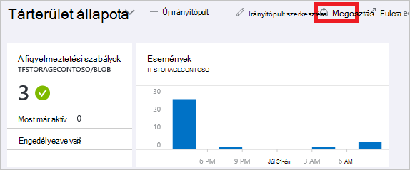
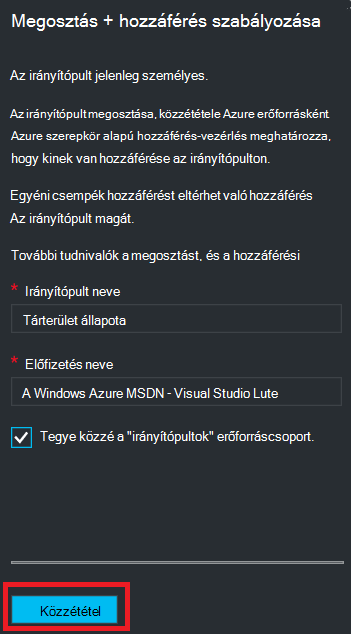
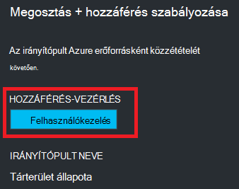
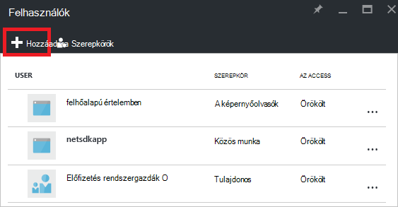
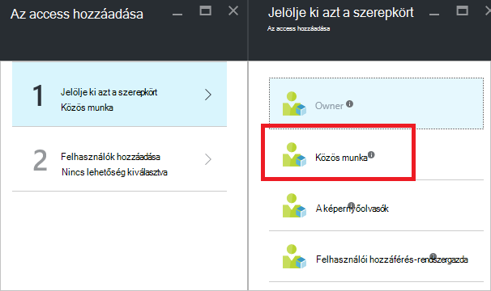
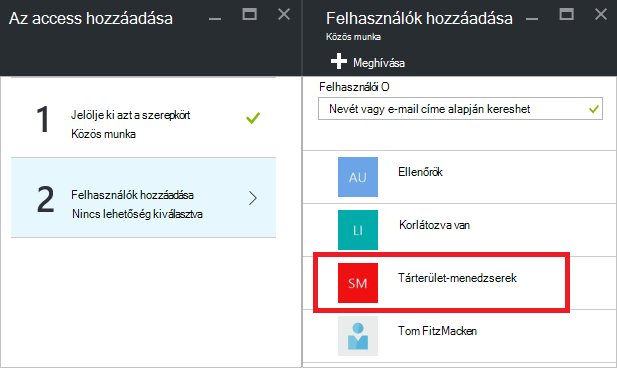
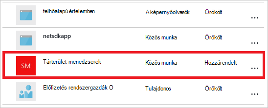

<properties
   pageTitle="Azure portál irányítópult access |} Microsoft Azure"
   description="A cikk ismerteti, hogyan oszthat meg az access egy irányítópult az Azure-portálon."
   services="azure-portal"
   documentationCenter=""
   authors="tfitzmac"
   manager="timlt"
   editor="tysonn"/>

<tags
   ms.service="multiple"
   ms.devlang="NA"
   ms.topic="article"
   ms.tgt_pltfrm="NA"
   ms.workload="na"
   ms.date="08/01/2016"
   ms.author="tomfitz"/>

# Azure irányítópult megosztása

Miután irányítópult, tegye közzé, és megosztása más felhasználókkal a szervezet. Ön engedélyezi másoknak használatával történő elérésére az irányítópult Azure [Szerepkör alapú hozzáférés-vezérlés](../active-directory/role-based-access-control-configure.md). Felhasználó vagy csoport a felhasználók a szerepkör hozzárendelése, és az adott szerepkör határozza meg, hogy azoknak a felhasználóknak nézheti meg vagy módosítsa a közzétett irányítópult. 

Az összes közzétett irányítópultokat végrehajtását Azure erőforrásként, ami azt jelenti, az előfizetés belül kezelhető elemek szerepelnek, és egy erőforrás csoportban találhatók.  A hozzáférési vezérlő szempontjából az irányítópultok olyan nem különbözik más erőforrások, például egy virtuális számítógépre vagy a tárterület-fiókkal.

> [AZURE.TIP] Egyéni csempék az irányítópulton a saját hozzáférési vezérlő követelmények alapján az erőforrások megjelenő hivatkozási.  Ezért miközben továbbra is az egyéni csempék az adatok védelme szélesebb körben megosztott irányítópult tervezhet.

## Az irányítópultok hozzáférés-vezérlés ismertetése

Szerepköralapú hozzáférés-vezérlés a szerepkörökhöz hatókör három különféle szintű adhatnak a felhasználóknak:

- előfizetés
- Erőforráscsoport
- erőforrás

Az engedélyek hozzárendelése öröklik az előfizetést, az erőforrás le. A közzétett irányítópult erőforrás. Ezért előfordulhat, hogy már az előfizetéshez, amely szintén együttműködnek az közzétett irányítópult szerepkörökhöz rendelt felhasználók. 

Lássunk egy példát.  Tegyük fel, hogy Azure szóló előfizetés, és a csapat tagjai különböző rendelkezik a **tulajdonos**, **munkatársi**vagy **olvasó** az előfizetéshez tartozó szerepkörök. Felhasználók, akik a tulajdonosok és a munkatársak is tudják a lista, megtekintése, létrehozása, módosítása és irányítópultok belül az előfizetés törlése.  Felhasználók, akik olvasóknak képes lista és nézet irányítópultok, de nem módosítása vagy törölheti őket.  Olvasó hozzáféréssel rendelkező felhasználók is tudják, hogy a helyi szerkesztéseket a közzétett irányítópultok (például: Ha probléma elhárításához), azonban nem tudja ezekhez a változtatásokhoz vissza közzététele a kiszolgálón.  A vezérlőt, amellyel az irányítópulton titkos másolatot készíteni maguknak rendelkeznek

Azonban sikerült is az engedélyek kiosztási az erőforráscsoport több irányítópultokat tartalmazó vagy egy különálló irányítópult. Ha például dönthet úgy, hogy felhasználók egy csoportja kell korlátozott engedélyek végig az előfizetést, de egy adott irányítópult nagyobb hozzáférés. Azoknak a felhasználóknak, hogy irányítópult szerepkörbe rendelhet. 

## Irányítópult közzététele

Tegyük fel, hogy befejezte, hogy meg szeretné osztani az előfizetést felhasználók egy csoportja egy irányítópult beállítását. Az alábbi lépésekkel jelzik a tárterület-menedzserek létrehoz egy testre szabott csoportot, de tetszés szerinti nevet adhat a csoport minden szeretné. Miként hozhat létre az Active Directory-csoportot, és hozzá a felhasználókat, hogy a csoport további tudnivalókért lásd [az Azure Active Directory kezelése csoportokat](../active-directory/active-directory-accessmanagement-manage-groups.md).

1. Az irányítópult lapon kattintson a **megosztás**elemre.

     

2. Hozzáférés engedélyezése előtt közzé kell tennie az irányítópulton. Alapértelmezés szerint az irányítópulton fog közzétehető **irányítópultok**nevű erőforráscsoport. Jelölje ki a **közzétenni**.

     

Az irányítópult most közzé van téve. Alkalmasak öröklik az előfizetést az engedélyeket, ha nem kell tennie semmit sem további. A szervezet más felhasználók is elérhessék és módosítása az irányítópulton a előfizetés szintű szerepkörön alapuló lesz. Azonban ebben az oktatóanyagban vegyük rendelje hozzá felhasználók egy csoportja egy adott irányítópult szerepkörhöz.

## Hozzáférés hozzárendelése egy irányítópult

1. Az irányítópult közzététele, után válassza a **felhasználók kezelése**.

     

2. Az irányítópult szerepkört hozzárendelt már meglévő felhasználók listájának jelenik meg. A meglévő felhasználók listájának ugyanaz, mint az alábbi képen lesz. A hozzárendelések nagy valószínűséggel öröklődnek az előfizetést. Új felhasználó vagy csoport hozzáadásához válassza a **Hozzáadás**lehetőséget.

     

3. Jelölje ki azt a szerepkört, amely a biztosítani kívánt engedélyeket. Ebben a példában jelölje ki a **közös munka**.

     

4. Jelölje ki a felhasználót vagy csoportot, a szerepkör hozzárendelése szeretne. Ha nem látható a felhasználót vagy csoportot a listában keres, használja a Keresés mezőbe. A rendelkezésre álló csoportok listája a csoportok, az Active Directory létrehozott függ.

      

5. Ha befejezte a felhasználók vagy csoportok hozzáadásával, kattintson **az OK gombra**. 

6. Az új hozzárendelés bekerül a felhasználók listáját. Figyelje meg, hogy az **Access** szerepel-e **hozzárendelve** , hanem **örökölt**.

     

## Következő lépések

- Szerepkörök listájáért lásd: [RBAC: beépített szerepkörök](../active-directory/role-based-access-built-in-roles.md).
- Erőforrások kezelése című témakörben talál [kezelése Azure erőforrások portálon keresztül](resource-group-portal.md).