<properties
   pageTitle="Azure portál irányítópultok |} Microsoft Azure"
   description="Ez a cikk ismerteti, hogyan hozhat létre és szerkeszthet irányítópultok az Azure-portálon."
   services="azure-portal"
   documentationCenter=""
   authors="sewatson"
   manager="timlt"
   editor="tysonn"/>

<tags
   ms.service="multiple"
   ms.devlang="NA"
   ms.topic="article"
   ms.tgt_pltfrm="NA"
   ms.workload="na"
   ms.date="09/06/2016"
   ms.author="sewatson"/>

# Létrehozása és megosztása az Azure-portálon irányítópultok

Több irányítópultok létrehozása, és megoszthatja őket másokkal, akiknek hozzáférésük az Azure-előfizetésekhez.  Ebben a bejegyzésben létrehozását és szerkesztését, közzététele és irányítópultok való hozzáférés kezelése az alapokat kerül.

## Irányítópultok pengéit és testreszabása

Az irányítópultok néhány hónapja indítása, nincs óta stabil csökken a lap testreszabása és a gyors növekedése irányítópult testreszabások. Ez erős használatát a trend jeleníti meg, hogy jobban szereti irányítópultok testreszabása pengéit fölé. A trend támogatásához azt eltávolítja a pengéit testreszabása és az irányítópult funkciók fejlesztése erőfeszítéseket jelöl ki. Ha a testre szabott egy lap, a testreszabási hamarosan törlődnek. Meg szeretné őrizni, testreszabás, rögzítése az irányítópultra a testre szabott csempék. Egyszerűen kattintson a jobb gombbal a csempére, és válassza a **kitűzés irányítópult** , az alábbi képen látható módon.

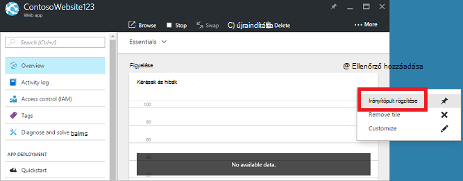

## Irányítópult létrehozása

Irányítópult létrehozása gombra az **Új irányítópult** az aktuális irányítópult neve mellett.  

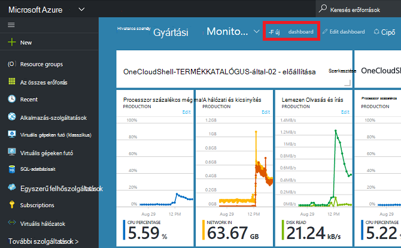

Ez a művelet létrehoz egy új, üres, személyes irányítópult és helyezi, ahol az irányítópult nevet, és felvehet és csempék átrendezése testreszabási módba.  Ebben a módban a összecsukható csempe gyűjtemény elsőbbrendű a bal oldali navigációs menüt.  A mozaik gyűjtemény lehetővé teszi a csempék keresse meg az Azure erőforrások különböző módokon: tallózhat [erőforráscsoport](../azure-resource-manager/resource-group-overview.md#resource-groups), az erőforrás típusa, [címke](../resource-group-using-tags.md)szerint vagy keresésével, hogy az erőforrás neve.  

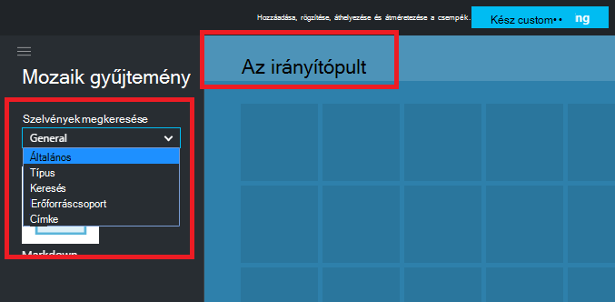

Csempék, húzza őket az irányítópult felületre, ott, ahová tabulátort szeretne adni.

Új kategória, amelyek nem egy adott erőforráshoz társított csempék az **Általános** című van.  Ebben a példában a Markdown csempe rögzítése azt.  Ez a csempe használatával egyéni tartalom hozzáadása az irányítópulthoz.  A mozaik egyszerű szöveg, a [Markdown szintaxis](https://daringfireball.net/projects/markdown/syntax)és a korlátozta a HTML-támogatja.  (Biztonsági, akkor nem dolgot kell tennie, mint behelyezése `<script>` címkék vagy bizonyos stíluselemeket elemmel CSS, amely a portálon zavarhatják.) 

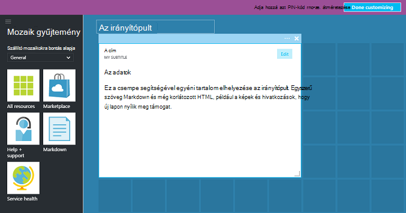

## Irányítópult szerkesztése

Az irányítópult létrehozása, után a csempe gyűjtemény vagy a csempe ábrázolása lemezt csempék is rögzíthet. Vegyük rögzítés az erőforráscsoport ábrázolása. Az elem megnyitásához vagy az erőforrás csoport lap is vagy PIN-kódot. Mindkét megközelítésnek erőforráscsoport ábrázolása csempe rögzítése az eredmény.

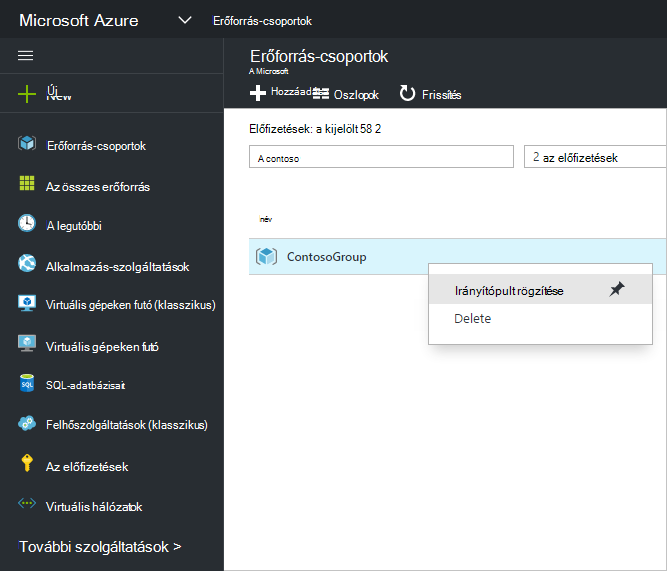

Miután rögzítése az elemet, megjelenik az irányítópulton.

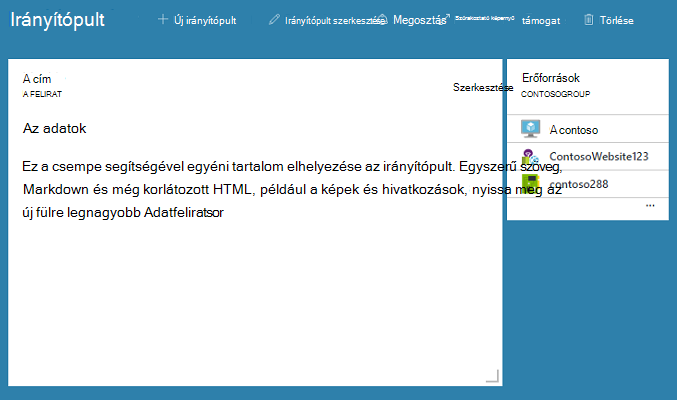

Most, hogy van egy Markdown csempét, és az irányítópult kiemelt erőforráscsoport, hogy átméretezése és a csempék átrendezése a megfelelő elrendezést.

A mozaik környezetfüggő minden parancs megjelenik megjelenítése rámutatáskor, és jelölje ki a (...), vagy kattintson a jobb gombbal a hivatkozásra. Alapértelmezés szerint két elemek találhatók:

1. **Levétel az irányítópult** – eltávolítja a csempe az irányítópult
2.  **Testreszabás** – ír üzemmód testreszabása

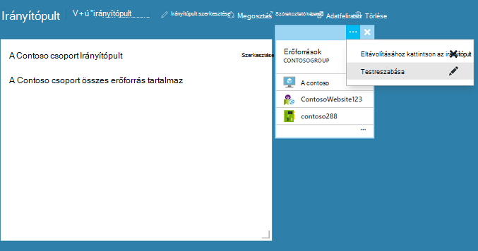

Jelöljön ki testreszabása, átméretezheti és csempék átrendezése. Egy mozaikon átméretezéséhez jelölje be az új méretet a helyi menüben az alábbi képen látható módon.

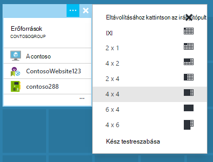

Vagy, ha a mozaik bármilyen méretű támogatja, a jobb alsó sarokban húzhatja a megfelelő méretre.

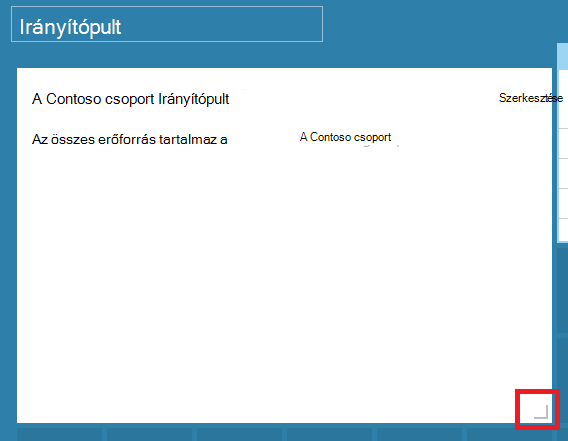

Átméretezése mozaikokat, után megjelenítése az irányítópulton.

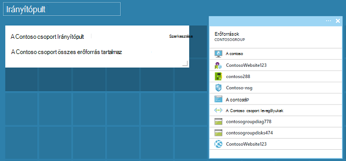

Miután befejezte a testreszabása irányítópult, egyszerűen válassza a **kész testreszabása** való kilépéshez üzemmód testreszabása vagy kattintson a jobb gombbal, és a helyi menüből válassza a **kész testreszabása** .

## Irányítópult közzé, és kezelheti a hozzáférés-vezérlés

Irányítópult létrehozásakor célszerű saját, ami azt jelenti, akkor nem tudja megjeleníteni felhasználó alapértelmezés szerint.  Meg szeretné jeleníteni a másoknak, használja az irányítópult parancsok mellett megjelenő **megosztás** gombra.

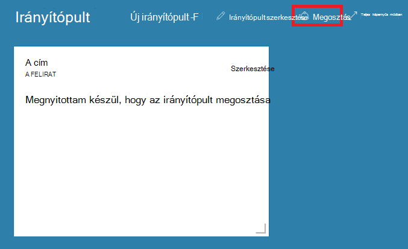

Válasszon egy előfizetés, és az erőforráscsoport az irányítópult közzétételének kérni. Irányítópultok zökkenőmentes integrálása ökológiai, akkor már végrehajtott megosztott irányítópultok Azure erőforrásként (tehát nem lehet megosztani, írja be az e-mail cím).  A legtöbb el a mozaikok a portálon által megjelenített adatokhoz való hozzáférés [Azure szerepkör alapú hozzáférés-vezérlés](../active-directory/role-based-access-control-configure.md )irányadók. A hozzáférési vezérlő szempontjából megosztott irányítópultok különböznek nem egy virtuális számítógépre vagy a tárterület-fiókkal.  

Tegyük fel, hogy Azure szóló előfizetés, és a csapattagokhoz rendelkezik a szerepkörök **tulajdonosa**, **munkatársi**vagy **olvasó** , az előfizetést.  Felhasználók, akik a tulajdonosok és a munkatársak is tudják a lista, megtekintése, létrehozása, módosítása és irányítópultok belül, hogy az előfizetés törlése.  Felhasználók, akik olvasók képes lista és nézet irányítópultok, de nem módosítása vagy törölheti őket.  Olvasó hozzáféréssel rendelkező felhasználók tudja, hogy a helyi szerkesztéseket a megosztott irányítópultok, de nem tud ezekhez a változtatásokhoz vissza közzététele a kiszolgálón.  Jó helyen jár hogy az irányítópulton saját használatra magánjellegű másolatát.  Mint mindig egyéni csempék az irányítópulton hivatkozási saját access-ellenőrzési szabályok, az erőforrások megfelelnek alapján.  

Az egyszerűség kedvéért a portálon közzétételi élmény végigvezeti felé minta irányítópultok elhelyezni egy **irányítópultok**néven erőforrás csoportban.  

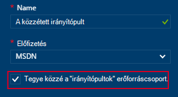

Irányítópult közzététele egy adott erőforráscsoport is választhat.  A hozzáférés-vezérlés az adott irányítópult a hozzáférés-vezérlés az erőforráscsoport írt.  Felhasználók hogyan kezelhetik az erőforrások erőforráscsoport is hozzáférést az irányítópultok.

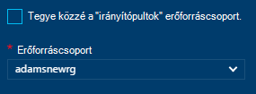

Az irányítópult közzététele után a **megosztás + access** vezérlő ablak frissítése, és mutatja, hogy a közzétett irányítópult, beleértve az irányítópult felhasználói hozzáférés kezelése a mutató hivatkozás adatait.  Ezt a hivatkozást a normál szerepkör-alapú hozzáférés szabályozása a lap bármely Azure erőforrás access kezelésére szolgáló elindítja.  Mindig kattint a nézethez **megosztási**kiválasztásával.

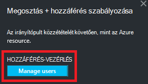

## Következő lépések

- Erőforrások című témakörben [kezelése Azure erőforrások portálon keresztül](resource-group-portal.md).
- Erőforrások üzembe helyezéséhez témakörökben [Deploy az erőforrás-kezelő sablonok és Azure portálon](../resource-group-template-deploy-portal.md).