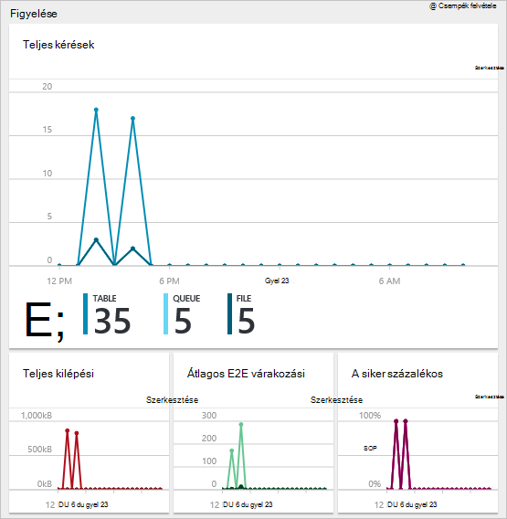

<properties 
    pageTitle="Azure portal segítségével kezelheti az Azure erőforrásokat |} Microsoft Azure" 
    description="Azure-portál és -Azure erőforrás kezelése segítségével az erőforrások kezelése. Lync-erőforrások irányítópultok használata mutatja." 
    services="azure-resource-manager,azure-portal" 
    documentationCenter="" 
    authors="tfitzmac" 
    manager="timlt" 
    editor="tysonn"/>

<tags 
    ms.service="azure-resource-manager" 
    ms.workload="multiple" 
    ms.tgt_pltfrm="na" 
    ms.devlang="na" 
    ms.topic="article" 
    ms.date="09/12/2016" 
    ms.author="tomfitz"/>

# Azure erőforrások keresztül portál kezelése

> [AZURE.SELECTOR]
- [Azure PowerShell](../powershell-azure-resource-manager.md)
- [Azure CLI](../xplat-cli-azure-resource-manager.md)
- [Portál](resource-group-portal.md) 
- [REST API-VAL](../resource-manager-rest-api.md)

Ez a témakör bemutatja, hogyan [Azure erőforrás-kezelő](../azure-resource-manager/resource-group-overview.md) az Azure erőforrások kezelése az [Azure portál](https://portal.azure.com) használata. A portálon keresztül erőforrások telepítésével kapcsolatos című témakörben talál [az erőforrás-kezelő sablonok és Azure portál Deploy erőforrásokat](../resource-group-template-deploy-portal.md).

Jelenleg nem minden szolgáltatás lehetővé teszi, a portálra vagy az erőforrás-kezelő. A szolgáltatások akkor a [Klasszikus portálon](https://manage.windowsazure.com)használja. Egyes szolgáltatások állapotát a [Azure portál elérhetőségi diagram](https://azure.microsoft.com/features/azure-portal/availability/)című témakör tartalmaz.

## Erőforrás-csoportok kezelése

1. Az előfizetés az erőforrás csoportokat megtekintéséhez kattintson **az erőforrás csoportok**.

    

1. Hozzon létre egy üres erőforráscsoport, jelölje be a **Hozzáadás gombra**.

    

1. Adja meg a nevet és helyet az új erőforráscsoport. Jelölje ki a **létrehozása**.

    

1. Előfordulhat, jelölje be a **frissítése** a legutóbb létrehozott erőforrás csoport megtekintéséhez.

    

1. Az erőforráscsoport megjelenített adatok testreszabásához jelölje ki az **oszlopot**.

    

1. Jelölje ki a hozzáadandó oszlopok kiválasztását, és válassza a **frissítés**.

    

1. Erőforrások bevezetéshez az új erőforráscsoport kapcsolatos további tudnivalókért lásd: [Deploy erőforrások az erőforrás-kezelő sablonok és Azure portálon](../resource-group-template-deploy-portal.md).

1. Erőforráscsoport gyorsan hozzáférhet akkor a lap rögzítheti az irányítópult.

    

1. Az irányítópult jeleníti meg, az erőforráscsoport és erőforrásait. Az erőforrás csoportokat vagy az erőforrások közül nyissa meg az elem kijelölése

    

## Címke erőforrások

Erőforrás-csoportok és erőforrások logikailag rendszerezéséhez eszközeit címkéket alkalmazhat. Címkék használata tudni lásd: [az Azure erőforrások rendszerezéséhez használata címkék](../resource-group-using-tags.md).

[AZURE.INCLUDE [resource-manager-tag-resource](../../includes/resource-manager-tag-resources.md)]

## Képernyő-erőforrások

Amikor kijelöl egy erőforrást, az erőforrás lap alapértelmezett grafikonok és táblázatok, hogy az erőforrás típusa figyelemmel kísérésére mutatja be.

1. Jelölje ki a tevékenységet, és figyelje meg a **Figyelés** szakaszban. Grafikonok szempontjából fontos, hogy az erőforrás típusa tartalmazza. Az alábbi képen látható az alapértelmezett nyomon követési adatok tárolására fiókot.

    

1. A lap egy része fölé a szakaszban a három pontra (…) kattintva rögzítheti az irányítópult. Is testre szabhatja a szakasz a lap méretét, illetve távolítsa el teljesen. Az alábbi képen látható, hogyan szeretné rögzíteni, testreszabása és a Processzor- és szakasz eltávolítása.

    

1. Után a szakasz az irányítópult rögzítése, látni fogja az összefoglaló az irányítópulton. És, ha kijelöli, azonnal megnyitja az adatokat olvashat bővebben.

    

1. Az adatok teljesen testre figyelheti a portálon keresztül, nyissa meg azt az alapértelmezett irányítópult, és válassza az **Új irányítópult**.

    

1. Nevezze el az új irányítópult és csempék húzása az irányítópulton. A mozaikok vannak szűrve a különböző beállításokat.

    

     Irányítópultok használata kapcsolatos további tudnivalókért olvassa el a [létrehozása és megosztása az Azure-portálon irányítópultok](azure-portal-dashboards.md)című témakört.

## Erőforrások kezelése

Az erőforrás lap lásd az erőforrás kezelésére vonatkozó beállításokat. A portál forrástáblázat kezelése, hogy az adott erőforrás típusa. A kezeléséhez szükséges parancsokat is, a képernyő tetején, az erőforrás lap és a bal oldalon megjelenik.

Az alábbi lehetőségek közül például indítása és leállítása egy virtuális gép vagy módosít a virtuális gép tulajdonságainak műveleteket végezheti el.

## Erőforrások áthelyezése

Ha erőforrások áthelyezése egy másik erőforráscsoport vagy egy másik előfizetésre van szükség, olvassa el a [áthelyezése erőforrások új erőforráscsoport vagy-előfizetésre](../resource-group-move-resources.md)című témakört.

## Források zárolása

Egy előfizetés, erőforráscsoport vagy erőforrás meg, hogy más felhasználók a szervezet véletlen törlését vagy módosítása a kritikus források zárolása További információért témakörökben [zárolása a Azure-kezelő eszközzel](../resource-group-lock-resources.md).

[AZURE.INCLUDE [resource-manager-lock-resources](../../includes/resource-manager-lock-resources.md)]

## Az előfizetést és a költségeket megtekintése

Információk az előfizetés és az összegzett költségek kapcsolatos összes erőforrás megtekintése. Jelölje ki **az előfizetések** és az előfizetés meg szeretné jeleníteni. Esetleg csak egy előfizetéssel, jelölje be.

Az előfizetés lap belül írási díjának látni.

És erőforrástípus alapján költségeket.

## Sablon exportálása

Az erőforráscsoport beállítása, után érdemes az erőforrás-kezelő sablon az erőforráscsoport megjelenítése. A sablon exportálása kínál a két előnyökkel jár:

1. Egyszerűen automatizálhatja a jövőbeli telepítéseknél a megoldást, mert a sablont tartalmaz, a teljes infrastruktúra.

2. Akkor is megismerje sablon szintaxis megjeleníti a a JavaScript objektum jelölés (JSON), amely a megoldás.

Lépésenkénti, olvassa el [a meglévő erőforrásoktól exportálása Azure erőforrás-kezelő sablont](../resource-manager-export-template.md).

## Erőforráscsoport vagy az erőforrások törlése

Erőforráscsoport törlésekor az abban szereplő összes erőforrás. Egyes erőforrások erőforráscsoport belül is törölheti. Erőforráscsoport törlésekor, mivel előfordulhat, hogy erőforrások vannak csatolva más erőforrás csoportokban fokozott körültekintéssel szeretne. Erőforrás-kezelő program nem törli a csatolt erőforrásokat, de azok nem működnek megfelelően a várt erőforrások nélkül.

## Következő lépések

- Megtekintheti a naplókat, olvassa el [az erőforrás-kezelő műveletek naplózási](../resource-group-audit.md).
- Telepítési hibáinak elhárítása, olvassa el a [Hibaelhárítás erőforrás csoport telepítések Azure Portal segítségével](../resource-manager-troubleshoot-deployments-portal.md)című témakört.
- Források a portálon keresztül üzembe helyezéséhez témakörökben [Deploy az erőforrás-kezelő sablonok és Azure portálon](../resource-group-template-deploy-portal.md).
- Erőforrások elérését című témakörben [szerepkör-hozzárendelések az Azure előfizetés erőforrások való hozzáférés kezelése](../active-directory/role-based-access-control-configure.md).

