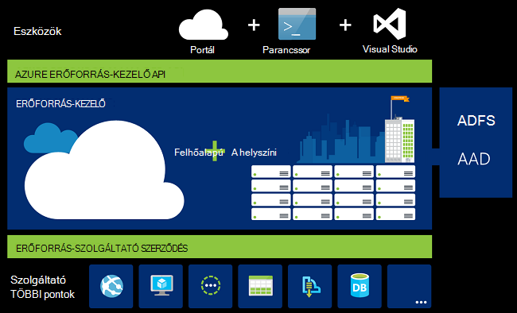
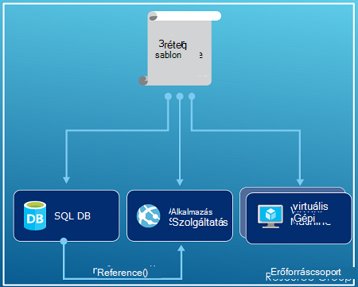
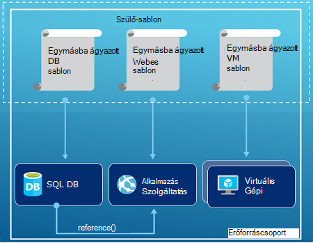
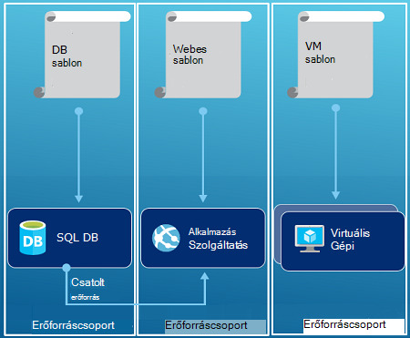

<properties
   pageTitle="Azure erőforrás szolgáltatásának áttekintése |} Microsoft Azure"
   description="Azure erőforrás-kezelő használja a telepítéshez, kezelése és a hozzáférés-vezérlés az erőforrások Azure a ismerteti."
   services="azure-resource-manager"
   documentationCenter="na"
   authors="tfitzmac"
   manager="timlt"
   editor="tysonn"/>

<tags
   ms.service="azure-resource-manager"
   ms.devlang="na"
   ms.topic="get-started-article"
   ms.tgt_pltfrm="na"
   ms.workload="na"
   ms.date="10/21/2016"
   ms.author="tomfitz"/>

# Azure erőforrás szolgáltatásának áttekintése

Az alkalmazás a infrastruktúra általában tevődnek össze számos összetevő – esetleg virtuális gép, tárterület-fiókot, és a virtuális hálózaton, vagy webalkalmazást, adatbázis, adatbázis-kiszolgáló és 3 külső szolgáltatásokra. Ezek az összetevők, a szervezetek külön nem látható, helyette látható őket egy entitás kapcsolódó és egymástól részei. Szeretné üzembe, kezelése és csoportként figyelje őket. Azure erőforrás-kezelő lehetővé teszi, hogy az erőforrásokat a megoldás csoportosan kezelheti. Telepítése, frissítése vagy összes erőforrás törlése egyetlen, összehangolt művelet a megoldás. Telepítés olyan sablont használ, és a sablonon használhatja például vizsgálat, előkészítése és munkakörnyezeti különböző környezetekben Erőforrás-kezelővel biztonsági, naplózás, és a címkéző segít a források kezelése a telepítés után. 

## Kifejezések

Ha még kezdő az Azure erőforrás-kezelő, vannak bizonyos, előfordulhat, hogy nem ismeri a kifejezéseket.

- **erőforrás** - egy teljes egészében elérhetők Azure kezelhető elemet. Néhány általános erőforrás egy virtuális gép, tárterület-fiók, webalkalmazás, adatbázis és virtuális hálózatot, de vannak sok egyebet.
- **erőforráscsoport** – olyan tároló, amely az Azure megoldást kapcsolódó erőforrásokat. Az erőforráscsoport is elhelyezhet, a megoldáshoz az erőforrások, vagy csak a kívánt csoportosan kezelheti erőforrásokat. Úgy dönt, hogy hogyan szeretné erőforrások hozzárendelése az erőforrás-csoportok a szervezet kiválasztania Miből alapján. [Erőforrás-csoport](#resource-groups)megjelenítéséhez.
- **erőforrás-szolgáltató** - szolgáltatás, amely megadja az erőforrások telepítheti és erőforrás-kezelő kezelése. Minden erőforrás-szolgáltató kínál az erőforrásokat van telepítve, a műveletek. Néhány általános erőforrás-szolgáltató, hogy Microsoft.Compute, amely megadja a virtuális gép erőforrás, Microsoft.Storage, amely megadja a tárhely fiók erőforrás, és Microsoft.Web, amely megadja a web Apps alkalmazások kapcsolódó erőforrásokat. Lásd: az [erőforrás-szolgáltatók](#resource-providers).
- **Erőforrás-kezelő sablon** – A JavaScript objektum jelölés (JSON) fájlt, amely definiálja egy vagy több erőforrások erőforráscsoport telepítéshez használni. A határozza meg a telepített erőforrások közötti függőségek is. A sablon egységes és többször az erőforrások telepítendő használható. Lásd: [a sablon telepítésének](#template-deployment).
- **deklaráció szintaxis** - szintaxis, amely lehetővé teszi, hogy azt az "Itt is mi lehet létre szeretne hozni" anélkül, hogy írja be a sorozat programozás parancsok szeretné létrehozni a dokumentumot. Az erőforrás-kezelő sablon képen deklaráció szintaktikai. A fájlban Azure szeretne telepíteni az infrastruktúra tulajdonságainak megadása. 

## Az erőforrás-kezelő használatának előnyei

Erőforrás-kezelő több előnyöket nyújtja:

- Telepíthető, kezelése és összes erőforrás figyelheti a megoldás csoport, hanem ezek az erőforrások egyenként kezelése.
- Többször a fejlesztési életciklus során a megoldást üzembe helyez, és webhelyeit az erőforrások konzisztens állapotban van telepítve.
- A parancsfájlok, hanem deklaráció sablonok révén infrastruktúra kezelheti.
- Megadhatja, hogy a függőségeket, így azokat a megfelelő sorrendben telepítik erőforrások között.
- Alkalmazhat hozzáférés-vezérlés szolgáltatások a erőforráscsoport mivel szerepköralapú hozzáférés szerepalapú natív módon beépül az adatkezelési platform.
- Erőforrások logikailag rendszerezheti az előfizetése összes erőforrás címkéket alkalmazhat.
- Szervezete számlázási egyértelművé teheti az erőforrások megosztása az adott címkét csoportnak költségeket megtekintésével.  

Erőforrás-kezelővel új üzembe helyezéséhez és kezeléséhez, a megoldások lehetőséget. Ha a korábbi telepítési modell használt, és szeretné, ha többet szeretne tudni a módosításokat, olvassa el a [erőforrás-kezelő Pivotbeli üzembe és a klasszikus telepítési](../resource-manager-deployment-model.md).

## Réteg következetes kezelése

Erőforrás-kezelő következetes kezelése réteg biztosít Azure PowerShell, Azure CLI, Azure portál, REST API-val és a Fejlesztőeszközök keresztül elvégezhető. Az eszközök gyakori műveletek használ. Az eszközök, érdemes használni, amely lehet a segítségükkel szót azonos értelemben fejetlenséget nélkül használhatja. 

Az alábbi kép mutatja hogyan az eszközök a azonos Azure erőforrás-kezelő API-val interaktív módon. Az API-t az erőforrás-kezelő szolgáltatása, amelynek a hitelesíti és engedélyezi a kérések kérések továbbítja. Erőforrás-kezelő kérelmek majd a megfelelő erőforrás-szolgáltatók irányítja.

## Útmutató

Az alábbi javaslatok segítenek a teljes mértékben az erőforrás-kezelő a megoldások való munkavégzés során.

1. Határozza meg, és az erőforrás-kezelő sablonok deklaráció szintaxisát keresztül, és nem feltétlenül szükséges parancsok keresztül infrastruktúra telepítése.
2. Az összes telepítés és konfigurációs lépéseket megadása a sablonban. Rendelkeznie kell a megoldás beállításának nincs kézi lépéseit.
3. Az erőforrások, például kezelheti a elindítása és leállítása appok vagy gépi sürgető parancsai futtathatók.
4. Erőforrások rendeznie az azonos életciklus egy erőforrás csoportban. Minden más rendszerezésében erőforrások címkék használata

További javaslatok olvassa el a [Gyakorlati tanácsok az erőforrás-kezelő Azure-sablonok létrehozása](../resource-manager-template-best-practices.md)című témakört.

## Erőforrás-csoportok

Tényező néhány fontos is célszerű figyelembe venni az erőforráscsoport megadásakor:

1. A csoport összes erőforrás az azonos életciklus kell megosztani. Telepítése, frissítése és közös törölje őket. Ha egy erőforrás, például egy adatbázis-kiszolgálóval van szüksége a különböző telepítési verziókövetéssel egy olyan másik erőforráscsoport kell lennie.
2. Az egyes erőforrások csak egy erőforráscsoport is megtalálható.
3. Akkor felvehet és eltávolíthat egy erőforrást egy erőforrás csoportot bármikor.
4. Áthelyezheti egy erőforrás egy erőforrás csoportból másik csoportba. További tudnivalókért olvassa el a [Új erőforráscsoport vagy-előfizetésre erőforrások áthelyezése](../resource-group-move-resources.md)című témakört.
4. Erőforráscsoport tartalmazhat információforrások, amelyek különböző régióban találhatók.
5. Erőforráscsoport szűkítheti a címzettek körét a hozzáférés-vezérlés felügyeleti műveleteket használható.
6. Erőforrás használhatók interaktív módon, a többi erőforráscsoport erőforrásokkal. Kapcsolati esetén közös a két erőforrás kapcsolódnak, de nem osztja meg a azonos életciklusáról (például web apps-adatbázisokhoz való csatlakozási).

Erőforráscsoport létrehozásakor meg kell adnia, hogy erőforráscsoport helyét. Akkor is lehet tudni szeretné, hogy, "Miért erőforráscsoport nek helyét? És, ha az erőforrások erőforráscsoport mint különböző helyeken is rendelkezik, miért nem az erőforrás csoport helyét mindegy egyáltalán?" Az erőforráscsoport erőforrásokról metaadatok tárolja. Emiatt az erőforráscsoport helyét megadásakor megadása esetén a metaadat-alapú tárolási helyére. Megfelelőségi okokból előfordulhat, annak érdekében, hogy az adatok tárolásának-e egy adott régióban.

## Erőforrás-szolgáltatók

Minden erőforrás-szolgáltató kínál az erőforrások és a műveletek az Azure szolgáltatásainak használata. Ha például kulcsok és titkos kulcsok tárolni szeretné, ha használatakor a **Microsoft.KeyVault** erőforrás szolgáltató. Ez az erőforrás-szolgáltató **tárolókban** nevű hozhat létre, a fő tárolóból elemre, és egy erőforrás típusa **tárolókban és titkos kulcsok** nevű egy titkos létrehozásához a a fő tárolóra erőforrástípust kínál. 

Előtt – első lépések az erőforrások telepíti, az erőforrás elérhető szolgáltatók megértéséhez kell révén. Arra az erőforrás-szolgáltatók és az erőforrások nevét segít, hogy a Azure telepítéshez használni kívánt erőforrásokat.

A PowerShell-parancsmagot a összes erőforrás-szolgáltató beolvashatja:

    Get-AzureRmResourceProvider -ListAvailable

Vagy az Azure CLI, az alábbi paranccsal összes erőforrás-szolgáltató beolvasása:

    azure provider list

Kereshet visszaküldött végig az erőforrás-szolgáltatót, amely a kell használnia.

A részleteket szeretne megtudni az erőforrás-szolgáltatót, vegye fel a szolgáltató névtér a parancsot. A parancs az erőforrás-szolgáltatóval, és a támogatott helyek és API-verziók az egyes erőforrások: a támogatott erőforrástípus számítja ki. Az alábbi PowerShell-parancsmag Microsoft.Compute részleteket kapja:

    (Get-AzureRmResourceProvider -ProviderNamespace Microsoft.Compute).ResourceTypes

Vagy az Azure CLI, lekérése a támogatott erőforrástípus, a helyek és az API-verziók Microsoft.Compute, az alábbi paranccsal:

    azure provider show Microsoft.Compute --json > c:\Azure\compute.json

További tudnivalókért lásd: az [erőforrás-kezelő szolgáltatók régiók, API-verziók sémák és](../resource-manager-supported-services.md).

## A sablon telepítésének

Az erőforrás-kezelő sablon (JSON format), amely definiálja az infrastruktúra és konfigurálása az Azure megoldást is létrehozhat. Egy sablon segítségével többször is az életciklus során a megoldást üzembe helyez és megbízhatóság az erőforrások konzisztens állapotban van telepítve van. Ha olyan megoldást hoz létre a portálról, a megoldást automatikusan tartalmazza az üzembe sablon. Nem rendelkezik létrehozhat, a sablon létrehozása a sablon kezdődhet a megoldás, és testre szabhatja a saját igényeinek. Egy meglévő erőforrás-csoport sablon meghallgathatja exportálása erőforráscsoport aktuális állapotát, vagy egy adott telepítéshez használt sablont megtekintése. A [sablon exportált](../resource-manager-export-template.md) megtekintése módja a hasznos, ha többet szeretne tudni a sablon szintaxis.

Többet szeretne tudni a sablont, és hogyan Egyenletszerkesztővel formátumának, lásd: [Azure erőforrás-kezelő sablonok létrehozása](../resource-group-authoring-templates.md) és [Erőforrás-kezelő sablon forgatókönyv](../resource-manager-template-walkthrough.md).

Erőforrás-kezelő végrehajtja a sablont, mint bármely más összehívást (lásd: a kép [következetes kezelése réteg](#consistent-management-layer)). Elemzi a sablont, és azt a szintaxist alakítja a megfelelő erőforrás szolgáltatók REST API-műveletek. Például ha erőforrás-kezelő kap sablon az alábbi erőforrás meghatározása:

    "resources": [
      {
        "apiVersion": "2016-01-01",
        "type": "Microsoft.Storage/storageAccounts",
        "name": "mystorageaccount",
        "location": "westus",
        "sku": {
          "name": "Standard_LRS"
        },
        "kind": "Storage",
        "properties": {
        }
      }
      ]

A definíció alakítja a következő REST API művelet, amelyeket a rendszer elküldi a Microsoft.Storage erőforrás-szolgáltató:

    PUT
    https://management.azure.com/subscriptions/{subscriptionId}/resourceGroups/{resourceGroupName}/providers/Microsoft.Storage/storageAccounts/mystorageaccount?api-version=2016-01-01
    REQUEST BODY
    {
      "location": "westus",
      "properties": {
      }
      "sku": {
        "name": "Standard_LRS"
      },   
      "kind": "Storage"
    }

Sablonok és erőforrás-csoportok meghatározása hogyan teljesen felfelé, és hogyan szeretné kezelni a megoldás van. Például a három réteg alkalmazás egyetlen sablon keresztül telepítheti egyetlen erőforráscsoport.

De nem kell a teljes infrastruktúra definiálása egyetlen sablonba. Gyakran van ilyesmire lehetőség a telepítési követelmények a célközönséget, célból-specifikus sablonok készletét szeretné. Ezek a sablonok különböző megoldások egyszerűen felhasználhatja. Egy adott megoldást üzembe helyezéséhez hozzon létre egy fő sablont, amely a szükséges sablonokat. Az alábbi képen egy három egymásba ágyazott sablonok tartalmazó szülő sablon keresztül három réteg-megoldást üzembe helyez mutatja.

A réteg gondjai életciklusokhoz külön envision akkor, ha a három réteg erőforrás csoportok külön telepítheti. Figyelje meg, az erőforrások továbbra is csatolható erőforrások más erőforrás csoportban.

A sablonok tervezésével kapcsolatos további javaslatok a [mintázatok Azure erőforrás-kezelő sablonok tervezéséhez](../best-practices-resource-manager-design-templates.md)című témakör tartalmaz. Egymásba ágyazott sablonok tudni olvassa el a [csatolt sablonok az Azure erőforrás-kezelő használata](../resource-group-linked-templates.md)című témakört.

Azure erőforrás-kezelő elemzi a függőségeket annak érdekében, hogy a megfelelő sorrendben létrehozott erőforrások. Ha egy erőforrás egy értéket egy másik erőforrás (például egy erre szolgáló a tárterület-fiók a lemezt virtuális gép), a függőség beállítása. További tudnivalókért lásd: [az erőforrás-kezelő Azure sablonok definiáló függőségek](../resource-group-define-dependencies.md).

A sablon frissítéseinek infrastruktúra is használhatja. Például erőforrás felvétele a megoldás, és az erőforrások már telepített konfigurációs szabályok felvétele. Ha a sablon határozza meg, hogy egy erőforrás létrehozása, azonban, hogy az erőforrás már létezik, az Azure erőforrás-kezelő helyett új eszköz frissítés hajt végre. Azure erőforrás-kezelő a meglévő eszköz azonos állapotba frissíti az új lenne.  

Erőforrás-kezelővel bővítmények felhasználási területei további műveletek, például, amely nem szerepel a beállítása adott szoftver telepítése szükség esetén. Ha már használja a konfigurációs alkalmazáskezelési szolgáltatás DSC, tölthetők le vagy Puppet, például bővítményeket használatával is szolgáltatás használata. Virtuális gép bővítmények információt című témakörben [olvashat a virtuális gép extensions és szolgáltatások](../virtual-machines/virtual-machines-windows-extensions-features.md). 

Végül a sablon lesz a forráskódot az alkalmazás részét. Ellenőrizze az adatforrás-kód tárházba, és a módosításokat, az alkalmazás követi. Módosíthatja a sablont a Visual Studio keresztül.

Után definiálásáról a sablont, készen áll az erőforrások Azure telepítéshez használni. A parancsok az erőforrások telepítése című témakörben olvashat:

- [Források az erőforrás-kezelő sablonok és Azure PowerShell telepítése](../resource-group-template-deploy.md)
- [Erőforrás-kezelő sablonok és Azure CLI erőforrások terjesztése](../resource-group-template-deploy-cli.md)
- [Erőforrás-kezelő sablonok és Azure portál erőforrások terjesztése](../resource-group-template-deploy-portal.md)
- [Erőforrás-kezelő sablonok és erőforrás-kezelő REST API erőforrások terjesztése](../resource-group-template-deploy-rest.md)

## Címkék

Erőforrás-kezelővel címkézési szolgáltatása, amely lehetővé teszi, hogy kategorizálása erőforrások vagy a Számlázás kezelése az igényeinek megfelelően. Erőforrás-csoportok és erőforrások összetett hosszas, és azokat az eszközöket, hogy a legtöbb értelemszerű helyeznie címkék használata. Ha például sikerült nyomon követése információforrások, amelyek egy hasonló szerepkör szolgálnak a szervezet, illetve az ugyanazon részleg tartoznak. Címkék nélkül a felhasználók a szervezet több erőforrásokat, hogy nehéz lehet később azonosítása és kezelése hozhat létre. Például érdemes adott projekt az erőforrások törlése. Ha ezek az erőforrások nem a projekthez címkézett, akkor manuálisan megtalálhassák őket. Címkézés, lehet, hogy az előfizetés a szükségtelen költségek csökkentése egy fontos lehetőséget. 

Erőforrások nem kell az azonos erőforráscsoport címke megosztása tárolnak. Egyéni címke osztályozási annak érdekében, hogy a szervezet összes felhasználójának használata helyett véletlenül címkékkel némileg eltérő (például "osztály" helyett "részleg") felhasználók közös címkék hozhat létre.

A következő példa bemutatja egy virtuális gép alkalmazott címke.

    "resources": [    
      {
        "type": "Microsoft.Compute/virtualMachines",
        "apiVersion": "2015-06-15",
        "name": "SimpleWindowsVM",
        "location": "[resourceGroup().location]",
        "tags": {
            "costCenter": "Finance"
        },
        ...
      }
    ]

Címke értéket tartalmazó összes erőforrás beolvasásához, használja az alábbi PowerShell-parancsmagot:

    Find-AzureRmResource -TagName costCenter -TagValue Finance

Másik lehetőségként a következő Azure CLI parancsot:

    azure resource list -t costCenter=Finance --json

Címkézett erőforrások az Azure portálon keresztül is megtekintheti.

A [használati jelentés](../billing/billing-understand-your-bill.md) az előfizetéshez tartozó magában foglalja címke nevét és értéket, amely lehetővé teszi, hogy ki a költségek címkék szerint oldaltörés. Címkékkel kapcsolatos további tudnivalókért olvassa el a [címkék használata a rendszerezheti az Azure erőforrások](../resource-group-using-tags.md)című témakört.

## Hozzáférés-vezérlés

Erőforrás-kezelő lehetővé teszi annak szabályozására, aki rendelkezik hozzáféréssel a szervezet meghatározott műveletekhez. Natív módon szerepköralapú hozzáférés-szerepalapú integrálja a kezelés platform és a hozzáférés-vezérlés vonatkozik az erőforráscsoport az összes szolgáltatás. 

Van két fő fogalmak megértéséhez szerepköralapú hozzáférés-vezérlés való munkavégzés során:

- Szerepkör-definíciók - engedélyek csoportja ismertetése, és sok feladaton használható.
- Szerepkör-hozzárendelés - definícióját (felhasználó vagy csoport) identitással társítása egy adott hatókör (előfizetés, erőforráscsoport vagy erőforrás). A hozzárendelés alsó hatókörök örökli.

Felhasználók felvétele előre definiált platform- és erőforrás-specifikus szerepkörök. Ha például használatba veheti az előre definiált szerepkör nevű olvasó, amely lehetővé teszi a felhasználóknak, tekintse meg a erőforrásokat, de ne módosíthassák őket. A szervezet ilyen típusú az Olvasó szerepkör hozzáférést igénylő felhasználók hozzáadása, illetve a szerepkör alkalmazása az előfizetést, az erőforráscsoport vagy az erőforrás.

Azure nyújt a következő négy platform szerepkörök:

1.  Tulajdonos - kezelhetik a szolgáltatás, beleértve a hozzáférést
2.  Közös munka - kezelhetik a hozzáférés kivételével minden
3.  Olvasó - megtekinthetők mindent, de nem lehet módosítani
4.  Felhasználói hozzáférés - kezelhetik Azure erőforrások felhasználói hozzáférés

Azure is biztosít több erőforrás-specifikus szerepkörök. Néhány gyakori tartalmazza:

1.  Virtuális gép közreműködői - kezelhetik a virtuális gépeken futó, de nem és adjon hozzáférést őket, nem tudják kezelni a virtuális hálózati vagy tároló fiókot, amelyhez csatlakozott
2.  Hálózati közreműködői – az összes hálózati erőforrások kezelése, de nem hozzáférést őket
3.  Tárterület-fiók közös munka - tároló fiókokat, de nem hozzáférést őket
4. Közös munka a SQL Server - kezelhetik az SQL-kiszolgálók és adatbázisok, de nem saját biztonsági házirendek
5. Webhely közreműködői - kezelhetik a webhelyek, de nem a webes tervek, amelyhez csatlakozott

A teljes listáját a szerepkörök és engedélyezett műveletek című [RBAC: beépített szerepkörök](../active-directory/role-based-access-built-in-roles.md). Szerepköralapú hozzáférés-vezérlés kapcsolatos további tudnivalókért olvassa el a [Azure szerepköralapú hozzáférés-vezérlés](../active-directory/role-based-access-control-configure.md)című témakört. 

Egyes esetekben használni kívánt kódot vagy parancsprogramot erőforrások hozzáférő, de nem szeretné, hogy a felhasználó hitelesítő adatok területén futtatásához. Ehelyett kívánt szolgáltatás fő nevű alkalmazásához identitás létrehozása és hozzárendelése a fő a szolgáltatás a megfelelő szerepkört. Erőforrás-kezelő lehetővé teszi, hogy hozhat létre az alkalmazás hitelesítő adatait, és az alkalmazás programozás útján hitelesíteni. Szolgáltatás rendszerbiztonsági létrehozásával kapcsolatos további tudnivalókért lásd: a következő témakörök egyikét:

- [Hozzon létre egy egyszerű erőforrások eléréséhez a Azure PowerShell használatával](../resource-group-authenticate-service-principal.md)
- [Hozzon létre egy egyszerű erőforrások eléréséhez az Azure CLI használatával](../resource-group-authenticate-service-principal-cli.md)
- [Az Active Directory-alkalmazás és a források hozzáférő szolgáltatás egyszerű létrehozása portal segítségével](../resource-group-create-service-principal-portal.md)

Kritikus erőforrások felhasználók számára letiltott művelet törlését vagy módosítását őket közvetlenül is zárolhatja. További információért témakörökben [zárolása a Azure-kezelő eszközzel](../resource-group-lock-resources.md).

## Tevékenység naplók

Erőforrás-kezelő naplózza az összes művelet létrehozása, módosítása vagy erőforrás törlése. A tevékenység naplók keresése a hibát, ha a hiba elhárításához vagy a Lync-hogyan a felhasználó a szervezet egy erőforrás módosított használható. Ha látni szeretné a naplókat, jelölje ki a **Beállítások** lap erőforráscsoport **tevékenység naplók** . A naplók együtt, mely a felhasználó által kezdeményezett a művelet számos különböző értékek szerint szűrheti. Használata a tevékenység naplók tudni olvassa el a [naplózási műveletek az erőforrás-kezelő](../resource-group-audit.md)című témakört.

## Testre szabott házirendek

Erőforrás-kezelő lehetővé teszi az erőforrások kezelésére szolgáló testre szabott házirendek létrehozása. A házirendeket típusú különböző esetek lehetnek. A források, mely típusát, és a példányok erőforrások telepíthető, vagy határértékén azokat a területeket üzemeltetheti egy erőforrás típusú elnevezési alkalmazhat. A címke érték részlegek szerint rendezheti a számlázási erőforrások kérheti. A költségek csökkentése és kezelése az előfizetés konzisztencia házirendek létrehozása 

A JSON házirendek definiálása, és alkalmazhatja házirendekhez, végig az előfizetést, vagy egy erőforrás csoporton belül. Házirendek eltérnek a szerepköralapú hozzáférés-vezérlés, mert erőforrástípus alkalmazza őket.

A következő példa bemutatja egy házirendet, amely a címke konzisztencia biztosítja, hogy az összes erőforrás tartalmazzák costCenter címke megadásával.

    {
      "if": {
        "not" : {
          "field" : "tags",
          "containsKey" : "costCenter"
        }
      },
      "then" : {
        "effect" : "deny"
      }
    }

Nincsenek további típusú házirendek hozhat létre. További tudnivalókért lásd: az [Erőforrások kezelésére és a hozzáférés vezérléséhez feltételei](../resource-manager-policy.md).

## SDK

Azure SDK több nyelvet és platformokon érhetők el.
Nyelvi rendszer ezeket keresztül is elérhető ökológiai csomag kezelő és GitHub együtt.

A kód mindegyik ezek SDK az Azure RESTful API jellemzői jön létre.
Ezeket a jellemzői Megnyitás, és a Swagger 2.0-s specifikációja alapján.
A SDK kódot AutoRest néven Megnyitás-forrás projektben keresztül jön létre.
AutoRest ezek RESTful API jellemzői az ügyfél-tárak különféle nyelvű alakítja.
Javíthatja a létrehozott kódot a SDK bármely tulajdonságát szeretné, a teljes készlete a SDK eszközöket is a Megnyitás, ingyenesen elérhető és elterjedt API specifikációja formátumot alapján.

Az alábbiakban a megnyitott forrás SDK tárházakban. Üdvözli a visszajelzést, problémák, azt, és kérések lekérés.

[.NET](https://github.com/Azure/azure-sdk-for-net) | [Java](https://github.com/Azure/azure-sdk-for-java) | [Node.js](https://github.com/Azure/azure-sdk-for-node) | [PHP](https://github.com/Azure/azure-sdk-for-php) | [Python](https://github.com/Azure/azure-sdk-for-python) | [fonetikus](https://github.com/Azure/azure-sdk-ruby)

> [AZURE.NOTE]Ha a SDK nem nyújt a szükséges funkciót, is felhívhatja az [Azure REST API](https://msdn.microsoft.com/library/azure/dn790568.aspx) -nak közvetlenül.

## A minták

### .NET

- [Azure erőforrások és erőforrás-csoportok kezelése](https://azure.microsoft.com/documentation/samples/resource-manager-dotnet-resources-and-groups/)
- [Egy SSH telepítését engedélyezve van a virtuális sablonnal](https://azure.microsoft.com/documentation/samples/resource-manager-dotnet-template-deployment/)

### Java

- [Azure erőforrások kezelése](https://azure.microsoft.com/documentation/samples/resources-java-manage-resource/)
- [Azure erőforrás-csoportok kezelése](https://azure.microsoft.com/documentation/samples/resources-java-manage-resource-group/)
- [Egy SSH telepítését engedélyezve van a virtuális sablonnal](https://azure.microsoft.com/documentation/samples/resources-java-deploy-using-arm-template/)

### NODE.js

- [Azure erőforrások és erőforrás-csoportok kezelése](https://azure.microsoft.com/documentation/samples/resource-manager-node-resources-and-groups/)
- [Egy SSH telepítését engedélyezve van a virtuális sablonnal](https://azure.microsoft.com/documentation/samples/resource-manager-node-template-deployment/)

### Python

- [Azure erőforrások és erőforrás-csoportok kezelése](https://azure.microsoft.com/documentation/samples/resource-manager-python-resources-and-groups/)
- [Egy SSH telepítését engedélyezve van a virtuális sablonnal](https://azure.microsoft.com/documentation/samples/resource-manager-python-template-deployment/)

### Fonetikus

- [Azure erőforrások és erőforrás-csoportok kezelése](https://azure.microsoft.com/documentation/samples/resource-manager-ruby-resources-and-groups/)
- [Egy SSH telepítését engedélyezve van a virtuális sablonnal](https://azure.microsoft.com/documentation/samples/resource-manager-ruby-template-deployment/)

Ezeket a mintákat mellett, a gyűjtemény minták kereshet.

[.NET](https://azure.microsoft.com/documentation/samples/?service=azure-resource-manager&platform=dotnet) | [Java](https://azure.microsoft.com/documentation/samples/?service=azure-resource-manager&platform=java) | [Node.js](https://azure.microsoft.com/documentation/samples/?service=azure-resource-manager&platform=nodejs) | [Python](https://azure.microsoft.com/documentation/samples/?service=azure-resource-manager&platform=python) | [fonetikus](https://azure.microsoft.com/documentation/samples/?service=azure-resource-manager&platform=ruby)

## Következő lépések

- Egy egyszerű Bevezetés a sablonok használatába [egy erőforrás-kezelő Azure-sablon a meglévő erőforrásoktól exportálása](../resource-manager-export-template.md)című témakör tartalmaz.
- A alaposabb áttekintése a következő sablon létrehozása [Erőforrás-kezelő sablon áttekintése a következő](../resource-manager-template-walkthrough.md)témakörben találhat.
- A függvény a sablon is használhatja, című cikkben talál részletes [sablon függvények](../resource-group-template-functions.md)
- Visual Studio az erőforrás-kezelő használatával kapcsolatos információkért olvassa el a [létrehozása és a Visual Studio segítségével Azure erőforráscsoport telepítése](../vs-azure-tools-resource-groups-deployment-projects-create-deploy.md)című témakört.
- VIEWBEN kódot az erőforrás-kezelő használatával kapcsolatos információkért olvassa el az [Azure erőforrás-kezelő sablonok a Visual Studio kód használata](../resource-manager-vs-code.md)című témakört.

Az alábbiakban a áttekintés szeretné:

[AZURE.VIDEO azure-resource-manager-overview]

[powershellref]: https://msdn.microsoft.com/library/azure/dn757692(v=azure.200).aspx
