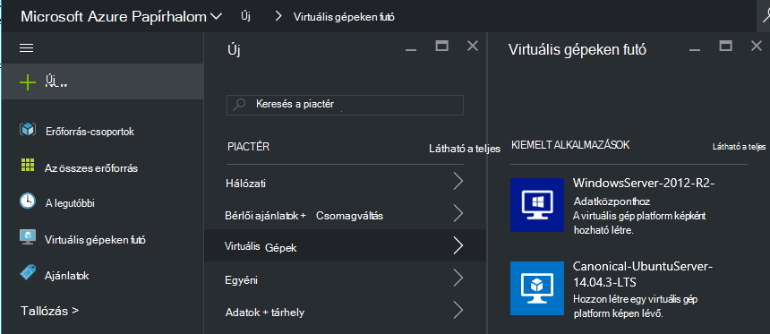
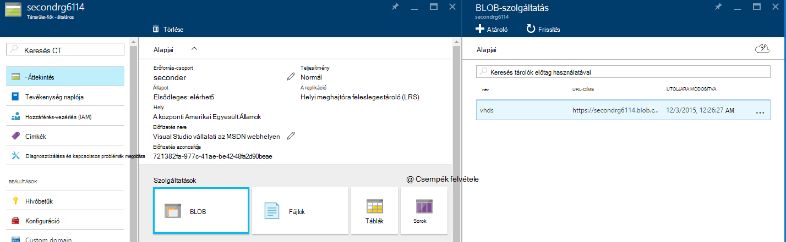
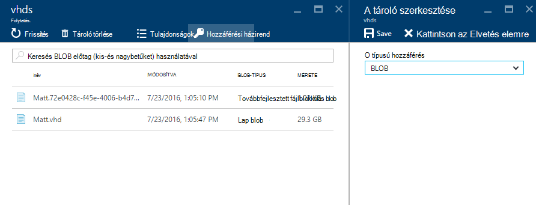
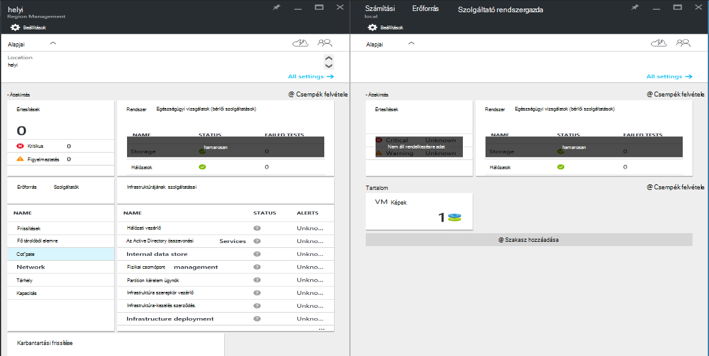
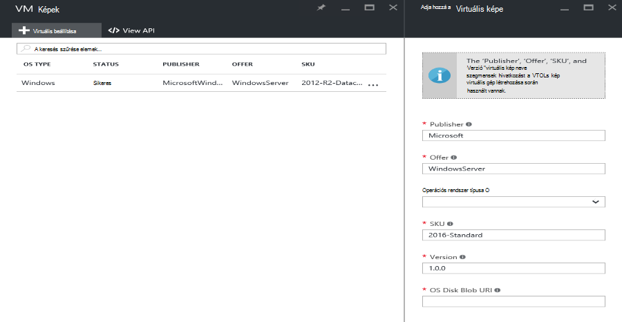

<properties
    pageTitle="A virtuális kép hozzáadása Azure Papírhalom |} Microsoft Azure"
    description="A szervezet egyéni Windows vagy Linux virtuális beállítása a bérlők használata"
    services="azure-stack"
    documentationCenter=""
    authors="mattmcg"
    manager="darmour"
    editor=""/>

<tags
    ms.service="azure-stack"
    ms.workload="na"
    ms.tgt_pltfrm="na"
    ms.devlang="na"
    ms.topic="get-started-article"
    ms.date="09/26/2016"
    ms.author="mattmcg"/>

# <a name="make-a-custom-virtual-machine-image-available-in-azure-stack"></a>Azure egymást fedő elérhetővé egy egyéni virtuális gép képe


Azure Papírhalom lehetővé teszi, hogy virtuális képek, például a szervezet egyéni virtuális, ha elérhetővé szeretné tenni a bérlők rendszergazdái számára. Képek lehet Azure erőforrás-kezelő sablonok által hivatkozott vagy Piactér listaelem létrehozása az Azure piactéren elérhető felhasználói felület adott hozzá. A Windows Server 2012 R2 képet is tartalmazni fogja az Azure Papírhalom Technical Preview alapértelmezés szerint.

> [AZURE.NOTE] Virtuális képek piactér elemekkel elvégezhető **Új** felhasználói felület, majd gomb kiválasztásával a **virtuális gépeken futó** kategóriára. A virtuális kép elemek szerepelnek.


## <a name="add-a-vm-image-to-marketplace-with-powershell"></a>Virtuális kép elhelyezése a PowerShell piactér

Ha a virtuális kép virtuális áll rendelkezésre helyi meghajtóra a virtuális console (vagy egy másik külső felekkel csatlakoztatott eszköz), kövesse az alábbi lépéseket:

1. Felkészülés a Windows vagy Linux rendszerhez operációs rendszer virtuális merevlemez kép virtuális formátumban (nem VHDX).
    -   Windows képek, a cikk [egy erőforrás-kezelő telepítésekhez Azure virtuális Windows kép feltöltése](virtual-machines-windows-upload-image.md) tartalmazza kép előkészítése a **Felkészülés a virtuális való feltöltésre** szakaszban.
    -   Az Linux képek kövesse a Felkészülés a kép vagy egy meglévő Azure Papírhalom Linux kép [üzembe Linux virtuális gépeken futó Azure Papírhalom a](azure-stack-linux.md)cikkben leírt módon.

2. Az [Azure Papírhalom eszközök tárházba](https://aka.ms/azurestackaddvmimage)klónozhatja, és importálja a **ComputeAdmin** modul

    ```powershell
    Import-Module .\ComputeAdmin\AzureStack.ComputeAdmin.psm1
    ```

3. A virtuális kép hozzáadása – VMImage parancsmag meghívása adni.
    -  A publisher, ajánlat, Termékváltozat és a virtuális kép verzió tartalmazzák. Ezeket a paramétereket a virtuális kép hivatkozó Azure erőforrás-kezelő sablonok használják.
    -  Adja meg osType Windows vagy Linux rendszerhez.
    -  Az űrlap tartalmazza az Azure Active Directory-bérlői azonosító * &lt;myaadtenant&gt;*. onmicrosoft.com.
    - Az alábbiakban a parancsprogram példa hívás:

    ```powershell
       Add-VMImage -publisher "Canonical" -offer "UbuntuServer" -sku "14.04.3-LTS" -version "1.0.0" -osType Linux -osDiskLocalPath 'C:\Users\AzureStackAdmin\Desktop\UbuntuServer.vhd' -tenantID <myaadtenant>.onmicrosoft.com
    ```

    > [AZURE.NOTE] A parancsmaggal kéri hitelesítő adatait a virtuális kép. Adja a rendszergazda Azure Active Directory hitelesítő adatait, például: serviceadmin@ * &lt;myaadtenant&gt;*. onmicrosoft.com a kérdésre.  

A parancs az alábbi műveleteket végzi el:
- Az Azure Papírhalom környezetbe hitelesíti
- A helyi virtuális feltöltések megjelenítése az újonnan létrehozott ideiglenes tárterület-fiókhoz
- A virtuális kép tárat a virtuális kép hozzáadása
- Piactér elem létrehozása

Ha ellenőrizni szeretné, hogy a parancsot sikerült futtatta, a portálon a piactér webhelyre léphet, és győződjön meg arról, hogy a virtuális kép érhető el a **virtuális gépeken futó** kategóriára.

> 

Az alábbiakban a parancs paraméterek leírását.


| Paraméter | Leírás |
|----------| ------------ |
|**tenantID** | A képernyőn látható az Azure Active Directory bérlői azonosító * &lt;AADTenantID*. onmicrosoft.com&gt;. |
|**a Publisher** | A publisher neve szakaszához-ös bérlői webhelyek használatát a kép telepítésekor virtuális kép. Példa a "Microsoft". Ne kerüljön bele szóközzel vagy egyéb különleges karaktereket ebben a mezőben.|
|**ajánlat** | Az ajánlat nevét a szakasz-ös bérlői webhelyek használatát a virtuális kép telepítésekor virtuális kép. Példa az "WindowsServer". Ne kerüljön bele szóközzel vagy egyéb különleges karaktereket ebben a mezőben. |
| **Raktári szám** | A virtuális kép-ös bérlői webhelyek használatát a virtuális kép telepítésekor Termékváltozat neve szakaszában. Példa az "Datacenter2016". Ne kerüljön bele szóközzel vagy egyéb különleges karaktereket ebben a mezőben. |
|**verzió** | A virtuális kép-ös bérlői webhelyek használatát a virtuális kép telepítésekor verziója. Ez a verzió *formátumban van \#.\#. \#*. Példa az "1.0.0". Ne kerüljön bele szóközzel vagy egyéb különleges karaktereket ebben a mezőben.|
| **osType** | A kép a osType "Windows" vagy "Linux" kell lennie. |
|**osDiskLocalPath** | Az operációs rendszer lemezre, amely feltöltése a Jegyzettömbhöz Azure virtuális képként virtuális helyi elérési útját. |
|**dataDiskLocalPaths**| Nem kötelező a tömbje adatok lemezen a virtuális kép részeként feltölthető helyi elérési útját.|
|**CreateGalleryItem**| Logikai jelző, amely meghatározza, hogy hozzon létre egy elemet a piactéren. Az alapértelmezett értéke igaz.|
|**cím**| A megjelenítendő név piactér elem. Az alapértelmezett virtuális kép a Publisher-ajánlat-Sku van beállítva.|
|**Leírás**| A piactér elem leírását. |
|**osDiskBlobURI**| Ez a parancsfájl tetszés szerint is blobtárolóhoz URI-osDisk fogadja el.|
|**dataDiskBlobURIs**| Tetszés szerint a parancsfájl is fogadja el Blob-tárolóhoz URL-címe tömbje hozzáadásának adatok lemezt a képet.|


## <a name="add-a-vm-image-through-the-portal"></a>A portálon keresztül virtuális beállítása

> [AZURE.NOTE] Ehhez a módszerhez a piactér elem külön-külön létrehozása.

Képek egy követelmény, hogy azok hivatkozhat Blob-tárolóhoz URI. Felkészülés a Windows vagy Linux rendszerhez operációs rendszer virtuális merevlemez kép virtuális formátumban (nem VHDX), és töltse be a kép Azure-ban vagy az Azure egymást fedő tárterület-fiókhoz. Ha a kép feltöltése már Azure vagy Papírhalom Azure Blob-tárolóhoz, kihagyhatja ezt a lépést.

Kövesse a lépéseket a cikkből [egy erőforrás-kezelő telepítésekhez Azure virtuális Windows kép feltöltése](https://azure.microsoft.com/documentation/articles/virtual-machines-windows-upload-image/) a lépés **a tárterület-fiókjába a virtuális kép feltöltése**keresztül. Tartsa szem előtt a következőket:

-   Linux képen kövesse az utasításokat a kép előkészítése, vagy használhatja a meglévő Azure Papírhalom Linux kép, [üzembe Linux virtuális gépeken futó Azure Papírhalom a](azure-stack-linux.md)cikkben leírt módon.

- Még hatékonyabb, ha a kép feltöltése Azure Blob-tárolóhoz mint Azure Papírhalom Blob-tárolóhoz, mert a virtuális kép leküldéses az Azure Papírhalom kép tárházba kevesebb időt vesz igénybe. Közben című szakasz utasításai feltöltése, feltétlenül helyettesítése a "Azure bejelentkezési" lépésben a [PowerShell hitelesíteni a Microsoft Azure Papírhalom](azure-stack-deploy-template-powershell.md) lépésre.

- Jegyezze fel a Blob-tárolóhoz URI, ahol a kép feltöltése. A következő formátumban van: * &lt;storageAccount&gt;/&lt;blobContainer&gt;/&lt;targetVHDName&gt;*.vhd

2.  Megkönnyítése a blob névtelenül, lépjen a tárterület fiók blob-tároló virtuális virtuális kép feltöltése **Blob,** hogy hol, és válassza a **Házirend**. Ha azt szeretné, ehelyett a tároló átengedése aláírást készíthet, és adja hozzá a blob URI részeként.





1.  Jelentkezzen be az Azure Papírhalom rendszergazdaként. Nyissa meg a **régió kezelése**. **RPs**, válasszon a **Kiszámítása az erőforrás-szolgáltató** > **Virtuális képek** > **Hozzáadás**

    

2.  Adja meg a következő lap a publisher, ajánlat, Termékváltozat és a virtuális kép verzióját. Olvassa el az alábbi neve szegmensek Azure erőforrás-kezelő sablonok a virtuális kép. Győződjön meg róla, hogy a **osType** megfelelően. Írja be a URI, ahol a kép feltöltése **osDiskBlobURI**, az 1. Kattintson a **Create** a virtuális kép létrehozása a kezdéshez.

    

3.  A virtuális kép állapotra változik "Sikerült" Ha sikeresen hozzáadta a képet.

4.  Bérlők telepítheti a virtuális kép a publisher, ajánlat, Termékváltozat és a virtuális kép verziójának megadásával egy erőforrás-kezelő Azure-sablont. Elérhetővé szeretné tenni a virtuális kép könnyebben bérlői fogyasztási felhasználói felület, célszerű [Hozzon létre egy piactéren elérhető elemre](azure-stack-create-and-publish-marketplace-item.md).
