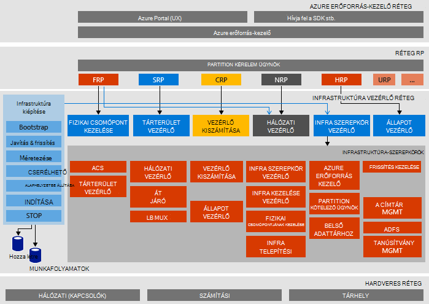

<properties
    pageTitle="Microsoft Azure Papírhalom vásárlási, amely (Ez) architektúráját |} Microsoft Azure"
    description="A Microsoft Azure Papírhalom ez architektúra megtekintése."
    services="azure-stack"
    documentationCenter=""
    authors="heathl17"
    manager="byronr"
    editor=""/>

<tags
    ms.service="azure-stack"
    ms.workload="na"
    ms.tgt_pltfrm="na"
    ms.devlang="na"
    ms.topic="article"
    ms.date="10/25/2016"
    ms.author="helaw"/>

# Microsoft Azure Papírhalom ez architektúra

Az Azure Papírhalom Ez egy egy csomópont-t tartalmazó telepítés Azure Papírhalom technikai előzetes verzió 2. Minden összetevő virtuális gépeken futó egy állomáshoz-gépen futó van telepítve. 

## Logikai architektúra diagramja
Az alábbi ábra szemlélteti a logikai architektúra az Azure Papírhalom Ez és összetevői.

## Virtuális gép szerepkörök
Az Azure Papírhalom Ez a használja az alábbi VMs a ez állomáson szolgáltatásokat nyújtja:

 - **M/m-ACS01** Virtuális géphez üzemeltető Azure Papírhalom tároló szolgáltatást.

 - **M/m-ADFS01** Virtuális gép szolgáltatója, az Active Directory összevonási szolgáltatásokat.  A virtuális számítógéphez nem szerepel a technikai előzetes verzió 2.  

 - **M/m-ASQL01**  Virtuális gép Azure Papírhalom infrastruktúra szerepkörök egy belső adatokat tároló kezeléséről.  

 - **M/m-BGPNAT01** A szegély útválasztó eljáró virtuális gép és a hálózati Címfordítást és VPN-funkciókat nyújt a Azure Papírhalom.

 - **M/m-CA01** Virtuális gép tanúsítvány hitelesítésszolgáltató szolgáltatásokat Azure Papírhalom szerepkör-szolgáltatásait.

 - **M/m-CON01** Virtuális gép az PowerShell, a Visual Studio és az egyéb eszközök fejlesztők számára elérhető.

 - **M/m-DC01** Virtuális géphez üzemeltető Papírhalom a Microsoft Azure Active Directory, a DNS és DHCP szolgáltatásokat.

 - **M/m-GWY01** Virtuális gép nyújtó biztonsági átjáró szolgáltatások, például a virtuális Magánhálózati hely közötti kapcsolatok bérlői hálózatokhoz.

 - **M/m-NC01**  Virtuális géphez üzemeltető hálózati vezérlő, amely Azure Papírhalom hálózati szolgáltatások kezelése.  

 - **M/m-SLB01**  Virtuális gép bérlők és Azure Papírhalom infrastruktúrájának szolgáltatásai terheléselosztási Azure egymást fedő szolgáltatásokat biztosít.  

 - **M/m-SUS01**  Virtuális gép szolgáltatója a Windows Server Update Services és más Papírhalom Azure virtuális gépeken futó frissítések nyújtó felelős.

 - **M/m-WAS01**  Virtuális gép portál és -szolgáltatások Azure erőforrás-kezelő szolgáltatója.

 - **M/m-XRP01** Az alapvető erőforrás szolgáltatókhoz Microsoft Azure veremtárának, beleértve a számítási, hálózati és tárolását erőforrás-szolgáltatók üzemeltető virtuális gépet.

## Tárterület-szolgáltatások
A fizikai állomáson az operációs rendszer tárolása a következők:

 - **ACS Blob-szolgáltatás** Azure egységes tároló Blob szolgáltatása, amelynek blob és a táblázat tároló szolgáltatásokat nyújt.

 - **SoFS** Méretezési fájlkiszolgálóra.

 - **ReFS CSV** Rugalmas fájl rendszer fürt mennyiségi megosztott.

 - **Virtuális lemez**, a **Rendelkezésre álló tárterület méretének**és a **Tárhely szóközöket közvetlen** a megfelelő tároló alaptechnológiát a Windows Server ahhoz, hogy a Microsoft Azure Papírhalom core tárolási erőforrás-szolgáltatóval.

## Következő lépések

[Azure Papírhalom terjesztése](azure-stack-deploy.md)

[Próbálja ki az első esetek](azure-stack-first-scenarios.md)

