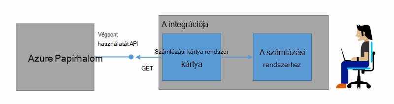
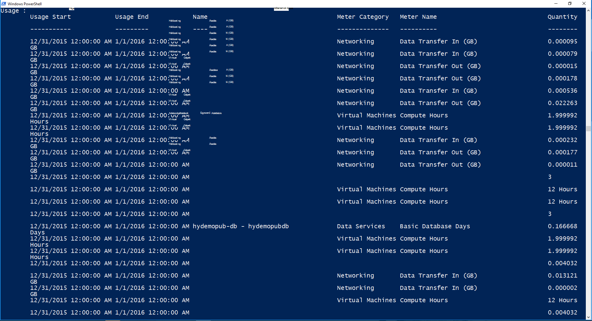

<properties
    pageTitle="Ügyfél számlázási és Azure egymást fedő visszaterhelési |} Microsoft Azure"
    description="Megtudhatja, hogy miként erőforrás-kihasználtsági információk lekérése az Azure oszlopból."
    services="azure-stack"
    documentationCenter=""
    authors="AlfredoPizzirani"
    manager="byronr"
    editor=""/>

<tags
    ms.service="azure-stack"
    ms.workload="na"
    ms.tgt_pltfrm="na"
    ms.devlang="na"
    ms.topic="article"
    ms.date="10/18/2016"
    ms.author="alfredop"/>

# Számlázás ügyfél- és Azure egymást fedő visszaterhelési

Most, hogy az Azure Papírhalom használ, érdemes megfontolni nyomon követése használatát mikéntjéről célszerű. Szolgáltatók kihasználtsági információk ügyfeleik számlázási és szolgáltatásokat nyújtó költségét megértéséhez támaszkodhat.
Környezetbe, túl, általában nyomon használatát részlegenként.

Azure Papírhalom nem a számlázási rendszert. Az erőforrások használják a bérlők nem töltődik. De Azure Papírhalom összegyűjtése és használati adatainak összesítése minden egységes erőforrás-szolgáltató infrastruktúrát van. Az adatok eléréséhez és exportálása egy számlázási rendszerhez számlázási kártya használatával, vagy exportálása a business intelligence eszköz például a Microsoft Power BI.

## Használatát információk találhatók, és hogyan?

Azure Papírhalom erőforrás szolgáltatók használatát rekordok létrehozása az óránkénti időközönként. A rekordok minden erőforrás felhasznált, és mely előfizetés elfogyasztott mennyiség megjelenítésére, az erőforrás mennyiségét mutatják. Ezeket az adatokat tárolja. Az adatok a REST API keresztül is elérheti.

Szolgáltatás-rendszergazda meghallgathatja használati adatainak minden bérlői-előfizetésben. Egyes bérlők csak a saját információkat gyűjthet ki.

Használatát rekord a tárhely, a hálózati és a számítási használatát kapcsolatos információkat tartalmaz. Méter listájáért lásd: [Ez a cikk](azure-stack-usage-related-faq.md).

## Látogatottsági adatok beolvasása

Rekordok szeretne létrehozni, fontos, hogy fut, és a rendszer a aktív erőforrások. Ha biztos benne, hogy van-e operációs rendszert futtató erőforrások, a az Azure piactér-Papírhalom üzembe, majd futtassa a virtuális gép (virtuális). Győződjön meg arról, hogy a lap figyelése a virtuális figyelmébe fut.

Azt javasoljuk, hogy futtassa a Windows PowerShell-parancsmagok használati adatok megtekintéséhez.
A PowerShell hívja fel az Erőforrás kihasználtsága API-khoz.

1.  [Telepítse és állítsa be a Azure PowerShell](https://azure.microsoft.com/en-us/documentation/articles/powershell-install-configure/).

2.  Jelentkezzen be az Azure erőforrás-kezelő, használja a PowerShell-parancsmag **Bejelentkezési-AzureRmAccount**.

3.  Jelölje ki azt az előfizetést, az erőforrások létrehozásához használt, írja be a "sub" Get-AzureRmSubscription – SubscriptionName **|} Jelölje ki-AzureRmSubscription**.

4.  Az adatok beolvasásához, használja a [**Get-UsageAggregates**](https://msdn.microsoft.com/en-us/library/mt619285.aspx)PowerShell-parancsmag.
    Látogatottsági adatok érhető el, ha azt értéket adja vissza a PowerShellben, ahogy az alábbi példa A PowerShell 1000 sornyi egy hívás használatát adja eredményül.
    A *folytatását jelző* argumentum beolvasásához vonalak másokat az első 1000 csoportját is használhatja. Használati adatainak kapcsolatos további tudnivalókért lásd: az [Erőforrás kihasználtsága API hivatkozást](azure-stack-provider-resource-api.md).

    

## Következő lépések

[Szolgáltató erőforrás-kihasználtság API](azure-stack-provider-resource-api.md)

[Erőforrás-kihasználtság API bérlői](azure-stack-tenant-resource-usage-api.md)

[Használatát kapcsolatos gyakori kérdések](azure-stack-usage-related-faq.md)
