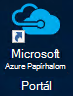
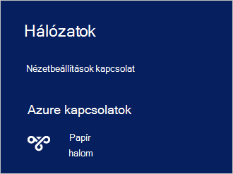

<properties
    pageTitle="Azure Papírhalom csatlakoztatása |} Microsoft Azure"
    description="Megtudhatja, hogy miként Azure Papírhalom csatlakoztatása"
    services="azure-stack"
    documentationCenter=""
    authors="ErikjeMS"
    manager="byronr"
    editor=""/>

<tags
    ms.service="azure-stack"
    ms.workload="na"
    ms.tgt_pltfrm="na"
    ms.devlang="na"
    ms.topic="get-started-article"
    ms.date="10/18/2016"
    ms.author="erikje"/>

# <a name="connect-to-azure-stack"></a>Azure Papírhalom csatlakoztatása
Erőforrások kezelésére, csatlakoznia kell az Azure Papírhalom ez számítógépre. Használja a következő csatlakozási beállítások közül választhat:

 - Távoli asztali: lehetővé teszi, hogy gyorsan kapcsolatba léphet a ez számítógépről egy egyidejű felhasználó.
 - Virtuális magánhálózat (VPN): lehetővé teszi, hogy az Azure Papírhalom infrastruktúra (konfiguráció szükséges) kívüli ügyfelektől csatlakozás több egyidejű felhasználó.

## <a name="connect-with-remote-desktop"></a>Csatlakozás távoli asztali
A távoli asztali kapcsolaton egyidejű egy felhasználó az erőforrások kezelésére portálon is dolgozhat. Az m/m-CON01 virtuális gépen eszközök is használhatja.

1.  Jelentkezzen be az Azure Papírhalom ez fizikai számítógépen.

2.  Nyissa meg a távoli asztali kapcsolat, és csatlakozzon az m/m-CON01. Írjon be **AzureStack\AzureStackAdmin** felhasználónév és a rendszergazdai jelszó megadását Azure Papírhalom a telepítés során.  

3.  Az m/m-CON01 asztali ikonra **A Microsoft Azure Papírhalom Portal** (https://portal.azurestack.local/) kattintva nyissa meg a [portálon](azure-stack-key-features.md#portal).

    

4.  Jelentkezzen be a telepítés során megadott Azure Active Directory hitelesítő adatokat.

## <a name="connect-with-vpn"></a>A virtuális magánhálózati kapcsolatot
Virtuális magánhálózati kapcsolatot használóinak több egyidejű kívül az Azure Papírhalom infrastruktúra-ügyfelek csatlakozni. A portál erőforrások kezelésére használható. Kattintson a helyi ügyfél eszközöket, például a Visual Studio és PowerShell, is használhatja.

1.  A AzureRM modul telepítése a következő parancs használatával:
   
    ```PowerShell
    Install-Module -Name AzureRm -RequiredVersion 1.2.6 -Scope CurrentUser
    ```   
   
2. Töltse le az Azure Papírhalom eszközök parancsfájlokat.  Fájlok tölthetők a [GitHub tárházba](https://github.com/Azure/AzureStack-Tools)böngészési, vagy az alábbi Windows PowerShell-parancsprogramot futtatása rendszergazdaként támogatási:
    
    >[AZURE.NOTE]  A következő lépések végrehajtásához PowerShell 5.0-s.  Jelölje be azon verziójával, futtassa a $PSVersionTable.PSVersion, és hasonlítsa össze a "Fő".  

    ```PowerShell
       
       #Download the tools archive
       invoke-webrequest https://github.com/Azure/AzureStack-Tools/archive/master.zip -OutFile master.zip

       #Expand the downloaded files. 
       expand-archive master.zip -DestinationPath . -Force

       #Change to the tools directory
       cd AzureStack-Tools-master
    ````

3.  Az azonos PowerShell-munkamenet keresse meg a **Csatlakozás** mappát, és importálja a AzureStack.Connect.psm1 modult:

    ```PowerShell
    cd Connect
    import-module .\AzureStack.Connect.psm1
    ```

4.  Az Azure Papírhalom virtuális Magánhálózati kapcsolatot létrehozni, futtassa az alábbi Windows PowerShell. Futtatása előtt feltöltése, a rendszergazdai jelszavát és Azure Papírhalom host címmezők. 
    
    ```PowerShell
    #Change the IP Address below to match your Azure Stack host
    $hostIP = "<HostIP>"

    # Change password below to reference the password provided for administrator during Azure Stack installation
    $Password = ConvertTo-SecureString "<Admin Password>" -AsPlainText -Force

    # Add Azure Stack One Node host & CA to the trusted hosts on your client computer
    Set-Item wsman:\localhost\Client\TrustedHosts -Value $hostIP -Concatenate
    Set-Item wsman:\localhost\Client\TrustedHosts -Value mas-ca01.azurestack.local -Concatenate  

    # Update Azure Stack host address to be the IP Address of the Azure Stack POC Host
    $natIp = Get-AzureStackNatServerAddress -HostComputer $hostIP -Password $Password

    # Create VPN connection entry for the current user
    Add-AzureStackVpnConnection -ServerAddress $natIp -Password $Password

    # Connect to the Azure Stack instance. This command (or the GUI steps in step 5) can be used to reconnect
    Connect-AzureStackVpn -Password $Password 
    ```

5. Amikor a rendszer kéri, a megbízható gombra az Azure Papírhalom állomás.

6. Amikor a rendszer kéri, telepítse (az üzenet jelenik meg a Powershell-munkamenet ablak mögött) tanúsítvány.

7. A portál kapcsolat teszteléséhez böngészőben nyissa meg azt a *https://portal.azurestack.local*.

8. Tekintse át, és kezelheti az Azure Papírhalom kapcsolatot, használja az ügyfélnek **hálózatok** :

    

>[AZURE.NOTE] A virtuális Magánhálózati kapcsolat nem nyújt VMs vagy más erőforrások: a kapcsolatot. Erőforrások elérhetőségének a további tudnivalókért lásd [Egy csomópont virtuális Magánhálózati kapcsolat](azure-stack-create-vpn-connection-one-node-tp2.md)


## <a name="next-steps"></a>Következő lépések
[Első feladatok](azure-stack-first-scenarios.md)

[Telepítse és PowerShell kapcsolatba](azure-stack-connect-powershell.md)

[Telepítse és CLI kapcsolatba](azure-stack-connect-cli.md)


