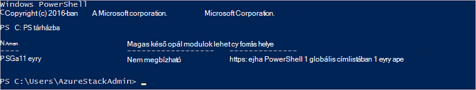

<properties
    pageTitle="A PowerShell Azure Papírhalom csatlakoztatása |} Microsoft Azure"
    description="Megtudhatja, hogy miként kezelése a PowerShell Azure Papírhalom"
    services="azure-stack"
    documentationCenter=""
    authors="HeathL17"
    manager="byronr"
    editor=""/>

<tags
    ms.service="azure-stack"
    ms.workload="na"
    ms.tgt_pltfrm="na"
    ms.devlang="na"
    ms.topic="article"
    ms.date="10/19/2016"
    ms.author="helaw"/>

# PowerShell telepítése, és csatlakozzon az Azure Papírhalom
Ebből az útmutatóból végigvezetjük a lépésekkel csatlakozhat az Azure Papírhalom PowerShell. Ha kész, ezeket a lépéseket is segíthetnek kezelése és telepítése az erőforrások.

## Telepítse az Azure Papírhalom PowerShell-parancsmagok

1.  AzureRM parancsmagok vannak telepítve a PowerShell gyűjteményből. A kezdéshez m/m-CON01 a PowerShell konzol megnyitása, és szeretne megjeleníteni a PowerShell tárházakban érhető el, a következő parancsot:

        Get-PSRepository

      

2.  A következő parancsot a AzureRM modul telepítése:

        Install-Module -Name AzureRM -RequiredVersion 1.2.6 -Scope CurrentUser

    >[AZURE.NOTE] *-Hatókör CurrentUser* nem kötelező. Ha több, mint az aktuális felhasználó hozzáférjen a modulokat, rendszergazda jogú parancssort használata, és ki a *hatókör* paramétert elhagyja.

3.  Erősítse meg a AzureRM modulok példányával, hajtsa végre az alábbi parancsokat:

        Get-Command -Module AzureRM.AzureStackAdmin

## Azure Papírhalom csatlakoztatása
A modul kezeli a PowerShell-kapcsolat beállítása Azure jegyzettömbhöz meg letöltésre érhető el.  Látogasson el az [Azure Papírhalom eszközök](http://aka.ms/ConnectToAzureStackPS) a modul és további lépéseket. 

## Az előfizetések listáját
Ebben a részben ellenőriznie PowerShell-parancsmagok futtatja Azure Papírhalom szemben a retrieving, és válassza az előfizetés használatra.

A következő parancsot a fiókkal társított Azure Papírhalom előfizetések listáját:

    Get-AzureRmSubscription

## Következő lépések
[Sablonok PowerShell telepítése](azure-stack-deploy-template-powershell.md)

[Azure CLI kapcsolatba](azure-stack-connect-cli.md)

[A Visual Studio sablonok telepítése](azure-stack-deploy-template-visual-studio.md)

