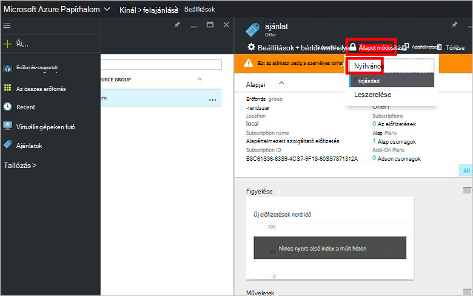

<properties
    pageTitle="Az ajánlat létrehozása az Azure egymást fedő |} Microsoft Azure"
    description="A szolgáltatás rendszergazdájaként megtudhatja, hogy miként felajánlás létrehozása az Azure egymást fedő a bérlők."
    services="azure-stack"
    documentationCenter=""
    authors="ErikjeMS"
    manager="byronr"
    editor=""/>

<tags
    ms.service="azure-stack"
    ms.workload="na"
    ms.tgt_pltfrm="na"
    ms.devlang="na"
    ms.topic="get-started-article"
    ms.date="09/26/2016"
    ms.author="erikje"/>

# Hozzon létre egy ajánlatra Azure egymást fedő

Egy vagy több tervek előidéző szolgáltatók megvásárlásához és a feliratkozás bérlőkhöz csoportok [kínál](azure-stack-key-features.md#services-plans-offers-and-subscriptions) . A dokumentum megtudhatja, hogy miként hozhat létre, amely tartalmazza az [Ön által létrehozott terv](azure-stack-create-plan.md) az utolsó lépésben felajánlás. Ezt az ajánlatot az azt jelenti, hogy virtuális gépeken futó kiépítése előfizetők adja vissza.

1.  [Jelentkezzen be](azure-stack-connect-azure-stack.md#log-in-as-a-service-administrator) a szolgáltatás rendszergazdái-portálra, és kattintson az **Új** > **bérlői kínál + csomagok** > **felajánl**.
    

2.  Az **Új ajánlat** lap töltse ki a **Megjelenítendő nevet** , és az **Erőforrás nevére**, és válassza az új vagy meglévő **Erőforráscsoport**. A megjelenítendő név az ajánlat rövid nevét. Csak a rendszergazda láthatja, hogy az erőforrás nevét. Érdemes a nevet, amelyet a rendszergazdák az ajánlat Azure erőforrás-kezelő erőforrásként használata.

    

3.  **Alap tervek** , és jelölje ki a tervek az ajánlatra vonatkozó szerepeltetni kívánt **megtervezése** lap, gombmenü **Jelölje ki**. Kattintson a **Create** a ajánlat létrehozásához.

    
    
4. Kattintson a **kínál** , és válassza az imént létrehozott ajánlat.

    

5.  Kattintson az **Állapot módosítása**, és kattintson a **nyilvános**.
  
    

Ajánlatok nyilvános az előfizetés a lehető a teljes nézet bérlők kell elvégezni. Ajánlatok lehet:

- **Nyilvános**: bérlők látható.

- **Titkos**: a szolgáltatás-rendszergazdák számára csak látható. Hasznos közben elkészítése a csomagot vagy ajánlatot, vagy ha a szolgáltatás rendszergazdája szeretne minden előfizetés jóváhagyása.

- **Decommissioned**: új előfizetők lezárva. A szolgáltatás-rendszergazda leszerelt megakadályozhatja, hogy a jövőben előfizetések, de az aktuális előfizetők változatlanul hagyja.

Az ajánlat módosítások nem láthatók azonnal a bérlő. Ha látni szeretné a módosításokat, lehet, ha kijelentkezés/jelentkezzen be az új előfizetés az "előfizetés választó" megtekintéséhez erőforrások/erőforrás csoport létrehozásakor.

## Következő lépések

[Feliratkozás felajánlás és egy virtuális majd kiépítése](azure-stack-subscribe-plan-provision-vm.md)
