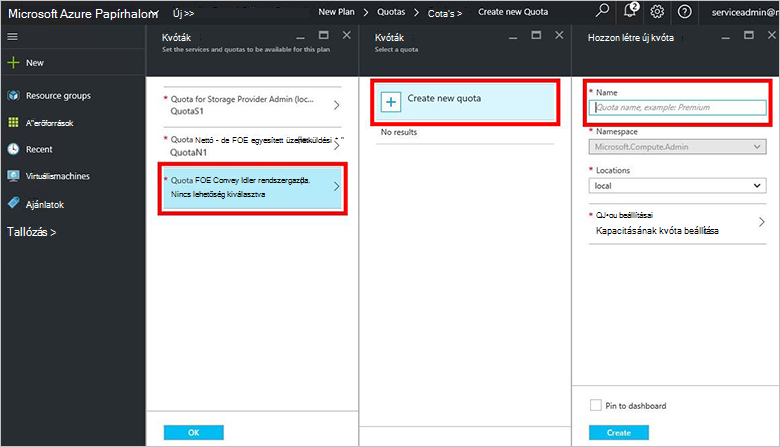

<properties
    pageTitle="Terv létrehozása az Azure egymást fedő |} Microsoft Azure"
    description="Szolgáltatás rendszergazdái, amely lehetővé teszi, hogy a előfizetők rendelkezést virtuális gépeken futó terv létrehozása"
    services="azure-stack"
    documentationCenter=""
    authors="ErikjeMS"
    manager="byronr"
    editor=""/>

<tags
    ms.service="azure-stack"
    ms.workload="na"
    ms.tgt_pltfrm="na"
    ms.devlang="na"
    ms.topic="get-started-article"
    ms.date="09/26/2016"
    ms.author="erikje"/>

# Azure egymást fedő terv létrehozása

Csoportosítás egy vagy több szolgáltatás [csomagok](azure-stack-key-features.md#services-plans-offers-and-subscriptions) . Egy szolgáltatóként tervezi, hogy felajánlja a bérlők hozhat létre. A csomagok és szolgáltatások tartalmazzák a ajánlatok a bérlők fizessen elő. Ez a példa bemutatja, hogyan hozhat létre egy másik csomagra a számítási, a hálózati és a tárhely erőforrás szolgáltatók tartalmazza. Ez a terv előfizetők az azt jelenti, hogy virtuális gépeken futó kiépítése adja vissza.

1.  Böngészőben nyissa meg azt a https://portal.azurestack.local.

2.  [Jelentkezzen be](azure-stack-connect-azure-stack.md#log-in-as-a-service-administrator) az Azure Papírhalom portálra szolgáltatás rendszergazdái és a írja be a szolgáltatás rendszergazdai hitelesítő adatait (az Ön által létrehozott lépés 5 [futtassa a PowerShell](azure-stack-run-powershell-script.md) szakasz során fiók), és kattintson a **Bejelentkezés**gombra.

    Szolgáltatás-rendszergazdák a ajánlatok és csomagok hozhat létre, és a felhasználók kezelése.

3.  Terv és ajánlatot, amely a bérlők feliratkozhat létrehozni, kattintson az **Új** > **bérlői kínál + csomagok** > **csomagot**.

    

4.  Az **Új terv** lap töltse ki a **Megjelenítendő név** és az **Erőforrás neve**. A megjelenítendő név a terv rövid nevet, amelyet a bérlők. Csak a rendszergazda láthatja, hogy az erőforrás nevét. A nevet, amelyet a rendszergazdák használata a terv Azure erőforrás-kezelő erőforrásként.

    

5.  Hozzon létre egy új **Erőforráscsoport**, vagy jelöljön ki egy meglévőt elhelyezése a terv (például "OffersAndPlans")

    

6.  Kattintson a **szolgáltatások**, jelölje be a **Microsoft.Compute** **Microsoft.Network**és **Microsoft.Storage**, és **kattintson a**.

    

7.  Kattintson a **kvóták**, **Microsoft.Storage (helyi)**, kattintson és majd jelölje ki az alapértelmezés szerinti kvóta vagy **létrehozása új kvóta** kvóta testreszabásához kattintson.

    

8.  Írjon be egy nevet a kvóta, **Kvóta beállításai**parancsra, állítsa be a kvóta értékeket kattintson az **OK gombra**, és kattintson a **Létrehozás**gombra.

    

9. Kattintson a **Microsoft.Network (helyi)**, majd jelölje ki az alapértelmezés szerinti kvóta, vagy kattintson a **Létrehozás új kvóta** kvóta testreszabása.

    

10. Írjon be egy nevet a kvóta, **Kvóta beállításai**parancsra, állítsa be a kvóta értékeket kattintson az **OK gombra**, és kattintson a **Létrehozás**gombra.

    

11. Kattintson a **Microsoft.Compute (helyi)**, majd jelölje ki az alapértelmezés szerinti kvóta, vagy kattintson a **Létrehozás új kvóta** kvóta testreszabása.

    

12.  Írjon be egy nevet a kvóta, **Kvóta beállításai**parancsra, állítsa be a kvóta értékeket kattintson az **OK gombra**, és kattintson a **Létrehozás**gombra.

    

13. A **kvóták** lap kattintson az **OK gombra**, és az **Új csomag** lap, kattintson a terv **létrehozása** .

    

14. Jelenik meg az új csomag, kattintson az **összes erőforrás**, majd keresése a csomagot, és kattintson a nevére.

    

## Következő lépések

[Az ajánlat létrehozása](azure-stack-create-offer.md)
