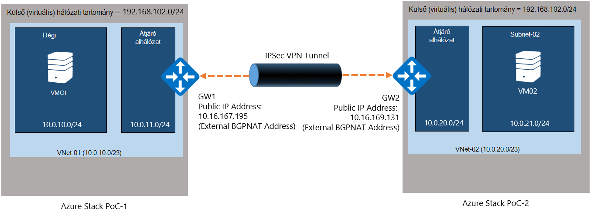
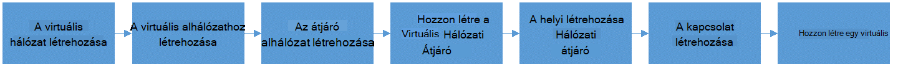
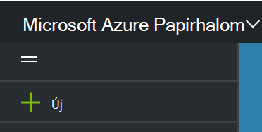
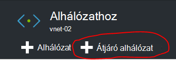
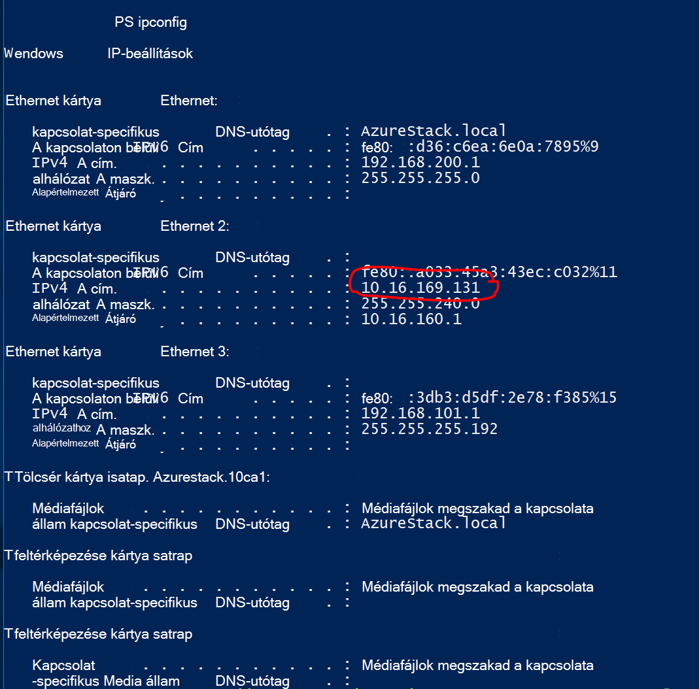
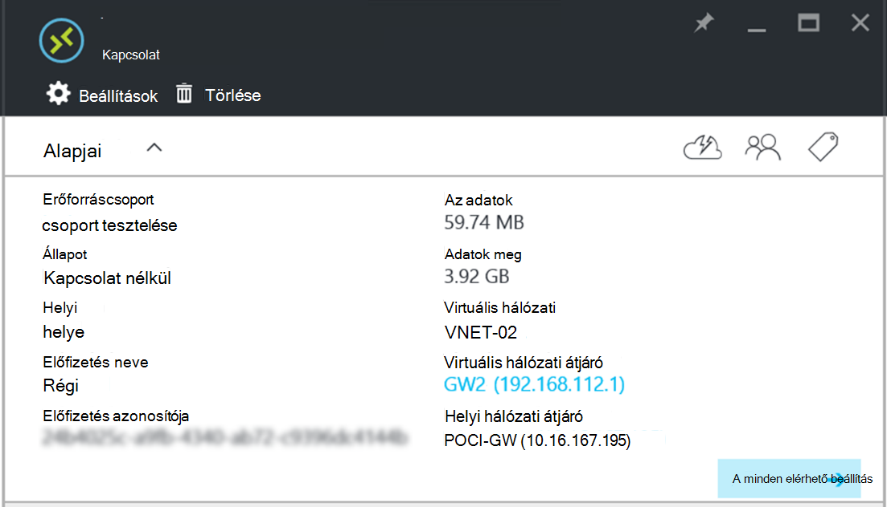

<properties
    pageTitle="Kapcsolat létrehozása a webhelyen a webhely-VPN között két virtuális hálózatok Azure Papírhalom ez különböző környezetekben |} Microsoft Azure"
    description="Lehetővé teszi, hogy a felhőben rendszergazdája között két egy csomópont-ez környezetben TP2 a webhely virtuális Magánhálózati kapcsolat létrehozásához lépésenkénti útmutatót."
    services="azure-stack"
    documentationCenter=""
    authors="ScottNapolitan"
    manager="darmour"
    editor=""/>

<tags
    ms.service="azure-stack"
    ms.workload="na"
    ms.tgt_pltfrm="na"
    ms.devlang="na"
    ms.topic="get-started-article"
    ms.date="09/26/2016"
    ms.author="scottnap"/>

# Azure Papírhalom ez különböző környezetekben virtuális hálózatok között a webhely virtuális Magánhálózati kapcsolat létrehozása

## – Áttekintés

Ez a cikk végigvezeti a két külön Azure Papírhalom vásárlási-a-fogalom (Ez) környezetben virtuális hálózatok között, a webhely virtuális Magánhálózati kapcsolat létrehozásához. Az adott célja, hogy a webhely értékelése, akik súgó átjárók megtudhatják, hogy miként állíthatja be a VPN-kapcsolatok, a két különböző Azure Papírhalom környezetekben virtuális hálózatok között.  Ezzel a módszerrel te000129565 VPN átjárók Azure egymást fedő működésének megértése érheti el.

>[AZURE.NOTE] A dokumentum kifejezetten az Azure Papírhalom TP2 Ez vonatkozik.

### Kapcsolati diagram

Az alábbiakban diagram, amely megmutatja, milyen címjegyzékemben konfigurációs kell például amikor végzett azt.

### Első lépések

Ez a beállítás befejezéséhez szükséges a következő elemek, győződjön meg arról, hogy rendelkezik az alábbi tényezőket megkezdése előtt.

-   Két-kiszolgálót, amelyek megfelelnek az Azure Papírhalom ez hardverkövetelményeknek határozza meg az [Azure Papírhalom telepítési előfeltételek](azure-stack-deploy.md), és az egyéb előfeltételek határozza meg, hogy a dokumentumot.

-   Az Azure Papírhalom Technical Preview 2 telepítőcsomagot.

## A ez környezetben üzembe helyezése

Ez a beállítás befejezéséhez két Azure Papírhalom ez környezetben telepíti.

-   Az egyes ez, amely rendszerbe, egyszerűen csak kövesse a telepítési utasításokat az [Üzembe Azure Papírhalom ez](azure-stack-run-powershell-script.md)a cikk részletesen.
    Az egyes ez környezetekben a dokumentumban, általában, valamint POC1 POC2 hivatkozik.

## Kvóták beállítása a számítási, hálózati és tárolása

Kvóták beállítása a számítási, hálózati és tárolására, hogy az alábbi szolgáltatások társítható egy tervet, és ezután, amely-ös bérlői webhelyek felajánlás feliratkozhat szüksége.

>[AZURE.NOTE] Hajtsa végre ezeket a lépéseket minden Azure Papírhalom ez környezetben van szükség.

A felület szolgáltatások kvóták létrehozása TP1 megváltozott. A lépéseket a kvóták létrehozása az TP2 <http://aka.ms/mas-create-quotas>találhatók. Elfogadhatja az alapértelmezett értékeket ez ellátásához összes kvóta beállítások.

## Terv és ajánlat létrehozása

Csoportosítás egy vagy több szolgáltatás [csomagok](azure-stack-key-features.md) . Egy szolgáltatóként tervezi, hogy felajánlja a bérlők hozhat létre. A csomagok és szolgáltatások tartalmazzák a ajánlatok a bérlők fizessen elő.

>[AZURE.NOTE] Meg kell végezniük ezeket a lépéseket minden Azure Papírhalom ez környezetben.

1.  Először létre kell hoznia egy csomagot. Ehhez követheti a [terv létrehozása](azure-stack-create-plan.md) online cikkben leírt lépéseket.

2.  Hozzon létre egy ajánlatra [létrehozása az Azure Papírhalom felajánlás](azure-stack-create-offer.md)ismertetett lépéseket követve.

3.  Jelentkezzen be a portálon egy Bérlői rendszergazda, és [fizessen elő az ajánlat létrehozott] (azure-Papírhalom-előfizetés-terv-rendelkezést-vm.md.

## A hálózati erőforrások létrehozása a ez 1

Most már fogjuk az erőforrások a konfiguráció beállítása szükség ténylegesen létrehozásához. A következő lépések bemutatják, hogy milyen azt fogja kell elvégezni. Ezeket az utasításokat a hogyan hozhat létre a portálon keresztüli erőforrások megjelenítő lesz, de a célt szolgálja PowerShell keresztül elvégezhető.

### Jelentkezzen be bérlői webhelyre

Szolgáltatás-rendszergazda, tesztelje a tervek, konstrukciók és a bérlők használhat előfizetés bérlői webhelyre is jelentkezzen be. Ha még nem rendelkezik egy, a [bérlői fiók létrehozása](azure-stack-add-new-user-aad.md) előtt jelentkezzen be.

### A virtuális hálózati & virtuális alhálózat létrehozása

1.  Jelentkezzen be bérlői fiók.

2.  Az Azure-portálon kattintson az **Új** ikonra.

     
3.  A piactér menüből válassza a **hálózat** .

4.  Kattintson a menüben a **virtuális hálózati** elemre.

5.  Kattintson az erőforrás leírás a lap alján a **Létrehozás** gombra. Írja be az alábbi értékek szerint az alábbi táblázat a megfelelő mezőkbe.

  	| **A mező**             | **Érték** |
  	|----------------------- | ------ |
  	| név                  |vnet-01 |
  	| Címterület használatára         | 10.0.10.0/23 |
  	| Alhálózat neve           | alhálózat-01 |
  	| Alhálózat címtartományokat  | 10.0.10.0/24 |

6.  Meg kell jelennie a létrehozott korábbi kitölti az **előfizetés** mező az előfizetést.

7.  Az erőforráscsoport hozzon létre egy új erőforráscsoport, vagy ha már van egy, válassza a meglévő használata.

8.  Ellenőrizze az alapértelmezett helyre.

9.  Kattintson a **Létrehozás** gombra.

### Az átjáró alhálózat létrehozása

1.  Nyissa meg az újonnan létrehozott (Vnet-01) az irányítópult virtuális hálózati erőforrás.

2.  Válassza a beállítások lap alhálózat

3.  Az **Átjáró alhálózat** gombra kattintva átjáró alhálózat hozzáadása a virtuális hálózathoz.

     
4.  Az alhálózathoz neve alapértelmezés szerint **GatewaySubnet** van állítva.
    Átjáró alhálózat speciális és rendelkeznie kell a megadott név annak érdekében, hogy működik megfelelően.

5.  A **cím tartomány** mezőben adja meg a **10.0.11.0/24**.

6.  Kattintson a **Létrehozás** gombra az átjáró alhálózat létrehozásához.

### A virtuális hálózati átjáró létrehozása

1.  Az Azure-portálon kattintson az **Új** ikonra.

    

2.  A piactér menüből válassza a **hálózat** .

3.  Jelölje ki a **virtuális hálózati átjáró** hálózati erőforrásokat a listából.

4.  Tekintse át a leírást, és kattintson a **Létrehozás**gombra.

5.  A **név** mezőbe írja be a **GW1**.

6.  Kattintson a **virtuális hálózati** virtuális hálózat kiválasztása elemre.
    Jelölje ki a **Vnet-01** a listából.

7.  Kattintson a **nyilvános IP-cím** menüpontra. Amikor megnyílik a választható nyilvános IP címét a lap kattintson a létrehozás új gombra.

8.  A **név** mezőbe írja be a **GW1-mezőpont** , és kattintson a **Ok.**

9.  Az **átjáró típus** van, hogy **virtuális Magánhálózati** alapértelmezés szerint be van jelölve. Tartsa meg ezt a beállítást.

10. A **virtuális Magánhálózati típus** kell tartalmaznia, **útvonal-alapú** alapértelmezés szerint be van jelölve.
    Tartsa meg ezt a beállítást.

11. Ellenőrizze, hogy helyesek **előfizetés** és **helyét** . Ha szeretné az erőforrás az irányítópult is rögzíthet. Kattintson a **létrehozása**gombra.

### A helyi hálózaton átjáró létrehozása

A helyi hálózati átjáró erőforrás a helyzetben kissé weird.
Ugyanaz az erőforrás megtalálta az Azure, azonban a fizikai, helyszíni eszköz ábrázolásához a rendelkezik a szokásos szólnak Azure-ban használható csatlakoztatása az Azure virtuális hálózati átjáró. Ebben a példában a kapcsolat mindkét oldalán megjelennek a ténylegesen virtuális hálózati átjárók!

Megfontolni Ez általában további célja, hogy a helyi hálózati átjáró erőforrás mindig van-e, hogy a távoli átjáró a kapcsolat más végén lehetőséget. Készült a Ez esetben miatt ténylegesen szükség a címét a külső hálózati adapteren adja meg a hálózati Címfordítást virtuális a többi Ez az, a helyi hálózati átjáró nyilvános IP-címét. Hálózati Címfordítást hozzárendelések kattintva győződjön meg arról, hogy mindkét végén megfelelően van-e csatlakoztatva a hálózati Címfordítást virtuális majd azt hoz létre.

### Az IP-cím, a hálózati Címfordítást virtuális külső kártyájának beolvasása

1.  Bejelentkezés az Azure Papírhalom fizikai gépi-POC2.

2.  [A Windows billentyű] + R billentyűkombinációval nyissa meg a **Futtatás** menüt, és írja be a **mstsc** és találati adja meg.

3.  A **számítógép** mezőben adja meg az **M/m-BGPNAT01** nevét, és kattintson a **Csatlakozás** gombra.

4.  Kattintson a Start menüre, és kattintson a jobb gombbal a PowerShell, és válassza a **Futtatás rendszergazdaként**.

5.  Típus **IPConfig/összes**.

6.  Keresse meg az Ethernet-adaptert, amely a helyszíni hálózathoz csatlakozik, és a IPv4-címet, hogy a kártya kötött vegye figyelembe. Saját környezetben **10.16.167.195** de eltérő lesz rá.

7.  A cím rekord. Ez a mi fogjuk használni, a helyi hálózati átjáró erőforrás hozzunk létre, a POC1 nyilvános IP-címét.

### A helyi hálózati átjáró erőforrás létrehozása

1.  Bejelentkezés az Azure Papírhalom fizikai gépi-POC1.

2.  A **számítógép** mezőbe írja be a nevet, **M/m-CON01** , és kattintson a **Csatlakozás** gombra.

3.  Az Azure-portálon kattintson az **Új** ikonra.

    

4.  A piactér menüből válassza a **hálózat** .

5.  Válassza a **helyi hálózati átjáró** erőforrások a listából.

6.  A **név** mezőbe írja be **A GW POC2**.

7.  Nem tudunk IP-címét a más átjáró még, de ez az OK gombra, mert azt térjen vissza, és később. Most írja be az **IP-cím mező** **10.16.167.195** .

8.  A **Címterület** mező adja meg a címterület használatára, a Vnet, hogy fog szervezni az POC2. Ez lesz **10.0.20.0/23** úgy adja meg ezt az értéket.

9.  Győződjön meg arról, hogy az **előfizetést**, az **Erőforráscsoport** és a **hely** összes helyes-e, és kattintson a **Létrehozás**gombra.

### A kapcsolat létrehozása

1.  Az Azure-portálon kattintson az **Új** ikonra.

     

2.  A piactér menüből válassza a **hálózat** .

3.  Az erőforrások listájából válassza ki a **kapcsolatot** .

4.  Az **alapvető** beállítások lap válassza a **webhely (IPSec)** a **kapcsolat típusát**.

5.  Jelölje be az **előfizetést**, **Erőforráscsoport** és **helyét** , és kattintson az **OK gombra**.

6.  A **Beállítások** lap válassza ki a **Virtuális hálózati átjáró** (**GW1**.) korábban létrehozott.

7.  Válassza a **helyi** **Hálózati átjáró** (**POC2-GW**.) korábban létrehozott.

8.  A **Kapcsolat neve** mezőben adja meg a **POC1-POC2**.

9.  A **Megosztott kulcs (PSK)** mezőben adja meg a **12345**. Kattintson az **OK gombra**.

### Hozzon létre egy virtuális

Az adatérvényesítés út közben a VPN-kapcsolaton keresztül, VMs küldhet és fogadhat adatokat az egyes ez van szüksége. Vegyük most hozzon létre egy virtuális POC1, és elhelyezése a virtuális alhálózat a virtuális hálózaton.

1. Az Azure-portálon kattintson az  **Új** ikonra.

     

2.  Jelölje ki a **virtuális gépeken futó** a piactér menüből.

3.  Virtuális gép képek listájában jelölje ki a **Windows Server 2012 R2 adatközponthoz** képet.

4.  Az **alapvető tudnivalók** lap a **név** mezőben adja meg az érték **VM01**.

5.  Adja meg az érvénytelen felhasználónevet és jelszót. Jelentkezzen be a virtuális után lett létrehozva ehhez a fiókhoz kell használni.

6.  Adjon meg egy **előfizetést**, az **Erőforráscsoport** és a **helyet** , és kattintson a **Ok**gombra.

7.  Kattintson a **méret** lap válassza ki a virtuális méretet erre az előfordulásra vonatkozóan, és kattintson a **Jelölje ki**.

8.  A beállítások lap fogadja el az alapértelmezett beállításokat, csak győződjön meg róla, hogy a kijelölt virtuális hálózat **VNET-01** és az alhálózathoz **10.0.10.0/24**van beállítva. Kattintson az **OK gombra**.

9.  Tekintse át az **összefoglaló** lap beállítást, és kattintson az **OK gombra**.

## Ez a 2 hálózati szükséges erőforrások létrehozása

### Jelentkezzen be bérlői webhelyre

Szolgáltatás-rendszergazda, tesztelje a tervek, konstrukciók és a bérlők használhat előfizetés bérlői webhelyre is jelentkezzen be. Ha még nem rendelkezik egy, a [bérlői fiók létrehozása](azure-stack-add-new-user-aad.md) előtt jelentkezzen be.

### A virtuális hálózati & virtuális alhálózat létrehozása

1. Jelentkezzen be bérlői fiók.

2. Az Azure-portálon kattintson az  **Új** ikonra.

     

3.  A piactér menüből válassza a **hálózat** .

4.  Kattintson a menüben a **virtuális hálózati** elemre.

5.  Kattintson az erőforrás leírás a lap alján a **Létrehozás** gombra. A megfelelő mezők az alábbi táblázatban, írja be az alábbi értékeket.

  	|**A mező**              |**Érték** |
  	| ----------------------|----------|
  	| név                  | vnet-02 |
  	| Címterület használatára         | 10.0.20.0/23 |
  	| Alhálózat neve           | alhálózat-02 |
  	| Alhálózat címtartományokat  | 10.0.20.0/24 |

6.  Meg kell jelennie a létrehozott korábbi kitölti az **előfizetés** mező az előfizetést.

7.  Az erőforráscsoport hozzon létre egy új erőforráscsoport, vagy ha már van egy, válassza a meglévő használata.

8.  Ellenőrizze az alapértelmezett **helyre**. Ha azt szeretné, akkor rögzítheti a virtuális hálózat az irányítópult, hogy megkönnyítse az elérésüket.

9.  Kattintson a **Létrehozás** gombra.

### Az átjáró alhálózat létrehozása

1.  Nyissa meg a virtuális hálózati erőforrás (**Vnet-02**) létrehozott az irányítópult.

2.  Válassza a **Beállítások** lap **alhálózat.**

3.  Az **Átjáró alhálózat** gombra kattintva átjáró alhálózat hozzáadása a virtuális hálózathoz.

     

4.  Az alhálózathoz neve alapértelmezés szerint **GatewaySubnet** van állítva.
    Átjáró alhálózat speciális és rendelkeznie kell a megadott név annak érdekében, hogy működik megfelelően.

5.  A **cím tartomány** mezőben adja meg a **10.0.20.0/24**.

6.  Kattintson a **Létrehozás** gombra az átjáró alhálózat létrehozásához.

### A virtuális hálózati átjáró létrehozása

1. Az Azure-portálon kattintson az  **Új** ikonra.

     

2.  A piactér menüből válassza a **hálózat** .

3.  Jelölje ki a **virtuális hálózati átjáró** hálózati erőforrásokat a listából.

4.  Tekintse át a leírást, és kattintson a **Létrehozás**gombra.

5.  A **név** mezőbe írja be a **GW2**.

6.  Kattintson a **virtuális hálózati** virtuális hálózat kiválasztása elemre.
    Jelölje ki a **Vnet-02** a listából.

7.  Kattintson a **nyilvános IP-cím** menüpontra. Amikor megnyílik a választható nyilvános IP címét a lap kattintson a létrehozás új gombra.

8.  A **név** mezőbe írja be a **GW2-mezőpont** , és kattintson a **Ok.**

9.  Az **átjáró típus** van, hogy **virtuális Magánhálózati** alapértelmezés szerint be van jelölve. Tartsa meg ezt a beállítást.

10. A **virtuális Magánhálózati típus** kell tartalmaznia, **útvonal-alapú** alapértelmezés szerint be van jelölve.
    Tartsa meg ezt a beállítást.

11. Ellenőrizze, hogy helyesek **előfizetés** és **helyét** . Ha szeretné az erőforrás az irányítópult is rögzíthet. Kattintson a **létrehozása**gombra.

### A helyi hálózaton átjáró létrehozása

#### Az IP-cím, a hálózati Címfordítást virtuális külső kártyájának beolvasása

1.  Bejelentkezés az Azure Papírhalom fizikai gépi-POC1.

2.  Nyomja le és tartsa [Windows billentyű] + R billentyűkombinációval nyissa meg a **Futtatás** menüt, és írja be a **mstsc** , majd kattintson az adja meg.

3.  A **számítógép** mezőben adja meg az **M/m-BGPNAT01** nevét, és kattintson a **Csatlakozás** gombra.

4.  Kattintson a Start menü, kattintson a jobb gombbal a PowerShell, és válassza a **Futtatás rendszergazdaként**.

5.  Típus **IPConfig/összes**.

6.  Keresse meg az Ethernet-adaptert, amely a helyszíni hálózathoz csatlakozik, és a IPv4-címet, hogy a kártya kötött vegye figyelembe. A környezet **10.16.169.131** de eltérő lesz rá.

7.  A cím rekord. Ez a mi fogjuk később használni, a helyi hálózati átjáró erőforrás hozzunk létre, a POC1 nyilvános IP-címét.

#### A helyi hálózati átjáró erőforrás létrehozása

1.  Bejelentkezés az Azure Papírhalom fizikai gépi-POC2.

2.  A **számítógép** mezőben adja meg az **M/m-CON01** nevét, és kattintson a **Csatlakozás** gombra.

3. Az Azure-portálon kattintson az **Új** ikonra.

     

4.  A piactér menüből válassza a **hálózat** .

5.  Válassza a **helyi hálózati átjáró** erőforrások a listából.

6.  A **név** mezőbe írja be **A GW POC1**.

7.  A nyilvános IP-cím azt a rögzített most az virtuális hálózati átjáró POC1 a szükséges. Az **IP-cím mezőbe**írja be a **10.16.169.131** .

8.  A **Címterület** mező adja meg a címterület **Vnet -** 01 a POC1 - **10.0.0.0/16**.

9.  Győződjön meg arról, hogy az **előfizetést**, az **Erőforráscsoport** és a **hely** összes helyes-e, és kattintson a **Létrehozás**gombra.

## A kapcsolat létrehozása

1. Az Azure-portálon kattintson az  **Új** ikonra.

     

2.  A piactér menüből válassza a **hálózat** .

3.  Az erőforrások listájából válassza ki a **kapcsolatot** .

4.  Az **alapvető** beállítások lap válassza a **webhely (IPSec)** a **kapcsolat típusát**.

5.  Jelölje be az **előfizetést**, **Erőforráscsoport** és **helyét** , és kattintson az **OK gombra**.

6.  A **Beállítások** lap válassza ki a **Virtuális hálózati átjáró** (**GW1**.) korábban létrehozott.

7.  Válassza a **helyi** **Hálózati átjáró** (**POC1-GW**.) korábban létrehozott.

8.  A **Kapcsolat neve** mezőben adja meg a **POC2-POC1**.

9.  A **Megosztott kulcs (PSK)** mezőben adja meg a **12345**. Ha úgy dönt, hogy egy másik értéket, ne feledje, hogy meg kell egyeznie az érték, a POC1 kapott megosztott billentyű. Kattintson az **OK gombra**.

## Hozzon létre egy virtuális

Most hozzon létre egy virtuális POC1, és elhelyezése a virtuális alhálózat a virtuális hálózaton.

1.  Az Azure-portálon kattintson az **Új** ikonra.

     

2.  Jelölje ki a **virtuális gépeken futó** a piactér menüből.

3.  Virtuális gép képek listájában jelölje ki a **Windows Server 2012 R2 adatközponthoz** képet.

4.  Az **alapvető tudnivalók** lap a **név** mezőben adja meg az érték **VM02**.

5.  Adja meg az érvénytelen felhasználónevet és jelszót. Jelentkezzen be a virtuális után lett létrehozva ehhez a fiókhoz kell használni.

6.  Adjon meg egy **előfizetést**, az **Erőforráscsoport** és a **helyet** , és kattintson a **Ok**gombra.

7.  Kattintson a **méret** lap válassza ki a virtuális méretet erre az előfordulásra vonatkozóan, és kattintson a **Jelölje ki**.

8.  A beállítások lap fogadja el az alapértelmezett beállításokat, csak győződjön meg róla, hogy a kijelölt virtuális hálózat **VNET-02** és az alhálózathoz **20.0.0.0/24**van beállítva. Kattintson az **OK gombra**.

9.  Tekintse át az **összefoglaló** lap beállítást, és kattintson az **OK gombra**.

## A hálózati Címfordítást virtuális minden Ez az átjáró átviteli beállítása

Az Ez az önálló és a hálózatról, amelyen telepítve van a fizikai host elszigetelt készült, mivel a "Külső" virtuális hálózat, amelyeket az átjárók csatlakoztatott nem ténylegesen külső, de inkább rejtett hálózati cím fordítási-(hálózati Címfordítást) módon útválasztó mögött. Az útválasztó valójában egy Windows Server virtuális (**M/m-BGPNAT01**) a Útválasztás és távoli az Access Services () szerepkör fut ez infrastruktúra nem. Hálózati Címfordítást konfigurálása a m/m-BGPNAT01 virtuális engedélyezése a webhelyen a webhely-virtuális Magánhálózati kapcsolatot kapcsolódni, akkor mindkét vége a szükséges.

>[AZURE.NOTE] Ez a beállítás szükség, használja a csak ez környezetben.

### Hálózati Címfordítást konfigurálása

Tegye a következőket mindkét ez környezetben van szükség.

1.  Bejelentkezés az Azure Papírhalom fizikai gépi-POC1.

2.  Nyomja le és tartsa [Windows billentyű] + R billentyűkombinációval nyissa meg a **Futtatás** menüt, és írja be a **mstsc** , majd kattintson az adja meg.

3.  A **számítógép** mezőben adja meg az **M/m-BGPNAT01** nevét, és kattintson a **Csatlakozás** gombra.

4.  Kattintson a Start menü, kattintson a jobb gombbal a PowerShell, és válassza a **Futtatás rendszergazdaként**.

5.  Típus **IPConfig/összes**.

6.  Keresse meg az Ethernet-adaptert, amely a helyszíni hálózathoz csatlakozik, és a IPv4-címet, hogy a kártya kötött vegye figyelembe. Saját környezetben **10.16.169.131** (az alábbi pirossal bekarikázott), de eltérő lesz rá.

     

7.  Az alábbi PowerShell parancsot írja be a külső hálózati Címfordítást címét a portokat jelölhet ki a IKE hitelesítés. Ne felejtse el módosítani az IP-címet, amely megfelel a környezet egy.

        Add-NetNatExternalAddress -NatName BGPNAT -IPAddress 10.16.169.131 PortStart 499 -PortEnd 501

8. Ezután azt a külső cím hozzárendelése az átjáró nyilvános IP-címet a ISAKMP port 500 megfeleltetéséhez fázis 1, a IPSEC alagutas statikus hálózati Címfordítást megfeleltetés hoz létre.

        Add-NetNatStaticMapping -NatName BGPNAT -Protocol UDP -ExternalIPAddress 10.16.169.131 -InternalIPAddress 192.168.102.1 -ExternalPort 500 -InternalPort 500

9.  Végezetül lesz szükség végezze el a hálózati Címfordítást átviteli, amely 4500 portot használja a sikeres létrehozni a teljes IPEC alagutas hálózati Címfordítást eszközök.

         Add-NetNatStaticMapping -NatName BGPNAT -Protocol UDP -ExternalIPAddress 10.16.169.131 -InternalIPAddress 192.168.102.1 -ExternalPort 4500 -InternalPort 4500

10.  Ismételje meg az 1-9 POC2 lépéseit.

## A kapcsolat tesztelése

Most, hogy a webhely kapcsolatot létesíteni a következő kell erősítenie, azt, hogy azt forgalom halad keresztül érheti el. Ezt a műveletet nem egyszerű, mint csak csapattól kell beszerezni az egyik az egyik ez környezetben létrehozott VMs bejelentkezés, és a virtuális a környezetben létrehozott pingelés. Annak érdekében, hogy azt helyezni a forgalmat a webhely kapcsolaton keresztül, szeretnénk győződjön meg arról, hogy a távoli alhálózat, nem a virtuális a virtuális közvetlen IP (DIP) címének pingelése azt. Ehhez megtudhatja, hogy mi az cím más végén található a kapcsolat az rendszer szükséges.

### Jelentkezzen be a bérlő POC1 a virtuális

1.  Bejelentkezés az Azure Papírhalom fizikai gépi-POC1, és a portálon bérlői fiók használatával jelentkezzen be.

3.  Kattintson a **virtuális gépeken futó** ikonra a bal oldali navigációs sávon.

4.  Keresse meg a **VM01** létrehozott korábbi VMs listáját, és kattintson rá.

5. A lap a virtuális gép kattintson a **Csatlakozás**gombra.

     

6.  Nyisson meg egy parancssorablakot a virtuális, és írja **IPConfig/összes**.

7.  Keresse meg a **IPv4-címet** az eredményben, és, vegye figyelembe. Ez az a pingelést POC2 a címet. Ebben a környezetben a cím **10.0.10.4**, de a környezetben eltérő lehet. A korábban létrehozott **10.0.10.0/24** alhálózat belül azonban kell esniük.

### Jelentkezzen be a bérlő POC2 a virtuális

1.  Jelentkezzen be az Azure Papírhalom fizikai gépi POC2 és bejelentkezés az bérlői fiók portálra.

3.  Kattintson a **virtuális gépeken futó** ikonra a bal oldali navigációs sávon.

4.  Keresse meg a **VM02** létrehozott korábbi VMs listáját, és kattintson rá.

5.  A lap a virtuális gép kattintson a **Csatlakozás**gombra.

     

6.  Nyisson meg egy parancssorablakot a virtuális, és írja **IPConfig/összes**.

7.  Meg kell jelennie egy IPv4-címet, amely 10.0.20.0/24 esik. A próba labor a cím 10.0.20.4, de Öné eltérő lehet.

8.  Most az a virtuális POC2 a szeretnénk a virtuális POC1, a ping a alagutas keresztül. Ehhez a DIP azt VM01 a rögzített ping azt.
    A saját labor ez 10.0.10.4, de ügyeljen arra, hogy a cím, a labor található ping. Meg kell jelennie így néz ki egy eredményt.

     

9.  A távoli virtuális válasz azt jelzi, hogy egy sikeres próba! A kapcsolódás virtuális ablak bezárásához, de ha szeretné, próbálkozzon a módon néhány egyéb adatátvitel tesztelje a kapcsolatot (például a fájl másolatának).

### Megtekintés adatátviteli statisztika az átjáró-kapcsolaton keresztül

Ha meg szeretné tudni, hogy mennyi adatot ad át a webhely kapcsolaton keresztül, ez az információ érhető el a kapcsolat lap. A tesztet található is jól használható úgy is, ellenőrizze, hogy a ping csak küldött ténylegesen találja a hiba a VPN-kapcsolaton keresztül.

1.  Bejelentkezve továbbra is **ClientVM** POC2, a **Microsoft Azure Papírhalom ez portálon** , a bérlői fiók használatával jelentkezzen be a.

2.  Kattintson a **Tallózás** menüpontra, és jelölje be a **kapcsolatok**.

3.  Kattintson a **POC2-POC1** kapcsolatot a listában.

4.  A kapcsolat a lap statisztikai megtekintheti az adatokat, majd az adatok meg. Az alábbi képen látható csak ping-nál nagyobb számok számlája tenné. Ennek oka az, hogy elvégzett néhány fájlátvitel. Meg kell jelennie van néhány nullától különböző érték.

     
