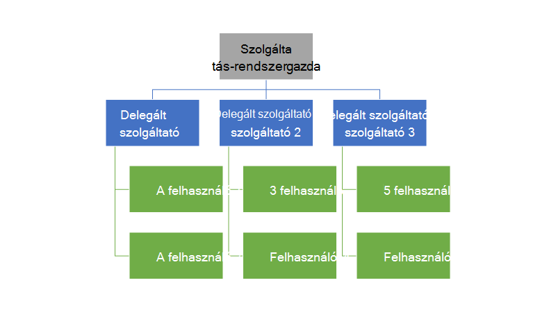
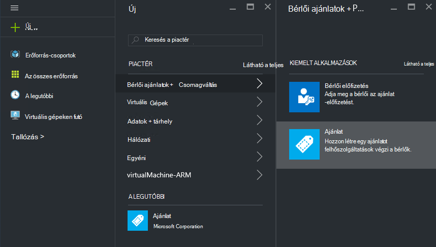

<properties
    pageTitle="Azure egymást fedő ajánlatok delegálása |} Microsoft Azure"
    description="Megtudhatja, hogy miként ajánlatok létrehozását, és bejelentkezés felhasználók mások helyezi."
    services="azure-stack"
    documentationCenter=""
    authors="AlfredoPizzirani"
    manager="byronr"
    editor=""/>

<tags
    ms.service="azure-stack"
    ms.workload="na"
    ms.tgt_pltfrm="na"
    ms.devlang="na"
    ms.topic="article"
    ms.date="10/07/2016"
    ms.author="alfredop"/>

#Azure egymást fedő ajánlatok delegálása

Szolgáltatás rendszergazdái gyakran kívánt ajánlatok létrehozása és a felhasználók feliratkozna meg másokkal. Ez például akkor fordulhat elő, ha egy szolgáltatót, és azt szeretné, hogy a viszonteladói ügyfelek jelentkezhetnek, és kezelheti azokat az Ön nevében. Ha egy központi informatikai csoport részeként, és részlegek vagy leányvállalataival számára a Regisztrálás a felhasználók a beavatkozás nélkül szeretné, akkor fordulhat elő egy vállalati is.

Meghatalmazás segít a következő műveleteket, ezzel megkönnyítve eléréséhez, és meg szeretné elvégeztetni közvetlenül, mint további felhasználók kezelése. Az alábbi ábrán egy szinttel a meghatalmazás, de az Azure Papírhalom támogatja a többszintű. Delegált szolgáltatók viszont is átadhatja más szolgáltatóktól legfeljebb öt szintje.

A rendszergazdák átadhatja ajánlatok létrehozását és a bérlők más felhasználók számára a meghatalmazás funkció használatával.

##Szerepkörök és a meghatalmazás lépései

Meghatalmazás megértéséhez, ne feledje, hogy az érintett három szerepkör létezik:

-   A **szolgáltatás-rendszergazda** kezeli az Azure Papírhalom infrastruktúra-ajánlat sablont hoz létre és delegálja mások ajánlja fel, hogy a felhasználók számára.

-   A meghatalmazott felhasználók **szolgáltatók meghatalmazott**neve. Más szervezetek (például más Azure Active Directory bérlők) is tartoznak.

-   **Felhasználók** a ajánlatok regisztrálhat, és használhatja őket a saját feladatok kezelése, VMs létrehozása, tárolása adatok stb.

Ahogy az alábbi ábrán látható, két lépésből áll a meghatalmazás beállítása.

1.  Azonosítsa a meghatalmazott szolgáltatók. Ehhez az ajánlatra csak a előfizetések szolgáltatást tartalmazó terv alapján feliratkozással.
    Ezt az ajánlatot előfizetőknek szerezheti be a szolgáltatás rendszergazdája lehetőségeit, köztük a kiterjesztése ajánlatok, és jelentkezzen be a felhasználók tagjának őket egy része.

2.  Az ajánlat átadhatja a meghatalmazott szolgáltató. Ezt az ajánlatot működik, Mik a meghatalmazott szolgáltatót is kínálhatnak sablonként. A meghatalmazott szolgáltató most már tudja venni az ajánlatot, válasszon egy nevet, (de ne módosítsa a szolgáltatásainak és kvóták), és ügyfeleknek kínált.

Használni kívánt delegált szolgáltatók, a felhasználóknak kell létrehozni a kapcsolatot a fő szolgáltató; Ez azt jelenti hogy létrehozásához szükséges előfizetést. Ebben az esetben az előfizetés azonosítja a meghatalmazott biztosító szolgáltatók – fő szolgáltató nevében bemutató ajánlatok jog.

Miután a kapcsolat létrejött, a rendszergazda felajánlás átadhatja a meghatalmazott szolgáltatóval. A meghatalmazott szolgáltató ettől kezdve az ajánlatra vonatkozó venni, nevezze át a (de ne módosítsa az anyag), és ajánlja fel a felelősséget ügyfelei.

A meghatalmazott szolgáltató meghatározásához felajánlás delegálása, és ellenőrizni, hogy a felhasználók akkor regisztrálhat, végezheti el az alábbi szakaszok utasításait.

##Szerepkörök beállítása

Lásd: a meghatalmazott szolgáltató a munkahelyén, szüksége van további Azure Active Directory-fiókok kívül a szolgáltatás rendszergazdai fiókkal. Ha nem rendelkezik őket, a két fiókok létrehozása. A fiókok bármely AAD bérlői tartozhat. Ezeket a meghatalmazott szolgáltató (DP), valamint a felhasználó hivatkozik.

| **Szerepkör** | **Szervezeti jogok** |
| -------------------- | ----------------------- |
|  Delegált szolgáltató | Felhasználói |
| Felhasználói | Felhasználói |

##A meghatalmazott szolgáltatók azonosítása

1.  Jelentkezzen be rendszergazdaként a szolgáltatás.

2.  Az ajánlat, amely lehetővé teszi a meghatalmazott szolgáltatók válhat bérlők létrehozása. Ehhez a tervet, és egy alapuló ajánlatra létrehozása:

    egy.  [Terv létrehozása](azure-stack-create-plan.md).
        Ez a terv csak az előfizetések szolgáltatás kell tartalmaznia. Ebben a cikkben egy PlanForDelegation nevű csomagot használjuk.

    b.  [Hozzon létre egy ajánlatot](azure-stack-create-offer.md) 
     a séma alapján. Ebben a cikkben OfferToDP nevű felajánlás használjuk.

    c billentyűkombinációt.  Az ajánlat kibocsátása elkészülte felvétele a meghatalmazott szolgáltató a felhasználói Azonosítójával ajánlatra bérlői webhelyre, kattintva     **előfizetések** &gt; **hozzáadása** &gt; **Új bérlő előfizetést**.

  

> [AZURE.NOTE]Az összes Azure Papírhalom ajánlatok, megvan az ajánlatra vonatkozó nyilvános, és hogy a felhasználók hozunk regisztrálhat, vagy hagyja a magánjellegű, és problémákat kezelése az előfizetés-kezelő szolgáltatás-rendszergazda. Delegált szolgáltatók általában kisebb csoport, és szeretné, hogy kik így ajánlatra magánjellegű megőrzési értelmezhető lesz a legtöbb esetben a, beengedésre.

##Szolgáltatás-rendszergazda hoz létre a delegált ajánlat

Most már hozott létre a delegált szolgáltatójához. A következő lépésként hozza létre a terv és ajánlatot, amelyek meghatalmazotti fogja, és amelyek ügyfelei fogja használni. Ezt az ajánlatot be kell állítania, pontosan úgy, ahogyan azt szeretné, hogy a vevők, mert a meghatalmazott szolgáltató nem tudnak a csomagok és tartalmazza kvótájának módosítása.

1.  Szolgáltatás-rendszergazda, [a terv létrehozása](azure-stack-create-plan.md) és [felajánlás](azure-stack-create-offer.md) azt. Ez a cikk azt DelegatedOffer nevű felajánlás használja.
> [AZURE.NOTE]Ezt az ajánlatot nem szükséges közzé kell tenni. El kell végezni nyilvános Ha úgy dönt, de a legtöbb esetben csak szeretné férhetnek hozzá a meghatalmazott szolgáltatók. Miután egy privát ajánlatot, delegálása, az alábbi lépésekkel ismertetett módon, a meghatalmazott szolgáltató hozzáférést kap azt.

2.  Az ajánlat delegálása. Nyissa meg a DelegatedOffer, és a beállítások ablakban, kattintson a **Meghatalmazott szolgáltatók** &gt; **Hozzáadás gombra**.

3.  Jelölje be a meghatalmazott szolgáltató előfizetés a legördülő listából, majd kattintson a **meghatalmazott**.

> 

##Delegált szolgáltató szabták az ajánlat

Jelentkezzen be a meghatalmazott szolgáltatóként, és hozzon létre egy új ajánlatot, használja a meghatalmazott ajánlat sablonként.

1.  Kattintson az **Új** &gt; **bérlői kínál + tervek** &gt; **felajánl**.

    

2.  Nevezze el az ajánlatot. Itt azt ResellerOffer ki. Jelölje be a meghatalmazott ajánlat alapján hozhatja létre, és kattintson a **Létrehozás**gombra.
    
    

    >[AZURE.NOTE] Megjegyzés: a különbség az ajánlat létrehozása, mint a szolgáltatás-rendszergazda által a tapasztaltabb képest. A meghatalmazott szolgáltató nem hozza létre az ajánlatot az alap-csomagokról és -bővítmény használatára feljogosító csomagok; ő csak választhat, hogy delegált ajánlatok, és a program nem módosíthatják-e.

3. Az ajánlat nyilvánossá tétele **Tallózás** gombra kattintva &gt; **kínál**, jelölje ki az ajánlatra vonatkozó, és kattintson a **Módosítás állam**.

4. A meghatalmazott szolgáltató közzététele ezek ajánlatok keresztül saját portál URL-CÍMÉT. Ne feledje, hogy ezek ajánlatok látható csak a delegált portál használatával. Keresse meg és az URL-cím módosítása:

    egy.  Kattintson a **Tallózás** &gt; **internetszolgáltató beállításai** &gt; **portál URL-címe**.

    b.  Ha azt szeretné, módosítsa a szolgáltató azonosítója.

    c billentyűkombinációt.  Másolja a portál URL-címe egy külön helyre, például a Jegyzettömbben.

    
<!-- -->
Most már befejezése delegált szolgáltatóként egy meghatalmazott ajánlatot létrehozását. Jelentkezzen ki a meghatalmazott szolgáltatóként. Zárja be a böngésző lap használta.

##Az ajánlat regisztrálhat

1.  Egy új böngészőablakban, nyissa meg a meghatalmazott portál URL-CÍMÉT az előző lépésben a mentett. Jelentkezzen be a portálon felhasználóként. Megjegyzés: az ebben a lépésben kell használnia a meghatalmazott portálon. A meghatalmazott ajánlatot nem lesz látható egyéb.

2.  Az irányítópult lapon kattintson a **előfizetés letöltése**gombra. Jelennek meg, hogy csak a delegált szolgáltató által létrehozott delegált ajánlatok jelennek meg a felhasználó:

> 

Ezzel a ajánlat meghatalmazás folyamata véget ér. A felhasználó most ajánlatra való bejelentkezéshez,-előfizetésről.

##Több szintű meghatalmazás

Több szintű meghatalmazás lehetővé teszi, hogy a meghatalmazott szolgáltató más szervezetek ajánlat delegálása. Ebben a csoportban adhatja, például mélyebb viszonteladói csatornák, amelyben a szolgáltató Azure Papírhalom kezelése a Disztribútor, akik viszont a viszonteladói delegálja felajánlás delegálja létrehozását.
Azure Papírhalom meghatalmazás legfeljebb öt szintet támogat.

Az ajánlat meghatalmazás többszintű létrehozásához a meghatalmazott szolgáltató viszont delegálja az ajánlat a következő szolgáltatóval. A folyamat megegyezik a meghatalmazott szolgáltató volt a szolgáltatás rendszergazdája számára (lásd: a [szolgáltatás-rendszergazda hoz létre a delegált ajánlat](#service-admin-creates-the-delegated-offer)).

##Következő lépések
[A virtuális kiépítése](azure-stack-provision-vm.md)
