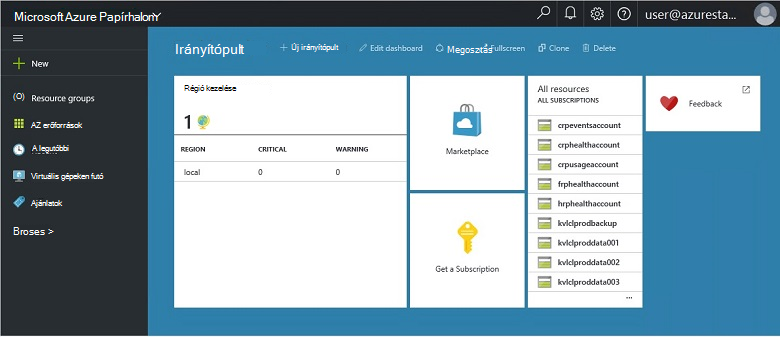
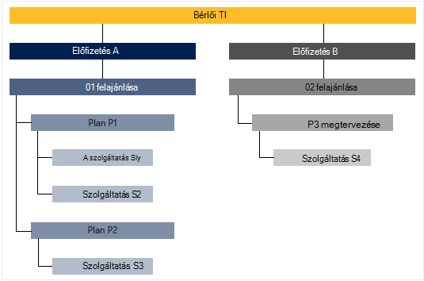

<properties
    pageTitle="Főbb funkciók és Azure egymást fedő fogalmak |} Microsoft Azure"
    description="Tudnivalók a fontosabb funkciói és Azure egymást fedő fogalmak."
    services="azure-stack"
    documentationCenter=""
    authors="Heathl17"
    manager="byronr"
    editor=""/>

<tags
    ms.service="azure-stack"
    ms.workload="na"
    ms.tgt_pltfrm="na"
    ms.devlang="na"
    ms.topic="article"
    ms.date="10/25/2016"
    ms.author="helaw"/>

# Főbb funkciók és Azure egymást fedő fogalmak

Ha most használja először a Microsoft Azure Papírhalom, ezek a kifejezések és a funkciók ismertetése hasznos lehet.

## Personas

Vannak olyan felhasználók a Microsoft Azure Papírhalom, a szolgáltatás rendszergazdája és a bérlő (ügyfél) két fajtái.

-  A **szolgáltatás-rendszergazda** is konfigurálása és erőforrás-szolgáltatók, bérlői ajánlatok, tervek, szolgáltatások, kvótáinak és árak kezelése.
-  **Bérlői** elnyeri (vagy vásárolja), amely felajánlja a szolgáltatás rendszergazdája szolgáltatások. Bérlői webhelyek kiépítése, figyelésére és, hogy azok előfizetett, például a Web Apps alkalmazások, a tárhely és a virtuális gépeken futó szolgáltatások kezelése.

## Portál

Az elsődleges módszerek használata a Microsoft Azure Papírhalom a portál és -PowerShell.

A Microsoft Azure Papírhalom portál egy példányát a kiszolgálón futó az Azure portálon. Egy olyan webhelyet, amely egy önkiszolgáló élmény nyújt szolgáltatás-rendszergazdák és a bérlők szerepköralapú hozzáférés-szerepalapú erőforrások és a felhő beosztását, gyors alkalmazás szolgáltatás fejlesztését és telepítésének engedélyezése a.

## Régiók, szolgáltatások, tervek, konstrukciók és előfizetések

Egymást fedő Azure szolgáltatások régiók, előfizetések, konstrukciók és a csomagok bérlők érkeznek. Több ajánlatok bérlők feliratkozhat. Ajánlatok beállíthatja, hogy egy vagy több tervek, és a csomagok beállíthatja, hogy egy vagy több szolgáltatást.

Példa hierarchiáját ajánlatok saját változó egy bérlői előfizetés csomagok és szolgáltatások.

### Területek
Azure Papírhalom területek méretezése és kezelése egy egyszerű elemet.  Egy szervezet több régióban elérhető erőforrásokkal lehet egyes régiókra.  Előfordulhat, hogy régiók is elérhető különböző szolgáltatásajánlatok.

### Szolgáltatások

Microsoft Azure Papírhalom lehetővé teszi, hogy a szolgáltatások és alkalmazások, például a virtuális gépeken futó SQL Server adatbázisok, SharePoint, az Exchange és további számos különböző előadásához szolgáltatók.

### Csomagváltás

Csoportosítás egy vagy több szolgáltatás alábbi csomagok állnak. Egy szolgáltatóként ajánlhat fel a bérlők tervezi hoz létre. A csomagok és szolgáltatások tartalmazzák a ajánlatok a bérlők fizessen elő.

Egyes szolgáltatásokhoz csomagra hozzáadott hozzáadva egyszerűbben kezelheti a felhőben kapacitás kvóta beállításokkal beállíthatók. Kvóták is elhelyezhet, például a virtuális memória és Processzor korlátai korlátozások, és a felhasználó előfizetésenként alkalmazza. Kvóták is termékenként a helyet. Például a számítási terület A szolgáltatásai tartalmazó terv lehet két virtuális gépeken futó, 4GB RAM és 10 Processzormagok kvóta.

Felajánlás írásakor a szolgáltatás rendszergazdája tartalmazhat **Alap tervek**. Ha egy adott ajánlat előfizetője ezekről a csomagokról alap alapértelmezés szerint látható. Amint a felhasználó előfizetett (és az előfizetés létrehozása), a felhasználó hozzáférhet e alap csomag (a megfelelő kvóták) megadott összes erőforrás-szolgáltató.

A szolgáltatás rendszergazdája is tartalmazhatnak **bővítmény használatára feljogosító csomagok** felajánlás. Az előfizetés alapértelmezés szerint nem szerepelnek a bővítmény használatára feljogosító csomagok. Bővítmény használatára feljogosító csomagok érhető el, hogy azok előfizetések vehet fel egy előfizetés tulajdonosa felajánlás más csomagok (kvóták).

### Ajánlatok

Ajánlatok olyan csoportjai, amelyek egy vagy több csomagok vásárlásához bérlőkhöz előidéző szolgáltatók (előfizetés). Ajánlat alfa például az terv A (a régió 1 tartalmazó számítási szolgáltatások) és a B terv (a tárhely és a hálózati szolgáltatások tartalmazó terület 2) is tartalmazhatnak.

Felajánlás tartalmaz egy alap tervek, és a szolgáltatás-rendszergazdák hozhatnak létre, amely a bérlők vehet fel az előfizetése bővítmény használatára feljogosító csomagok.

### Az előfizetések

Az előfizetés egy hogyan a bérlők a ajánlatok vásárolni. Az előfizetés egy bérlői webhelyre ajánlattal kombinációi. A bérlő beállíthatja, hogy több ajánlatok előfizetés. Egyes előfizetések csak egy ajánlat vonatkozik. A bérlő előfizetések csomagok és szolgáltatások elérhetik azt határozza meg.

Az előfizetések szolgáltatók rendszerezése elérése és használata a felhőben erőforrások és -szolgáltatások segítségével.

## Azure erőforrás-kezelő

Erőforrás-kezelő Azure használatával dolgozhat az infrastruktúra-erőforrások egy sablont, a declaritive modell.   Telepíthető, kezelése és a megoldás-összetevők, például virtuális gépeken futó, a tárterület-fiókok, a web Apps alkalmazások és az adatbázisok figyelése használható egyetlen felületet biztosít. Teljes információt és útmutatást a az [Azure erőforrás-kezelő – áttekintés](../azure-resource-manager/resource-group-overview.md)című témakörben találhat.

### Erőforrás-csoportok

Az erőforrás csoportok erőforrások, szolgáltatások és alkalmazások gyűjteményei – és az egyes erőforrásokhoz típus, például a virtuális gépeken futó, virtuális hálózatok, nyilvános IP-címei, tároló fiókok és webhely. Minden erőforrás egy erőforrás csoport legyen, és így erőforrás hatékonyabban logikusan érdekében erőforrások, például terhelést és helyét.

Íme néhány fontos fontolja meg egy erőforráscsoport megadásakor:

-   Az egyes erőforrások csak egy erőforráscsoport is megtalálható.

-   Akkor fogja üzembe, frissíthet és törölhet egy erőforrás csoport elemeinek együtt. Ha egy erőforrás, például egy adatbázis-kiszolgáló különböző telepítési ciklusban létezik, azt egy másik erőforráscsoport kell lennie.

-   Akkor felvehet és eltávolíthat egy erőforrást egy erőforrás csoportot bármikor.

-   Áthelyezheti egy erőforrás egy erőforrás csoportból másik csoportba.

-   Erőforráscsoport tartalmazhat információforrások, amelyek különböző régióban találhatók.

-   Erőforráscsoport felügyeleti műveleteket hozzáférés-vezérlés hatókör használható.

-   Egy erőforrás egy erőforrás egy másik erőforráscsoport a két erőforrás kell kapcsolatba egymással, de azok nem osztja meg a azonos életciklusáról csatolható. Például több alkalmazások csatlakoznia kell egy adatbázist, de arra az adatbázisra nem kell frissíteni vagy törölték a Apps azonos tempójában.

-   Microsoft Azure egymást fedő erőforrások, például a csomagok és ajánlatok is kezelhetők az erőforrás-csoportokat.

-   Erőforráscsoport is telepítsen újra.  Ez akkor hasznos kísérleti vagy fejlesztési céljából.  

### Azure erőforrás-kezelő sablonok

Az Azure erőforrás-kezelő, létrehozhat egy egyszerű sablon (JSON formátumban), amely definiálja, telepítés és az alkalmazás beállításai. Ez a sablon egy erőforrás-kezelő Azure-sablon nevezik, és telepítési meghatározásához deklaráció útján biztosít. Egy sablon segítségével többször telepítheti az alkalmazást az app életciklus során és webhelyeit az erőforrások konzisztens állapotban van telepítve.

## Erőforrás-szolgáltatók (RPs) – hálózati RP, kiszámítania RP tároló RP

Erőforrás-szolgáltatók, hogy az összes Azure-alapú IaaS a foundation alkotó webszolgáltatásokhoz és PaaS szolgáltatások. Azure erőforrás-kezelő támaszkodik különböző RPs egy szolgáltatási szolgáltatások hozzáférést biztosít.

Vannak olyan három fő RPs: hálózat, a tárhely és a számítási. Minden egyes e RPs segít beállítani és szabályozhatja az annak megfelelő erőforrásait. Szolgáltatás-rendszergazdák is adhat meg az új egyéni erőforrás-szolgáltatók.

### RP kiszámítása

A kiszámítása az erőforrás szolgáltató (KSZT) lehetővé teszi, hogy az Azure Papírhalom bérlők saját virtuális gépeken futó létrehozásához. A szolgáltatás rendszergazdája beállítása, és állítsa be az erőforrás-szolgáltató az bérlők funkciókat is tartalmaz. A KSZT létre virtuális gépeken futó, valamint a virtuális gép bővítmények tartalmazza. A virtuális gép bővítmény szolgáltatás segítségével IaaS funkciókat nyújt a Windows és Linux virtuális gépeken futó.

### Hálózati RP

A hálózati erőforrás szolgáltató (NRP) biztosítja a magánjellegű felhő szoftver definiált Networking (SDN) és a hálózati függvény virtualizációs (NFV) szolgáltatások sorozata. Ezek a funkciók konzisztensek az Azure nyilvános felhőbeli, így alkalmazássablonok egyszer írt, és mind az Azure nyilvános felhő vagy a helyszíni Microsoft Azure sávdiagram rendszerbe. A hálózati RP lehetőséget finomabb hálózati, metaadatok címkék, gyorsabb konfigurációs, gyors és megismételhető testreszabási, és több vezérlő felületek (beleértve a PowerShell, .NET SDK, Node.JS SDK, a többi-alapú API-val). A NRP hozhat létre a szoftver betöltés balancers, nyilvános IP-címei hálózati a biztonsági csoportok virtuális hálózatok, többek között.

### Tárterület RP

A tároló RP biztosítja négy Azure egységes tároló szolgáltatások: blob, a táblázat, a várakozási sora és a fiókok kezelése. Ezenkívül egy felhőalapú felügyeleti tárhelyszolgáltatáshoz service provider felügyeleti Azure egységes tárolás szolgáltatások megkönnyítése érdekében. Azure tároló tárolni, valamint strukturálatlan adatokat, például a dokumentumok és médiafájlok Azure okkal nagy mennyiségű rugalmasságot és strukturált NoSQL Azure-táblázatokkal rendelkező adatok alapján. További tájékoztatást a Azure tárolás című témakörben [a Microsoft Azure tárolás](../storage/storage-introduction.md).

#### BLOB-tárolóhoz

BLOB-tárolóhoz bármely adatkészlet tárolja. Blob szöveg vagy a bináris adatokat, például egy dokumentum, médiafájlok vagy alkalmazás installer bármilyen típusú is lehet. Táblatároló strukturált adatkészleteket tárolja. Táblatároló egy kulcsot-attribútumok adatai gyors fejlesztés és nagy mennyiségű adat gyors hozzáférést tesz lehetővé NoSQL áruházból. Várólista-tároló megbízható üzenetküldést, munkafolyamat feldolgozása és felhőszolgáltatások összetevői közötti kommunikációhoz biztosít.

Minden blob tároló szerint vannak rendezve. Tárolók is kínál hasznos biztonsági házirendek hozzárendelése objektumok csoportjainak. A tároló fiók tárolók tetszőleges számú is tartalmazhat, és tároló tetszőleges számú BLOB legfeljebb 500 TB kapacitás korlátot a tárterület-fiókot is tartalmazhat. BLOB-tároló ajánlatok háromféle BLOB, blokkolása BLOB, hozzáfűzése BLOB és lap BLOB (lemez). Blokkokból álló BLOB streaming és a felhő objektumokra tárolása optimalizálva, és a dokumentumok, a médiafájlokat, a biztonsági másolatok stb tárolásához kinek ajánljuk. Hozzáfűzése BLOB blokk BLOB hasonló, de vannak optimalizálva hozzáfűzése műveletek. Egy hozzáfűző blob frissíthető csak hozzáadásával egy új szövegrészt a végére. Hozzáfűző BLOB, például a naplózás, ahol új adatok van szüksége ahhoz, hogy csak a blob végén az esetek kinek ajánljuk. Lap BLOB optimalizálva, amely IaaS lemez és támogató véletlen ír, és lehetséges, hogy a mérete legfeljebb 1 TB. Az Azure virtuális gép hálózat lemez egy virtuális, oldal blob-ként tárolt IaaS csatolt.

#### Táblatároló

Táblatároló a Microsoft NoSQL kulcs/attribútum áruház – anélkül, hogy a sémák, így különböző hagyományos relációs adatbázisból látványterv tartalmaz. Adatok hiányát sémák tárolja, mivel nagyon egyszerűen meg is alkalmassá teheti az adatok, az alkalmazás evolve szükségleteinek. Táblatároló is könnyű kezelhetőséget, ezért a fejlesztők gyorsan hozhat létre alkalmazásokat. Táblatároló egy kulcsot-attribútum mentése, tehát, hogy minden táblában értéket beírt tulajdonság néven tárolja. A tulajdonság neve a szűrés és kiválasztási feltételek megadásával használható. Tulajdonságok és értékeik gyűjteménye entitás tartalmazzák. Táblázat tároló hiánya sémák óta a táblázatból két entitás tartalmazhat más webhelycsoportok tulajdonságait, és tulajdonságokat a különböző típusú lehet. Rugalmas adatkészleteket, például a webalkalmazások, címjegyzékek, eszköz adatait és más típusú metaadatokat a szolgáltatáshoz felhasználói adatok tárolására táblatároló is használhatja. Tetszőleges számú személyek is tárolnia egy táblában, és egy tárterület-fiókot is tartalmazhatnak tetszőleges számú táblázatok, a tárhely fiók kapacitás határértékén felfelé.

#### A várakozási tárhely
Azure várólista-tároló felhő között alkalmazásösszetevők üzenetküldés tartalmaz. Az alkalmazások skála tervez, alkalmazásösszetevők is gyakran leválasztott, úgy, hogy azok a független méretezheti. Várólista-tároló biztosítja, hogy aszinkron üzenetküldés alkalmazásösszetevők, közötti kommunikációhoz, hogy a felhőben, az asztalon, a helyszíni kiszolgálón vagy mobileszközön futnak. Várólista tárolás támogatja a aszinkron feladatok kezelése és a folyamat munkafolyamatok fejlesztésére is.

## Szerepköralapú hozzáférés-szerepalapú

Hogy hozzáférést rendszer jogosult felhasználók, csoportok és szolgáltatások szerepkörök egy előfizetés, a erőforráscsoport vagy az adott erőforrás szinten társításával RBAC is használhatja. Minden szerepkör határozza meg, hogy a hozzáférési szintet egy felhasználói, csoport vagy szolgáltatás van Microsoft Azure Papírhalom erőforrások fölé.

Azure RBAC alkalmazása az összes erőforrástípus három alapvető szerepköröket tartalmaz: tulajdonosa, a közös munka és az olvasó. Tulajdonos jobbra meghatalmazotti hozzáférést másokkal együtt összes erőforrás teljes hozzáféréssel rendelkezik. Közös munka hozhat létre és Azure erőforrások diagramtípusokat kezelése, de nem tud hozzáférést másokkal. A képernyőolvasók csak olvashatják a meglévő Azure erőforrásokat. A RBAC szerepkörök Azure-ban a többi adott Azure erőforrások kezelését teszi lehetővé. A virtuális gép munkatársi szerepkörök például lehetővé teszi, hogy létrehozásának és kezelésének virtuális gépeken futó, de nem engedélyezi a virtuális hálózat vagy az alhálózathoz, amelyhez csatlakozik a virtuális gép kezelését.

## Látogatottsági adatok

Microsoft Azure Papírhalom gyűjti össze, és használati adatainak összesíti az összes erőforrás-szolgáltató tömör felhasználónként jelentés megadására keresztül. Adatok lehet egyszerűen felhasznált erőforrás száma, illetve bonyolultakat egyes teljesítmény és arányának számláló. Az adatok REST API keresztül érhető el. Van egy Azure egységes bérlői API-val, valamint szolgáltató és meghatalmazott szolgáltató API-k használati adatok beolvasása az összes bérlői előfizetésekben. Ezeket az adatokat egy külső eszköz vagy a számlázási vagy visszaterhelési szolgáltatás integrálása használható.

## Következő lépések

[Azure Papírhalom Technical Preview 2 (Ez) telepítése](azure-stack-deploy.md)
