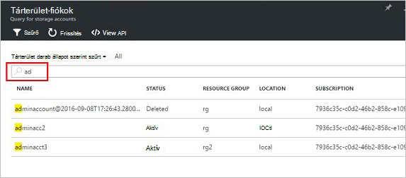

<properties
    pageTitle="Azure Papírhalom tárolás fiókokat |} Microsoft Azure"
    description="Megtudhatja, hogy miként kereshet, illetve kezelése, helyreállítása és Azure Papírhalom tároló fiókok visszanyeréséhez"
    services="azure-stack"
    documentationCenter=""
    authors="AniAnirudh"
    manager="darmour"
    editor=""/>

<tags
    ms.service="azure-stack"
    ms.workload="na"
    ms.tgt_pltfrm="na"
    ms.devlang="na"
    ms.topic="get-started-article"
    ms.date="09/26/2016"
    ms.author="anirudha"/>

# <a name="manage-storage-accounts-in-azure-stack"></a>Tárterület-fiókokat az Azure Papírhalom

Megtudhatja, hogy miként tárterület-fiókokat az Azure Papírhalom kereshet, visszaállítása és visszanyeréséhez tárolókapacitással rendelkezik vállalati igényei alapján.

## <a name="find-a-storage-account"></a>Keresse meg a tárterület-fiók

A tartományban lévő tároló fiókok listáját megtekintheti az Azure Halmozás:

1.  Böngészőben nyissa meg azt a [https://portal.azurestack.local](https://portal.azurestack.local/).

2.  (A telepítés során megadott hitelesítő adataival) rendszergazdaként jelentkezzen be az Azure Papírhalom portálra

3.  Keresse meg az alapértelmezett irányítópult – a **régió kezelés** listában, és kattintson a kívánt feltárása – például a régió **(helyi**).

    

4.  Válassza a **tárterület** az **Erőforrás-szolgáltatók** listából.

    

5.  Ezután a tárhely erőforrás szolgáltató felügyeleti lap – görgessen le a "Tároló fiókok" fülre, és kattintson rá.

    
    
    Az eredményül kapott lap az adott régióban tároló fiókok listáját.

    

Alapértelmezés szerint az első 10 fiókok jelennek meg. További lehívása választhatja a lista alján "betöltése több" hivatkozásra kattintva <br>
VAGY <br>
Ha érdekli egy adott tárolás fiókban – megtekintheti, **szűrheti és a megfelelő számlákhoz lehívása** csak.<br>

Szűrési fiókok:

1. Kattintson a szűrő gombra a lap tetején.

2. Kattintson a szűrő lap azt lehetővé teszi, hogy adja meg a **fiók nevét**,  **Előfizetés azonosítója** vagy **állapot** testre szabhatja a tárterület-fiókok listáját megjeleníteni. Szükség szerint használható őket.

3. Kattintson a frissítés gombra. A lista lehetőséget kell frissíteni.

    

4. Állítsa alaphelyzetbe a szűrőt, – kattintson a Szűrés gombra, törölje a jelet a megfelelő beállításokat, és frissíteni.

A keresett szöveg mezőbe fiókok listát tároló lap tetején lévő lehetővé teszi a jelölje ki a szöveget a fiókok listáját. Ez akkor nagyon hasznos abban az esetben, ha a teljes nevét vagy azonosítóját nem érhető el egyszerűen.<br>
A fiók érdeklik keresésének a megkönnyítéséhez ingyenes szöveg itt is használhatja.




## <a name="look-at-account-details"></a>Keresse meg a számla részletei

Miután megtalálta a számlák megtekintése érdeklik, rákattintva adott fiók bizonyos részletes adatainak megjelenítéséhez. Egy új lap nyílik a fiókadatokat, például a típusát a fiókot, a létrehozási idejének, a hely stb.


## <a name="recover-a-deleted-account"></a>A törölt fiók helyreállítása

Előfordulhat olyan helyzet, ahol meg szeretné állíthatja helyre a törölt fiókhoz.<br>
Van erre nagyon egyszerűen AzureStack.

1.  Lépjen a tárterület-fiókok listában keresse meg. [Lásd: keresse meg a tárterület-fiók](#find-a-storage-account)

2.  A listában keresse meg az adott fiókhoz. Előfordulhat, hogy szűréséhez.

3.  Jelölje be a "állapot" a fiók. Meg kell mondja ki a "törölt".

4.  Kattintson a fiókot, amely megnyitja a számla részletei lap.

5.  Ez a lap – fölött keresse meg a "visszaállítás" gombra, és kattintson rá.

6.  Győződjön meg arról, "Igen" billentyűkombinációval

    

7.  A helyreállítás most már folyamatban... Várakozás a jelzi, hogy a sikeres volt.
    Választhatja a haladás jelzéseket megtekintése a portálon tetején "Csengő" ikonra.

    

  A helyreállított fiókot sikeresen szinkronizált, miután egy is visszatérni a azt.

### <a name="some-gotchas"></a>Néhány Meglátások

- A törölt fiók mint "kívül adatmegőrzési" állapot megjelenítése.

  Ez azt jelenti, hogy a törölt fiók túllépte az adatmegőrzési időszak, és nem lehet helyreállítható eltűnt.

- A törölt fiók nem látható a partnerek listában.

  Ez azt, hogy a törölt fiók már szemétgyűjtő jelentheti. Ebben az esetben azt nem állíthatók eltűnt. Olvassa el a "visszanyeréséhez kapacitás".

## <a name="set-retention-period"></a>Az adatmegőrzési időszak beállítása

Az adatmegőrzési időszak beállítás lehetővé teszi, hogy a rendszergazda töltött idő megadásához nap (0 és 9999 nap) között, ameddig bármely törölt fiók esetleg állíthatók helyre. Az alapértelmezett az adatmegőrzési időszak 15 nap értékre van állítva. Érték az "0" azt jelenti, hogy minden olyan törölt fiók azonnal lesz az adatmegőrzési periodikus szemétgyűjtő-e jelölve.

Az adatmegőrzési időszak – módosítása

1.  Böngészőben nyissa meg azt a [https://portal.azurestack.local](https://portal.azurestack.local/).

2.  (A telepítés során megadott hitelesítő adataival) rendszergazdaként jelentkezzen be az Azure Papírhalom portálra

3.  Keresse meg az alapértelmezett irányítópult – a **régió kezelés** listában, és kattintson a kívánt feltárása – például a régió **(helyi**).

4.  Válassza a **tárterület** az **Erőforrás-szolgáltatók** listából.

5.  Kattintson a gombra kattintva nyissa meg a beállítás a lap tetején a beállítások ikonra.

6.  Kattintson a konfigurálás – az adatmegőrzési időszak.

7.  Az érték szerkesztése, és mentse.

 Ez az érték azonnal érvénybe, és a át a teljes terület megfelelően.


## <a name="reclaim-capacity"></a>Kapacitás visszanyeréséhez

Az adatmegőrzési időszak járó hatásai egyik, hogy a törölt fiók továbbra is használhatnak beosztását, amíg ki az adatmegőrzési időszak származik. Most lehet, hogy rendszergazdaként visszanyeréséhez Ez úgy a törölt fiókok terület annak ellenére, hogy az adatmegőrzési időszak még nem járt le. Jelenleg is használhatja a parancssor kifejezetten felülbírálása az adatmegőrzési időszak, és azonnal visszanyeréséhez kapacitása. Ehhez tegye –

1.  Feltételezve, hogy Azure-PowerShell telepítette és beállította. Ha nem, kövesse az útmutatást: telepítse a legújabb Azure PowerShell-verziót, és társíthatja az Azure előfizetés, megtudhatja, [hogy miként telepítheti, állíthatja Azure PowerShell](http://azure.microsoft.com/documentation/articles/powershell-install-configure/).
    Azure erőforrás-kezelő parancsmagok kapcsolatos további tudnivalókért lásd: [Azure PowerShell használatá a Azure-kezelő eszközzel](http://go.microsoft.com/fwlink/?LinkId=394767)

2.  Futtassa a következő parancsmagot:

    ```
    PS C:\\>; Clear-ACSStorageAccount -ResourceGroupName system
    -FarmName <your farmname>
    ```

> További részletekért olvassa el [AzureStack powershell dokumentáció](https://msdn.microsoft.com/library/mt637964.aspx)

> [AZURE.NOTE] A következő parancsmagot véglegesen törli a fiókot, és annak tartalmát. Már nem lesz a helyreállítható. Körültekintéssel használjon.

