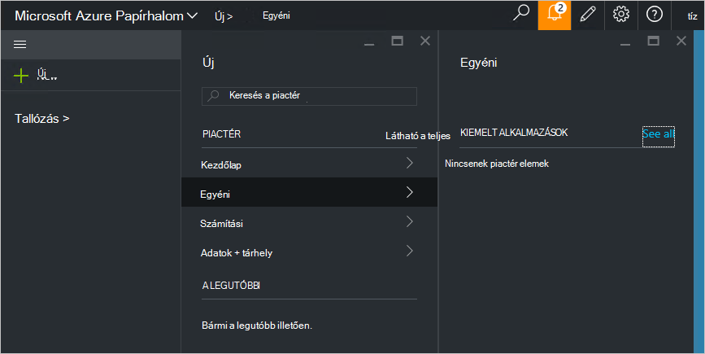

<properties
    pageTitle="Közzététel egy egyéni piactéren elérhető elemre Azure egymást fedő (szolgáltatás rendszergazdája) |} Microsoft Azure"
    description="Szolgáltatás rendszergazdái megtudhatja, hogy miként teheti közzé egy egyéni piactéren elérhető elemre Azure egymást fedő."
    services="azure-stack"
    documentationCenter=""
    authors="rupisure"
    manager="byronr"
    editor=""/>

<tags
    ms.service="azure-stack"
    ms.workload="na"
    ms.tgt_pltfrm="na"
    ms.devlang="na"
    ms.topic="article"
    ms.date="09/26/2016"
    ms.author="rupisure"/>

# A Papírhalom Azure piactérről

A piactér az Azure Papírhalom, például a services, az alkalmazások és az erőforrások testre szabott elemek gyűjteménye. Akkor arra a helyre, ahol bérlők jár új erőforrások létrehozása és az új alkalmazások telepítése. Szolgáltatás-rendszergazdák az egyéni elemeket az Office áruházat, és a bérlők láthatóvá válnak azonnal is hozzáadhat.

Nyissa meg a piactér, kattintson az **Új**gombra.

A piactér öt percenként frissül.

## Elemek piactér

Minden Marketplace elemet foglalja magában:

-   Egy erőforrás-kezelő Azure sablont a erőforrás szerinti kiépítéséhez

-   Metaadat-alapú, például a karakterláncok, ikon és egyéb marketing biztosítékot

-   Az elem megjelenítéséhez a portálon formázási információk

Minden elemet a piactér közzétett használja az Azure gyűjtemény csomag (azpkg) nevű formátumot. Telepítési és runtime erőforrások (például kód, a szoftvert vagy virtuális gép képek zip-fájlok) kell hozzá Azure Papírhalom külön-külön, nem a piactér elem részeként. 

## Következő lépések

[Létrehozása és közzététele a piactér elem](azure-stack-create-and-publish-marketplace-item.md)
