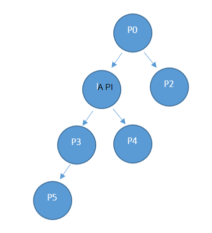

<properties
    pageTitle="Szolgáltató erőforrás-kihasználtság API |} Microsoft Azure"
    description="Hivatkozás az Erőforrás kihasználtsága API-val, amely lekérése az Azure Papírhalom kihasználtsági információk."
    services="azure-stack"
    documentationCenter=""
    authors="AlfredoPizzirani"
    manager="byronr"
    editor=""/>

<tags
    ms.service="azure-stack"
    ms.workload="na"
    ms.tgt_pltfrm="na"
    ms.devlang="na"
    ms.topic="article"
    ms.date="10/18/2016"
    ms.author="alfredop"/>

# Szolgáltató erőforrás-kihasználtság API

A szerződési időszak szolgáltató a szolgáltatás rendszergazdája és bármely delegált szolgáltatók vonatkozik. Szolgáltatás-rendszergazdák és a meghatalmazott szolgáltatók segítségével a szolgáltató használatát API megtekintheti az illető közvetlen bérlők használatát. Például P0 felhívhatja, ha a szolgáltató API tájékozódáshoz használatát a P1 meg és P2's közvetlen használatát, és P1 felhívhatja P3 és P4 használatát információt.

## API-hívás hivatkozás

### Kérés

A kérés felhasználási részleteket a kért előfizetések és a kért időkereten kap. Nem nincs összehívás törzsébe.

A használati API is a szolgáltató API, ezért a kíván a hívó féllel a szolgáltató előfizetés tulajdonosa, munkatársi vagy olvasó szerepet e kiosztani.

| **A módszer**  | **Kérés URI** |
| ------------ | ------------------------------------------------------------------------------------------------------------------------------------------------------------------------------------------------------------------------------------------------------------------------------------------------------ |
|  GET        | https://{armendpoint}/subscriptions/{subId}/providers/Microsoft.Commerce/subscriberUsageAggregates?reportedStartTime={reportedStartTime}&reportedEndTime={reportedEndTime}&aggregationGranularity={granularity}&subscriberId={sub1.1}&api-version=2015-06-01-preview&continuationToken={token-value} |

### Argumentumok

| **Argumentum**              | **Leírás** |
| -------------------------- | --------------------------------------------------------------------------------------------------------------------------------------------------------------------------------------------------------------------------------------------------------------------------------------------------------------------------------------------------------- |
| *armendpoint*             | Azure erőforrás-kezelő végpontja a Papírhalom Azure környezetben. Az Azure Papírhalom használni kívánt, hogy a formátum https://api van ARM végpontjának neve. {tartománynév} ". Például ha a tartománynév azurestack.local, majd a ARM végpont lesz https://api.azurestack.local. |
| *subId*                   | Előfizetés azonosítója annak a felhasználónak a telefonhívás. |
| *reportedStartTime*       | A lekérdezés elindítása. *Dátum és idő* érték UTC szerint megadva, és az órát, például 13:00 elején kell lennie. Napi összesítésre Egyezményes éjfél állítsa ezt az értéket. Formátuma *escape* ISO 8601, például a Skype 2015-06-16T18 % 3a53 % 3a11 % 2b00 % 3a00Z, ahol a kettőspont való % 3a escape és plusz van escape % 2b, úgy, hogy könnyen megjegyezhető URI. |
| *reportedEndTime*         | A lekérdezés befejezési idő. A *reportedStartTime* vonatkozó korlátozások érvényesek ezt az argumentumot is. *ReportedEndTime* értéke nem lehet a jövőben. |
| *aggregationGranularity*  | Két különálló potenciális értékeket tartalmazó választható paraméter: napi és óránként. Az értékek alapján, mint egy adja vissza az adatokat a napi Granularitás, és a másik pedig az óránkénti felbontás. A napi lehetőséget az alapértelmezett érték. |
| *subscriberId*            | Előfizetés azonosítója. Úgy juthat az adatok szűrt, a szolgáltató közvetlen bérlő előfizetés azonosítója szükség. Ha nem előfizetés azonosítója paraméter nincs megadva, a hívás a szolgáltató közvetlen bérlők használati adatainak visszaadása. |
| *API-verzió*             | A kérés létesítéséhez használatos protokollt verziója. 2015-06-01-előnézet kell használnia. |
| *continuationToken*       | Jogkivonat beolvasni a használatát API-szolgáltató a legutóbbi hívást. Ez van szükség, ha a választ értéke nagyobb, mint 1000 sorokat. Ez az a könyvjelző előrehaladásra. Ha nincs megadva, az adatok beolvasásának az elejétől a nap, vagy átadott órát, granularitása alapján. |

### Válasz

BEOLVASÁSA /subscriptions/sub1/providers/Microsoft.Commerce/subscriberUsageAggregates?reportedStartTime=reportedStartTime=2014-05-01T00%3a00%3a00%2b00%3a00 és reportedEndTime = 2015-06-01T00 % 3a00 % 3a00 % 2b00 % 3a00 & aggregationGranularity = napi & subscriberId = sub1.1 & api-verzió = 1,0

{

"érték":\[

{

"azonosító": "/subscriptions/sub1.1/providers/Microsoft.Commerce/UsageAggregate/sub1.1-

meterID1 ",

"név": "sub1.1-meterID1"

"típus": "Microsoft.Commerce/UsageAggregate",

"Tulajdonságok": {

"subscriptionId": "sub1.1",

"usageStartTime": "a Skype 2015-03-03T00:00:00 + 00:00",

"usageEndTime": "a Skype 2015-03-04T00:00:00 + 00:00",

"instanceData": "{\\" Microsoft.Resources\\": {\\" resourceUri\\":\\" resourceUri1\\",\\"hely\\

":\\" Alaszka\\",\\" címkék\\": null\\" additionalInfo\\": null}}",

"quantity":2.4000000000,

"meterId": "meterID1"

}

},

…

### Válasz adatai

| **Argumentum**       | **Leírás**
| ------------------ | ------------------------------------------------------------------------------------------------------------- |
| *azonosító*               | Az összesítés használatát egyedi azonosító
| *név*             | Összesítés használatát neve
| *típus*             | Erőforrás meghatározása
| *subscriptionId*   | Azure Papírhalom felhasználó előfizetés azonosítója
| *usageStartTime*   | A használati gyűjtő, amelyhez ez használatát összesítés tartozik UTC elindítása
| *usageEndTime*     | UTC befejezési idő értékét a használati gyűjtő, amelyhez ez használatát összesítés tartozik
| *instanceData*     | Kulcs – érték párokká a példány részletei (az új formátumra):  *resourceUri*: teljesen minősített az erőforrás-azonosító, amely tartalmazza az erőforrás-csoportok és a példány nevét   *hely*: Ez a szolgáltatás futtatásának terület   *címkék*: a felhasználó által megadott erőforrás címkék   *additionalInfo*: további részleteket az erőforrás-felhasználás alatt álló, például operációs rendszer verziója vagy kép típusát |
| *mennyiség*         | Az erőforrás-e időkereten előfordult felhasználás összege |
| *meterId*          | Egyedi azonosító, amely az erőforrás elfogyasztott (is hívott, *ResourceID*) |

## Következő lépések

[Bérlői erőforrás-kihasználtság API-hivatkozás](azure-stack-tenant-resource-usage-api.md)

[Használatát kapcsolatos gyakori kérdések](azure-stack-usage-related-faq.md)
