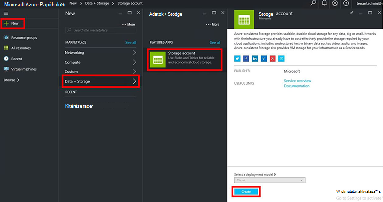
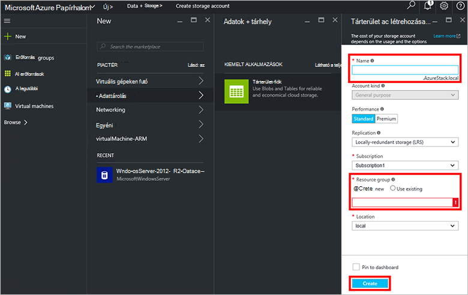
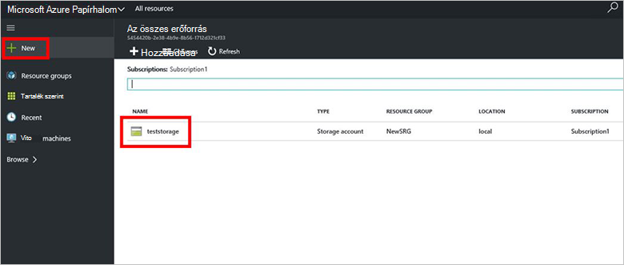

<properties
    pageTitle="Tárterület-fiókok Azure egymást fedő |} Microsoft Azure"
    description="Megtudhatja, hogy miként hozhat létre Azure Papírhalom tároló fiókot."
    services="azure-stack"
    documentationCenter=""
    authors="ErikjeMS"
    manager="byronr"
    editor=""/>

<tags
    ms.service="azure-stack"
    ms.workload="na"
    ms.tgt_pltfrm="na"
    ms.devlang="na"
    ms.topic="get-started-article"
    ms.date="09/26/2016"
    ms.author="erikje"/>

# Azure egymást fedő tárterület-fiókok

Tárterület-fiókok Blob és a táblázat szolgáltatások és a tárhely adatobjektumok egyedi névtere tartalmazzák. Alapértelmezés szerint a fiók adatai csak az Ön, a tárhely fióktulajdonos érhető el.

1.  Az Azure Papírhalom ez számítógépen jelentkezzen be az `https://portal.azurestack.local` [rendszergazda](azure-stack-connect-azure-stack.md#log-in-as-a-service-administrator), és kattintson az **Új** > **adatok + tárhely** > **tárterület-fiókot**.

    

2.  Írja be a **tárterület-fiók létrehozása** lap tárterület-fiókja nevét. Hozzon létre egy új **Erőforráscsoport**, vagy jelöljön ki egy meglévőt, majd kattintson a **Create** a tárterület-fiók létrehozása gombra.

    

3. Lásd: a tárterület-fiókja, kattintson az **összes erőforrás**, majd keresése a tárterület-fiók, és kattintson a nevére.

    
    
## Következő lépések

[Erőforrás-kezelő Azure sablonok használata](azure-stack-arm-templates.md)

[További tudnivalók: Azure tárterület-fiókok](../storage/storage-create-storage-account.md)

[Azure Papírhalom Azure egységes tároló érvényességi-útmutató letöltése](http://aka.ms/azurestacktp1doc)
