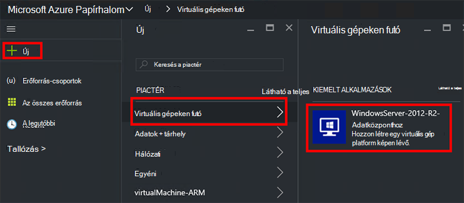
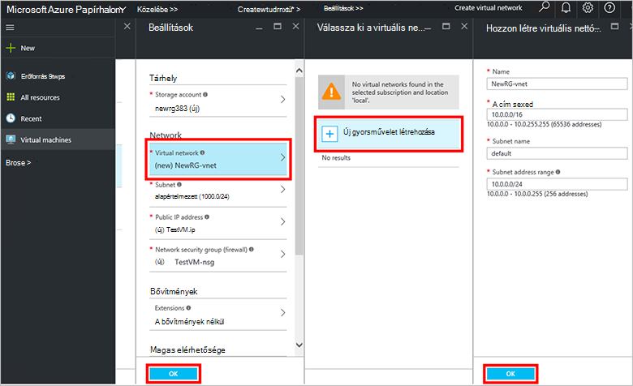
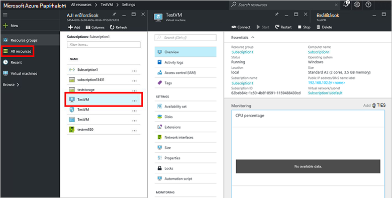

<properties
    pageTitle="Azure egymást fedő (bérlő esetében) egy virtuális kiépítése |} Microsoft Azure"
    description="A bérlői, mint megtudhatja, hogy miként hozhatók létre egy virtuális Azure egymást fedő."
    services="azure-stack"
    documentationCenter=""
    authors="ErikjeMS"
    manager="byronr"
    editor=""/>

<tags
    ms.service="azure-stack"
    ms.workload="na"
    ms.tgt_pltfrm="na"
    ms.devlang="na"
    ms.topic="get-started-article"
    ms.date="10/12/2016"
    ms.author="erikje"/>

# A virtuális gép kiépítése

Rendszergazdaként hozhat létre virtuális gépeken futó erőforrások kiértékelendő kínáló őket a csomagváltás előtt.

## A virtuális gép kiépítése

1.  Az Azure Papírhalom ez számítógépen jelentkezzen be az `https://portal.azurestack.local` [rendszergazda](azure-stack-connect-azure-stack.md#log-in-as-a-service-administrator), és kattintson az **Új** > **virtuális gépeken futó** > **WindowsServer-2012-R2-adatközponthoz**.  

    

2.  Az **alapvető tudnivalók** lap írja be egy **nevet**, **felhasználónevet**és **jelszót**. **Virtuális lemez típusa**válassza a **merevlemez**. Válasszon **előfizetést**. Hozzon létre egy **erőforráscsoport**, vagy jelöljön ki egy meglévőt, és kattintson az **OK gombra**.  

3.  A **Válassza ki a méretet** a lap, a **A1 egyszerű**gombra, és kattintson a **Jelölje ki**.  

4.  Kattintson a **Beállítások** lap **virtuális hálózati**. Kattintson a **Válassza ki a virtuális hálózati** lap **Új létrehozása**. A **virtuális hálózat létrehozása** lap fogadja el az alapértelmezett beállításokat, majd kattintson az **OK gombra**. A **Beállítások** lap kattintson **az OK gombra**.

    

5.  Az **összefoglaló** lap kattintson **az OK** gombra a virtuális gép létrehozásához.  

6. Jelenik meg az új virtuális gép, kattintson az **összes erőforrás**, majd a virtuális gép keresése, és kattintson a nevére.

    

## Következő lépések

[Tárterület-fiókok](azure-stack-provision-storage-account.md)
