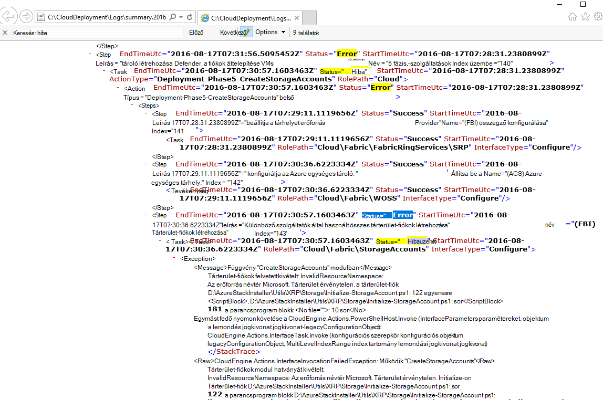
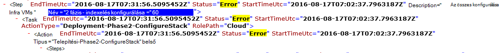

<properties
    pageTitle="Futtassa újra a telepítés nem sikerült lépés a |} Microsoft Azure"
    description="Ha hibát tapasztal a telepítés során, próbálja meg a futtassa újra a telepítést, ahol nem sikerült a következő lépéseket."
    services="azure-stack"
    documentationCenter=""
    authors="ErikjeMS"
    manager="byronr"
    editor=""/>

<tags
    ms.service="azure-stack"
    ms.workload="na"
    ms.tgt_pltfrm="na"
    ms.devlang="na"
    ms.topic="get-started-article"
    ms.date="09/26/2016"
    ms.author="erikje"/>
    
# A telepítés nem sikerült lépés a ismétlése
  
Ha hibát tapasztal a telepítés során, próbálja meg a futtassa újra a telepítést, ahol nem sikerült a következő lépéseket.

## A hiba keresése

Nem sikerült a Take Megjegyzés: a hiba, kifejezetten hívja lépésénél, mely a meghívási része. Ha például

**2016-08-17 00:30:57 hiba 1 > 1 > művelet: nem sikerült lépés 60.140.143 meghívását. Tevékenységterv leállítása meghívását.**

Ez egy lépésben a hol elkezdenek az ismétlése helyezési.

## További részleteket találhat a hiba

Ha további információra kíváncsi, a hiba, keresse meg a társított összefoglaló **. YYYY-MM-DD.tt.N.log.xml** a a **C:\CloudDeployment\Logs\* * mappát.
A "Hiba" karakterláncot keres, és kövesse azt lefelé a kimenet keresztül nem XML formázott szöveget, amely tartalmazza az (Ez a szakasz gyakran egybe a "Hiba" karakterlánc utolsó példánya) hibaüzenet nagy mennyiségű amíg. Példa:

Az információk segítségével nyomon követheti a futtassa újra a lépést, a "Indexelni" számok Elintézendő az utolsó hiba. A fenti képen látható (alsó kezdve): 143 140, majd görgessen le, fel, 60 látható:

Elhelyez összes csoportosítása (most fentről lefelé), akkor 60.140.143, hasonlóan a PS konzol eredményt ad a hiba (a látható módon a fenti szakasz "Találja a hiba").

## Futtassa újra a telepítést, egy adott lépésénél

Most, hogy a lépés, amely a telepítés nem sikerült, próbálja meg a - ismétlése azokhoz a helyezési.

> [AZURE.IMPORTANT] A következő parancsokat a megfelelő felhasználói környezetben, hogy mikor történt a hibát tartalmazó kell futtatnia. Ha a hiba történt, mielőtt a fogadó volt a tartományhoz, a helyi rendszergazdafiók futtatása ezeket a lépéseket. Ha a hiba történt, miután a fogadó volt a tartományhoz, futtassa a ezeket a lépéseket a tartomány rendszergazdájaként (azurestack\azurestackadmin).

### A Invoke-EceAction parancs végrehajtása

1. Egy jogú PS konzolról a következő modulok importálása:

        Import-Module C:\CloudDeployment\CloudDeployment.psd1 -Force
        Import-Module C:\CloudDeployment\ECEngine\EnterpriseCloudEngine.psd1 -Force 

2. Ezután hajtsa végre a következő parancs (például feletti használt itt):

        Invoke-EceAction -RolePath Cloud -ActionType Deployment -Start 60.140.143 -Verbose

3.  Ez kezdeményez azonosítani a lépésben a példányban paraméterben – kezdés Invoke-EceAction parancs

### Eredmény: a - ismétlése / – kezdés

Függetlenül attól, a beállítást választja, a telepítési újra meg is kezdi a megadott - kezdje paraméter.

1.  Helyreállítható a hiba esetén a telepítés befejezése keresztül továbbra is.

2.  Ha a telepítő nem sikerül újra...
    
    - ugyanazon a helyen: a hiba valószínűleg nem helyreállítható, és további vizsgálat szükség.

    - Új hely után, ha nem sikerült Ez esetben: próbálja meg megszerezni a Lendület fenntartása újra fenti lépéseket.

    - Új hely előtt, ha nem sikerült Ez esetben: egyéb hiba történt-idempotent hívást, amelyhez szükséges további vizsgálat.

## Következő lépések

[Azure Papírhalom csatlakoztatása](azure-stack-connect-azure-stack.md)

