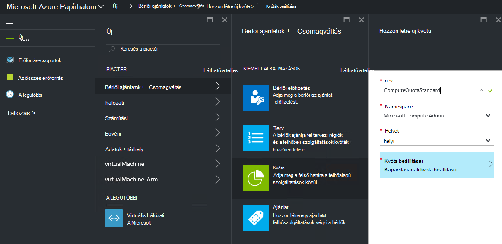
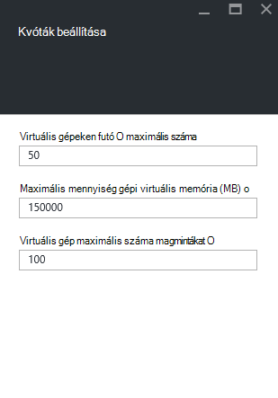
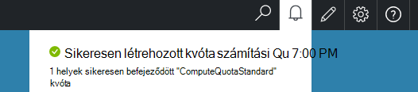

<properties
    pageTitle="Azure egymást fedő kvóták |} Microsoft Azure"
    description="A rendszergazdák legnagyobb mennyiségű rendelkező erőforrások bérlők való hozzáférés korlátozása kvóták beállítása."
    services="azure-stack"
    documentationCenter=""
    authors="mattmcg"
    manager="byronr"
    editor=""/>

<tags
    ms.service="azure-stack"
    ms.workload="na"
    ms.tgt_pltfrm="na"
    ms.devlang="na"
    ms.topic="get-started-article"
    ms.date="09/26/2016"
    ms.author="mattmcg"/>

# Azure egymást fedő vonatkozó kvóták beállítása

Kvóták információforrások, amelyek előfizetés bérlői webhely kiépítése, vagy a kimerítheti határain határozza meg. Kvóta például lehetővé teheti a bérlő létrehozása legfeljebb öt VMs. Szolgáltatás hozzáadása csomagra, a rendszergazda konfigurálnia kell a szolgáltatás kvóta beállításait.

Kvóták konfigurálható szolgáltatás használati és területenként engedélyezése a rendszergazdák számára, hogy az erőforrás-felhasználás részletes szabályozható. A rendszergazdák hozzon létre egy vagy több kvóta erőforrások és őket társítása tervek, ami azt jelenti, hogy azok megadhatja az eltérő szeretne rendelni, a szolgáltatásokhoz. Egy adott szolgáltatás kvóták létrehozhatók az **Erőforrás-szolgáltató** a felügyeleti lap, hogy a szolgáltatás.

Bérlői webhelyet, amely több csomagok tartalmazó felajánlás előfizetője használhatja az egyes csomagban elérhető összes erőforrás.

## Egy IaaS kvóta létrehozása

1.  A böngészőben nyissa meg a [https://portal.azurestack.local](https://portal.azurestack.local/).

    Jelentkezzen be az Azure Papírhalom portálra rendszergazdaként (a hitelesítő adatokat, a telepítés során kapott) segítségével.

2.  Válassza az **Új**, és válassza a **Kvóta**.

3.  Jelölje ki az első szolgáltatás, amelynek meg szeretné kvóta létrehozása. Egy IaaS kvóta kövesse ezeket a lépéseket a számítási, hálózati és tárolását szolgáltatásokra.
Ebben a példában azt először kvóta létrehozása a számítási szolgáltatás. **Namespace** listájában válassza ki a **Microsoft.Compute.Admin** névteret.

    > 

4.  Válassza ki a helyet, ahol a kvóta definiálva van (például "helyi").

5.  A **Kvóta beállítások** elemen megjelölésekor **a kapacitás kvóta beállítása**. Kattintson az elem a kvóta beállítása.

6.  A **Kvóták beállítása** lap a látható, amelynek korlátozásokat állíthat be az összes számítási erőforrás. Minden egyes alapértelmezett értéke van társítva. Módosíthatja, hogy ezeket az értékeket, vagy választhatja a fogadja el az alapértelmezett beállításokat a lap alján az **Ok** gombra.

    > 

7.  Az értékek konfigurált és **Ok**kattintott, a **Kvóta beállításai** elemet **a beállított**jelenik meg. Kattintson az **OK gombra** a **Kvóta** erőforrás létrehozásához.

    Meg kell jelennie a kvóta erőforrás létrejön jelző értesítés.

8.   Kvóta beállítása sikeres létrehozását követően egy második értesítést kap. A számítási szolgáltatás kvóta készen áll a terv társítani. Ismételje meg a hálózati és tárolási szolgáltatásokkal, és készen áll a IaaS terv létrehozása!

    >   

## Kvóta típusok kiszámítása

|**Típus**                    |**Alapérték**| **Leírás**|
|--------------------------- | ------------------------------------|------------------------------------------------------------------|
|Virtuális gépeken futó maximális száma   |50|Ezen a helyen előfizetés hozhat létre virtuális gépeken futó maximális száma. |
|Virtuális gép magmintákat maximális száma              |100|Maximális száma magmintákat, előfizetés hozhat létre az ezen a helyen (például egy A3 virtuális négy magmintákat van).|
|Maximális mennyiség gépi virtuális memória (GB)         |150|A legnagyobb mennyiségű kiépítése MB RAM (például az A1 virtuális fogyasztása 1,75 GB RAM).|

> [AZURE.NOTE] Kiszámítania kvóták nem vannak érvényben a technikai előzetes verzióban.

## Tárolási kvóta típusok

|**Elem**                           |**Alapérték**   |**Leírás**|
|---------------------------------- |------------------- |-----------------------------------------------------------|
|A maximális kapacitás (GB)              |500                 |Ezen a helyen előfizetés felhasználható tárterületkorlátot kapacitása.|
|Tárterület számlák száma   |20                  |Az előfizetés hozhat létre az ezen a helyen, a tárhely fiókoknak maximális száma.|

## Hálózati kvóta típusai

|**Elem**                                                   |**Alapérték**   |**Leírás**|
|----------------------------------------------------------| ------------------- |--------------------------------------------------------------------------------------------------------------------------------------------------------------------|
| Max nyilvános IP-címei                         |50                  |Nyilvános IP-címei, előfizetés hozhat létre az ezen a helyen maximális száma. |
| Max virtuális hálózatok                   |50                  |Előfizetés az ezen a helyen hozhat létre virtuális hálózatok maximális száma. |
| Max virtuális hálózati átjárók           |1                   |A maximális száma, hogy az előfizetés ezen a helyen hozhat létre virtuális hálózati átjárók (VPN átjárók). |
| Hálózati kapcsolatok maximális száma                |2                   |Hálózati kapcsolatok (pontok közötti vagy webhely), amely előfizetés hozhat létre minden virtuális hálózati átjárók ezen a helyen keresztül maximális száma. |
| Max terheléselosztókkal                     |50                  |Az előfizetés ezen a helyen hozhat létre, terheléselosztókkal maximális száma. |
| Max NIC                               |100                 |Az előfizetés hozhat létre, erre a helyre a hálózati felületek maximális száma. |
| Max hálózati biztonsági csoportok            |50                  |Az előfizetés hozhat létre, erre a helyre a hálózati biztonsági csoportokat maximális száma. |
