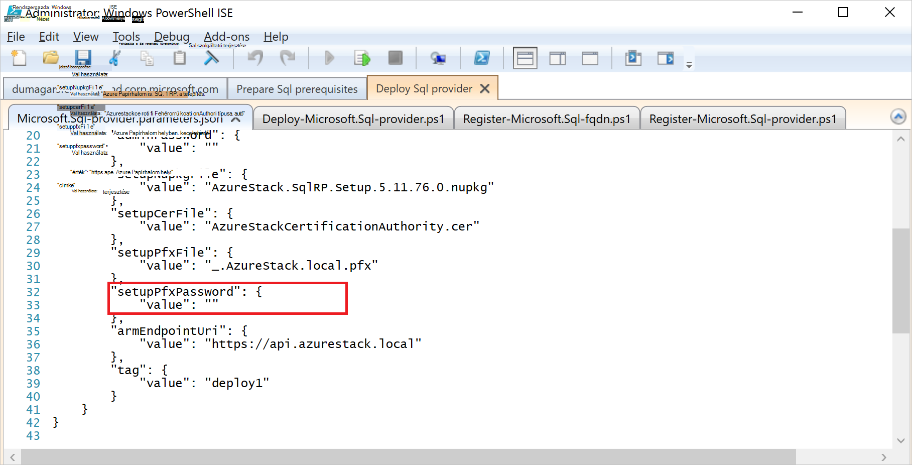

<properties
    pageTitle="Az SQL Server-erőforrás szolgáltatót a Azure Papírhalom telepítése |} Microsoft Azure"
    description="Egy SQL Server erőforrás szolgáltató adaptert Azure Papírhalom üzembe részletes lépéseket."
    services="azure-stack"
    documentationCenter=""
    authors="Dumagar"
    manager="byronr"
    editor=""/>

<tags
    ms.service="multiple"
    ms.workload="na"
    ms.tgt_pltfrm="na"
    ms.devlang="na"
    ms.topic="article"
    ms.date="09/26/2016"
    ms.author="dumagar"/>

# Az SQL Server erőforrás szolgáltató adaptert Azure Papírhalom terjesztése

> [AZURE.NOTE] Az alábbi információk csak az Azure Papírhalom TP1 telepítések vonatkozik.

Ez a cikk segítségével hajtsa végre a részletes lépéseket az SQL Server erőforrás szolgáltató kártya meg fogalmat (Ez) igazolása Azure egymást fedő beállítása. Lásd: a megtudhatja, hogy az erőforrás-szolgáltató funkciók és architektúra [használja a Papírhalom Azure SQL-adatbázisait](azure-stack-sql-rp-deploy-short.md) .

## Állítsa be a lépéseket, mielőtt beállítaná

Mielőtt beállítaná az erőforrás-szolgáltató, akkor kell:

- A .NET 3.5-ös, egy alapértelmezett Windows Server kép
- Az Internet Explorer (IE) fokozott biztonság kikapcsolása
- Azure PowerShell legújabb verziójának telepítése

### Hozzon létre a Windows Server, beleértve a .NET 3.5-ös képe

Kihagyhatja ezt a lépést, ha letöltötte az Azure Papírhalom bittel 2/23/2016 után, mert az alapértelmezett alap Windows Server 2012 R2 kép tartalmaz 3.5-ös .NET keretrendszer letöltéséhez és újabb verzióiban.

Ha 2/23/2016 előtt töltötte le, létre kell hoznia egy Windows Server 2012 R2 adatközponthoz virtuális .NET 3.5-ös képpel és beállítása a Platform kép adattárban az alapértelmezett kép.

### IE kikapcsolása fokozott biztonság és engedélyezése cookie-k használata

Egy erőforrás-szolgáltató üzembe helyezéséhez futtatja a PowerShell integrált parancsfájlok környezet (ISE) rendszergazdaként, így a cookie-kat és a JavaScript engedélyezése az Internet Explorer profilban használatával jelentkezzen be az Azure Active Directory-rendszergazda, és a felhasználó bejelentkezési bővítmények kell.

**Internet Explorer kikapcsolása fokozott biztonság:**

1. Jelentkezzen be az Azure Papírhalom vásárlási a fogalom az (Ez) számítógépre rendszergazdaként AzureStack /, és nyissa meg a Kiszolgálókezelő.

2. Kapcsolja ki az **Internet Explorer fokozott biztonság beállításai** rendszergazdáknak és a felhasználóknak.

3. Jelentkezzen be rendszergazdaként a **ClientVM.AzureStack.local** virtuális gép, és nyissa meg a Kiszolgálókezelő.

4. Kapcsolja ki a **IE fokozott biztonság beállításai** rendszergazdáknak és a felhasználóknak.

**Cookie-k engedélyezése:**

1. A Windows kezdőképernyőjét kattintson a **minden alkalmazás**, kattintson a **Windows Kellékek menüpontra**, kattintson a jobb gombbal **Az Internet Explorer**, mutasson a **További**, és válassza a **Futtatás rendszergazdaként**.

2. Ha a rendszer kéri, jelölje be a **javasolt biztonsági**, és kattintson **az OK**gombra.

3. Az Internet Explorerben, kattintson a **Tools (fogaskerék) ikonra** , a &gt; **Internetbeállítások** &gt; **Adatvédelem** fülre.

4. Kattintson a **Speciális kategóriára**, győződjön meg arról, hogy mindkét **Elfogadás** gomb kijelölve, kattintson az **OK gombra**, és kattintson ismét az **OK gombra** .

5. Zárja be az Internet Explorerben, és indítsa újra a PowerShell ISE rendszergazdaként.

### Azure PowerShell-Azure Papírhalom kompatibilis kiadásának telepítéséhez

1. Távolítsa el az ügyfél virtuális bármelyik meglévő Azure PowerShell.

2. Jelentkezzen be rendszergazdaként AzureStack/az Azure Papírhalom ez számítógépen.

3. Távoli asztali változatában, jelentkezzen be a **ClientVM.AzureStack.local** virtuális gép rendszergazdaként.

4. Nyissa meg a Vezérlőpultot, kattintson **a program eltávolítása** &gt; kattintson az **Azure PowerShell** &gt; kattintson az **Eltávolítás**gombra.

5. [A legújabb Azure Powershellt, amely támogatja az Azure Papírhalom töltse le](http://aka.ms/azstackpsh) és telepítse az eszközt.

    Miután telepítette a PowerShell, ez az ellenőrzés PowerShell-parancsprogramot, győződjön meg arról, hogy tud csatlakozni az Azure Papírhalom példányához (bejelentkezési weblapról jelenjen) futtathatja.

## Az erőforrás-szolgáltató telepítési PowerShell betöltő

1. Csatlakozás az Azure Papírhalom Ez távoli asztali clientVm.AzureStack.Local és azurestack rendszergazdaként jelentkezzen be\\azurestackuser.

2. A fájl [letöltése az SQLRP bináris](http://aka.ms/massqlrprfrsh) . Előfordulhat, hogy az Internet letöltési biztonsági blokk eltávolításához kattintson a jobb gombbal a fájlt, és válassza a **Tulajdonságok parancsot** , és az **Általános** lapon osztásjelek **Tiltás feloldása**, **az OK gombra**. Akadályozhatja, hogy a "Nem tölthető fájl vagy összeállítás" kivételek DeploymentTelemetry.dll és a későbbi nyomkövetési-Deployment kivételek.

3. D: a fájlokat\\SQLRP.

4. Futtassa a D:\\SQLRP\\rendszergazdaként Bootstrap.cmd fájl (azurestack\\rendszergazda).

    A PowerShell ISE ezzel megnyitja a Bootstrap.ps1 fájlt.

5. Betöltése a PowerShell ISE ablak befejeztével kattintson a lejátszás gombra, vagy nyomja le az F5 billentyűt.

    

    Két fő lapok fogja tölteni, minden egyes tartalmazó a parancsprogramokat és a fájlokat az erőforrás-szolgáltatót telepíteni kell.

## Felkészülés a vonatkozó követelmények

Kattintson a **Előfeltételek Készítsünk** lapra:

- Szükséges tanúsítványok létrehozása
- Töltse fel a eltérések Azure Papírhalom egy tároló fiókkal
- Gyűjtemény elemek közzététele

### A szükséges tanúsítványok létrehozása
A **New-SslCert.ps1** parancsprogram hozzáadása a \_. A D: való AzureStack.local.pfx az SSL-tanúsítvány\\SQLRP\\Előfeltételek\\BlobStorage\\tároló mappát. A tanúsítvány védelemmel látja el, az erőforrás-szolgáltató és a helyi példányt az Azure erőforrás-kezelő közötti kommunikációt.

1. **Előfeltételek Készítsünk** fő lapján kattintson a **New-SslCert.ps1** fülre, és indítsa el.

2. A megjelenő kérdésnél írja be a titkos kulcs, és **Jegyezze fel a jelszó**védő PFX jelszóval. Újabb mobiltelefon szükséges.

### Az összes eltérések feltöltése egy Azure Papírhalom tároló fiókkal

1. Kattintson a **Feltöltés-Microsoft.Sql-RP.ps1** fülre, és indítsa el.

2. A Windows PowerShell hitelesítő adatok kérelem párbeszédpanelen írja be az Azure Papírhalom szolgáltatás rendszergazdai hitelesítő adatait.

3. Amikor a rendszer kéri az Azure Active Directory bérlői Azonosítóját, írja be az Azure Active Directory bérlői tartománynevét: például microsoftazurestack.onmicrosoft.com.

    Előugró ablak a hitelesítő adatokat kér.

    

    > [AZURE.TIP] Az előugró nem jelenik meg, ha, vagy nem kapcsolta ki IE fokozott biztonság JavaScript engedélyezése a számítógép és a felhasználó, vagy még nem elfogadott a cookie-kat IE. Lásd: a [lépéseket, mielőtt beállítaná állíthat be](#set-up-steps-before-you-deploy).

4. Írja be az Azure Papírhalom szolgáltatás rendszergazdai hitelesítő adataival, és kattintson a **Bejelentkezés**gombra.

### Újabb erőforrás elrejtésével gyűjtemény elemek közzététele

Kattintson a **Közzététel-GalleryPackages.ps1** fülre, és indítsa el. A parancsfájl két piactér elemek ad az Azure Papírhalom ez portál piactér piactér elemként adatbázis-erőforrások üzembe használható.

## Az SQL Server erőforrás-szolgáltató virtuális terjesztése

Most, hogy az Azure Papírhalom ez szükséges tanúsítványok és piactér elemek készített, telepítheti egy szolgáltató SQL Server erőforrás. Kattintson az **üzembe SQL-szolgáltató** lapra:

   - Adja meg a telepítési folyamatot hivatkozó JSON fájlban értékeket
   - Az erőforrás-szolgáltató terjesztése
   - A helyi DNS frissítése
   - Regisztráljon az SQL Server erőforrás szolgáltató kártya

### Adja meg az értékeket a JSON-fájlban

Kattintson a **Microsoft.Sqlprovider.Parameters.JSON**. Ezzel a fájllal rendelkezik az erőforrás-kezelő Azure-sablon az Azure jegyzettömbhöz megfelelően üzembe kell, hogy paramétereket.

1. Töltse ki a JSON-fájl **üres** paraméterei:

    - Győződjön meg arról, hogy Ön megadja a **adminusername** és **adminpassword** az SQL-erőforrás szolgáltató virtuális:

        

    - Győződjön meg arról, adja meg a jelszót az [Előkészítés prequisites](#prepare-prerequisites) lépésben egy megjegyzés az elvégzett **SetupPfxPassword** paraméterhez:

    

2. A paraméter fájl mentéséhez a **Mentés** gombra.

### Az erőforrás-szolgáltató terjesztése

1. Kattintson a **központi telepítés-Microsoft.sql-provider.PS1** fülre, és futtassa a.
2. Az Azure Active Directory, amikor a rendszer kéri, írja be a bérlői webhely neve.
3. Az előugró ablakban elküldése az Azure Papírhalom szolgáltatás rendszergazdai hitelesítő adataival.

A teljes példányban eltarthat néhány nagyon területekre Azure Papírhalom POCs 25 és 55 percek között. A leghosszabb lépéseket lesz a kívánt állapotot konfigurációs (DSC) bővítmény és a PowerShell végrehajtás az utolsó lépés. Minden egyes 10-25 percig tart.

### A helyi DNS frissítése

1. Kattintson a **Register-Microsoft.SQL-fqdn.ps1** fülre, és futtassa a.
2. Amikor a rendszer kéri az Azure Active Directory bérlői azonosítója, a bemeneti az Azure Active Directory bérlői webhely teljes tartománynevét: például **microsoftazurestack.onmicrosoft.com**.

### Regisztráljon az SQL-RP erőforrás-szolgáltató##

1. Kattintson a **Register-Microsoft.SQL-provider.ps1** fülre, és futtassa a.

2. Amikor a rendszer kéri hitelesítő adatokat, felhasználónevét és jelszavát a következő értékeket használja:

   - **sqlRpUsername**
   - **sqlRpPassw0rd**

   > [AZURE.IMPORTANT] Ezeket az értékeket *konstans* , amikor a hitelesítő adatokat kér, írja be kell. Ezek nem helyőrzői. * *Tegye *nem* típusú ** a username\password, mielőtt a virtuális a paraméter fájlban mentett.

## Ellenőrizze a példányban az Azure Papírhalom portál használatával

1. Jelentkezzen ki a ClientVM, és rendszergazdaként jelentkezzen be ismét **AzureStack\AzureStackUser**.

2. Az asztalon kattintson a **Azure Papírhalom ez portálra** , és jelentkezzen be a portálra a szolgáltatás rendszergazdaként.

3. Győződjön meg arról, hogy a telepítés sikeres volt. Kattintson a **Tallózás gombra** &gt; **Erőforráscsoport** &gt; kattintson a használt erőforráscsoport (az alapértelmezés **SQLRP**), és győződjön meg arról, hogy a lap (felső fele) essentials részét felolvassa **sikeres telepítési**.

      

4. Győződjön meg arról, hogy a regisztráció sikeres volt. Kattintson a **Tallózás** &gt; **erőforrás szolgáltatók**, és keresse meg **Az SQL helyi**:

      

## Az erőforrás-szolgáltató SQL kapacitás biztosítása az SQL Server üzemeltetési útján

1. Szolgáltatás-rendszergazda rendszergazdaként jelentkezzen be az Azure Papírhalom ez portálra

2. Kattintson az **erőforrás-szolgáltatók** &gt; **SQL helyi** &gt; **Nyissa meg az erőforrás-szolgáltató kezelés** &gt; **kiszolgálók** &gt; **hozzáadása**.

    Az **SQL-üzemeltető kiszolgálókon** lap, hogy hol csatlakozhat az SQL Server erőforrás-szolgáltató SQL Server tényleges példányát az erőforrás-szolgáltató kódmentes lesz.

    

3. Az űrlap kitöltése a kapcsolat adatait az SQL Server-példányt. Alapértelmezés szerint az előre beállított SQL Server neve "SQLRP" a "rendszergazdai" használt rendszergazdai felhasználónevével és a jelszavát, a "adminpassword" paramétert a paraméterek JSON fut a virtuális beállításokkal.

## A központi telepítés tesztelése az első SQL-adatbázis létrehozása

1. Jelentkezzen be az Azure Papírhalom ez portálra szolgáltatás rendszergazdaként.

2. Kattintson a **Tallózás** &gt; **SQL-adatbázisait** &gt; **hozzáadása**
  

3. Töltse ki az űrlapot, a részletek az adatbázisról, benne a **Kiszolgáló nevét**, a **Server felügyeleti bejelentkezés**és a **jelszót** az **Új kiszolgáló** lap új *virtuális kiszolgáló* .

    

    A virtuális kiszolgáló-mesterséges szerkezet. Az nem feleltesse meg az SQL Server magát, hanem inkább jegyzékfájlok: belül a kapcsolati karakterláncot, amelyhez az erőforrás-szolgáltató hoz létre, ez az eljárás végén felhasználónév keresztül. **Megjegyzés: a jelszót, a bemeneti külön-külön a virtuális-kiszolgálón**. A portál soha nem jelennek meg a jelszót.

4. Válassza ki az adatbázis egy árak réteg kéri.

    

    Ez a verzió nem támogatja az rétegek, de azok felhasználási tényét által az Azure erőforrás-kezelő módja, megjelenítve a különbségtétel hozhat létre kvóta kényszerítési stb.

5. Az űrlap elküldéséhez, és várja meg a telepítés befejezéséhez.

6. Az eredményül kapott lap figyelje meg a "Kapcsolat-karakterlánc" mezőben. Karakterlánc bármely alkalmazásban (például webalkalmazás) az SQL Server hozzáférést igénylő az Azure egymást fedő is használhatja.

    

## Következő lépések

Próbáljon meg más [PaaS szolgáltatások](azure-stack-tools-paas-services.md) , például a [MySQL-kiszolgáló erőforrás-szolgáltató](azure-stack-mysql-rp-deploy-short.md) és a [Web Apps alkalmazások erőforrás szolgáltató](azure-stack-webapps-deploy.md).
