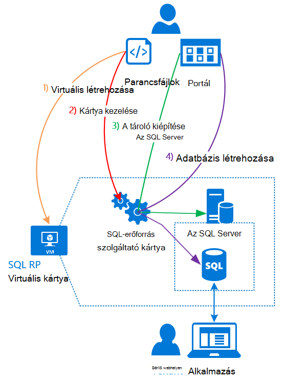

<properties
    pageTitle="SQL-adatbázisok használata Azure Papírhalom |} Microsoft Azure"
    description="Megtudhatja, hogyan telepítheti az SQL-adatbázisait Azure Papírhalom és a rövid lépéseket az SQL Server erőforrás szolgáltató adaptert üzembe szolgáltatásként."
    services="azure-stack"
    documentationCenter=""
    authors="Dumagar"
    manager="byronr"
    editor=""/>

<tags
    ms.service="multiple"
    ms.workload="na"
    ms.tgt_pltfrm="na"
    ms.devlang="na"
    ms.topic="article"
    ms.date="09/26/2016"
    ms.author="dumagar"/>

# Papírhalom Azure SQL-adatbázisok használata

> [AZURE.NOTE] Az alábbi információk csak az Azure Papírhalom TP1 telepítések vonatkozik.

Az SQL Server erőforrás szolgáltató adaptert használatával elérhetővé teheti Azure veremtárának szolgáltatás SQL-adatbázisait. Miután telepítette az erőforrás-szolgáltató, és a felhasználók hozhat létre felhő natív alkalmazások SQL alapuló webhely és munkaterhelésekből anélkül, hogy egy virtuális gép (virtuális) kiépítése épülő SQL-adatbázisait, hogy tárolja az SQL Server minden alkalommal, amikor.

Az erőforrás-szolgáltató nincs Azure SQL-adatbázissal az összes funkcióját fogalmat (Ez) igazolása során, mivel ez a cikk az erőforrás-szolgáltató architektúra áttekintése kezdődik. Ezután kattint áttekintheti, hogy milyen lépéseket kell beállítása erőforrás-szolgáltatóval, amely hivatkozásokat tartalmaz az [Azure Papírhalom Ez az SQL-adatbázis erőforrás szolgáltató adaptert Deploy](azure-stack-sql-rp-deploy-long.md)részletesebb című témakör lépéseit.

## Az SQL Server erőforrás szolgáltató kártya architektúra
Az erőforrás-szolgáltató SQL Azure-adatbázis szolgáltatásairól nem kínál az adatbázis összes. Ha például rugalmas adatbázis készletek és az azt jelenti, hogy adatbázis teljesítményét felfelé és lefelé tárcsázza menet közben nem érhetők el. Az erőforrás-szolgáltató támogatja azonban a azonos létrehozás, Olvasás, frissítés és törlése (CRUD) végezhető műveletek, amely az Azure SQL-adatbázis.

Az erőforrás-szolgáltató három összetevő tevődik össze:

- **Az SQL erőforrás szolgáltató kártya virtuális**, amelyhez az erőforrás-szolgáltató folyamat és a kiszolgáló szolgáltató az SQL Server lefedi.
- **Az erőforrás-szolgáltató magát**, amely dolgozza fel a kiépítési kérelmeket, és erőforrások adatbázis közzététele.
- **Az SQL Server tároló kiszolgáló**, amelyek-adatbázisok kapacitása.

A következő szemléltető ábra jeleníti meg az alábbi összetevők és a lépések, amelyek a mesteroldalhoz az erőforrás-szolgáltató üzembe, SQL Server tároló kiszolgáló beállítása, és kattintson az adatbázis létrehozása.

## A rövid lépéseket követve az erőforrás-szolgáltató terjesztése
Ha már ismert Azure Papírhalom, az alábbi lépésekkel. Ha ezután további információra kíváncsi, hajtsa végre az egyes szakasz hivatkozásait, és egyből használatba veheti az [Azure Papírhalom Ez az SQL-adatbázis erőforrás szolgáltató adaptert Deploy](azure-stack-sql-rp-deploy-long.md).

1.  Ügyeljen arra, hogy befejezte az összes [beállítása a lépéseket, mielőtt beállítaná](azure-stack-sql-rp-deploy-long.md#set-up-steps-before-you-deploy) az erőforrás-szolgáltató:

  - Az alap Windows Server képen 3.5-ös .NET-keretrendszer már be van állítva. (Ha február 23, 2016, miután letöltötte az Azure Papírhalom bittel kihagyhatja ezt a lépést.)
  - [Ez az Azure Papírhalom kompatibilis Azure PowerShell egy kiadását telepítve van](http://aka.ms/azStackPsh).
  - Az Internet Explorer biztonsági beállításait a ClientVM [engedélyezve van az Internet Explorer fokozott biztonság ki van kapcsolva, és a cookie-k](azure-stack-sql-rp-deploy-long.md#Turn-off-IE-enhanced-security-and-enable-cookies).

2. [Az SQL Server RP bináris fájl töltse le](http://aka.ms/massqlrprfrsh) és csomagolja ki azt az Azure Papírhalom Ez az a ClientVM.

3. [Futtassa a bootstrap.cmd és parancsfájlok](azure-stack-sql-rp-deploy-long.md#Bootstrap-the-resource-provider-deployment-PowerShell-and-Prepare-for-deployment).

    Nyissa meg a a PowerShell integrált parancsfájlok környezet (ISE) két fő lapok parancsfájlok halmazának csoportosítva. Futtassa a betöltött parancsfájlok sorrendben balról jobbra az egyes lapokon.

    1. Parancsfájlok futtatása **Előkészítés** lapján balról jobbra:

        - Az erőforrás-szolgáltató és Azure erőforrás-kezelő közötti biztonságos kommunikációt helyettesítő tanúsítvány létrehozása.
        - Töltse fel a tanúsítványok és minden más eltérések tárterület-fiókhoz az Azure Papírhalom.
        - Tár-csomagok közzététele, hogy az SQL és erőforrások: a gyűjtemény keresztül telepítheti.

        > [AZURE.IMPORTANT] A parancsfájlok bármelyikét lefagy ok az Azure Active Directory-ös bérlői webhelyen elküldése után a biztonsági beállítások előfordulhat, hogy nem blokkolja-e egy DLL futtatásához a telepítéshez szükséges. A probléma megoldásához az erőforrás-szolgáltató mappába a Microsoft.AzureStack.Deployment.Telemetry.Dll keres, kattintson a jobb gombbal, válassza a **Tulajdonságok parancsot**, és kattintson az **Általános** lapon jelölje be a **Tiltás feloldása** .

    1. Parancsfájlok futtatása a **központi telepítés** lapon balról jobbra:

        - [A virtuális Deploy](azure-stack-sql-rp-deploy-long.md#Deploy-the-SQL-Server-Resource-Provider-VM) , hogy az erőforrás-szolgáltató és az SQL Server tárolja. Ez a parancsfájl a paraméter módosítania kell az egyes értékek a parancsfájl futtatása előtt JSON fájlok hivatkozik.
        - [Regisztrálhatja a helyi DNS-rekord](azure-stack-sql-rp-deploy-long.md#Update-the-local-DNS) , amely az erőforrás-szolgáltató virtuális rendeli.
        - [Az erőforrás-szolgáltató regisztrálni](azure-stack-sql-rp-deploy-long.md#Register-the-SQL-RP-Resource-Provider) a helyi Azure erőforrás-kezelő használatával.

        > [AZURE.IMPORTANT] Az összes parancsfájl feltételezik, hogy az alap operációs rendszer kép megfelel-e a vonatkozó követelmények (.NET 3.5-ös telepítette, JavaScript-fájlok és a ClientVM és Azure PowerShell telepítése kompatibilis verziója engedélyezett cookie-k). Ha hiba, amikor a parancsfájlt, győződjön meg róla, hogy teljesülnek-e a előfeltételek.

6. [Az erőforrás-szolgáltató, amelyen az SQL Server kiszolgálóra való csatlakozás](#Provide-capacity-to-your-SQL-Resource-Provider-by-connecting-it-to-a-hosting-SQL-server) az Azure Papírhalom portálon. Kattintson a **Tallózás** &gt; **erőforrás szolgáltatók** &gt; **SQLRP** &gt; **Nyissa meg az erőforrás-szolgáltató kezelés** &gt; **kiszolgálók** &gt; **hozzáadása**.

    "Nyelvű" felhasználónév és telepítette az erőforrás-szolgáltató virtuális használt jelszót használja.

7. [Az új SQL Server-erőforrás szolgáltató tesztelése](/azure-stack-sql-rp-deploy-long.md#create-your-first-sql-database-to-test-your-deployment)telepítse az Azure Papírhalom portálon SQL-adatbázishoz. Kattintson a **Létrehozás** gombra &gt; **egyéni** &gt; **SQL Server-adatbázishoz**.

Ez szerezheti be az SQL Server erőforrás szolgáltató be és futtatása (attól függően, hogy a hardver) körülbelül 45 perc alatt.
