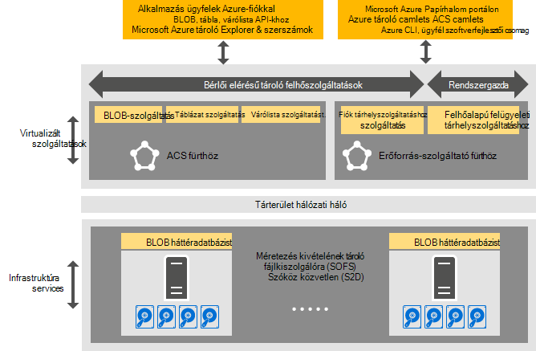

<properties
    pageTitle="Azure egységes tároló – bevezetés |} Microsoft Azure"
    description="További tudnivalók: Azure egységes tárhely"
    services="azure-stack"
    documentationCenter=""
    authors="AniAnirudh"
    manager="darmour"
    editor=""/>

<tags
    ms.service="azure-stack"
    ms.workload="na"
    ms.tgt_pltfrm="na"
    ms.devlang="na"
    ms.topic="get-started-article"
    ms.date="09/26/2016"
    ms.author="anirudha"/>

# Azure egységes tároló – bevezetés
Azure egységes tároló a Microsoft Azure egymást fedő tároló felhőszolgáltatásba megadása. Azure egységes tároló blob, a táblázat, a várólista és a fiók kezelése funkció az Azure egységes szemantikáját biztosít. Egy felhőalapú adminisztrátor tároló szolgáltatások kezelése funkciókat is tartalmaz. Ez a cikk bemutatja az Azure egységes tárhely, és ismerteti, hogyan tároló felhőszolgáltatások Azure egymást fedő megfelelően legyenek rendezve kiegészítése gazdag [szoftverek által definiált tárolási lehetőségeket a Windows Server 2016-ban](https://blogs.technet.microsoft.com/windowsserver/2016/04/14/ten-reasons-youll-love-windows-server-2016-5-software-defined-storage/).

Azure egységes tároló biztosítja az alábbi fő kategóriába sorolható funkciót:

- **BLOB**: BLOB oldalon, a BLOB legyen, és a Hozzáfűzés az   [Azure egységes blob](https://msdn.microsoft.com/library/azure/dd179355.aspx#Anchor_1) BLOB
   viselkedése

- **Táblázatok**: szervezetek, a partíciók és a többi táblázat tulajdonságai   [Azure egységes](https://msdn.microsoft.com/library/azure/dd179355.aspx#Anchor_3) táblázatot
   viselkedése

- **Sorok**: megbízható és állandó üzenetek és az   [Azure egységes várakozási](https://msdn.microsoft.com/library/azure/dd179355.aspx#Anchor_2) sorban várakozó
   viselkedése

- **Partnerek**: tároló fiók erőforrás-kezelés   [Azure egységes fiók](https://azure.microsoft.com/documentation/articles/storage-create-storage-account/) 
   viselkedés keresztül az [Azure erőforrás-kezelő telepítési modell](https://azure.microsoft.com/documentation/articles/resource-manager-deployment-model/) kiépítve általános célú tárterület-fiókok

- **Felügyeleti**: bérlői hozzáférhető és Azure egységes tároló belső tároló szolgáltatást (tárgyalt további cikkek) kezelése

## Azure egységes tárterület-architektúra

Ábra 1. Azure egységes tároló: megoldás nézete

## Azure egységes tároló virtualizálva szolgáltatások és fürt

Az Azure egységes tárterület-architektúra a bérlő vagy a rendszergazda által elérhető tároló szolgáltatások vannak virtualizálva. Ez azt jelenti, hogy a Futtatás szolgáltatásban szolgáltató által kezelt, könnyen hozzáférhető VMs [A Hyper-V](https://technet.microsoft.com/library/dn765471.aspx) funkciók, a [Windows Server 2016](http://www.microsoft.com/server-cloud/products/windows-server-2016/)alapján.
Ugyan a VMs erősen érhető el a [Windows Server feladatátvételét](https://technet.microsoft.com/library/dn765474.aspx) technológia alapján, az Azure egységes virtualizálva tároló maguk azok a szolgáltatások Vendég csoportosított, könnyen hozzáférhető szolgáltatások [Azure Service háló technológia](http://azure.microsoft.com/campaigns/service-fabric/)alapján.

Azure egységes tároló alkalmaz a két szolgáltatás háló fürt egy Papírhalom Azure környezetben.
A tároló erőforrás szolgáltató szolgáltatás telepítve van a többi eligazodást erőforrás-szolgáltató szolgáltatás által megosztott is szolgáltatás háló fürthöz ("RP fürthöz"). A többi tárolására virtualizálva elérési út adatszolgáltatások – beleértve a Blob, a táblázat és a várólista telepített szolgáltatások – a második szolgáltatás háló fürthöz ("Azure egységes tároló fürthöz").

## BLOB-szolgáltatás, a szoftverek által definiált tárterület

A szolgáltatás vissza lezárásához azonban, Blob fut, közvetlenül a [Méretezési fájlkiszolgálóra](https://technet.microsoft.com/library/hh831349.aspx) fürt csomópontok. Az Azure Papírhalom megoldás architektúra méretezési fájlkiszolgálóra alapuló a [Tárhely szóközöket közvetlen](https://technet.microsoft.com/library/mt126109.aspx)-alapú, megosztott semmi Feladatátvevőfürt. 1 ábra szemlélteti a fő Azure egységes tároló összetevő-szolgáltatások és azok elosztva telepítési modell. Az ábrán látható módon Azure egységes tároló dovetails, a meglévő szoftverek által definiált tároló szolgáltatások Windows Server 2016-ban. Nincs speciális hardvereszközök nem túl a Windows Server platform feltétel Azure egységes tárhely szükséges.

## Tárterület-Farm

Tárterület-Farm a webhelycsoport tárolási infrastruktúra, az erőforrások és a háttéradatbázist szolgáltatások együttes bérlői hozzáférhető és a rendszergazda elérésű Azure egységes tároló szolgáltatásokat nyújtó egy Papírhalom Azure környezetben. Tárterület-Farm kifejezetten, az alábbiakat tartalmazza:

- Tárolási hardver (például a méretezési fájlkiszolgálóra csomópontok, a lemez)

- Tárolási háló erőforrásokat (például a kis-és Középvállalatok megosztások)

- Tárterület-kapcsolatos szolgáltatás háló szolgáltatások (például Blob végpont szolgáltatás kikapcsolása az Azure egységes tároló fürt)

- A méretezési fájlkiszolgálóra csomópontokat (például a Blob-szolgáltatása) futó tároló kapcsolatos szolgáltatások

## IaaS és PaaS tároló használatát felhasználási területei

Azure egységes tároló lap BLOB Azure, ahogy adja meg az összes infrastruktúra virtuális lemez egy (IaaS) szolgáltatás használatát, alkalmazási helyzetek:

- Hozzon létre egy virtuális lap blob egyéni OS lemez használatával

- Hozzon létre egy virtuális lap blob használatával az egyéni OS képe

- Hozzon létre egy virtuális egy új oldal blob Azure piactéren elérhető képek használatával

- Hozzon létre egy virtuális egy új oldal blob üres lemezen használatával

Hasonlóképpen platform, a szolgáltatás (PaaS) esetek, Azure egységes tároló letiltása BLOB, hozzáfűző BLOB, sorok, és táblák működik, mint Azure-ban.

## Felhasználói szerepkörök

Azure egységes tárolására jelentősége két felhasználói szerepkörök:

- Alkalmazás tulajdonosok, beleértve a fejlesztők és az informatikai vállalati. Már nem rendelkeznek karbantartásához és az alkalmazások és az ugyanazon feladatot elvégezheti az nyilvános felhő és a adatközpontban üzemeltetett/magánjellegű felhő parancsprogramok két verziójának telepítése. Azure egységes tároló tárterület-szolgáltatásokat REST API-t, SDK, parancsmag és Azure Papírhalom portálon keresztül biztosít.

- Szolgáltatók, vállalati IT, például ki üzembe helyezéséhez és kezeléséhez, a Microsoft Azure Papírhalom, multitenant tároló felhőalapú szolgáltatást.

## Következő lépések

- [Azure egységes tároló: különbségek és szempontok] (azure-Papírhalom-acs-eltérések-tp2.md)
