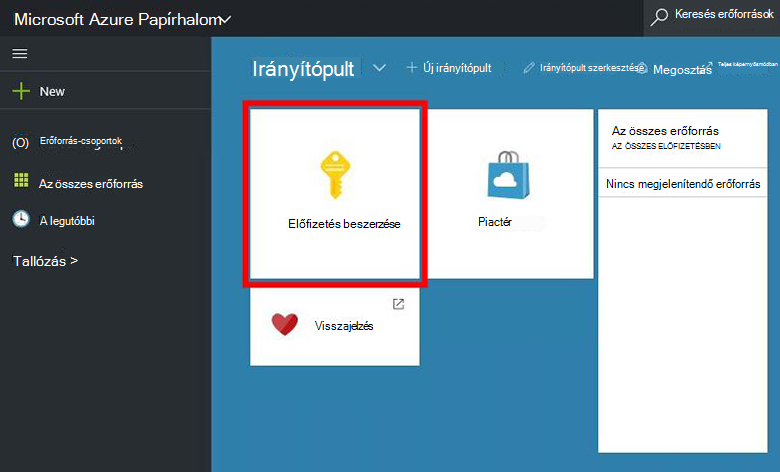
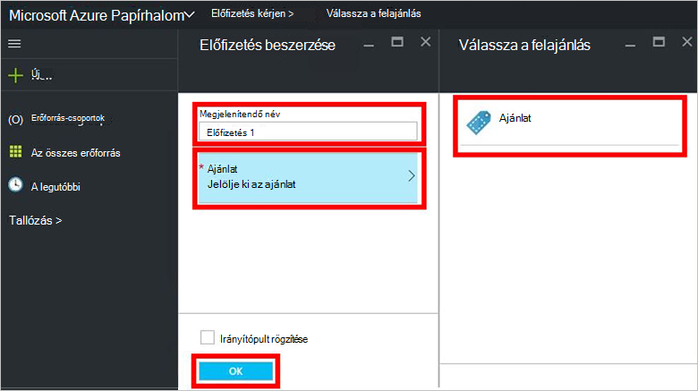
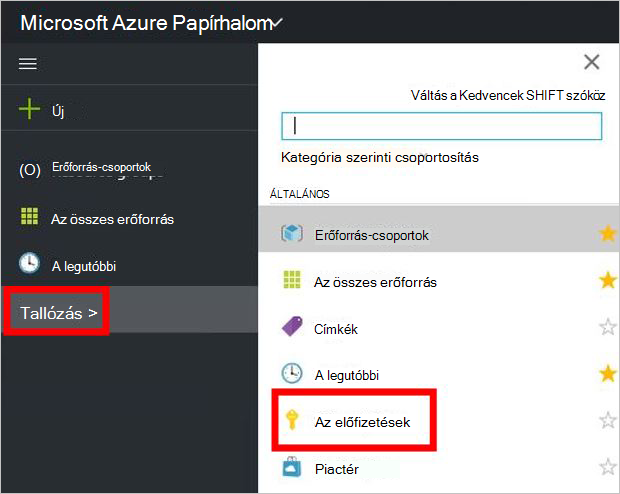

<properties
    pageTitle="Feliratkozás egy ajánlatra, és majd rendelkezni az Azure egymást fedő (bérlő esetében) egy virtuális |} Microsoft Azure"
    description="A bérlői, mint megtudhatja, hogy miként felajánlás előfizetés, és kattintson a egy virtuális Azure egymást fedő rendelkezni."
    services="azure-stack"
    documentationCenter=""
    authors="ErikjeMS"
    manager="byronr"
    editor=""/>

<tags
    ms.service="azure-stack"
    ms.workload="na"
    ms.tgt_pltfrm="na"
    ms.devlang="na"
    ms.topic="get-started-article"
    ms.date="09/26/2016"
    ms.author="erikje"/>

# Feliratkozás felajánlás

Most, hogy, ha már [létrehozott egy ajánlatra](azure-stack-create-offer.md), ellenőrizze, hogy a bérlők hozhat létre előfizetés.

1.  Az Azure Papírhalom ez számítógépen jelentkezzen be az `https://portal.azurestack.local` [bérlői webhelyet](azure-stack-connect-azure-stack.md#log-in-as-a-tenant) , és kattintson a **előfizetés**.

    

2.  A **Megjelenítendő név** mezőben írja be az előfizetés nevét, **hivatkozásra**, kattintson a **választható felajánlás** lap az ajánlat egyikére, és kattintson a **Létrehozás**gombra.

    

4.  Az előfizetés létrehozott megtekintéséhez kattintson a **Tallózás gombra**, kattintson az **előfizetések elemre**, majd kattintson az új előfizetésbe.  

    

Miután előfizetett az ajánlatot, frissítse a portálon, mely szolgáltatások vannak-e az új előfizetéshez tartozó.

## Következő lépések

[A virtuális gép kiépítése](azure-stack-provision-vm.md)
