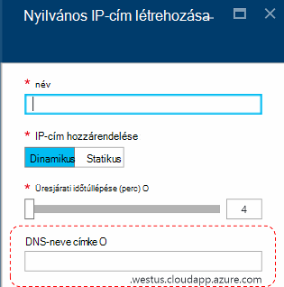
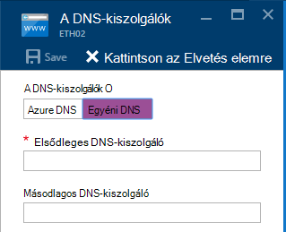
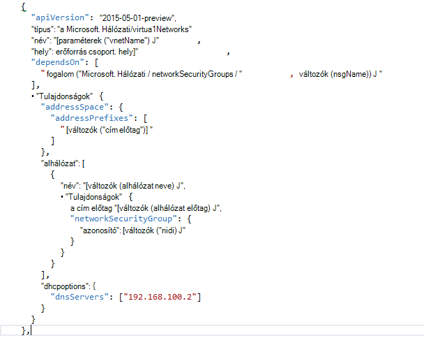

<properties
    pageTitle="Az Azure Papírhalom TP2 DNS ismertetése |} Microsoft Azure"
    description="Új DNS-szolgáltatások és funkciók az Azure Papírhalom TP2 ismertetése"
    services="azure-stack"
    documentationCenter=""
    authors="ScottNapolitan"
    manager="darmour"
    editor=""/>

<tags
    ms.service="azure-stack"
    ms.workload="na"
    ms.tgt_pltfrm="na"
    ms.devlang="na"
    ms.topic="get-started-article"
    ms.date="09/26/2016"
    ms.author="scottnap"/>

# Bemutatkozik a IDN Azure Papírhalom
================================

IDN lehetővé teszi az új technológia előzetes 2 az Azure Papírhalom, amely lehetővé teszi, hogy a külső DNS-neveket (például http://www.bing.com).
Lehetővé teszi regisztrálhatja a belső virtuális hálózat nevét. Ezzel a módszerrel oldhatja meg VMs ugyanazon a virtuális hálózaton IP-cím, hanem nevét anélkül, hogy adja meg az egyéni DNS-kiszolgáló bejegyzéseket.

Azt, amit mindig is volt ott Azure-ban, de most érhető el a Windows Server 2016 és Azure Papírhalom, is.

Mit jelent a IDN?
------------------

Azure egymást fedő IDN kap az alábbi funkciókat anélkül, hogy adja meg az egyéni DNS-kiszolgáló bejegyzéseket.

-   A megosztott DNS névfeloldás szolgáltatást a bérlői munkaterhelésekből.

-   Mérvadó a DNS-szolgáltatás névfeloldás és a DNS-nyilvántartási a bérlői virtuális hálózaton belül.

-   Internetes nevek bérlői VMs felbontásának rekurzív DNS-szolgáltatást. Bérlők már nem kell adni a egyéni DNS-bejegyzések Internet nevek (például www.bing.com).

Továbbra is a saját DNS-származhatnak, és használjon egyéni DNS-kiszolgálók. De most, ha csak szeretne oldható meg az Internet a DNS neveket is csatlakozhat más virtuális gépeken futó virtuális ugyanabba a hálózatba, nem kell semmit megadása és ugyanúgy fog működni.

Mire használható IDN nem?
---------------------

Milyen IDN nem teszi lehetővé, hogy végezze el nem egy nevet, amely a virtuális hálózaton kívüli megoldott DNS-rekord létrehozása.

Az Azure-meg, hogy egy nyilvános IP-cím társítható DNS neve címke megadása. Megadhatja, hogy a címke (előtag), de az Azure választ ki az utótag, amelyen alapul, amelyben a nyilvános IP-cím létrehozása a régió.

A fenti képen Azure-"Egy" rekordot a DNS-ben a DNS neve felirat alatt a zóna **westus.cloudapp.azure.com**megadott hoz létre. Az előtag és az utótag együtt írása egy teljesen minősített tartománynevét (FQDN), amely tetszőleges kell hárítani a nyilvános internetkapcsolat.

TP2, az Azure Papírhalom csak támogatja IDN belső neve regisztráció, így nem kövesse az alábbi lépéseket.

-   Hozzon létre egy meglévő szolgáltatott DNS zone (például azurestack.local) a DNS-rekord.

-   Hozzon létre egy DNS-zóna (például Contoso.com).

-   Hozzon létre egy rekordot saját egyéni DNS-zóna csoportban.

-   A tartománynevek megvásárlása támogatja.

A DNS-ben az Azure Papírhalom TP1 módosítása
-----------------------------------

Az Azure veremtárának Technology Preview 1 (TP1) kiadásban kellett megy végbe, ha engedélyezni szeretné megoldani a hosts neve telepítik IP-cím egyéni DNS-kiszolgálók nyújtanak. Ez azt jelenti, hogy ha a virtuális hálózathoz vagy egy virtuális hozott létre, kellett a szükséges DNS-kiszolgáló legalább egy bejegyzésnek. A TP1 ez környezetben ez kialakítva beírása a IP ez háló DNS-kiszolgáló, azaz 192.168.200.2.

Ha létrehozott egy virtuális a portálon keresztüli, kellett **Egyéni DNS** jelölje ki a virtuális hálózatra vagy az ethernet kártya beállításai.

TP2 választhat az Azure DNS, és nem kell megadni a egyéni DNS-kiszolgáló bejegyzéseket.

A saját kép egy virtuális sablon használatával hozta létre, ha a **DHCPOptions** tulajdonságot kellett, és ahhoz, hogy DNS-Rekordokat a DNS-kiszolgáló névfeloldás a munkát. Az alábbi képen látható, hogy mi ez volt.

A TP2 már nincs szüksége a virtuális sablonok engedélyezése az Internet nevek VMs módosítások végrehajtásának. Érdemes ugyanúgy működnek.