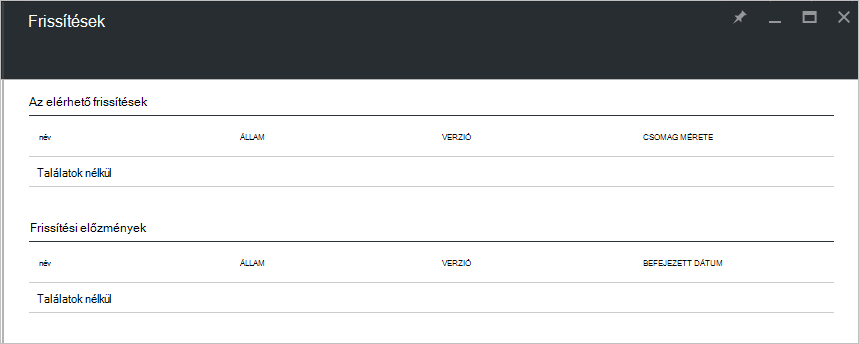

<properties
    pageTitle="Azure egymást fedő frissítések |} Microsoft Azure"
    description="További tudnivalók: Azure egymást fedő frissítések"
    services="azure-stack"
    documentationCenter=""
    authors="HeathL17"
    manager="byronr"
    editor=""/>

<tags
    ms.service="azure-stack"
    ms.workload="na"
    ms.tgt_pltfrm="na"
    ms.devlang="na"
    ms.topic="article"
    ms.date="09/26/2016"
    ms.author="Helaw"/>

# Azure egymást fedő frissítések kezelése
Technikai előzetes verzió 2 Azure Papírhalom frissítések kezelését előnézetét vezet be.  Ebben a témakörben fogja lépjen a frissítések csomópontot.  

## Frissítések lap
1.  A frissítések lap eléréséhez kattintson a **Tallózás gombra** , és kattintson a **frissítés**gombra.

2.  Kattintson a **helyi** helyét.

3.  Ön az elérhető frissítések listázása képernyő jelenik meg, és frissítési előzmények.  A technikai előzetes verzió 2 frissítések nem érhetők el a telepítést.  

    

## Következő lépések
- [Azure Papírhalom ez architektúra ismertetése](azure-stack-architecture.md)      
- [Telepítési előfeltételek ismertetése](azure-stack-deploy.md)
- [Azure Papírhalom terjesztése](azure-stack-run-powershell-script.md)
 
    
  

  

