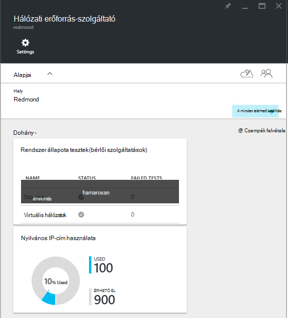
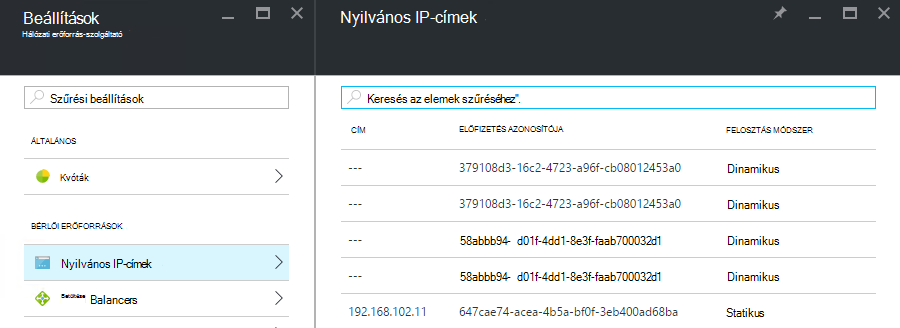

<properties
    pageTitle="Nyilvános IP-címek felhasználása megtekintése a TP2 |} Microsoft Azure"
    description="A rendszergazdák az terület tekintheti meg a nyilvános IP-címek felhasználás"
    services="azure-stack"
    documentationCenter=""
    authors="ScottNapolitan"
    manager="darmour"
    editor=""/>

<tags
    ms.service="azure-stack"
    ms.workload="na"
    ms.tgt_pltfrm="na"
    ms.devlang="na"
    ms.topic="get-started-article"
    ms.date="09/26/2016"
    ms.author="scottnap"/>

# Azure Papírhalom TP2 nyilvános IP-címek felhasználása megtekintése

Szolgáltatás-rendszergazda, mint a nyilvános IP-címek bérlők, továbbra is elérhetők terhelés nyilvános IP-címtartományokat számát és a nyilvános IP-címek, amely az adott helyen Önhöz rendelt szám tekinthet meg.

A **Nyilvános IP-cím használatát** csempe nyilvános IP-címtartományokat át az összes nyilvános IP cím készletek a háló a felhasznált, hogy a használt bérlői IaaS virtuális példányok, háló infrastruktúrájának szolgáltatásai vagy explicit módon hozta létre bérlők nyilvános IP-cím erőforrások teljes számát mutatja.

Ez a csempe célja Azure Papírhalom rendszergazdák adjon meg egy értelmezhető ezen a helyen felhasznált nyilvános IP-címtartományokat teljes számát. Ezzel az elemzéssel határozza meg, hogy azok kevés erőforrás rendszergazdák.

Kattintson a **Beállítások** lap a **Nyilvános IP-címek** menüpont, a **bérlői erőforrások** csak e nyilvános IP-címek, amelyeket *kifejezetten bérlők által létrehozott*sorolja fel. Ilyenként, **használja** a **Nyilvános IP-cím használata** a nyilvános IP-címek csempe száma eltér mindig (nagyobb, mint) **Nyilvános IP-címek** csempével **bérlői erőforrások**csoportjában a szám.

## A nyilvános IP-cím használatát mezőt megtekintése

Nyilvános IP-címek, amely a régió felhasznált száma megtekintése:

1.  Az Azure Papírhalom-portálon kattintson a **Tallózás gombra**, és válassza az **Erőforrás-szolgáltatók**.

2.  Az **Erőforrás-szolgáltatók**listájából a **Hálózati erőforrás szolgáltató rendszergazda**elemre.

3.  Másik megoldás, rákattintva **Tallózás |} Helyek** , és válassza ki a helyet, hogy meg szeretné tekinteni a listából. Az **Erőforrás-szolgáltatók** csempére, kattintson a **Hálózati erőforrás szolgáltató Admin**.

4.  A **Hálózati erőforrás szolgáltató** érkezési lap a **Nyilvános IP-cím használatát** csempére az **Áttekintés** részben jeleníti meg.

Ne feledje, hogy a **használt** szám jelöl, amely a nyilvános IP-címek számának az összes nyilvános IP-cím rendelt készletek az adott helyen. A **rendelkezésre álló** számozási jelöl, amely a nyilvános IP-címek számának az összes nyilvános IP cím készletek, amely nem rendelkezik, és továbbra is elérhetők. A cím készletek az adott helyen a **% használt** szám jelöl, amely az összes nyilvános IP címek használnak, vagy a tevékenységhez rendelt címeket nyilvános IP száma százalékában számát.

## A nyilvános IP-címek bérlői előfizetések által létrehozott megtekintése

Nyilvános IP-címek kifejezetten létrehozott bérlői előfizetések egy adott tartomány listájának megtekintéséhez nyissa meg a **Beállítások** lap, a **Hálózati erőforrás szolgáltató rendszergazda**, és válassza a **Nyilvános IP-címeket**.

Megfigyelheti, hogy bizonyos nyilvános IP-címek, dinamikusan lefoglalt jelenik meg a listában, de nem rendelkezik a velük társított még címre. Ennek oka az, a cím erőforrás még jött létre a hálózati erőforrás-szolgáltató, de nem a hálózati vezérlő.

A hálózati vezérlő nem rendelhet címre az erőforrás mindaddig, amíg a ténylegesen kötődik felületet, a hálózati kapcsolat kártya, egy terheléselosztó vagy egy virtuális hálózati átjáró. Ha a nyilvános IP-cím van kötve felületet, a hálózati vezérlő osztja ki azt az IP-cím, és megjelenik az a **cím** mezőbe.

## A nyilvános IP-cím adatokat összesítő táblázat megtekintése

Számos nyilvános IP-címek van rendelve, amelyek meghatározzák, hogy a cím jelenik meg egy lista vagy egy másik különböző eseteket.

| **Nyilvános IP-cím hozzárendelés eset** | **Látogatottság összegzése jelenik meg** | **Megjelenik a bérlői nyilvános IP-címek listája** |
| ------------------------------------- | ----------------------------| ---------------------------------------------- |
| Még nem rendelt (ideiglenes) egy hálózati vagy tölt terheléselosztó dinamikus nyilvános IP-cím | nem | igen |
| Dinamikus nyilvános IP-címe egy hálózati vagy tölt terheléselosztó rendelve. | igen | igen |
| Statikus nyilvános IP-címe egy bérlői hálózati vagy tölt terheléselosztó rendelve. | igen | igen |
| Statikus nyilvános IP-címe egy háló infrastruktúra szolgáltatás végpontjának rendelve. | igen | nem |
| Nyilvános IP-cím implicit módon létrehozott IaaS virtuális előfordulását és használt kimenő hálózati Címfordítást a virtuális hálózaton. Amikor a bérlői webhelyre egy virtuális példányt hoz létre, így VMs küldhet információk az internetes ezek jönnek létre Bepillantás a színfalak mögé. | igen | nem |
