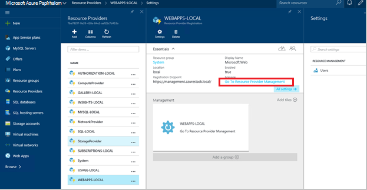
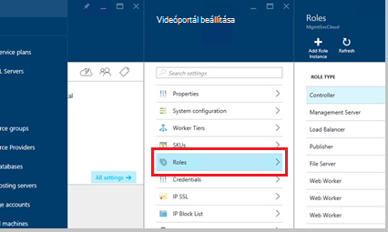
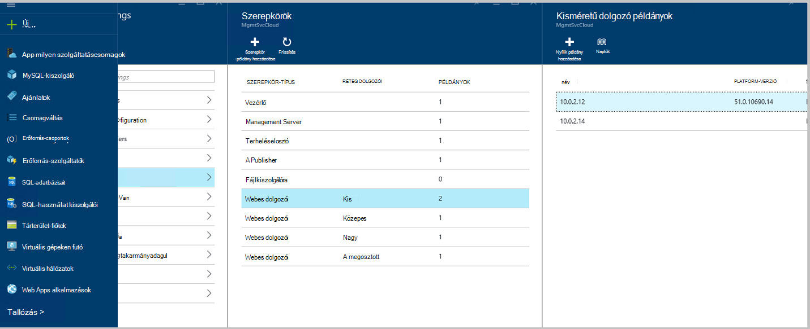
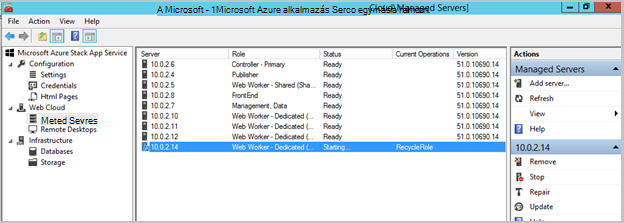
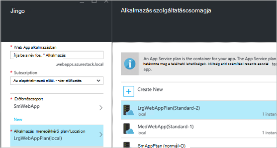
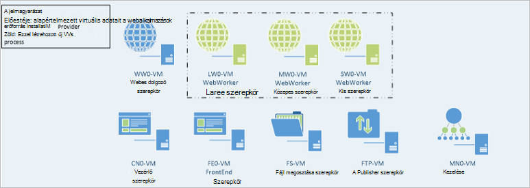

<properties
    pageTitle="Webalkalmazások hozzáadása több webes dolgozó szerepkörök |} Microsoft Azure"
    description="Részletes útmutató a méretezés Azure Papírhalom Web App alkalmazásban"
    services="azure-stack"
    documentationCenter=""
    authors="kathm"
    manager="slinehan"
    editor=""/>

<tags
    ms.service="azure-stack"
    ms.workload="app-service"
    ms.tgt_pltfrm="na"
    ms.devlang="na"
    ms.topic="article"
    ms.date="09/26/2016"
    ms.author="kathm"/>

#   <a name="web-apps-adding-more-web-worker-roles"></a>Web Apps alkalmazások: További webes dolgozó szerepkörök hozzáadása

> [AZURE.NOTE] Az alábbi információk csak az Azure Papírhalom TP1 telepítések vonatkozik.

A dokumentum megtudhatja, hogy miként, ha át kívánja méretezni a Web Apps alkalmazások webes dolgozó szerepköröket tartalmaz. További webes dolgozó szerepkörök a web Apps alkalmazások által kínált bármilyen méretű támogatási létrehozásának lépéseit tartalmaz.

Azure Papírhalom ingyenes és megosztott web app-telepítések támogatja. Más típusú hozzáadásához kell hozzáadhat webes dolgozó szerepköröket.

Ha nem biztos abban, hogy mi lett telepítve az alapértelmezett Web Apps-telepítése mellé, áttekintheti további információt [Itt](azure-stack-webapps-overview.md).

Méretezés webes dolgozó szerepkörök szükségesek az alábbi lépéseket:

1.  [Hozzon létre egy új virtuális számítógépre](#step-1-create-a-new-vm-to-support-the-new-instance-size)

2.  [A virtuális gép konfigurálása](#step-2-configure-the-virtual-machine)

3.  [Állítsa be a webes dolgozó szerepkör az Azure Papírhalom portálon](#step-3-configure-the-web-worker-role-in-the-azure-stack-portal)

4.  [App milyen szolgáltatáscsomagok konfigurálása](#step-4-configure-app-service-plans)

##<a name="step-1-create-a-new-vm-to-support-the-new-instance-size"></a>Lépés: 1: Hozzon létre egy új virtuális az új példányának méret támogatásához

Hozzon létre egy virtuális gép, a leírt [Ez a cikk](azure-stack-provision-vm.md), biztosítva, hogy létrejönnek-e a következő lehetőségek közül:

 - Felhasználónév és jelszó: Adja meg a ugyanazzal a felhasználónévvel és jelszóval Web Apps alkalmazások telepítésekor.

 - Előfizetés: Használja az alapértelmezett szolgáltató előfizetést.

 - Erőforráscsoport: válassza a **Helyi AppService**.

> [AZURE.NOTE]A virtuális gépeken futó dolgozó szerepkörök tárolja a Web Apps alkalmazások telepíti, az azonos erőforráscsoport. (Ez javasolt jelenlegi kiadásába.)

##<a name="step-2-configure-the-virtual-machine"></a>Lépés: 2: A virtuális gép konfigurálása

A telepítés befejezése után az alábbi beállításokkal támogatja a webes dolgozó szerepkör szükséges:

1.  Nyissa meg a Kiszolgálókezelő az állomásgép a, majd kattintson az **eszközök** &gt; **HyperV Manager**.

2.  Csatlakozás távoli asztali Protocol (RDP) az új virtuális géphez, az 1 létrehozott használatával. Minden egyes virtuális ki van jelölve a kiszolgáló nevét az összefoglalását tartalmazó munkaablakban található.

3.  Kattintson a **Start** gombra, és írja be a PowerShell PowerShell nyithatja meg. Kattintson a jobb gombbal a **PowerShell.exe**, és válassza a **Futtatás rendszergazdaként** PowerShell rendszergazdai módban való megnyitásához.

4.  Adja meg a másolás és Beillesztés minden az alábbi parancsokat (egyszerre csak egyet) be a PowerShell ablakban, és nyomja le:

    ```netsh advfirewall firewall set rule group="File and Printer Sharing" new enable=Yes```
    ```netsh advfirewall firewall set rule group="Windows Management Instrumentation (WMI)" new enable=yes```
    ```reg add HKLM\\SOFTWARE\\Microsoft\\Windows\\CurrentVersion\\Policies\\system /v LocalAccountTokenFilterPolicy /t REG\_DWORD /d 1 /f```

5.  Indítsa újra a virtuális gépen.

> [AZURE.NOTE]Megjegyzés: Ezek a minimális követelmények Web Apps alkalmazások. Az alapértelmezett beállításokat, a Windows 2012 R2 kép Azure Papírhalom részét képező legyenek is. A képernyőn megjelenő utasításokat későbbi felhasználás céljából, valamint a másik képre használatával kapott.

##<a name="step-3-configure-the-web-worker-role-in-the-azure-stack-portal"></a>Lépés 3: Állítsa be a webes dolgozó szerepkör az Azure Papírhalom portálon

1.  Nyissa meg a portálon **ClientVM**a szolgáltatás rendszergazdaként.

2.  Nyissa meg azt **az erőforrás-szolgáltatók** &gt; **WEBALKALMAZÁS helyi**.

    
 
3.  Kattintson az **Ugrás a szolgáltató az erőforrás-kezelés**hivatkozásra.

4.  Kattintson a **szerepkörök**elemre.

    
 
5.  Kattintson a **példány szerepkör hozzáadása**gombra.

6.  Kattintson a **réteg** szeretné telepíteni az új példány (kicsi, közepes, nagy, vagy megosztott).

    
 
7.  Konfigurálja a következő:
 - Kiszolgálónév: Adja meg a kiszolgáló, amelyet korábban létrehozott (1 szakasz) IP-címét.
 - Szerepkör típusa: Webes dolgozó.
 - Réteg dolgozó: Egyezéseket első csoportba tartozó kijelölt méretét.

8. Kattintson a **az OK gombra.**

9. Jelentkezzen be az CN0-virtuális, és nyissa meg a **Webes Felhőbeli adatkezelési MMC**.

10. Nyissa meg azt a **webes felhő** &gt; **kezelt kiszolgálók**.

11. Kattintson a kiszolgáló nevét, amely csak rendszerbe. Tekintse át az Állapot oszlopban, és várja meg, lépjen a következő lépésben mindaddig, amíg az Állapot oszlop értéke "Kész" gombra.

    

##<a name="step-4-configure-app-service-plans"></a>Lépés: 4: App milyen szolgáltatáscsomagok konfigurálása

> [AZURE.NOTE]Az online jelenlegi verziójában app milyen szolgáltatáscsomagok külön erőforráscsoport kell tárolni. Az egyes webalkalmazás méretének erőforráscsoport összeállítása, és helyezze az alkalmazás-csomagok a megfelelő erőforráscsoport.

1.  Jelentkezzen be a portálon kattintson a ClientVM.

2.  Nyissa meg azt az **Új** &gt; **Web és a Mobile**.

3.  Jelölje ki a telepíteni kívánt web app.

4.  Adja meg az adatokat a webes alkalmazáshoz, és válassza a **AppService terv / hely**.

-   Kattintson az **Új**gombra.

-   Az új csomag, jelölje ki a megfelelő árak réteg a terv létrehozása

> [AZURE.NOTE]Ez a lap a több csomagok hozhat létre. Mielőtt beállítaná, akkor jó helyen jár, győződjön meg róla, kijelölte a megfelelő csomagot.

Az alábbi példa az elérhető több csomagok egyikére:    

##<a name="final-web-app-service-vm-configuration"></a>Végleges webalkalmazás virtuális konfigurációjának

Az alábbi képen a környezet képet ad meg, miután meg van átméretezi a webes dolgozó szerepkörök. A zöld elemeket jelenítik meg szerepkör újdonsággal.
    
