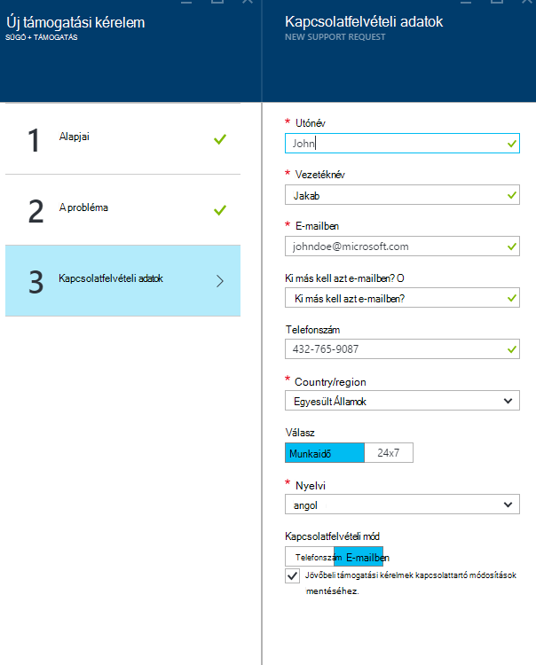

<properties
     pageTitle="Hogyan hozhat létre az Azure támogatási kérelmet |} Microsoft Azure"
     description="További tudnivalók: Azure támogatási kérelmet."
     services="Azure Supportability"
     documentationCenter=""
     authors="ganganarayanan"
     manager="scotthit"
     editor=""/>

<tags
     ms.service="azure-supportability"
     ms.workload="na"
     ms.tgt_pltfrm="na"
     ms.devlang="na"
     ms.topic="article"
     ms.date="10/25/2016"
     ms.author="gangan"/>

# Azure támogatási kérelem létrehozása

## Összefoglalás
Azure ügyfelek létrehozhat és kezelhetik a távolléti kérelmeket támogatás az Azure-portálon [https://portal.azure.com](https://portal.azure.com).
>[AZURE.NOTE] Az Azure portál Németország [https://portal.microsoftazure.de](https://portal.microsoftazure.de) és Azure kormányzati portál [https://portal.azure.us](https://portal.azure.us).

Ügyfeleink visszajelzései alapján a támogatási kérelem felület három fő célokat koncentrálhat frissítette azt:

- **Streamlined**: kattintással és pengéit, hogy a támogatási kérelem benyújtása folyamata egyszerű csökkentése.
- **Integrált**: amikor egy Azure erőforrás problémát hibaelhárítása kell lennie egyszerűen nyissa meg az adott erőforrás egy támogatási kérelmet helyi lecserélése nélkül.
- **Oldalablakot**: a támogatási adatbázismodellbe lesz szüksége a megoldáshoz hatékony főbb információk összegyűjtése.

## Első lépések
A felső navigációs sáv-ból vagy közvetlenül egy erőforrás lap, létrehozhat egy támogatási kérelmet.

**A felső navigációs sávon**

**Az egy erőforrás lap**

## Alapjai
Az első lépés a támogatási kérelem folyamat gyűjt a problémát, és a támogatási csomag egyszerű adatokat.

Nézzük végig a példát: műszaki problémák esetén szemben lévő a virtuális számítógépre, és a hálózati probléma gyanítja.
A Súgó erre a problémára folyamata kijelöli a szolgáltatás ("virtuális számítógép Windows operációs rendszert futtató") és az erőforrás (a virtuális gép neve) az első lépés a varázsló elindul.

>[AZURE.NOTE] Azure korlátlan támogatja az előfizetés-kezelés (összetevőjét, például a számlázási kvóta korrekciók és a fiók átvitelek). Technikai támogatás meg kell támogatási csomagra. [További tudnivalók a támogatási tervek](https://azure.microsoft.com/support/plans).

## A probléma
A második lépés a varázsló további információt a problémáról gyűjti össze. Pontos részleteket ebben a lépésben nyújtó lehetővé teszi, hogy us és irányítja a legjobb támogatási adatbázismodellbe a problémára az eset és a probléma mielőbbi diagnosztizálása megkezdéséhez.

A virtuális gép kapcsolódási példa a fentiektől folytatása, kitölthet, ezen az űrlapon, hogy a hálózati probléma, és meg szeretné adni további részleteket a problémáról a közelítő időpontot, amikor a a problémát tapasztal.

## Kapcsolódó súgó
A bizonyos problémákat kínálunk, amely kapcsolódó súgó elhárítani a problémát. Ha a javasolt dokumentumok nem segít, továbbra is azon a folyamaton, hozzon létre támogatási kérelmet.

## Kapcsolatfelvételi adatok
A varázsló utolsó lépésében megerősíti a kapcsolattartási adatok, így elérhetőségét, akkor azt.

Attól függően, hogy a hiba súlyosságát előfordulhat, hogy kéri, hogy ha szeretné számunkra, hogy kapcsolatba Önnel a munkaidő, vagy ha inkább 24 x 7 választ, ami azt jelenti, hogy kapcsolatba léphet a bármikor során.

## Támogatási kérelmek kezelése
Miután létrehozta a támogatási kérelmet, megtekintheti a részletek **Kezelése támogatási kérelmek** lapra.

**A felső navigációs sávon**

A **kezelés támogatási kérelem** lapon megtekintheti az összes támogatási kérelem és állapotuk.

Jelölje be a támogatási kérelem adatait, beleértve a súlyosságát és a várt időben válaszolni támogatási szakértőtől tart megtekintéséhez.

A kérés súlyosságát módosítani szeretné, ha kattintson a **Vállalati hatása** csempére. A portáladatbázis előző példában a kérelem van beállítva súlyosságát C.

A csempére kattintva megtekintheti a megnyitott támogatási kérelmet rendelhet severities listáját.

>[AZURE.NOTE] A maximális súlyosságát szintet a támogatási-csomagtól függ. [További tudnivalók a támogatási tervek](https://azure.microsoft.com/support/plans).

## Visszajelzés
Hogy mindig számára nyilvánosak, így visszajelzés és javaslatok! Küldjön nekünk [javaslatokat](https://feedback.azure.com/forums/266794-support-feedback). Ezenkívül is megtalál us [Twitter](https://twitter.com/azuresupport) , illetve az [MSDN-fórumok](https://social.msdn.microsoft.com/Forums/azure).

## tudj meg többet
[Azure támogatási – gyakori kérdések](https://azure.microsoft.com/support/faq)
