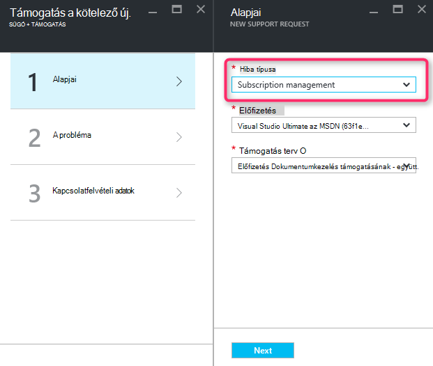
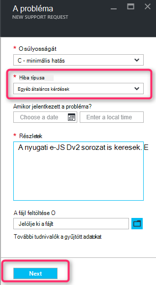
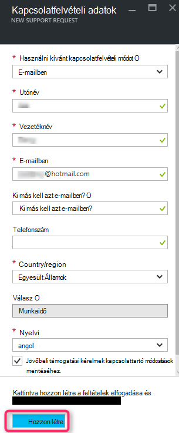

<properties
     pageTitle="Nem érhető el Termékváltozat sorozat |} Microsoft Azure"
     description="Néhány Termékváltozat adatsorokat nem érhető el, a kijelölt előfizetés ezt területhez tartozik."
     services="Azure Supportability"
     documentationCenter=""
     authors="ganganarayanan"
     manager="scotthit"
     editor=""/>

<tags
     ms.service="azure-supportability"
     ms.workload="na"
     ms.tgt_pltfrm="na"
     ms.devlang="na"
     ms.topic="article"
     ms.date="08/12/2016"
     ms.author="gangan"/>

# Termékváltozat adatsor nem érhető el

Bizonyos területeken bizonyos termékváltozatok nem érhetők el automatikusan a új előfizetések.  Ez akkor fordulhat elő, amikor [több hatékony termékváltozatok ismerkedhet terület](https://azure.microsoft.com/updates/announcing-new-dv2-series-virtual-machine-size/) és a régi, a Népszerűségi Termékváltozat lemondott.
Az "*egyes Termékváltozat adatsorokat ezt területhez tartozik kijelölt előfizetéshez nem érhető el*" üzenet jelenik meg a számítási core kvóta növelése egy támogatási kérelmet létrehozásakor.

Érdemes tanulmányozni a [régió szerint Azure-szolgáltatások](https://azure.microsoft.com/regions/#services) lapon Termékváltozat elérhetőségét. 

Amely az előfizetéséből korlátozta Termékváltozatot hozzáférést kérni, hozzon létre egy "Előfizetés-kezelés" támogatási kérelmet.

- Alapvető tudnivalók lapon jelölje ki a "Előfizetés-kezelés" típusú probléma, és kattintson a "Tovább" gombra.

- A probléma lapon válassza ki a problémát, "Egyéb általános kérdések", és adja meg a pontos régió és Termékváltozat jelenik meg.
Ezzel az elemzéssel a támogatási folyamat felgyorsításához.

- A kapcsolattartási adatok lapon adja meg a kapcsolattartási adatait, és kattintson "Létrehozása".

## Visszajelzés
Mindig vagyunk nyitott visszajelzések és suggestions! A [javaslatok](https://feedback.azure.com/forums/266794-support-feedback)skypefeedback. Ezenkívül is megtalál us [Twitter](https://twitter.com/azuresupport) , illetve az [MSDN-fórumok](https://social.msdn.microsoft.com/Forums/azure).

## tudj meg többet
[Azure támogatási – gyakori kérdések](https://azure.microsoft.com/support/faq)
