<properties
    pageTitle="Adatok helyreállítása a biztonsági másolat tárolóból elemre egy másik DPM kiszolgálóról |} Microsoft Azure"
    description="Az adatok minden DPM kiszolgálóról regisztrált a tárolóból elemre az Azure biztonsági másolat tárolóból elemre kattintva védett már visszaállítani."
    services="backup"
    documentationCenter=""
    authors="nkolli1"
    manager="shreeshd"
    editor=""/>

<tags
    ms.service="backup"
    ms.workload="storage-backup-recovery"
    ms.tgt_pltfrm="na"
    ms.devlang="na"
    ms.topic="article"
    ms.date="08/08/2016"
    ms.author="giridham;jimpark;trinadhk;markgal"/>

# Adatok helyreállítása a biztonsági másolat tárolóból elemre egy másik DPM kiszolgálóról
Az adatok minden DPM kiszolgálóról regisztrált a tárolóból elemre az Azure biztonsági másolat tárolóból elemre kattintva védett már most visszaállíthatja. Ennek a folyamat így teljes mértékben integrálva van a DPM kezelőkonzol és helyreállítási munkafolyamatok hasonlít.

A biztonsági másolat tárolóból elemre egy másik DPM kiszolgáló adatainak helyreállítása szüksége lesz a [System Center védelem adatkezelő UR7](https://support.microsoft.com/en-us/kb/3065246) és az [Azure biztonsági agent legújabb verzióját](http://aka.ms/azurebackup_agent).

## Egy másik DPM kiszolgáló adatainak helyreállítása
Adatok helyreállítása másik DPM kiszolgálóra:

1. A DPM management console **helyreállítási** fülre, kattintson a **"külső DPM hozzáadása"** (a képernyő bal felső).

    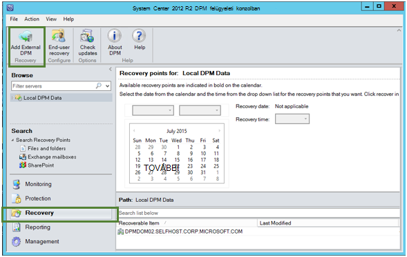

2. Új **tárolóra hitelesítő adatok** letöltése a tárolóból elemre, ha az adatok helyreállított **DPM kiszolgáló** társított, a DPM kiszolgáló válasszon a listából, DPM kiszolgálók regisztrált a biztonsági másolat tárolóból elemre, és adja meg a DPM kiszolgáló, amelynek adatait helyreállítása folyamatban társított **titkosítási jelszó** .

    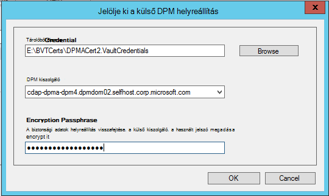

    >[AZURE.NOTE] Csak a azonos regisztrációs tárolóra társított DPM kiszolgálók egymás adatok visszaállíthatja.

    Miután sikeresen hozzáadta a külső DPM kiszolgáló, megkeresheti az adatokat a külső DPM kiszolgáló, valamint helyi DPM **helyreállítási** lapjáról.

3. Tekintse át a külső DPM kiszolgáló védik üzemi kiszolgálók a rendelkezésre álló listáját, és jelölje ki a megfelelő adatforrást.

    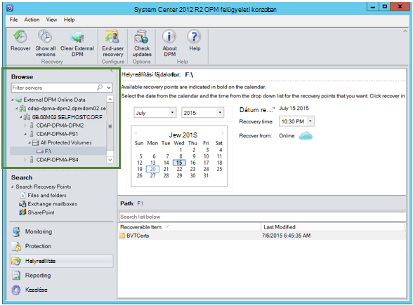

4. Válassza **a hónapokat és éveket** a **helyreállítási pontok** legördülő listája, jelölje ki a helyreállítási pont létrehozásának **helyreállítási dátum** kötelező és válassza ki a **helyreállítási idő**.

    Fájlok és mappák listájának megjelennek az alsó ablaktáblában, amely megtekintett és helyreállított tetszőleges helyére.

    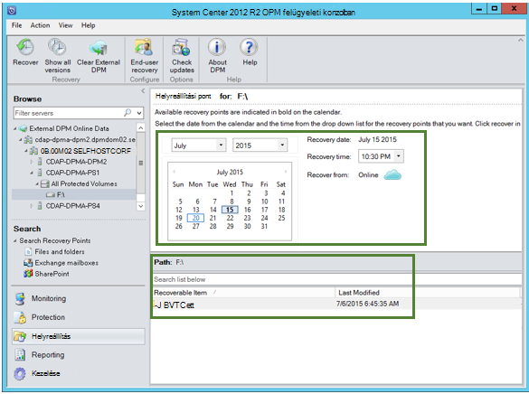

5. Kattintson a jobb gombbal a megfelelő elemet, és kattintson a **helyreállítás**.

    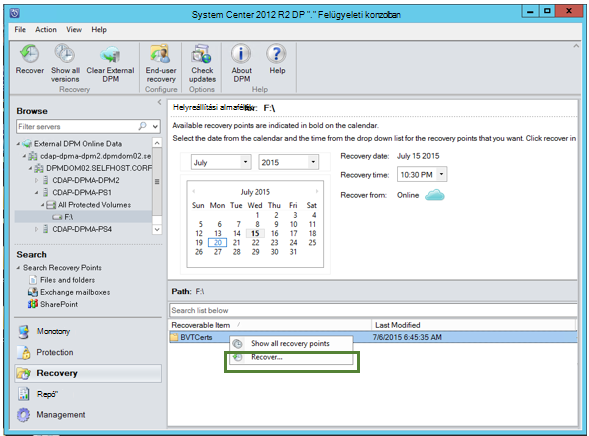

6. Tekintse át a **Kijelölés helyreállítani**. Ellenőrizze az adatokat, és a biztonsági másolat készül helyreállított időpontja, valamint a forrást, amely a biztonsági másolat készült. Ha a kijelölés helytelen, kattintson a **Mégse** való visszalépésre helyreállítási fülre, és válassza ki a megfelelő helyreállítási pont. Ha a kijelölés helyes, kattintson a **Tovább**gombra.

    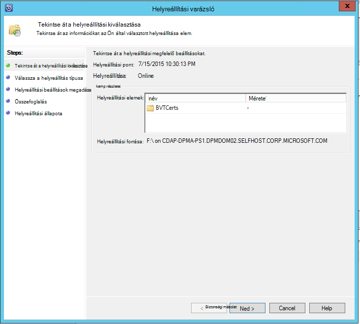

7. Jelölje ki a **helyreállítani kívánt egy másik helyre**. **Tallózással keresse meg** a megfelelő helyre az helyreállítási.

    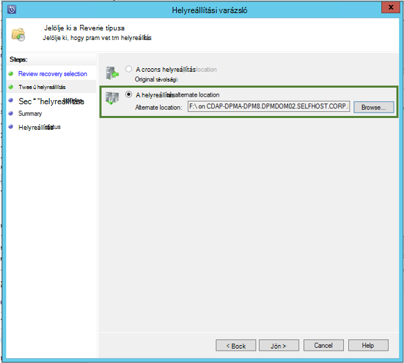

8. Válassza a **másolat** **kihagyása**és **felülírása**kapcsolódó lehetőséget.
    - **Másolat létrehozása** hoz létre a fájl egy példányát, abban az esetben, ha nincs ütközés nevét.
    - **Ugrás** kihagyja helyreállítása a fájlt, abban az esetben, ha nincs ütközés nevét.
    - **Felülírása** felülírja a meglévő másolása egy névütközések megelőzve megadott helyen.

    Válassza ki a kívánt lehetőséget a **biztonsági beállítások visszaállítása**. A biztonsági beállítások, ahol az adatok helyreállított cél számítógép vagy a biztonsági beállítások, amelyeket a termékre vonatkozó a helyreállítási pont létrehozásakor is alkalmazhat.

    Azonosítása, hogy egy **értesítést** kapnak, ha a helyreállítás sikeresen befejeződött.

    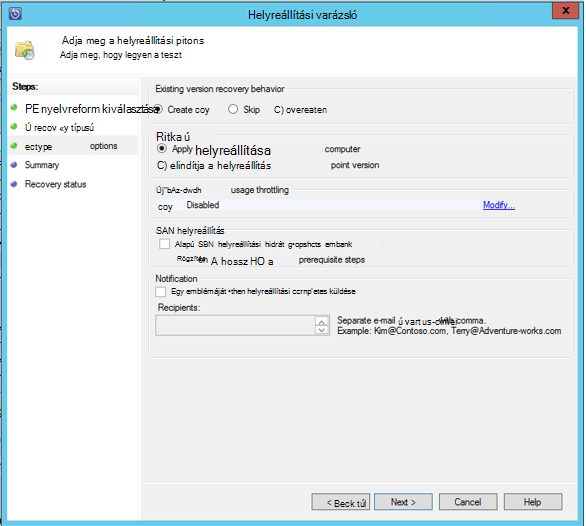

9. Az **Összegzés** képernyőn eddig a választott beállítások listája. Miután **"visszaállítása**gombra kattint, az adatokat a helyszíni megfelelő helyre lehet visszaállítani.

    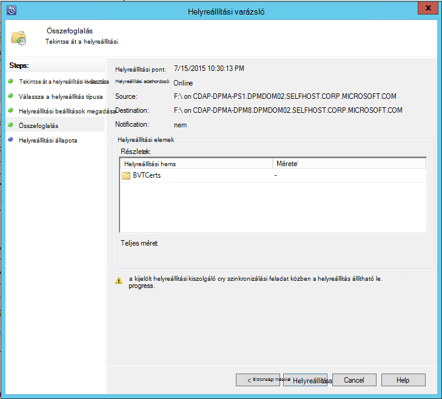

    >[AZURE.NOTE] Az helyreállítási feladat figyelhető a DPM kiszolgáló **Figyelés** lapján.

    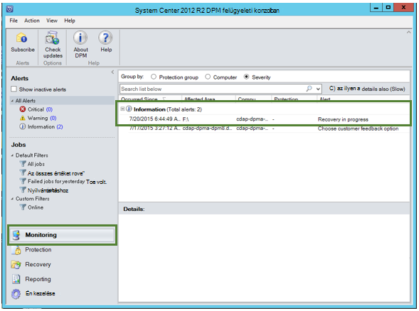

10. Ha el szeretné távolítani a nézetben a külső DPM kiszolgáló DPM kiszolgáló **helyreállítási** lapon **Törlése külső DPM** kattinthat.

    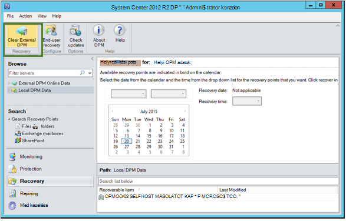

## Hiba elhárítása
|nem. |  Hibaüzenet jelenik meg | Hibaelhárítási lépések |
| :-------------: |:-------------| :-----|
|1.|        A kiszolgáló nem regisztrálva van a tárolóból elemre a megadott hitelesítő adatok tárolóból elemre.|  **Okai lehetnek:** Ez a hiba jelenik meg a biztonsági másolat tárolóra DPM kiszolgáló, amelyen a helyreállítás pró társított nem tagja a kijelölt tárolóra hitelesítőadat-fájl.   **Felbontás:** Töltse le a tárolóból elemre hitelesítőadat-fájlt, amelyhez a DPM kiszolgáló regisztrált a biztonsági másolat tárolóra.|
|2.|        Vagy nem érhető el a helyreállítható adatok vagy a kijelölt kiszolgáló nem DPM kiszolgáló.|   **Okai lehetnek:** Vannak olyan, nincs más DPM kiszolgálók DPM 2012 R2 UR7 regisztrált a biztonsági másolat tárolóból elemre, vagy a DPM kiszolgálók DPM 2012 R2 UR7 nem van még feltölteni a metaadatok, vagy a kijelölt kiszolgáló nem DPM server (más néven Windows Server vagy Windows-ügyfél).   **Felbontás:** Ha más regisztrált a biztonsági másolat tárolóra DPM kiszolgálók, győződjön meg róla, SCDPM 2012 R2 UR7 és Azure legújabb biztonsági ügynök telepítve vannak.  Vannak más DPM kiszolgálók regisztrált a DPM 2012 R2 UR7 a biztonsági másolat tárolóból elemre, ha megvárja, amíg a helyreállítási folyamat elindításához UR7 telepítése után nap. Az éjszakai feladat feltöltődnek a metaadatok összes a korábban védett biztonsági másolatok cloud. Az adatok érhetők el helyreállítási.|
|3.|        Nincs DPM kiszolgáló regisztrálva van a tárolóból elemre.|   **Okai lehetnek:** Nem találhatók más DPM kiszolgálók DPM 2012 R2 UR7 vagy újabb operációs regisztrált a tárolóból elemre, amelyhez a helyreállítás próbált szeretne. **Felbontás:** Ha más regisztrált a biztonsági másolat tárolóra DPM kiszolgálók, győződjön meg róla, SCDPM 2012 R2 UR7 és Azure legújabb biztonsági ügynök telepítve vannak. Vannak más DPM kiszolgálók regisztrált a DPM 2012 R2 UR7 a biztonsági másolat tárolóból elemre, ha megvárja, amíg az helyreállítási folyamat elindításához UR7 telepítése után nap. Az éjszakai feladat feltöltődnek a metaadatok összes a korábban védett biztonsági másolatok cloud. Az adatok érhetők el helyreállítási.|
|4.|        A megadott titkosítási jelszó nem egyezik meg a következő kiszolgáló társított jelszó:**<server name>**|  **Okai lehetnek:** A webhelyet a DPM kiszolgáló adatok helyreállítása folyamatban adatainak titkosítására használt titkosítási jelszó nem egyezik meg a titkosítási jelszó megadva. A agent nem tudja visszafejteni az adatokat. Ezért a helyreállítás sikertelen lesz. **Felbontás:** Adja meg pontosan ugyanazt titkosítási a hozzáférési kódot a DPM kiszolgáló, amelynek adatait helyreállítása folyamatban van társítva.|

## Gyakori kérdések:
1. **Miért nem tudok egy külső DPM server egy másik DPM kiszolgálóról a UR7 és Azure biztonsági másolat agent legújabb telepítése után?**

    A) a meglévő DPM kiszolgálókon a felhőbe (kumulatív verziónál összesítő 7 frissítése) segítségével védett adatforrások, meg kell várnia az UR7 és a legújabb Azure Backup ügynök *hozzáadása külső DPM kiszolgáló*indításához telepítése után legalább egy napnak. Ez a metaadatok DPM védelem csoportok feltöltése Azure van szükség. Ennek oka, hogy az első alkalommal éjszakai feladat keresztül.

2. **Mi az Azure biztonsági másolat ügynök szükséges minimális verzióját?**

    A) az Azure biztonsági másolat ügynök minimális ahhoz, hogy ez a funkció verziója 2.0.8719.0.  Azure biztonsági másolat agent verziójának ellenőrizheti a Vezérlőpult navigálással **>** összes Vezérlőpult elemeit **>** programok és szolgáltatások **>** a Microsoft Azure helyreállítási szolgáltatások Agent. Kisebb, mint 2.0.8719.0 verzió esetén töltse le az [Azure biztonsági másolat agent legújabb verzióját](https://go.microsoft.com/fwLink/?LinkID=288905) , és telepítse.

    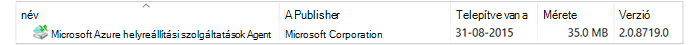

## A következő lépéseket:
• [Azure biztonsági – gyakori kérdések](backup-azure-backup-faq.md)
