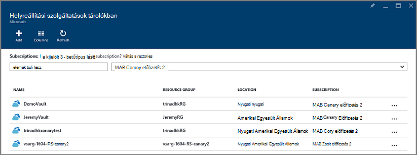

<properties
    pageTitle="Virtuális gépeken futó visszaállítása biztonsági másolatból Azure portálon |} Microsoft Azure"
    description="Az Azure virtuális gép visszaállítása a helyreállítási helyétől Azure portál használatával"
    services="backup"
    documentationCenter=""
    authors="markgalioto"
    manager="cfreeman"
    editor=""
    keywords="biztonsági másolat; visszaállítása hogyan állíthat vissza; helyreállítási pont;"/>

<tags
    ms.service="backup"
    ms.workload="storage-backup-recovery"
    ms.tgt_pltfrm="na"
    ms.devlang="na"
    ms.topic="article"
    ms.date="08/10/2016"
    ms.author="trinadhk; jimpark;"/>

# Azure portal segítségével virtuális gépeken futó visszaállítása

> [AZURE.SELECTOR]
- [VMs visszaállítása klasszikus portálon](backup-azure-restore-vms.md)
- [VMs visszaállítása az Azure-portálon](backup-azure-arm-restore-vms.md)

Az adatok védelme biztonsági szakértőjévé válhat egy adott időpontban érvényes adatok meghatározott időközönként. Ezeket a pillanatképek helyreállítási pontok nevezik, és helyreállítási szolgáltatások tárolókban mappába kerülnek. Ha vagy javítása, vagy egy virtuális újjáépítése szükséges, visszaállíthatja a virtuális bármilyen a mentett helyreállítási pontok. Amikor visszaállít egy helyreállítási pont, vissza, vagy a virtuális állapotba visszaállítása: amikor a helyreállítási pont történt. Ez a cikk ismerteti, hogyan egy virtuális visszaállításához.

> [AZURE.NOTE] Azure magában az erőforrások létrehozásáról és használatáról a két környezetben modellek: [az erőforrás-kezelő és klasszikus](../resource-manager-deployment-model.md). Ebben a cikkben az információkat és eljárásokat az erőforrás-kezelő modell rendszerbe VMs visszaállításához.

## A helyreállítási pont visszaállítása

1. Jelentkezzen be az [Azure portál](http://portal.azure.com/)

2. Azure menüben kattintson a **Tallózás gombra** , és írja be a szolgáltatások listáját, a **Helyreállítási szolgáltatások**. A szolgáltatások listáját a beírt igazodik. Amikor megjelenik a **helyreállítási szolgáltatások tárolókban**, jelölje ki.

    

    Az előfizetés tárolókban listája jelenik meg.

    

3. A listában jelölje ki a társított a visszaállítani kívánt virtuális tárolóból elemre. Ha a tárolóból elemre kattint, megnyílik az irányítópult.

    

4. Most, hogy a tárolóból elemre irányítópulton. A **Biztonsági másolat elemek** csempe **Azure virtuális gépeken futó** társított a tárolóból elemre a VMs megjelenítése parancsára.

    

    A **Biztonsági másolat elemek** lap megnyílik, és Azure virtuális gépeken futó listáját jeleníti meg.

    

5. A listában jelölje ki a virtuális kattintva nyissa meg az irányítópulton. A virtuális irányítópult megnyílik a figyelés területre, amely tartalmazza a visszaállítás pontok csempére.

    

6. A virtuális irányítópult menüben kattintson a **Visszaállítás** gombra.

    

    A visszaállítás lap megnyitása

    

7. Kattintson a **visszaállítása** lap **visszaállítási pont** az a **pont válassza a visszaállítás** lap megnyitásához.

    

    A párbeszédpanel alapértelmezés szerint az elmúlt 30 nap az összes visszaállítási pont jeleníti meg. Megjelenik a **szűrő** visszaállítási pontok időtartomány megváltoztatására használható. Alapértelmezés szerint minden konzisztencia visszaállítása pontjai jelennek meg. Jelölje ki a visszaállítási pontok egy adott következetességét **összes visszaállítása pontok** szűrő módosítása. További információt a különböző típusú visszaállítás pont [adatok konzisztencia](./backup-azure-vms-introduction.md#data-consistency)magyarázata találhat.  
    - Válassza a **Visszaállítás pont konzisztencia** a listából:
        - Egységes visszaállítási pontok, összeomlik
        - Alkalmazás egységes visszaállítási pontok
        - A fájl rendszer egységes visszaállítási pontok
        - Az összes visszaállítási pontokat.  

8. Válassza a visszaállítási pontot, és kattintson az **OK gombra**.

    

    A **Visszaállítás** lap látható, a visszaállítási pont van-e beállítva.

    

9. A **Visszaállítás** lap **beállításainak visszaállítása** automatikusan megnyílik visszaállítási pont beállítása után.

    

## A virtuális visszaállítása konfiguráció kiválasztása

Most, hogy be van jelölve a visszaállítási pontra, válassza a visszaállítás virtuális konfigurációt. A választási lehetőségek, a visszaállított virtuális lehetőségeit: használata: Azure portal vagy PowerShell.

> [AZURE.NOTE] A portál egy gyors létrehozása lehetőséget a visszaállított virtuális. Ha azt szeretné, ha testre szeretné szabni a to-be visszaállított virtuális virtuális konfigurációja, PowerShell-lel való visszaállítása biztonsági másolat lemezt, és őket csatolni virtuális konfigurációs megválasztása. [A virtuális különleges hálózati konfigurációjának visszaállítása](#restoring-vms-with-special-network-configurations)témakörben talál.

1. Ha Ön nem már létezik, nyissa meg a **visszaállítása** lap. Győződjön meg róla, **visszaállítási pont** ki van jelölve, és kattintson a **beállításainak visszaállítása** a **helyreállítási konfigurációs** lap megnyitásához.

    

2. **Beállításainak visszaállítása** lap adja meg, és válassza ki a minden egyes a következő mezők értékeit:
    - **Virtuális számítógépnév** - nevezze el a virtuális. A nevét az erőforráscsoport (az erőforrás-kezelő rendszerbe virtuális) vagy a felhőalapú szolgáltatáshoz (a klasszikus virtuális) egyedinek kell lennie. Ha már létezik az előfizetés nem helyettesítheti a virtuális gépen.
    - **Erőforráscsoport** - erőforrás csoport, vagy hozzon létre egy újat. Ha a klasszikus virtuális visszaállításához Ez a mező segítségével adja meg az új felhőalapú szolgáltatás nevét. Ha egy új erőforrás csoport/felhőszolgáltatásba létrehozásához a név globálisan egyedinek kell lennie. A felhőalapú szolgáltatás neve általában tartozik egy nyilvános URL-cím – például: [cloudservice]. cloudapp.net. Ha megpróbálja a felhőben erőforrás csoport/felhőszolgáltatásában már használt nevet, a Azure neve megegyezik a virtuális rendel a erőforrás csoport/felhőalapú szolgáltatást. Azure az erőforrás-csoportok/felhőszolgáltatások és a nem társított affinitás csoportokat VMs jeleníti meg. További tudnivalókért lásd: [áttelepítése affinitás csoportok területi virtuális hálózathoz (VNet)](../virtual-network/virtual-networks-migrate-to-regional-vnet.md).
    - **Virtuális hálózat** - jelölje ki a virtuális hálózati (VNET) a virtuális létrehozásakor. A mező tartalmazza a előfizetéséhez társított összes VNETs. Erőforráscsoport a virtuális a zárójelek között jelenik meg.
    - **Alhálózat** – Ha a VNET alhálózat tartalmaz, az első alhálózat alapértelmezés szerint van-e jelölve. Ha további alhálózat, jelölje ki a kívánt alhálózat.
    - **Tárterület-fiókot** – ebben a menüben a tárterület-fiókok a helyreállítási szolgáltatások tárolóra ugyanazon a helyen sorolja fel. A tárterület-fiók kiválasztásakor válassza a helyreállítási szolgáltatások tárolóra ugyanazon a helyen megosztó fiók. Tárterület-fiókot, amely felesleges zóna nem támogatottak. Ha nincs tároló fiókok a helyreállítási szolgáltatások tárolóra ugyanazon a helyen, létre kell hoznia egy, a visszaállítási művelet elindítása előtt. A tároló fióktípus replikációs zárójelek között szerepel.

    > [AZURE.NOTE] Ha egy erőforrás-kezelő rendszerbe virtuális visszaállításához meg kell adnia egy virtuális hálózati (VNET). A virtuális hálózati (VNET) nem kötelező, a klasszikus virtuális.

3. Kattintson a **beállításainak visszaállítása** lap véglegesíti a konfiguráció visszaállítása az **OK gombra** .

4. Kattintson a **Visszaállítás** lap **visszaállítása** a visszaállítási művelet elindítása.

    

## A visszaállítás nyomon követése

A visszaállítási művelet elindítása meg, miután a biztonsági másolat szolgáltatás a feladat nyomon követéséhez a visszaállítási művelet hoz létre. A biztonsági másolat szolgáltatás hoz létre, és jeleníti meg az értesítés a portálra értesítési területén. Ha nem látható az értesítés, mindig kattinthat az értesítések ikonjára az értesítések megtekintéséhez.

A művelet közben feldolgozása, vagy tekintheti meg, ha azt befejeződött, nyissa meg a biztonsági másolat feladatok listában.

1. Azure menüben kattintson a **Tallózás gombra** , és írja be a szolgáltatások listáját, **Helyreállítási szolgáltatások**. A szolgáltatások listáját a beírt igazodik. Amikor megjelenik a **helyreállítási szolgáltatások tárolókban**, jelölje ki.

    

    Az előfizetés tárolókban listája jelenik meg.

    

2. A listában jelölje ki a társított a visszaállított virtuális tárolóból elemre. Ha a tárolóból elemre kattint, megnyílik az irányítópult.

3. A tárolóból elemre irányítópulton a **Biztonsági másolat feladatok** csempe **Azure virtuális gépeken futó** a tárolóra társított feladatok megjelenítése parancsára.

    

    A **Biztonsági másolat feladatok** lap megnyílik, és a feladatok listáját jeleníti meg.

    

## Visszaállítás VMs különleges hálózati beállítások
Ajánlatos biztonsági mentés és visszaállítás VMs az alábbi speciális hálózati beállításokat. Ezek a konfigurációk azonban keresztül a helyreállítási folyamat során bizonyos speciális szempontok van szükség.

- VMs a terheléselosztó (belső és külső)
- A több fenntartott IP-címei VMs
- A több VMs

>[AZURE.IMPORTANT] A különleges hálózati konfigurációja VMs létrehozásakor a PowerShell VMs létrehozása a lemezről vissza kell használnia.

Teljesen hozza létre újból a virtuális gépeken futó lemezre visszaállítása után, tegye a következőket:

1. A lemez visszaállítani a helyreállítási szolgáltatások tárolóból elemre [a PowerShell](../backup-azure-vms-automation.md#restore-an-azure-vm) használatával

2. A virtuális beállítási terheléselosztó szükséges létrehozására / több hálózati kártya/több fenntartott IP a PowerShell-parancsmagok és használata a virtuális a létrehozásához szükséges konfigurációs.
    - Hozzon létre virtuális felhőszolgáltatásában a [belső terheléselosztó](https://azure.microsoft.com/documentation/articles/load-balancer-internal-getstarted/)
    - Hozzon létre virtuális csatlakozni [terheléselosztó internetes] (https://azure.microsoft.com/en-us/documentation/articles/load-balancer-internet-getstarted/)
    - Hozzon létre virtuális [több](https://azure.microsoft.com/documentation/articles/virtual-networks-multiple-nics/)
    - Hozzon létre virtuális [több fenntartott IP-címei](https://azure.microsoft.com/documentation/articles/virtual-networks-reserved-public-ip/)

## Következő lépések
Most, hogy a VMs visszaállításához ismertető hibaelhárítási tudnivalókat a gyakori hibák VMs a. Is nézze át a cikk a VMs a feladatok kezelésének.

- [Hibák elhárítása](backup-azure-vms-troubleshoot.md#restore)
- [Virtuális gépeken futó kezelése](backup-azure-manage-vms.md)
