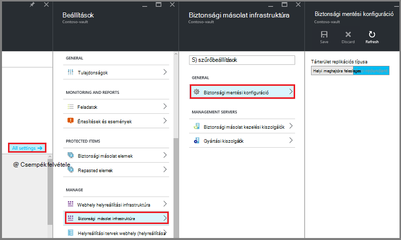
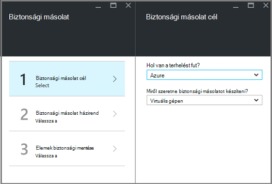
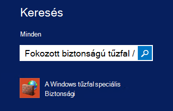
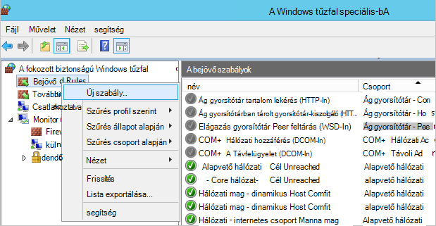

<properties
    pageTitle="Felkészülés a környezetben, készítsen biztonsági másolatot az erőforrás-kezelő rendszerbe virtuális gépeken futó |} Microsoft Azure"
    description="Ellenőrizze, hogy a környezet készült az Azure virtuális gépeken futó mentésével"
    services="backup"
    documentationCenter=""
    authors="markgalioto"
    manager="cfreeman"
    editor=""
    keywords="biztonsági másolatok; biztonsági másolat;"/>

<tags
    ms.service="backup"
    ms.workload="storage-backup-recovery"
    ms.tgt_pltfrm="na"
    ms.devlang="na"
    ms.topic="article"
    ms.date="08/21/2016"
    ms.author="trinadhk; jimpark; markgal;"/>


# <a name="prepare-your-environment-to-back-up-resource-manager-deployed-virtual-machines"></a>A környezet készítsen biztonsági másolatot az erőforrás-kezelő rendszerbe virtuális gépeken futó előkészítése

> [AZURE.SELECTOR]
- [Erőforrás-kezelő modell](backup-azure-arm-vms-prepare.md)
- [Klasszikus modell](backup-azure-vms-prepare.md)

Ez a cikk lépéseit a előkészítése egy erőforrás-kezelő rendszerbe virtuális (virtuális) számítógépre mentéséről a környezetben. Az eljárások bemutatott lépések használni az Azure portált.  

Az Azure biztonsági másolat szolgáltatás kétféle tárolókban (és biztonsági mentése tárolókban helyreállítási szolgáltatások tárolókban) a VMs védelmet. A biztonsági másolat tárolóból elemre a klasszikus telepítési modell használata rendszerbe VMs védi. A helyreállítási szolgáltatások tárolóból elemre a **Klasszikus rendszerbe, mind az erőforrás-kezelő rendszerbe VMs** védi. A helyreállítási szolgáltatások tárolóból elemre egy erőforrás-kezelő rendszerbe virtuális védelme kell használnia.

>[AZURE.NOTE] Azure van két telepítési modellekkel létrehozásáról és használatáról az erőforrások: [az erőforrás-kezelő és klasszikus](../resource-manager-deployment-model.md). Témakörben [a környezet Azure virtuális gépeken futó mentéséről](backup-azure-vms-prepare.md) további információt a klasszikus telepítési modell VMs használata.

Előtt védelme, vagy biztonsági másolatot az erőforrás-kezelő rendszerbe virtuális gép (virtuális), győződjön meg az Előfeltételek létezik:

- Hozzon létre egy helyreállítási szolgáltatások tárolóból elemre (vagy egy meglévő helyreállítási szolgáltatások tárolóra azonosítása) *a virtuális ugyanazon a helyen*.
- Példa kijelölése, adja meg a biztonsági másolat házirendet és védelme elemek meghatározása.
- Jelölje be a telepítés virtuális ügynök virtuális gépen.
- Jelölje be a hálózati kapcsolat

Ha tudja, hogy a környezetben már létezik ezen feltételek majd folytassa a [biztonsági másolatot készíteni a VMs cikk](backup-azure-vms.md). Ha módosítani szeretné beállítani, vagy ellenőrizze, bármelyik alábbi előfeltételek, ez a cikk végigvezeti Önt azon a lépéseket, hogy előfeltétel előkészítése.


## <a name="limitations-when-backing-up-and-restoring-a-vm"></a>Ha mentésével és visszaállításával egy virtuális korlátai

Mielőtt előkészítheti a környezetben, kérjük, megértése korlátozások

- A 16-nál több adat lemezen a virtuális gépeken futó mentésével nem támogatott.
- Virtuális gépeken futó fenntartott IP-címet, és nem meghatározott végpont mentésével nem támogatott.
- Biztonsági másolatot Linux virtuális gépeken futó Docker kiterjesztésű nem támogatott. 
- Adatok biztonsági másolatának csatolni virtuális csatlakoztatott hálózati meghajtók nem tartalmazza. 
- Egy meglévő virtuális gép cseréje visszaállítás során nem támogatott. Ha megpróbálja visszaállítása a virtuális, amikor a virtuális létezik, a visszaállítási művelet sikertelen lesz.
- Idegen-terület biztonsági mentési és visszaállítási nem támogatott.
- Készíthet biztonsági másolatot az összes nyilvános régiójában Azure virtuális gépeken futó (lásd: támogatott régiók a [Feladatlista](https://azure.microsoft.com/regions/#services) ). Ha az régiót, amelynek a keresett jelenleg nem támogatott, azt nem jelenik a legördülő lista tárolóra létrehozása során.
- Készíthet biztonsági másolatot virtuális gépeken futó csak a választó operációs rendszereken:
  - **Linux**: Azure biztonsági másolat támogatja a [listája, amely a Azure záradékkal terjesztését](../virtual-machines/virtual-machines-linux-endorsed-distros.md) Core OS Linux kivételével.  Más Előrehozás-a-Öné-Linux terjesztését is működnek mindaddig, amíg a virtuális agent érhető el a virtuális gépen és Python létezik támogatása.
  - **A Windows Server**: Windows Server 2008 R2-nél korábbi verzióiban nem támogatott.
- A tartományvezérlőnek visszaállítása a többszörös-Adatközpont konfiguráció részét képező (Adatközpont) virtuális támogatott csak a PowerShell használatával. További információ [a többszörös-Adatközpont tartományvezérlőnek visszaállítása](backup-azure-restore-vms.md#restoring-domain-controller-vms).
- Az alábbi speciális hálózati beállításokat tartalmazó virtuális gépeken futó visszaállítása csak a PowerShell használatával támogatja. A visszaállítás munkafolyamat a felhasználói felület készült VMs nem lesz hálózati őket a visszaállítási művelet befejezése után. További tudnivalókért olvassa el a [VMs visszaállítása a különleges hálózati beállítások](backup-azure-restore-vms.md#restoring-vms-with-special-netwrok-configurations)című témakört.
  - Virtuális gépeken futó betöltés terheléselosztó konfigurációja (belső és külső)
  - Virtuális gépeken futó több fenntartott IP-címmel
  - Virtuális gépeken futó több hálózati kártyával

## <a name="create-a-recovery-services-vault-for-a-vm"></a>Hozzon létre egy helyreállítási szolgáltatások tárolóból elemre egy virtuális

A még a biztonsági mentés és helyreállítási pontok időmennyiségét létrehozott tároló egységek a helyreállítási szolgáltatások tárolóból elemre. A helyreállítási szolgáltatások tárolóra is tartalmaz, a védett virtuális gépeken futó társított biztonsági házirendek.

A helyreállítási szolgáltatások tárolóra létrehozása:

1. Jelentkezzen be az [Azure-portálon](https://portal.azure.com/).

2. A központi menüben kattintson a **Tallózás gombra** , és az erőforrások listája, írja be a **Helyreállítási szolgáltatások**. Gépelés megkezdésekor a listában a rendszer kiszűri a megadott feltételeknek. Kattintson a **helyreállítás szolgáltatások tárolóból elemre**.

     <br/>

    A tárolókban helyreállítási szolgáltatások listáját jelenik meg.

3. A **helyreállítási szolgáltatások tárolókban** menüben kattintson a **Hozzáadás**gombra.

    

    Megnyílik a helyreállítási szolgáltatások tárolóból elemre a lap, kéri, adja meg **nevét**, **előfizetés**, **erőforráscsoport**és **helyét**.

    

4. A **név**írja be egy rövid nevet, amely azonosítja a tárolóból elemre. A név van szüksége az Azure előfizetés egyedinek kell lennie. Adjon egy nevet, amely a 2 és 50 karakter közötti tartalmazza. Egy betűvel kell kezdődnie, és csak betűket, számokat és kötőjelet is tartalmazhat.

5. Kattintson az **előfizetés** az előfizetések elérhető listájának megjelenítéséhez. Ha nem biztos abban, hogy mely előfizetés használni, használja az alapértelmezett (vagy a javasolt) előfizetés. Lesznek több lehetőség csak akkor, ha a szervezeti fiók társítva több Azure előfizetés.

6. **Erőforráscsoport** a rendelkezésre álló erőforráscsoport listájának megtekintéséhez, vagy hozzon létre egy új erőforráscsoport **Új** gombra. Az erőforrás csoportok átfogó információt a [Azure erőforrás-kezelő áttekintése](../azure-resource-manager/resource-group-overview.md) című témakörben találhat.

7. Kattintson a **hely** jelölje ki a földrajzi régióban esetében a tárolóból elemre. A virtuális gépeken futó, amelyet védeni kíván azonos régió a tárolóból elemre **kell** lennie.

    >[AZURE.IMPORTANT] Ha biztos benne, hogy a helyet, ahol a virtuális létezik, zárja be a tárolóból elemre létrehozása párbeszédpanel ki, és nyissa meg a virtuális gépeken futó listáját a portálon. Virtuális gépeken futó több területre, ha szüksége lesz az egyes régiókra hozzon létre egy helyreállítási szolgáltatások tárolóból elemre. Ugrás a következő helyen előtt hozzon létre a a tárolóból elemre az első helyen. Adja meg az adatok biztonsági másolatának – a helyreállítási szolgáltatások tárolóra tárolásához tároló fiókokat nincs szükség van, és a biztonsági másolat Azure szolgáltatás automatikusan kezelheti a.

8. Kattintson a **létrehozása**gombra. Eltarthat egy ideig a létrehozandó a helyreállítási szolgáltatások tárolóból elemre. Figyelje meg a állapotát jelző a portál jobb felső területén. Amikor létrejött a tárolóból elemre, megjelenik a helyreállítási szolgáltatások tárolókban listájában.

    

    Most, hogy létrehozta a tárolóból elemre, megtudhatja, hogyan kell beállítani a tárterület-replikáció.

## <a name="set-storage-replication"></a>Tárterület-replikáció beállítása

A tároló replikációs beállítással geo felesleges tároló és a helyi meghajtóra felesleges szolgáltatások közül választhat. Alapértelmezés szerint a tárolóból elemre a geo felesleges tároló tartalmaz. Kilépés a geo felesleges tárolóhoz beállítása, ha ez az elsődleges biztonsági mentése lehetőséget. Válassza a helyi meghajtóra felesleges tárolás, ha azt szeretné, hogy egy olcsóbb beállítást, amely nem igazán tartós. További információk [geo felesleges](../storage/storage-redundancy.md#geo-redundant-storage) és a [helyi meghajtóra felesleges](../storage/storage-redundancy.md#locally-redundant-storage) -tárolási lehetőségek a az [Azure tároló replikációs – áttekintés](../storage/storage-redundancy.md).

A tároló replikációs beállításainak módosítása:

1. Jelölje ki a tárolóból elemre kattintva nyissa meg a tárolóból elemre az irányítópult és a beállítások lap. A **Beállítások** lap nem nyílik meg, ha a tárolóból elemre az irányítópult kattintson a **minden beállításai** parancsra.

2. Kattintson a **Beállítások** lap a **Biztonsági másolat infrastruktúra** > **Biztonsági másolat konfigurációs** a **Biztonsági mentés beállításainak** lap megnyitásához. A **Biztonsági mentés beállításainak** lap válassza a tárterület replikációs lehetőséget a tárolóból elemre.

    

    Miután kiválasztotta a tárolóból elemre a tárolási lehetőség, készen áll a virtuális társítani a tárolóból elemre. A társítási indításához kell Fedezze fel, és regisztráljon az Azure virtuális gépeken futó.


## <a name="select-a-backup-goal-set-policy-and-define-items-to-protect"></a>Válassza ki a biztonsági másolat célt, házirend beállítása és védelme elemek meghatározása

Regisztrálás előtt egy virtuális a tárolóból elemre, és futtassa a keresési folyamatának annak érdekében, hogy minden új virtuális gépeken futó, amely az előfizetéshez van hozzáadva azonosítja. A folyamat lekérdezések Azure virtuális gépeken futó az előfizetést, és további információt a listája, mint a felhőalapú szolgáltatás neve és a régió. Az Azure-portálon forgatókönyv utal, mit szeretne helyezni a helyreállítási szolgáltatások tárolóból elemre. A házirend olyan gyakran hogyan és mikor helyreállítási pontok kell venni az ütemtervet. Házirend is magába foglalja a helyreállítási pontok adatmegőrzési tartományát.

1. Ha már van nyitva egy helyreállítási szolgáltatások tárolóból elemre, ugorjon a 2. Ha nem rendelkezik a helyreállítási Services megnyitott tárolóból elemre, de az Azure-portálon központi menüben kattintson a **Tallózás gombra**.

  - Az erőforrások listája írja be a **Helyreállítási szolgáltatások**.
  - Gépelés megkezdésekor a listában a rendszer kiszűri a megadott feltételeknek. Amikor megjelenik a **helyreállítási szolgáltatások tárolókban**, kattintson rá.

     <br/>

    A tárolókban helyreállítási szolgáltatások listája jelenik meg.
  - A tárolókban helyreállítási szolgáltatások listában jelölje ki a tárolóból elemre.

    Ekkor megnyílik a kijelölt tárolóból elemre az irányítópult.

    

2. A tárolóból elemre az irányítópult menüben kattintson a **biztonsági másolatot** a biztonsági másolat lap megnyitásához.

    

    Amikor megnyílik a lap, a biztonsági másolat szolgáltatás az előfizetés minden új VMs keres.

    

3. Kattintson a biztonsági másolat lap **biztonsági másolat cél** a biztonsági másolat cél lap megnyitásához.

    

4. A biztonsági másolat cél lap, állítsa **a terhelést futtató** Azure és **Miről szeretne biztonsági másolatot készíteni** virtuális géphez, majd kattintson az **OK gombra**.

    A biztonsági másolat cél lap bezárul, és a biztonsági másolat házirend lap nyílik meg.

    

5. Válassza a biztonsági másolat a házirend lap, a biztonsági másolat házirendet szeretne alkalmazni a tárolóból elemre, és kattintson az **OK gombra**.

    

    Az alapértelmezett házirend részleteit jelennek meg a részleteket. Ha hozzon létre egy új házirendet szeretne, jelölje be **Új létrehozása** a legördülő menüből. A legördülő menü is lehetővé teszi az idő, amikor a pillanatkép venni, 7 du válthat. Biztonsági házirend megadásával című cikkben olvashat [a biztonsági másolat házirend létrehozása](backup-azure-vms-first-look-arm.md#defining-a-backup-policy). Miután **az OK**gombra kattint, a biztonsági másolat házirendet a tárolóból elemre társítva.

    Ezután válassza ki a VMs szeretne társítani a tárolóból elemre.

6. Válassza ki a virtuális gépeken futó a megadott házirend hozzárendelése, és kattintson a **Kijelölés**gombra.

    

    Ha nem látja a kívánt virtuális, ellenőrizze, hogy a helyreállítási szolgáltatások tárolóra Azure ugyanazon a helyen található.

7. Most, hogy a megadott a tárolóból elemre a biztonsági másolat lap az összes beállításainak **Engedélyezése biztonsági mentése** elemre a lap alján kattintson a. Ez a házirendet a tárolóból elemre, és a VMs üzembe helyezése.

    

A következő szakaszban előkészítése telepítésére van beállítva a virtuális Agent, vagy a virtuális Agent gondoskodhat arról, hogy telepítve van.


## <a name="install-the-vm-agent-on-the-virtual-machine"></a>A virtuális ügynököt a virtuális gépen

Az Azure virtuális ügynök telepítenie kell a munkát a biztonsági másolat bővítmény Azure virtuális gépen. Ha a virtuális az Azure gyűjteményből jött létre, majd a virtuális Agent már szerepel a virtuális gépen. Ezeket az adatokat is biztosít az esetekben, hogy *nem* használ egy virtuális létre az Azure gyűjteményből – például egy virtuális áttelepítenie egy helyszíni adatközponthoz. Ebben az esetben a virtuális Agent kell telepíteni kell a virtuális gép védelme.

Tudnivalók a [Virtuális ügynök](https://go.microsoft.com/fwLink/?LinkID=390493&clcid=0x409) és [a virtuális Agent telepítése](../virtual-machines/virtual-machines-windows-classic-manage-extensions.md).

Ha a probléma a Azure virtuális mentésével, ellenőrizze, hogy az Azure virtuális ügynök megfelelően telepítve van a virtuális gépen (lásd az alábbi táblázatban). Ha létrehozott egy egyéni virtuális, [Győződjön meg arról, hogy a **virtuális ügynököt a** jelölőnégyzet be van-e jelölve](../virtual-machines/virtual-machines-windows-classic-agents-and-extensions.md) a virtuális gép előtt már kiépítve.

Az alábbi táblázat a virtuális ügynök a Windows vagy Linux VMs további információt tartalmaz.

| **Művelet** | **A Windows** | **Linux** |
| --- | --- | --- |
| A virtuális Agent telepítése | <li>Töltse le és telepítse az [MSI ügynök](http://go.microsoft.com/fwlink/?LinkID=394789&clcid=0x409). A telepítés elvégzéséhez rendszergazdai jogosultságokkal kell. <li>[A virtuális tulajdonság frissítéséhez](http://blogs.msdn.com/b/mast/archive/2014/04/08/install-the-vm-agent-on-an-existing-azure-vm.aspx) jelzi, hogy telepítve van-e a agent. | <li> Telepítse a legújabb [Linux ügynök](https://github.com/Azure/WALinuxAgent) GitHub. A telepítés elvégzéséhez rendszergazdai jogosultságokkal kell. <li> [A virtuális tulajdonság frissítéséhez](http://blogs.msdn.com/b/mast/archive/2014/04/08/install-the-vm-agent-on-an-existing-azure-vm.aspx) jelzi, hogy telepítve van-e a agent. |
| A virtuális Agent frissítése | Frissítés a virtuális Agent akkor egyszerűen, a [virtuális Agent bináris](http://go.microsoft.com/fwlink/?LinkID=394789&clcid=0x409)újratelepítése. <br>Győződjön meg arról, hogy nincs biztonsági mentést fut-e a virtuális agent frissítése közben. | Kövesse a képernyőn megjelenő utasításokat [a Linux virtuális Agent frissítése ](../virtual-machines-linux-update-agent.md). <br>Győződjön meg arról, hogy nincs biztonsági mentést fut-e a virtuális Agent frissítése közben. |
| A virtuális ügynök telepítés érvényesítése | <li>Nyissa meg a Azure virtuális *C:\WindowsAzure\Packages* mappájában. <li>Keresse meg a bemutató WaAppAgent.exe fájlt.<li> Kattintson a jobb gombbal a fájlra, válassza a **Tulajdonságok parancsot**, és válassza a **Részletek** fülre. A termék verziója írjuk 2.6.1198.718 vagy újabb verziójában. | A #HIÁNYZIK |


### <a name="backup-extension"></a>Biztonsági másolat bővítmény

A virtuális Agent a virtuális gépen telepítése után a biztonsági másolat Azure szolgáltatás a biztonsági másolat bővítmény telepítése a virtuális Agent. A biztonsági másolat Azure szolgáltatás zökkenőmentes frissíti, és a biztonsági másolat kiterjesztés összekapcsolja.

A biztonsági másolat kiterjesztés biztonsági másolat szolgáltatás telepítve van, a virtuális fut-e vagy sem. A futó virtuális itt-alkalmazás egységes helyreállítási pont első legnagyobb lehetőségét. Az Azure biztonsági másolat szolgáltatás azonban továbbra is, készítsen biztonsági másolatot a virtuális, még akkor is, ha ki van kapcsolva, és a bővítmény nem lehetett telepíteni. Kapcsolat nélküli virtuális nevezik. Ebben az esetben a helyreállítási pont lesz az *egységes összeomlik*.


## <a name="network-connectivity"></a>A hálózati kapcsolat

Annak érdekében, hogy a virtuális pillanatképek kezelése, a biztonsági másolat bővítmény van szüksége a kapcsolatot az Azure nyilvános IP-címeket. A jobb oldali internetkapcsolat nélkül a virtuális gép HTTP kéri a időkorlátja, és a biztonsági másolat művelet sikertelen lesz. Ha a telepítő hozzáférés-korlátozásait helyen (a hálózat biztonsági csoport (NSG), például), válassza az törlése az elérési nyújtó biztonsági forgalom az alábbi lehetőségek egyikét:

- [Csak jelszóval módosítható tartományok Whitelist az Azure adatközpont IP](http://www.microsoft.com/en-us/download/details.aspx?id=41653) - hogyan való whitelist az IP-címek útmutatást a cikk tartalmaz.
- Az adatforgalom HTTP-proxy kiszolgáló üzembe.

Melyik lehetőség, amellyel kiválasztásakor a kompromisszumok kezelhetőség, a részletes vezérlő, és a költség között van.

|A beállítás|Előnyei|Hátrányai|
|------|----------|-------------|
|Whitelist IP-címtartományai| Nincs többletköltségek.<br><br>Access-NSG megnyithatja, használja a <i>Set-AzureNetworkSecurityRule</i> parancsmag. | Összetett kezeléséhez, a probléma által sújtott IP-címtartományai időről időre változnak.<br><br>Azure, és nem csak a tárterület a teljes hozzáférést biztosít.|
|HTTP-proxy| A tároló az előnézeti részletes szabályozható URL-címek engedélyezett.<br>Szimpla VMs pont az interneten keresztüli elérését.<br>Nem fizetnie Azure IP-cím változását.| Többletköltségek egy virtuális futtatásához a proxy szoftverrel.|

### <a name="whitelist-the-azure-datacenter-ip-ranges"></a>Whitelist az Azure adatközpont IP-tartományok

Whitelist az Azure adatközpont IP-tartományokat, a következő témakörben további információt a [webhely Azure](http://www.microsoft.com/en-us/download/details.aspx?id=41653) az IP-tartományokat, és az utasításokat.

### <a name="using-an-http-proxy-for-vm-backups"></a>HTTP-proxy használatáról virtuális biztonsági másolatok
Egy virtuális mentésével, amikor a virtuális meg a biztonsági másolat bővítmény küld a pillanatkép kezeléséhez szükséges parancsokat Azure tárolási egy HTTPS API-t használja. A forgalmat a biztonságimásolat-bővítmény a HTTP-proxyn keresztül mivel ez éppen a beállított nyilvános Internet-hozzáféréssel csak összetevőt.

>[AZURE.NOTE] A proxykiszolgáló szoftver használandó nincs javaslat nem. Győződjön meg arról, hogy Ön felveszi a proxy, hogy kompatibilis-e az alábbi konfigurálási lépéseket.

Az alábbi példa képen látható a három konfigurálási lépéseket kell használni a HTTP-proxy:

- Alkalmazás virtuális forgalom az összes HTTP-Proxy virtuális nyilvános internetre kötött.
- Virtuális proxy lehetővé teszi, hogy bejövő forgalmat a VMs a virtuális hálózaton.
- A hálózati biztonsági csoport (NSG) nevű NSF-zárolási szüksége van egy biztonsági szabály lehetővé tevő kimenő internetes forgalmat a Proxy virtuális.


A HTTP-proxy nyilvános internetkapcsolat kommunikáció használatához kövesse az alábbi lépéseket:

#### <a name="step-1-configure-outgoing-network-connections"></a>Lépés: 1. Kimenő hálózati kapcsolatainak konfigurálása

###### <a name="for-windows-machines"></a>A Windows gépekhez
Ez lesz telepítő proxykiszolgáló helyi rendszer fiók beállításait.

1. [PsExec](https://technet.microsoft.com/sysinternals/bb897553) letöltése
2. Futtassa a következő parancsot, emelt parancssorából

     ```
     psexec -i -s "c:\Program Files\Internet Explorer\iexplore.exe"
     ```
     Ennek hatására megnyílik az internet explorer-ablakot.
3. Ugrás a eszközök -> Internetbeállítások -> kapcsolatok -> helyi hálózati beállítások.
4. Ellenőrizze a System fiók proxybeállításait. Állítsa be a proxykiszolgáló IP és port.
5. Zárja be az Internet Explorer.

Gépi szintű proxy konfiguráció beállítása lesz, és minden kimenő HTTP-/ HTTPS-forgalom használható.

Ha a telepítő a proxykiszolgáló a jelenlegi felhasználói fiók (nem egy helyi rendszerfiók), használja az alábbi parancsprogramot SYSTEMACCOUNT alkalmazni őket:

```
   $obj = Get-ItemProperty -Path Registry::”HKEY_CURRENT_USER\Software\Microsoft\Windows\CurrentVersion\Internet Settings\Connections"
   Set-ItemProperty -Path Registry::”HKEY_USERS\S-1-5-18\Software\Microsoft\Windows\CurrentVersion\Internet Settings\Connections" -Name DefaultConnectionSettings -Value $obj.DefaultConnectionSettings
   Set-ItemProperty -Path Registry::”HKEY_USERS\S-1-5-18\Software\Microsoft\Windows\CurrentVersion\Internet Settings\Connections" -Name SavedLegacySettings -Value $obj.SavedLegacySettings
   $obj = Get-ItemProperty -Path Registry::”HKEY_CURRENT_USER\Software\Microsoft\Windows\CurrentVersion\Internet Settings"
   Set-ItemProperty -Path Registry::”HKEY_USERS\S-1-5-18\Software\Microsoft\Windows\CurrentVersion\Internet Settings" -Name ProxyEnable -Value $obj.ProxyEnable
   Set-ItemProperty -Path Registry::”HKEY_USERS\S-1-5-18\Software\Microsoft\Windows\CurrentVersion\Internet Settings" -Name Proxyserver -Value $obj.Proxyserver
```

>[AZURE.NOTE] Ha proxykiszolgáló naplóban "(407) Proxyhitelesítés szükséges" figyelemmel követi azt, jelölje be a hitelesítés helyesen beállítva.

######<a name="for-linux-machines"></a>Linux gépekhez

Az alábbi sor hozzáadása a ```/etc/environment``` fájl:

```
http_proxy=http://<proxy IP>:<proxy port>
```

A következő sorokat szeretne hozzáadni a ```/etc/waagent.conf``` fájl:

```
HttpProxy.Host=<proxy IP>
HttpProxy.Port=<proxy port>
```

#### <a name="step-2-allow-incoming-connections-on-the-proxy-server"></a>Lépés: 2. A proxykiszolgáló bejövő kapcsolatokkal engedélyezése:

1. Nyissa meg a Windows tűzfal a proxykiszolgálón. A tűzfal eléréséhez legegyszerűbben fokozott biztonságú Windows tűzfal kereséséhez.

    

2. A Windows tűzfal párbeszédpanelen kattintson a jobb gombbal a **Bejövő szabályok** , és kattintson az **Új szabály...**.

    

3. Az **Új bejövő szabály varázsló** **Szabálytípus** az **egyéni** lehetőséget választja, és kattintson a **Tovább**gombra.
4. Jelölje be a **Program**a lapon válassza a **Minden program** , és kattintson a **Tovább**gombra.

5. A **Protocol (protokoll) és a portokra** lapon írja be az alábbi adatokat, és kattintson a **Tovább**gombra:

    

    - *protokoll* válassza ki a *TCP*
    - *helyi port* válassza az *Adott portok*, az alábbi mezőben adja meg a ```<Proxy Port>``` be van állítva.
    - *Távoli port* válassza a *Minden port*

    Teljes mértékben a befejezéséhez kattintson a varázsló további lépéseit, és nevezze el a szabályon.

#### <a name="step-3-add-an-exception-rule-to-the-nsg"></a>3 a lépést. A kivétel szabály hozzáadása a NSG:

Az Azure PowerShell a parancssorba írja be a következő parancsot:

A következő parancsot hozzáadja az NSG kivételt. Ez a kivétel lehetővé teszi, hogy a TCP-forgalmat a minden olyan portot 10.0.0.5 a port (HTTP) 80 és 443-as (HTTPS) bármely internetes címre. Ha szüksége van egy adott port nyilvános internetkapcsolat a, ügyeljen arra, hogy a port hozzáadása a ```-DestinationPortRange``` is.

```
Get-AzureNetworkSecurityGroup -Name "NSG-lockdown" |
Set-AzureNetworkSecurityRule -Name "allow-proxy " -Action Allow -Protocol TCP -Type Outbound -Priority 200 -SourceAddressPrefix "10.0.0.5/32" -SourcePortRange "*" -DestinationAddressPrefix Internet -DestinationPortRange "80-443"
```


*Ezeket a lépéseket a meghatározott nevek és értékek ebben a példában használja. Használja a nevek és értékek a telepítési beírásakor, vagy elemadatainak kivágása és a részletek beillesztése a kódot.*


Most, hogy a hálózati kapcsolat van, készen áll a virtuális mentéséről. Lásd: [készítsen biztonsági másolatot VMs erőforrás-kezelő rendszerbe](backup-azure-arm-vms.md).

## <a name="questions"></a>Kérdések?
Ha kérdései vannak, vagy bármely funkció, amely tartalmazza, hogy milyen [küldjön visszajelzést](http://aka.ms/azurebackup_feedback).

## <a name="next-steps"></a>Következő lépések
Most, hogy a környezet a virtuális mentésével készített, a következő logikai lépésként biztonsági másolatot készíteni. A tervezési cikkben VMs mentésével kapcsolatos részletes tudnivalókat.

- [Készítsen biztonsági másolatot virtuális gépeken futó](backup-azure-vms.md)
- [A virtuális biztonsági infrastruktúra megtervezése](backup-azure-vms-introduction.md)
- [Virtuális gép biztonsági másolatok kezelése](backup-azure-manage-vms.md)
