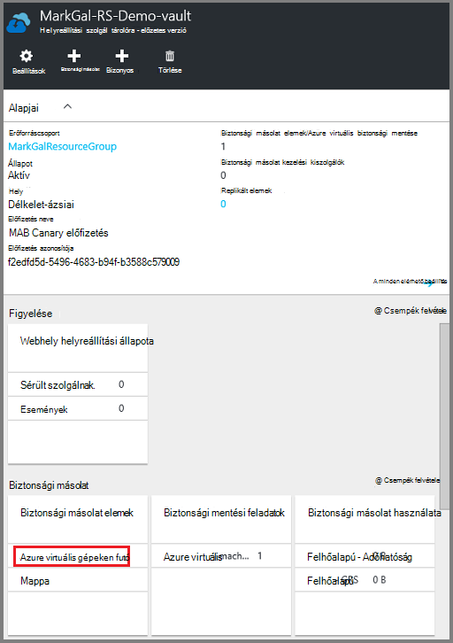
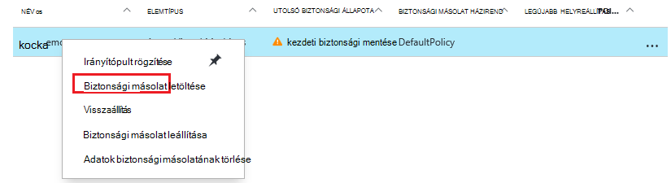
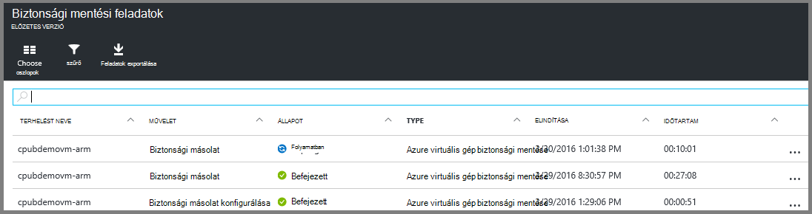

<properties
    pageTitle="Készítsen biztonsági másolatot az Azure VMs egy helyreállítási szolgáltatások tárolóból elemre kattintva |} Microsoft Azure"
    description="Fedezze fel, regisztrálni és biztonsági másolatot készíthet az Azure virtuális gépeken futó ezekkel az eljárásokkal Azure virtuális gép biztonsági másolatának a helyreállítási szolgáltatások tárolóból elemre."
    services="backup"
    documentationCenter=""
    authors="markgalioto"
    manager="cfreeman"
    editor=""
    keywords="virtuális gép biztonsági mentés; Készítsen biztonsági másolatot virtuális gép; biztonsági mentési és katasztrófa helyreállítási; ARM virtuális biztonsági mentése"/>

<tags
    ms.service="backup"
    ms.workload="storage-backup-recovery"
    ms.tgt_pltfrm="na"
    ms.devlang="na"
    ms.topic="article"
    ms.date="07/29/2016"
    ms.author="trinadhk; jimpark; markgal;"/>

# Biztonsági másolatot készíthet az Azure VMs egy helyreállítási szolgáltatások tárolóból elemre.

> [AZURE.SELECTOR]
- [Biztonsági másolatot készíthet VMs helyreállítási szolgáltatások tárolóból elemre.](backup-azure-arm-vms.md)
- [Biztonsági másolatot készíthet VMs biztonsági másolat tárolóból elemre.](backup-azure-vms.md)

Ebben a cikkben az eljárás a biztonsági mentése az Azure VMs (erőforrás-kezelő rendszerbe és klasszikus rendszerbe) egy helyreállítási szolgáltatások tárolóból elemre. A legtöbb munka VMs mentésével működésbe elkészítéséhez. Előtt készítsen biztonsági másolatot, vagy egy virtuális védelme, ki kell töltenie a [Előfeltételek](backup-azure-arm-vms-prepare.md) a védelmet a VMs környezet való előkészítéséhez. Miután elvégezte a Előfeltételek, majd kezdeményezhet a biztonsági másolat a virtuális rögzítenie művelet.

>[AZURE.NOTE] Azure van két telepítési modellekkel létrehozásáról és használatáról az erőforrások: [az erőforrás-kezelő és klasszikus](../resource-manager-deployment-model.md). Erőforrás-kezelő rendszerbe VMs és klasszikus VMs helyreállítási szolgáltatások tárolókban is védelme. Lásd: [készítsen biztonsági másolatot az Azure virtuális gépeken futó](backup-azure-vms.md) klasszikus telepítési modell VMs használata részletesen.

További információ című témakörben olvashat [Azure-ban a virtuális biztonsági infrastruktúrájára tervezési](backup-azure-vms-introduction.md) és [Azure virtuális gépeken futó](https://azure.microsoft.com/documentation/services/virtual-machines/).

## A biztonsági másolat feladatot el

A biztonsági másolat a helyreállítási szolgáltatások tárolóra társított házirend azt határozza meg, milyen gyakran és mikor fut-e a biztonsági mentés. Az első ütemezett biztonsági másolat alapértelmezés szerint ki a kezdeti biztonsági másolatot. Mindaddig, amíg a kezdeti biztonsági másolat fordul elő, kattintson a **Biztonsági másolat feladatok** lap az utolsó biztonsági állapot oszlopban a **Figyelmeztetés (függő első biztonsági)**szerint.

Kivéve, ha az első biztonsági másolatának nagyon hamarosan megkezdéséhez esedékes, **biztonsági mentése**futtatása ajánlott. Az alábbi eljárás elindítja az irányítópult tárolóból elemre. Ez az eljárás a kezdeti biztonsági mentési feladat futtatása, miután befejezte az összes vonatkozó követelmények szolgálnak. Ha a kezdeti biztonsági mentési feladat már meg lett fut, ez az eljárás nem érhető el. A kapcsolódó biztonsági házirend azt határozza meg, a következő biztonsági mentési feladat.  

A kezdeti biztonsági mentési feladat futtatása:

1. Kattintson a tárolóból elemre irányítópult, akkor a **biztonsági másolat** csempe **Azure virtuális gépeken futó**.  
    

    A **Biztonsági másolat elemek** lap megnyitása

2. A **Biztonsági mentés elemet** a lap kattintson a jobb gombbal a biztonsági másolatot szeretne tárolóból elemre, és **biztonsági másolat letöltése**parancsra.

    

    A biztonsági mentési feladat induljanak.  

    

3. **Azure virtuális gépeken futó**kattintva megtekintheti, hogy az első biztonsági befejeződött, tárolóból elemre az irányítópulton a **Biztonsági másolat feladatok** hivatkozásra.

    

    Ekkor megnyílik a biztonsági másolat feladatok lap.

4. A **biztonsági másolat feladatok** lap akkor láthatja az összes feladat állapotát.

    

    >[AZURE.NOTE] A biztonsági mentés részeként a biztonsági másolat Azure szolgáltatás hibák parancs a biztonsági másolat bővítmény a virtuális gépeken az összes írások ürítése, és egy következetes pillanatkép.

    A biztonsági mentési feladat befejezésekor, akkor az Állapot oszlop értéke *Befejezve*.

## Hibák elhárítása
Ha biztonsági mentése közben hiba lép fel a virtuális gép, olvassa el a a [virtuális hibakeresési témakört](backup-azure-vms-troubleshoot.md) segítséget.

## Következő lépések

Most, hogy a virtuális van védett, olvassa el az alábbi cikkekben további felügyeleti feladatok, akkor az a VMs, és hogyan állíthat vissza VMs kapcsolatban.

- [Kezelése és a virtuális gépeken futó figyelése](backup-azure-manage-vms.md)
- [Virtuális gépeken futó visszaállítása](backup-azure-arm-restore-vms.md)
