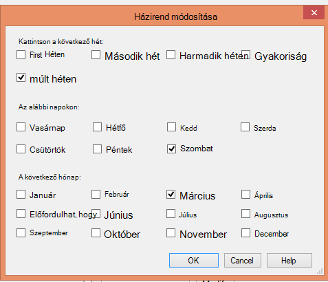

<properties
   pageTitle="Azure biztonsági másolat használata a szalag infrastruktúra cseréje |} Microsoft Azure"
   description="Megtudhatja, hogyan Azure biztonsági nyújt szalag-szerű szemantikáját, amely lehetővé teszi, hogy a biztonsági mentési és visszaállítási adatok Azure-ban"
   services="backup"
   documentationCenter=""
   authors="trinadhk"
   manager="vijayts"
   editor=""/>
<tags
   ms.service="backup"
   ms.devlang="na"
   ms.topic="article"
   ms.tgt_pltfrm="na"
   ms.workload="storage-backup-recovery"
   ms.date="09/27/2016"
   ms.author="jimpark;trinadhk;markgal"/>

# A szalag infrastruktúra helyett használhatja a Azure biztonsági mentése

Azure biztonsági mentése és a System Center adatok védelme Manager ügyfelek végezheti el:

- Készítsen biztonsági másolatot az ütemezést, amelyek a szervezeti igényeinek leginkább adatok.
- Az adatok biztonsági másolatának megőrzése hosszabb ideig
- Ellenőrizze az Azure része a hosszú távú adatmegőrzési szükséges (helyett szalagos).

Ez a cikk ismerteti, hogyan ügyfelek engedélyezheti a biztonsági mentés és az adatmegőrzési házirendek. A hosszú-távú – az adatmegőrzési címet szalagok használó felhasználók szüksége van már egy hatékony és életképes, mint az Ez a funkció elérhető a. A szolgáltatás engedélyezve van a legújabb verzióját az Azure biztonsági mentése (amely érhető el [az alábbi](http://aka.ms/azurebackup_agent)). System Center DPM ügyfelek frissítenie kell, amely legalább DPM 2012 R2 UR5 DPM használata az Azure biztonsági másolat szolgáltatással előtt.

## Mi az a biztonsági másolat ütemezés?
Az ütemezés azt jelzi, hogy a biztonsági mentés gyakoriságát. Például az alábbi képen az beállításai ezzel jelezve, hogy biztonsági másolatok vannak naponta 6 du andras@contoso.com éjfél.

Ügyfelek ütemezhető a heti biztonsági másolatot. Például az beállításait az alábbi képen a ezzel jelezve, hogy biztonsági másolatok vannak minden alternatív vasárnap és szerda a 9:30 és 1:00 de.

## Mi az az adatmegőrzési szabály?
Az adatmegőrzési Itt adhatja meg az időtartam, amelynek a biztonsági mentés kell tárolni. Csak megadása egy "sík házirendet" az összes biztonsági pont, helyett ügyfelek esetén a biztonsági mentés veszi alapul eltérő adatmegőrzési házirendek is megadhat. A biztonsági másolat pont készített naponta, működési helyreállítási pontként szolgál, például 90 napig megmarad. A naplózási célokra negyedévenként végén készített biztonsági pontot egy hosszabb időre megmarad.

A "adatmegőrzési pontok" a házirend megadott száma 90 (napi pont) + 40 (minden egy negyedév 10 éve) = 130.

## Példa – mindkettő kiépítésekor

1. **Napi adatmegőrzési**: napi készített biztonsági másolatok hét napig tárolja.
2. **Heti adatmegőrzési**: minden nap éjfél és a 18: 00 Szombat készített biztonsági másolatok megmaradnak négyhetes
3. **Havi adatmegőrzési**: 12 hónapos éjfél és 6 du az egyes hónap utolsó szombattal készített biztonsági másolatok megmaradnak
4. **Éves adatmegőrzési**: az utolsó szombat minden március éjfélét venni biztonsági másolatok megmaradnak 10 év

A "pontok adatmegőrzési" száma (ahonnan egy ügyfél vissza tudja állítani adatok pontban) a megelőző diagram kiszámítása az alábbi képlettel történik:

- két mutat, a hét napig = 14 napi helyreállítási pontok
- két négy hetek = 8 hetente pont helyreállítási pontok
- két mutat, 12 hónapos = 24 havonta helyreállítási pontok
- egy pont 10 év = 10 helyreállítási évi mutat

A helyreállítási pontok száma 56.

> [AZURE.NOTE] Azure biztonsági másolat nincs korlátozás a helyreállítási pontok száma.

## Speciális beállítások
Az előző képernyőn kattintson a **Módosítás** gombra, a felhasználóknak további rugalmasságot függő adatmegőrzési ütemtervek felülbírálását megadása kell.

## Következő lépések
Azure biztonsági mentéssel kapcsolatos további tudnivalókért lásd:

- [Azure biztonsági másolat – bevezetés](backup-introduction-to-azure-backup.md)
- [Próbálja ki az Azure biztonsági mentése](backup-try-azure-backup-in-10-mins.md)
