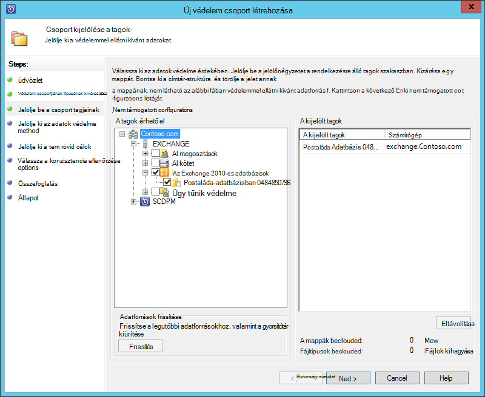
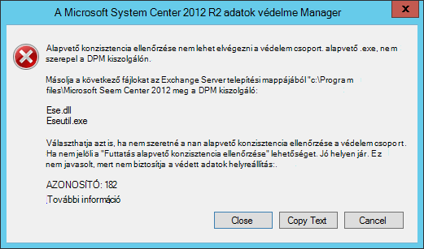
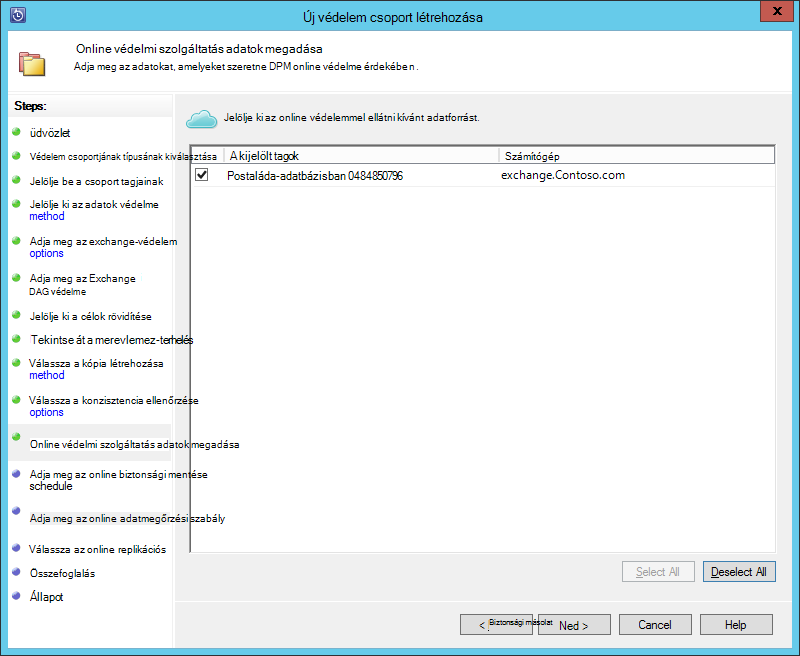
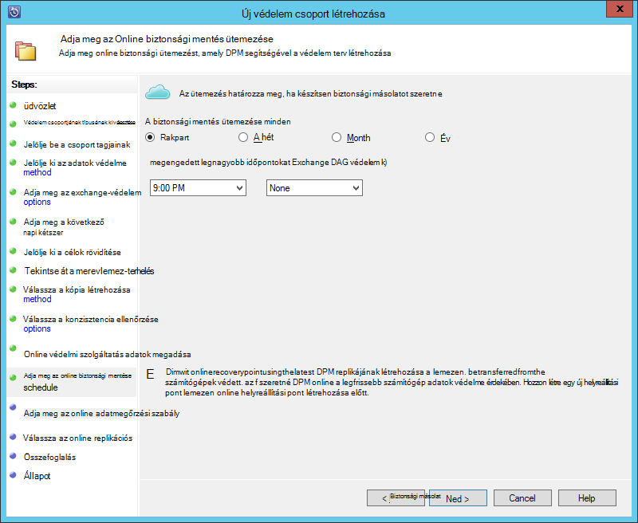
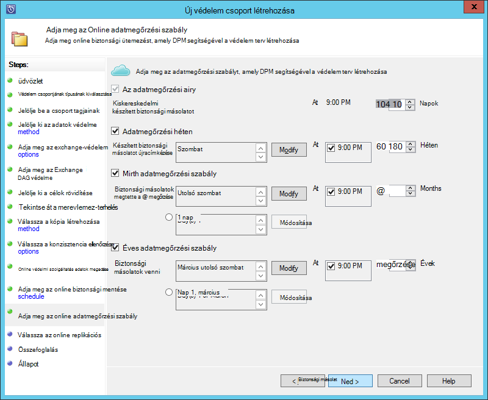
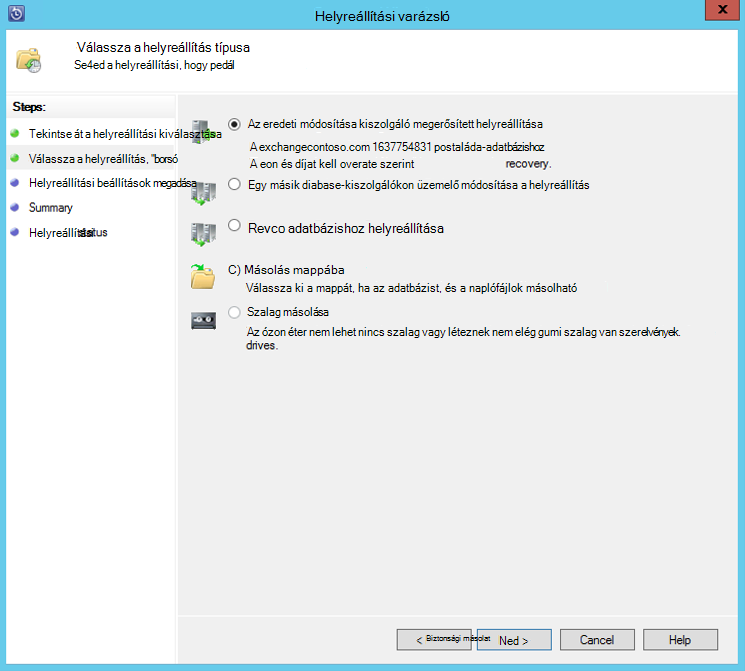

<properties
    pageTitle="Készítsen biztonsági másolatot az Exchange server Azure biztonsági másolatot készít a System Center 2012 R2 DPM |} Microsoft Azure"
    description="Megtudhatja, hogy miként biztonsági másolatot készíthet az Exchange server Azure biztonsági másolat System Center 2012 R2 DPM használatával"
    services="backup"
    documentationCenter=""
    authors="MaanasSaran"
    manager="NKolli1"
    editor=""/>

<tags
    ms.service="backup"
    ms.workload="storage-backup-recovery"
    ms.tgt_pltfrm="na"
    ms.devlang="na"
    ms.topic="article"
    ms.date="08/15/2016"
    ms.author="anuragm;jimpark;delhan;trinadhk;markgal"/>

# Biztonsági mentése az Exchange server Azure biztonsági másolatot készít a System Center 2012 R2 DPM
Ez a cikk ismerteti, hogyan kell biztonsági másolatot készíthet egy Microsoft Exchange server Azure biztonsági másolat rendszer Center 2012 R2 adatok védelme Manager (DPM) kiszolgáló konfigurálása.  

## Frissítések
Sikeresen regisztrálhatja a DPM server Azure mentéssel, telepítenie kell a legújabb kumulatív System Center 2012 R2 DPM és az Azure biztonsági másolat ügynök legújabb verzióját. A legújabb frissítőcsomag beolvasása a [Microsoft katalógus](http://catalog.update.microsoft.com/v7/site/Search.aspx?q=System%20Center%202012%20R2%20Data%20protection%20manager).

>[AZURE.NOTE] Ez a cikk példáiban az Azure biztonsági másolat ügynök 2.0.8719.0 verziója van telepítve, és frissítés frissítőcsomag 6 System Center 2012 R2 DPM van telepítve.

## Előfeltételek
A folytatás előtt győződjön meg arról, hogy teljesülnek-e a Microsoft Azure mentéssel munkaterhelésekből védelme az összes [Előfeltételek](backup-azure-dpm-introduction.md#prerequisites) . Az Előfeltételek közé tartoznak az alábbiak:

- A biztonsági másolat tárolóból elemre az Azure webhelyen létrehozva.
- Ügynök és tárolóból elemre a hitelesítő adatok letöltött DPM kiszolgálóra.
- A ügynök telepítve van a DPM kiszolgálón.
- A tárolóból elemre hitelesítő adatok DPM kiszolgáló regisztrálása használták.
- Ha Exchange-2016 védelmén frissítse-e DPM 2012 R2 UR9 vagy újabb

## DPM védelem agent  
Az Exchange-kiszolgálón a DPM védelem ügynök telepítéséhez kövesse az alábbi lépéseket:

1. Győződjön meg arról, hogy a tűzfalak helyesen vannak-e beállítva. Lásd: [az ügynök konfigurálása tűzfal kivételek](https://technet.microsoft.com/library/Hh758204.aspx).

2. Az Exchange-kiszolgáló gombra kattintva a agent telepítése **kezelés > ügynökök > telepítése** DPM felügyeleti konzolban. A lépések részletes leírását [a DPM védelem agent telepítése](https://technet.microsoft.com/library/hh758186.aspx?f=255&MSPPError=-2147217396) című témakörben tájékozódhat.

## Az Exchange server-védelem csoport létrehozása

1. A DPM felügyeleti konzolban kattintson a **Dokumentumvédelem**gombra, és majd az **Új** gombra kattintva nyissa meg az **Új védelem csoport létrehozása** varázsló eszköz menüszalagon.

2. **Üdvözli** a varázsló képernyőjén kattintson a **Tovább**gombra.

3. A **védelem csoportjának típusának kiválasztása** képernyőn jelölje ki a **kiszolgálók** , és kattintson a **Tovább**gombra.

4. Jelölje ki az Exchange server-adatbázishoz, amelyet védeni, és kattintson a **Tovább**gombra.

    >[AZURE.NOTE] Ha az Exchange 2013 védelmén jelölje be az [Exchange 2013 Előfeltételek](https://technet.microsoft.com/library/dn751029.aspx).

    A következő példában az Exchange 2010-es adatbázis be van jelölve.

    

5. Válassza ki az adatok védelme.

    Nevezze el a védelmet csoportot, és válassza a mind az alábbi lehetőségek közül:

    - Rövid érvényességi idejű védelem lemezzel szeretném.
    - Szeretném online védelmi szolgáltatás.

6. Kattintson a **Tovább**gombra.

7. A beállítással a **Futtatása Eseutil adatintegritás ellenőrzése** , ha meg szeretné tekinteni az Exchange Server-adatbázisok integritását.

    Miután kiválasztotta a ezt a beállítást, a biztonsági konzisztencia ellenőrzése a DPM kiszolgálón futó **parancsot** az Exchange-kiszolgáló által generált I/O forgalmat elkerülése érdekében fog futni.

    >[AZURE.NOTE]Használja ezt a beállítást, a Ese.dll és Eseutil.exe fájlokat kell másolnia DPM kiszolgálón C:\Program Files\Microsoft System Center 2012 R2\DPM\DPM\bin könyvtár. Egyéb esetben a következő hiba induljanak:  
    

8. Kattintson a **Tovább**gombra.

9. Jelölje ki az adatbázist a **Másolat**, és kattintson a **Tovább**gombra.

    >[AZURE.NOTE] Ha nem jelöli ki a "Teljes biztonsági másolat" az adatbázis másolata legalább egy DAG, naplók nem csonkolja.

10. Állítsa be a kitűzött célok **rövid érvényességi idejű**biztonsági másolatának, és kattintson a **Tovább gombra**.

11. Tekintse át a szabad lemezterület, és kattintson a **Tovább**gombra.

12. Válassza ki az időtartamot, amelynél a DPM kiszolgáló létrehozása a kezdeti replikáció, és kattintson a **Tovább gombra**.

13. Válassza ki a konzisztencia ellenőrzése beállításokat, és kattintson a **Tovább gombra**.

14. Válassza az Azure biztonsági másolatot készíteni kívánt adatbázist, és kattintson a **Tovább**gombra. Példa:

    

15. Az ütemezés **Azure**biztonsági másolat megadása, és kattintson a **Tovább gombra**. Példa:

    

    >[AZURE.NOTE] Megjegyzés: az Online helyreállítási pontok express alapuló helyreállítási pontok teljes. Az online helyreállítási pont emiatt a sürgős teljes megadott idő helyreállítási pont után kell ütemezése.

16. Az adatmegőrzési konfigurálása az **Azure biztonsági másolatot**, és kattintson a **Tovább gombra**.

17. Válasszon egy online replikációs lehetőséget, és kattintson a **Tovább**gombra.

    Ha nagy adatbázist, a hálózaton keresztül hozható létre a kezdeti mentés túl hosszú ideig is eltelhet. Ez a probléma elkerülése érdekében az offline biztonsági másolatot hozhat létre.  

    

18. Erősítse meg a beállításokat, és kattintson a **Csoport létrehozása**gombra.

19. Kattintson a **Bezárás**gombra.

## Az Exchange-adatbázis helyreállítása

1. Az Exchange-adatbázis visszaállításához kattintson a **helyreállítás** DPM felügyeleti konzolban.

2. Keresse meg az Exchange-adatbázist, amely a helyreállítani kívánt.

3. A *helyreállítási idő* legördülő listából válassza ki a egy online helyreállítási pontra.

4. Kattintson a **helyreállítása** a **Helyreállítási varázsló**elindításához.

Az online helyreállítási pontok ötféle helyreállítás:

- **Eredeti Exchange Server-helyre helyreállítása:** Az adatok az eredeti Exchange-kiszolgáló visszakerül.
- **Exchange-kiszolgálón egy másik adatbázist a helyreállítás:** Az adatok egy másik adatbázis más Exchange-kiszolgálón visszakerül.
- **Helyreállítása helyreállítási adatbázishoz:** Az adatok hasznosítani kell egy Exchange helyreállítási adatbázis (Rekordadatbázis).
- **Hálózati mappába másolás:** Az adatok hasznosítani kell hálózati mappába.
- **Szalag másolás:** Ha szalagos tár vagy különálló szalagos eszközzel melléklete és DPM kiszolgálóján konfigurált a helyreállítási pont átmásolni egy ingyenes szalag.

    

## Következő lépések

- [Azure biztonsági – gyakori kérdések](backup-azure-backup-faq.md)
