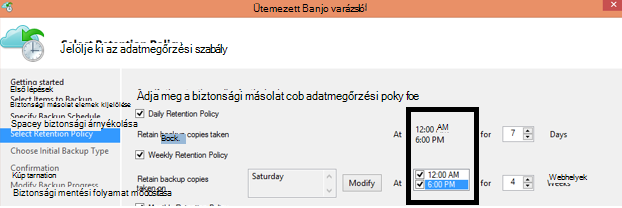

<properties
   pageTitle="Azure biztonsági gyakran ismételt kérdések |} Microsoft Azure"
   description="Gyakori kérdések a biztonsági szolgáltatás, biztonsági ügynök, biztonsági mentése és az adatmegőrzési helyreállítási, biztonsági és egyéb biztonsági mentése és katasztrófa helyreállítási gyakori kérdésekre adott válaszok."
   services="backup"
   documentationCenter=""
   authors="markgalioto"
   manager="jwhit"
   editor=""
   keywords="biztonsági mentési és katasztrófa helyreállítási; biztonsági másolat szolgáltatás"/>

<tags
   ms.service="backup"
   ms.workload="storage-backup-recovery"
     ms.tgt_pltfrm="na"
     ms.devlang="na"
     ms.topic="get-started-article"
     ms.date="10/21/2016"
     ms.author="trinadhk; giridham; arunak; markgal; jimpark;"/>

# <a name="azure-backup-service--faq"></a>Azure biztonsági másolat szolgáltatás – gyakori kérdések


Ez a cikk az Azure biztonsági másolat szolgáltatás az gyakran ismételt kérdések (és a megfelelő választ) listája. A közösségi gyorsan, a válaszüzenetet hozzá, és ha kérdés gyakran kéri, hogy ez a cikk. Kérdésekre adott válaszok általában adja meg a hivatkozást, vagy a támogatási információt. A kérdéseket Azure névjegy Ez a cikk vagy egy kapcsolódó témakör Disqus szakaszában. Az Azure biztonsági másolat szolgáltatás kapcsolatos kérdések [vitafórum](https://social.msdn.microsoft.com/forums/azure/home?forum=windowsazureonlinebackup)is küldhet.


## <a name="what-is-the-list-of-supported-operating-systems-from-which-i-can-back-up-to-azure-using-azure-backup-br"></a>Mi az a lista, amelyből lehet készíthet biztonsági másolatot az Azure Azure biztonsági másolat használata támogatott operációs rendszerek? <br/>
Azure biztonsági másolat a fájl-mappa biztonsági másolat készül, a biztonsági másolat Server Azure és SCDPM alkalmazás biztonsági mentése operációs rendszerek, az alábbi lista támogatja.

| Operációs rendszer        | Platform           | RAKTÁRI SZÁM  |
| :------------- |-------------| :-----|
| Windows 8 és a legújabb SPs      | 64 bites | Vállalati, Pro |
| Windows 7 és a legújabb SPs      | 64 bites | Végső, vállalati, Professional és otthoni prémium verzió, otthoni alapszintű hitelesítés, alapszintű |
| Windows 8.1 és a legújabb SPs | 64 bites      |    Vállalati, Pro |
| Windows 10-ben      | 64 bites | Vállalati, Pro otthoni |
|A Windows Server 2012 R2 és legújabb SPs| 64 bites| Szabványos, adatközpont, Foundation|
|Windows Server 2012-ben és a legújabb SPs|    64 bites| Adatközpont, Foundation, normál|
|Windows tároló Server 2012 R2 és legújabb SPs  |64 bites|    Szabványos, munkacsoport|
|Windows tároló Server 2012-ben és a legújabb SPs |64 bites |Szabványos, munkacsoport
|A Windows Server 2012 R2 és legújabb SPs  |64 bites|    Alapvető|
|A Windows Server 2008 R2 SP1 |64 bites|    Normál, a nagyvállalati, adatközpont, Foundation|
|A Windows Server 2008 SP2    |64 bites|    Normál, a nagyvállalati, adatközpont, Foundation|

Azure virtuális biztonsági másolat készül,

- **Linux**: Azure biztonsági másolat támogatja a [listája, amely a Azure záradékkal felosztott](../virtual-machines/virtual-machines-linux-endorsed-distros.md) Core OS Linux kivételével.  Más Előrehozás-a-Öné-Linux terjesztését is működnek mindaddig, amíg a virtuális agent érhető el a virtuális gépen és Python létezik támogatása.
- **A Windows Server**: Windows Server 2008 R2-nél korábbi verzióiban nem támogatott.

## <a name="where-can-i-download-the-latest-azure-backup-agent-br"></a>Hol tölthetem le a Azure biztonsági másolat agent legújabb verzióját? <br/>
A Windows Server, a rendszer központ DPM vagy a Windows-ügyfél, az [alábbi](http://aka.ms/azurebackup_agent)mentésével agent legújabb töltheti le. Ha egy virtuális számítógépre mentéséről, használja a virtuális ügynök (amely automatikusan telepíti a megfelelő bővítmény). A virtuális Agent már szerepel a virtuális gépeken futó létrehozása az Azure gyűjteményből.

## <a name="which-version-of-scdpm-server-is-supported-br"></a>Melyik SCDPM kiszolgáló verziója támogatott? <br/>
Javasoljuk, hogy a [legújabb](http://aka.ms/azurebackup_agent) Azure Backup ügynök telepítése SCDPM legújabb kumulatív (augusztus 2016 kezdve UR11)

## <a name="when-configuring-the-azure-backup-agent-i-am-prompted-to-enter-the-vault-credentials-do-vault-credentials-expire"></a>Az Azure biztonsági másolat ügynök konfigurálásakor kérdez adja meg a hitelesítő adatok tárolóból elemre. Lejárjon tárolóra hitelesítő adatok?
Igen, a tárolóból elemre hitelesítő adatok 48 óra elteltével lejár. Ha lejár a fájlt, jelentkezzen be az Azure-portálra, és töltse le a tárolóból elemre hitelesítő adatok fájlokat a tárolóból elemre.

## <a name="is-there-any-limit-on-the-number-of-vaults-that-can-be-created-in-each-azure-subscription-br"></a>Minden egyes Azure előfizetés létrehozott tárolókban számú korlátozva van? <br/>
igen. Kezdve szeptember 2016 25 biztonsági tárolókban előfizetésenként hozhat létre. Importálhat egy támogatott területenként Azure biztonsági másolat előfizetésenként 25 helyreállítási szolgáltatások tárolókban hozhat létre. Ha további tárolókban, hozzon létre egy új előfizetést.

## <a name="are-there-any-limits-on-the-number-of-serversmachines-that-can-be-registered-against-each-vault-br"></a>Van bármilyen számával a kiszolgálók/gépek, amely az egyes tárolóra ellen lehet regisztrálni? <br/>
Igen, akkor rögzítheti legfeljebb 50 gépek per tárolóból elemre. Azure IaaS virtuális gépeken futó korlát 200 VMs per tárolóból elemre. Ha további gépek regisztrálnia kell hozzon létre egy új tárolóból elemre.

## <a name="how-do-i-register-my-server-to-another-datacenterbr"></a>Hogyan végezze el a másik adatközponthoz kiszolgálója regisztrálni?<br/>
Adatok biztonsági másolatának a rendszer elküldi a tárolóból elemre, amelyhez regisztrált az az Adatközpont. Az az Adatközpont módosítása legegyszerűbben távolítsa el a agent, és telepítse újra az ügynök, valamint egy új tárolóból elemre, amely a kívánt adatközponthoz tevékenységének regisztrálni.

## <a name="what-happens-if-i-rename-a-windows-server-that-is-backing-up-data-to-azurebr"></a>Mi történik, ha átnevezem a Windows server Azure biztonsági másolat?<br/>
Ha átnevez egy kiszolgálón, az összes jelenleg beállított biztonsági másolatok vannak leállt.
Regisztrálnia kell az új nevet a kiszolgáló és a biztonsági másolat tárolóból elemre. Amikor létrehoz egy új bejegyzés, az első biztonsági művelet a teljes biztonsági másolatot, de nem növekményes biztonsági másolatot. Ha kell, amely a korábban mentett a tárolóból elemre a régi kiszolgáló neve adatok helyreállítása, visszaállíthatja az adatokat, a [**kiszolgáló egy másik**](backup-azure-restore-windows-server.md#recover-to-an-alternate-machine) beállítás használata az **Adatok helyreállítása** varázsló.

## <a name="what-types-of-drives-can-i-backup-files-and-folders-from-br"></a>Milyen típusú meghajtók is lehet biztonsági másolatot készíteni fájlokat és mappákat? <br/>
A következő készlete meghajtók/kötet nem tudják elérni az biztonsági:

- Cserélhető adathordozón: A meghajtó kell jelentése az lesz a rögzített használt forrás biztonsági elemet.
- Csak olvasható kötet: A mennyiségi írható a mennyiségi árnyék másolás szolgáltatás (VSS) függvénynek kell lennie.
- Kapcsolat nélküli kötet: A mennyiségi be kell jelentkezniük VSS függvénynek.
- Olyan hálózati megosztást: A hangerőt a kiszolgáló mentésben online biztonsági mentéssel helyi kell lennie.
- A védett kötet BitLocker: A mennyiségi nem zárolt kell, mielőtt a biztonsági mentés akkor fordulhat elő.
- : Fájl rendszer NTFS az azonosító Fájlrendszer kizárólagos az online biztonsági szolgáltatás ezen verziója támogatott.

## <a name="what-file-and-folder-types-can-i-back-up-from-my-serverbr"></a>Milyen fájlokat és mappákat is lehet biztonsági másolatot készíteni a kiszolgálóról?<br/>
A következő típusú támogatottak:

- Titkosított
- Tömörített
- A ritka
- Tömörített + ritka
- Rögzített hivatkozások: Nem támogatott, kihagyott
- Újraelemzési pont: Nem támogatott, kihagyott
- Titkosított + tömörített: Nem támogatott, kihagyott
- Titkosított + ritka: Nem támogatott, kihagyott
- Tömörített adatfolyam: Nem támogatott, kihagyott
- Ritka adatfolyam: Nem támogatott, kihagyott

## <a name="whats-the-minimum-size-requirement-for-the-cache-folder-br"></a>Mi az a minimális méret követelmény a gyorsítótár mappa? <br/>
A mappa méretét, a gyorsítótár biztonsági másolatot a adatmennyiség határozza meg. A gyorsítótárának mappáját a szükséges adatokat tároló terület 5 %-át kell lennie.

## <a name="if-my-organization-has-one-vault-how-can-i-isolate-one-servers-data-from-another-server-when-restoring-databr"></a>Ha a szervezetnek egy tárolóból elemre, hogyan lehet szétválaszthatja egy kiszolgáló adatokat másik kiszolgálóról adatok helyreállításakor?<br/>
Összes kiszolgálón a regisztrált a azonos tárolóból elemre kattintva visszaállíthatja az adatokat, készít biztonsági másolatot *ugyanazt a hozzáférési kódot használó*kiszolgálók-. Ha kiszolgálók, amelynek a szervezet más kiszolgálókról elkülöníteni kívánt adatok biztonsági másolatának, azokat a kiszolgálókat használata egy kijelölt jelszót. Emberi erőforrások kiszolgálók például kihasználva a titkosítási egy jelszót, könyvelési kiszolgálók között, és tároló kiszolgáló egy harmadik.

## <a name="can-i-migrate-my-backup-data-or-vault-between-subscriptions-br"></a>Lehet "áttelepítheti" a biztonságimásolat-adatok vagy a tárolóból elemre előfizetés között? <br/>
nem. A tárolóból elemre egy előfizetés szintjén létrejött, és nem a már létrehozott egy másik előfizetés rendelve.

## <a name="does-the-azure-backup-agent-work-on-a-server-that-uses-windows-server-2012-deduplication-br"></a>A Windows Server 2012 deduplication használó kiszolgálón működik az Azure biztonsági másolat ügynök? <br/>
igen. Előkészíti a biztonsági mentés esetén a ügynök szolgáltatás a deduplicated adatokat normál adatok alakítja át. Majd optimalizálja a az adatok biztonsági másolatának, titkosítja az adatokat, és kattintson a titkosított adatokat küld a az online biztonsági szolgáltatás.

## <a name="if-i-cancel-a-backup-job-once-it-has-started-is-the-transferred-backup-data-deleted-br"></a>Biztonsági mentési feladat Miután elindult, lemondásakor az átvitt adatok biztonsági másolatának törlődik? <br/>
nem. A biztonsági másolat tárolóból elemre volna átadott a lemondási pontig mentett adatokat tárolja. Azure biztonsági másolat használja egy ellenőrzés mechanizmusa alkalmanként hozzáadása pontjainak az adatok biztonsági másolatának a biztonsági másolatok készítése során. Pontjainak is szerepelnek a biztonságimásolat-adatok, mert a következő biztonsági mentés ellenőrizheti a fájlok integritását. Volt már a biztonsági mentésben korábban adatok felett a következő biztonsági mentés indított lenne egyre növekvő tendenciát mutat. Növekményes biztonsági másolat biztosít a sávszélesség, jobban hasznosítása, hogy nem kell többször átviheti a ugyanazokat az adatokat.

Azure virtuális mentés esetén a feladat megszakad, átvitt adatok figyelmen kívül hagyja, és a friss biztonsági másolat növekményes adatátviteli a korábban sikeres biztonsági mentési feladat.

## <a name="why-am-i-seeing-the-warning-azure-backups-have-not-been-configured-for-this-server-even-though-i-had-scheduled-regular-backups-previously-br"></a>Miért jelenik meg a "Azure biztonsági másolatok nincs konfigurálva kiszolgáló" figyelmeztetés akkor is, ha volt ütemeztem rendszeres biztonsági mentés korábban? <br/>
Ez a figyelmeztetés fordul elő, ha a ütemezett biztonsági mentés beállításait a helyi kiszolgálón tárolt nem ugyanaz, mint a beállításokat a biztonsági másolat tárolóból elemre. A kiszolgáló vagy a beállítások vannak lett helyreállított ismert jó állapotát, ha a biztonsági másolat ütemezések szinkronizálási elveszhet. Ha a figyelmeztetés, [a biztonsági másolat házirend átkonfigurálása](backup-azure-manage-windows-server.md) , majd **Futtatása azonnali biztonsági mentése elemre** a helyi server Azure szinkronizálnia jelenik meg.

## <a name="what-firewall-rules-should-be-configured-for-azure-backup-br"></a>Milyen szabályok Azure biztonsági másolatának kell konfigurálni tűzfal? <br/>
A-telepítésű-a-Azure és terhelést-Azure adatok folytonos védelmét ajánlott, hogy engedélyezte-e a tűzfal használatával kommunikál a következő URL-címeket:

- www.msftncsi.com
- \*. Microsoft.com
- \*. WindowsAzure.com
- \*. microsoftonline.com
- \*. windows.net

##<a name="can-i-install-the-azure-backup-agent-on-an-azure-vm-already-backed-by-the-azure-backup-service-using-the-vm-extension-br"></a>Telepíthetem az Azure biztonsági másolat ügynök egy virtuális kiterjesztése Azure biztonsági másolat szolgáltatás már biztonsági Azure virtuális? <br/>
Teljes mértékben. Azure biztonsági másolat nyújt a virtuális szintű biztonsági másolat Azure VMs virtuális bővítményében. A vendégként való bekapcsolódáshoz Windows operációs rendszer fájlokat és mappákat, hogy a vendégként való bekapcsolódáshoz OS védelme az Azure biztonsági másolat ügynök telepíthető.

## <a name="can-i-install-the-azure-backup-agent-on-an-azure-vm-to-back-up-files-and-folders-present-on-temporary-storage-provided-by-the-azure-vm-br"></a>Telepíthetem az Azure biztonsági másolat ügynök biztonsági mentése a fájlok és mappák jelen a Azure virtuális által biztosított ideiglenes tárterület-Azure virtuális? <br/>
Az Azure biztonsági másolat ügynök telepítése a vendégként való bekapcsolódáshoz Windows operációs rendszer, vagy kevésbé részletes átmeneti tárolásra fájlok és mappák. Azonban Felhívjuk a figyelmét arra, hogy a biztonsági másolatok sikertelen ideiglenes tárolási adatok teljes mértékben törlődnek Miután. Is ha az ideiglenes tárolási adatok törölve lett, csak akkor állíthat vissza nem ideiglenes tárolóhoz.

## <a name="i-have-installed-azure-backup-agent-to-protect-my-files-and-folders-can-i-now-install-scdpm-to-work-with-azure-backup-agent-to-protect-on-premises-applicationvm-workloads-to-azure-br"></a>Azure Backup ügynök védelme érdekében a fájlok és mappák van telepítése. Most már telepíthető SCDPM készült Azure Backup ügynök helyszíni alkalmazás/virtuális feladatok Azure védelmét? <br/>
Azure biztonsági másolat használata SCDPM, tanácsos telepítse SCDPM először és csak, majd telepítse az Azure Backup ügynök. Zökkenőmentes integráció az Azure biztonsági másolat ügynök SCDPM a biztosítja, és a program lehetővé teszi a fájlok és mappák, az alkalmazás-munkaterhelésekből és a VMs védheti Azure, hogy közvetlenül a SCDPM kezelése konzolról. SCDPM telepítése Azure biztonsági másolat telepítése után ügynök céljából az imént említett lekérdezéstípusokról, nem javasoljuk vagy támogatott.

## <a name="what-is-the-length-of-file-path-that-can-be-specified-as-part-of-azure-backup-policy-using-azure-backup-agent-br"></a>Mi az Azure biztonságimásolat-ügynök használatával Azure biztonsági másolat házirend részeként megadott fájl elérési útja hossza? <br/>  
Azure biztonsági másolatot ügynök NTFS támaszkodik. A [Windows API korlátozza a fájl elérési útja hosszúság megadása](https://msdn.microsoft.com/library/aa365247.aspx#fully_qualified_vs._relative_paths). Abban az esetben biztonsági másolatot a fájl elérési útja hosszú nagyobb, mint a Windows API által megadott lehetőségekből fájlokat, a vevők biztonsági másolatot készíteni a szülő mappából, vagy a lemezmeghajtó biztonsági másolat adhatja meg.  

## <a name="what-characters-are-allowed-in-file-path-of-azure-backup-policy-using-azure-backup-agent-br"></a>A fájl elérési útja Azure biztonságimásolat-ügynök használatával Azure biztonsági másolat házirend használható karakterek? <br>  
 Azure biztonsági másolatot ügynök NTFS támaszkodik. A fájl specifikációja részeként [NTFS támogatott karakterek](https://msdn.microsoft.com/library/aa365247.aspx#naming_conventions) lehetővé teszi.  

## <a name="can-i-use-azure-backup-server-to-create-a-bare-metal-recovery-bmr-backup-for-a-physical-server-br"></a>Biztonsági másolat Server Azure segítségével bA készült helyreállítási (BMR) biztonsági másolatot készít a fizikai kiszolgáló? <br/>
igen.

## <a name="can-i-configure-the-backup-service-to-send-mail-if-a-backup-job-fails-br"></a>Állítható be a biztonsági másolat szolgáltatás küldenek levelet, ha nem sikerül egy olyan biztonsági mentési feladat? <br/>
Igen, a biztonsági másolat szolgáltatás rendelkezik több esemény értesítések egy PowerShell-parancsprogramot használható. Teljes körű leírását lásd: az [értesítések](backup-azure-manage-vms.md#alert-notifications)

## <a name="is-there-a-limit-on-the-size-of-each-data-source-being-backed-up-br"></a>Van korlátozás minden adatforráshoz másolat készül mérete? <br/>
Tárolóra szintjén nem készítsen biztonsági másolatot adatok mennyiségét a nincs korlátozás, miközben Azure biztonsági ír elő egy korlátozás (az összes gyakorlati céljából, ezek a korlátok azok nagyon magas) a maximális mérete az adatforráshoz. Augusztus 2015, kezdve az maximális mérete adatforráshoz a támogatott operációs rendszerek van:

|S.No | Operációs rendszer |  Adatforrás maximális mérete |
| :-------------: |:-------------| :-----|
|1| A Windows Server 2012 vagy újabb| 54400 GB|
|2| Windows 8 vagy újabb| 54400 GB|
|3| A Windows Server 2008, Windows Server 2008 R2 rendszerben | 1 700 GB|
|4| Windows 7 rendszerben | 1 700 GB|

Az alábbi táblázat ismerteti, hogyan minden adat forrás mérete határozza meg.

|   Adatforrás  |   Részletek |
| :-------------: |:-------------|
|Mennyiségi |A kiszolgáló vagy ügyfél gép egyetlen mennyiségi mentésben adatok mennyiségét|
|A Hyper-V virtuális gépen | A virtuális gép biztonsági másolatot készít az összes VHD adatainak összege|
|A Microsoft SQL Server-adatbázishoz | SQL-adatbázis egyetlen mérete másolat készül mérete |
|Microsoft SharePoint |A tartalom- és konfigurációs adatbázisok belül egy SharePoint-farm biztonsági másolatot készít összege|
|Microsoft Exchange |Az Exchange-kiszolgáló biztonsági másolatot készít az összes Exchange-adatbázisok összege|
|BMR vagy a rendszer állapota |Minden egyes példányát a gép másolat készül BMR vagy a rendszer állapota|

## <a name="are-there-limits-on-the-number-of-times-a-backup-job-can-be-scheduled-per-daybr"></a>Vannak olyan korlátozások a hányszor egy biztonsági mentési feladat ütemezhető legyen a napi?<br/>
Igen, futtathatja biztonsági feladatok a Windows Server vagy Windows-ügyfél akár háromszor / nap. Biztonsági mentési feladatok napi kétszeri felfelé System Center DPM futtathatja. Futtathatja a biztonsági mentési feladat-IaaS VMs egyszer.

## <a name="is-there-a-difference-between-the-scheduling-policy-for-dpm-and-windows-server-ie-on-windows-server-without-dpm-br"></a>Van-e egy DPM az ütemezési házirendjének és a Windows Server (azaz a Windows Server nélkül DPM) közötti különbség? <br/>
igen. DPM használ, napi, heti, havi vagy éves ütemezést is megadhat. A Windows Server (nélkül DPM) csak a napi és heti ütemezések megadását teszi lehetővé.

## <a name="is-there-a-difference-between-the-retention-policy-for-dpm-and-windows-serverclient-ie-on-windows-server-without-dpmbr"></a>Van-e az adatmegőrzési DPM és a Windows Server/ügyfél (azaz a Windows Server nélkül DPM) közötti különbség?<br/>
Nem, mind a DPM, és a Windows Server-ügyfél van naponta, hetente, havonta és éves adatmegőrzési házirendek.

## <a name="can-i-configure-my-retention-policies-selectively--ie-configure-weekly-and-daily-but-not-yearly-and-monthlybr"></a>Az adatmegőrzési házirendek szelektív – azaz konfigurálása heti és a napi, de nem évente és havi lehet beállítani?<br/>
Igen, az Azure biztonsági másolat adatmegőrzési struktúra lehetővé teszi, hogy a teljes rugalmasság definiáló igényei szerint az adatmegőrzési szabályt.

## <a name="can-i-schedule-a-backup-at-6pm-and-specify-retention-policies-at-a-different-timebr"></a>"A biztonsági mentés ütemezése" a 18: 00 és adja meg a "adatmegőrzési házirendek" különböző egyszerre?<br/>
nem. Adatmegőrzési házirendek csak akkor alkalmazható, a biztonsági másolat pontok. Az alábbi képen az adatmegőrzési 12 óra és a 18: 00 készített biztonsági másolatok van megadva. <br/>


<br/>

## <a name="is-an-incremental-copy-transferred-for-the-retention-policies-scheduled-br"></a>Az adatmegőrzési házirendek ütemezett egy növekményes másolatot átvitele <br/>
Nem, a növekményes másolatot megfelelően küldi el a biztonsági másolat ütemezés lapon említett időben. A címzett pontok, amely akkor is megmaradnak az adatmegőrzési szabály alapján határozza meg.

## <a name="if-a-backup-is-retained-for-a-long-duration-does-it-take-more-time-to-recover-an-older-data-point-br"></a>Ha egy hosszú időtartam biztonsági tárolja, tart egy régebbi adatpont helyreállítása több időt? <br/>
 Nem – az időpontot állíthatja helyre a legrégebbi vagy legújabb pont megegyezik. Minden egyes helyreállítási pont úgy viselkednek, mint egy teljes pontra.

## <a name="if-each-recovery-point-is-like-a-full-point-does-it-impact-the-total-billable-backup-storagebr"></a>Ha például egy teljes pont minden helyreállítási pont, akkor hatással számlázható biztonsági tárterületkorlátot?<br/>
Tipikus hosszú távú adatmegőrzési pont termékek biztonsági adattárolásra teljes pontként. A teljes pontok tároló *hatékony* , de könnyebben és gyorsabban visszaállítása. Növekményes másolatok tároló *hatékony* , de melyekhez fel kell az adatokat, amelyeket a helyreállítási idő hatással van a lánc visszaállítása. Azure biztonsági másolat tároló architektúra ad mindkét a világon a legjobb optimálisan gyors visszaállítása adatainak tárolására és alacsony tárolási költségek hozni. Tárterület eljárás biztosíthatja, hogy a be- és kilépési sávszélesség hatékonyan használják. Az adatok helyreállítása szükséges időt és a adattárolás összegét legkisebb legyen. Megtudhatja, hogy hogyan [növekményes biztonsági](https://azure.microsoft.com/blog/microsoft-azure-backup-save-on-long-term-storage/) mentése bővebben hatékony.

## <a name="is-there-a-limit-on-the-number-of-recovery-points-that-can-be-createdbr"></a>Van-e a létrehozható helyreállítási pontok száma korlátozott?<br/>
nem. Azt még nem szüntette helyreállítási pontok vonatkozó korlátok. Annyi helyreállítási pontok sorolható fel hozhat létre.

## <a name="why-is-the-amount-of-data-transferred-in-backup-not-equal-to-the-amount-of-data-i-backed-upbr"></a>Miért van az átvitt adatok mennyisége biztonságimásolat-e a biztonsági mentésben adatok mennyiségét nem egyenlő?<br/>
 Az adatok Azure biztonsági másolatot ügynök vagy SCDPM, illetve biztonsági másolat Server Azure, biztonsági másolatot tömörítve, és a továbbított előtt titkosított. Miután alkalmazza a tömörítési és titkosítás, a biztonsági másolat tárolóra adatai 30-40 %-kal kisebb.

## <a name="is-there-a-way-to-adjust-the-amount-of-bandwidth-used-by-the-backup-servicebr"></a>Van-e lehetőség a biztonsági másolat szolgáltatás által használt sávszélességet beállításához?<br/>
 Igen, a biztonsági másolat Agent a **Tulajdonságainak módosítása** lehetőség használatával módosíthatja a sávszélesség. Állítsa be a sávszélesség és az időpontokat a sávszélesség használatakor összege. További információt a [Hálózat szabályozásának](../backup-configure-vault.md#enable-network-throttling), talál.

## <a name="my-internet-bandwidth-is-limited-for-the-amount-of-data-i-need-to-back-up-is-there-a-way-i-can-move-data-to-a-certain-location-with-a-large-network-pipe-and-push-that-data-into-azure-br"></a>Az internet-sávszélesség az ennyi kell kevésbé részletes adatok korlátozott. Van-e olyan módon, egy bizonyos helyre egy nagy hálózati adatok pipe, és a leküldéses adatokat az Azure lehet váltani? <br/>
Biztonsági másolatot készíthet adatok Azure be a szabványos online biztonsági mentés keresztül, vagy az importálás/exportálás Azure szolgáltatás segítségével átviheti a tárhely a Azure blob-adatokat. Biztonsági másolat dátum első Azure tárolóba nincs további módja létezik. Az importálás/exportálás Azure szolgáltatás használatát Azure mentéssel tudnivalókért olvassa el a [kapcsolat nélküli biztonsági másolat munkafolyamat](backup-azure-backup-import-export.md) cikkünket.

## <a name="how-many-recoveries-can-i-perform-on-the-data-that-is-backed-up-to-azurebr"></a>Hány helyreállítása birtokában elvégezhetnek a biztonsági másolat Azure adatokat?<br/>
Nincs korlát Azure biztonsági másolatból helyreállítása számú nem.

## <a name="do-i-have-to-pay-for-the-egress-traffic-from-azure-data-center-during-recoveriesbr"></a>Van helyreállítása során az Azure adatközpont kilépési forgalmához fizetés?<br/>
 nem. A helyreállítása ingyenes, és nem kell fizetnie a kilépési forgalmat.

## <a name="is-the-data-sent-to-azure-encrypted-br"></a>Az adatok titkosított Azure küldeni? <br/>
igen. Adatok titkosított a helyszíni server/ügyfél/SCDPM gépen AES256 használ, és az adatokat küldi a biztonságos HTTPS-kapcsolaton keresztül.

## <a name="is-the-backup-data-on-azure-encrypted-as-wellbr"></a>Az adatok biztonsági másolatának az Azure titkosított, valamint a?<br/>
 igen. Az Azure küldött adatok megmaradnak titkosított (a többi). A Microsoft nem visszafejteni az adatok biztonsági másolatának bármely pontján. Azure virtuális biztonsági másolat készül Azure biztonsági támaszkodik a virtuális gép titkosítási tehát ha a virtuális titkosított Azure lemezen titkosítási vagy néhány titkosítási technológiára, Azure biztonsági titkosítással, hogy az adatok biztonságos.

## <a name="what-is-the-minimum-length-of-encryption-key-used-to-encrypt-backup-data-br"></a>Mi az, hogy a titkosítási kulcs biztonsági másolatok adatainak titkosítására használt minimális hosszát? <br/>
 A titkosítási kulcs kell legalább 16 karaktert.

## <a name="what-happens-if-i-misplace-the-encryption-key-can-i-recover-the-data-or-can-microsoft-recover-the-data-br"></a>Mi történik, ha a lehet feljegyezte a titkosítási kulcs? A törölt az adatokat (vagy) Microsoft tudja helyreállítani az adatokat? <br/>
A biztonsági másolatok adatainak titkosítására használt kulcs csak az ügyfél helyszíni szerepel. A Microsoft nem tart fenn egy másolatot az Azure-ban, és nincs hozzáférése bármely a billentyűt. Az ügyfél misplaces a kulcsot, ha a Microsoft nem tudja visszaállítani a biztonsági mentés adatait.

## <a name="how-do-i-change-the-cache-location-specified-for-the-azure-backup-agentbr"></a>Hogyan módosíthatom az Azure biztonsági másolat ügynök megadott gyorsítótárból helyre másolja át?<br/>
 A listajeles lista a gyorsítótár helyének megváltoztatásához az alábbi megtekintése egymás után.
- Megakadályozhatja, hogy a biztonsági másolat motor hajtja végre a következő parancs a rendszergazda jogú parancssort:

  ```PS C:\> Net stop obengine```

- Ne helyezze át a fájlokat. Ehelyett másolja a vágólapra a gyorsítótár terület mappa elég helyet és egy másik meghajtóra. Az eredeti gyorsítótár területének után arról, hogy az új gyorsítótár térköz használata a biztonsági másolatok lehet eltávolítani.

- Frissítse a következő bejegyzéseket gyorsítótár helyet az új mappa elérési útját.<br/>

|Rendszerleíró elérési útja | Beállításkulcs | Érték |
| ------ | ------- | ------|
| `HKEY_LOCAL_MACHINE\SOFTWARE\Microsoft\Windows Azure Backup\Config` | ScratchLocation | *Gyorsítótár-mappa új helyre* |
| `HKEY_LOCAL_MACHINE\SOFTWARE\Microsoft\Windows Azure Backup\Config\CloudBackupProvider` | ScratchLocation | *Gyorsítótár-mappa új helyre* |

- Indítsa újra a biztonsági másolat motor hajtja végre a következő parancs a rendszergazda jogú parancssort:

  ```PS C:\> Net start obengine```

  Miután a biztonsági másolat létrehozása sikeresen befejeződött a gyorsítótár új helyen, érdemes lehet eltávolítani az eredeti gyorsítótárának mappáját.

## <a name="where-can-i-put-the-cache-folder-for-the-azure-backup-agent-to-work-as-expectedbr"></a>Hol helyezheti el a várt módon működnek az Azure biztonsági másolat ügynök a gyorsítótár-mappát?<br/>
Nem ajánlott a gyorsítótárának mappáját a következő helyeken:

- Hálózati megosztás vagy cserélhető adathordozóra: A gyorsítótárának mappáját a kiszolgáló biztonsági másolat készítése a online biztonsági másolat eszközzel igénylő helyi kell lennie. Hálózati helyek vagy cserélhető adathordozóra, például USB-meghajtón nem támogatottak.
- Kapcsolat nélküli kötet: A gyorsítótár-mappa online Azure biztonsági ügynök használatával várható biztonsági másolatának kell lennie.

## <a name="are-there-any-attributes-of-the-cache-folder-that-are-not-supportedbr"></a>Vannak olyan attribútumok a gyorsítótár-mappa nem támogatott?<br/>
 A következő attribútumok vagy az összes lehetséges kombinációinak nem támogatottak a gyorsítótár-mappa:

- Titkosított
- Vonja létrejön egy újabb példánya
- Tömörített
- A ritka
- Újraelemzési pont

Javasoljuk, hogy a gyorsítótárának mappáját, sem a metaadatok virtuális várható működik-e az Azure biztonsági másolat ügynök feletti attribútumok rendelkezik.
