<properties
   pageTitle="Azure biztonságimásolat - kapcsolat nélküli biztonsági mentés vagy a kezdeti rendezi az importálás/exportálás Azure szolgáltatás használatával |} Microsoft Azure"
   description="Megtudhatja, hogyan Azure biztonsági másolat lehetővé teszi, hogy ki az importálás/exportálás Azure szolgáltatás használatával a hálózati adatok küldése. Ez a cikk ismerteti, hogy az eredeti adatok biztonsági másolatának offline rendezi az Azure importálás exportálás szolgáltatás használatával."
   services="backup"
   documentationCenter=""
   authors="saurabhsensharma"
   manager="shivamg"
   editor=""/>
<tags
   ms.service="backup"
   ms.devlang="na"
   ms.topic="article"
   ms.tgt_pltfrm="na"
   ms.workload="storage-backup-recovery"
   ms.date="08/16/2016"
   ms.author="jimpark;saurabhsensharma;nkolli;trinadhk"/>

# Az Azure biztonsági offline biztonsági másolat munkafolyamat
Azure biztonsági másolat számos beépített hatékonyságot, hogy mentse a hálózati és tárolási költségeket az Azure adatok teljes kezdeti biztonsági másolatok készítésekor tartalmaz. Kezdeti teljes biztonsági másolatok általában átadása nagy mennyiségű adatot, és további hálózati sávszélesség összehasonlításkor későbbi biztonsági másolatokat, amely csak a delta/incrementals átadása szükséges. Azure biztonsági másolat tömöríti a kezdeti biztonsági másolatok. Azon a folyamaton, offline rendezi Azure biztonsági másolat segítségével lemezt töltse fel a tömörített kezdeti adatok biztonsági másolatának offline Azure.  

A kapcsolat nélküli rendezi folyamat Azure biztonsági másolat szorosan integrálva van az [Importálás/Exportálás Azure szolgáltatás](../storage/storage-import-export-service.md) lehetővé teszi, hogy az adatok átvitele Azure lemez használatával. Terabájt (TBs) az eredeti adatok biztonsági másolatának a nagy-időtartama és a kis sávszélességű hálózaton át kell, hogy ha a kapcsolat nélküli rendezi munkafolyamat egy vagy több merevlemez-meghajtók az Azure adatközponthoz szállítandó a kezdeti biztonsági másolat is használhatja. Ez a cikk áttekintést nyújt a munkafolyamat befejezése lépést.

## – Áttekintés

Lehetőséggel a kapcsolat nélküli rendezi Azure biztonsági mentése és Azure importálás/exportálás akkor egyszerűen feltölteni az adatokat a kapcsolat nélküli Azure lemez használatával. Helyett a kezdeti teljes másolatot átvitele a hálózaton keresztül, az adatok biztonsági másolatának írt *átmeneti tárolására helyét*. Az átmeneti tárolásra szolgáló helyre a másolatot az Azure importálás/exportálás eszközzel befejezése után az adatok írja be egy vagy több SATA meghajtót, attól függően, hogy az adatok mennyiségét. Ezek a meghajtók ahányat szállított a legközelebbi Azure adatközponthoz.

[Augusztus 2016 frissítése Azure biztonsági mentés (és újabb)](http://go.microsoft.com/fwlink/?LinkID=229525) tartalmazza az *Azure lemez előkészítő eszköz*, névvel ellátott AzureOfflineBackupDiskPrep, amely:

   - Segít a meghajtókon előkészítése az Azure importálása az Azure importálás/exportálás eszközzel.
   - Az importálás/exportálás Azure szolgáltatás Azure importálás automatikusan hoz létre az [Azure klasszikus portálon](https://manage.windowsazure.com) nem pedig a Azure biztonsági másolatot a korábbi verzióival való manuális létrehozása azonos.

Azure biztonsági adatok a feltöltés után Azure biztonsági másolja az adatok biztonsági másolatának a biztonsági másolat tárolóból elemre, és a növekményes biztonsági van ütemezve.

  > [AZURE.NOTE] Az Azure lemez előkészítése eszközzel, győződjön meg arról, hogy telepítve van a augusztus 2016 frissítés Azure biztonsági mentés (vagy újabb), és végezze el a munkafolyamat-vele a lépéseket. Azure biztonsági másolat egy régebbi verzióját használja, ha a SATA meghajtó készítheti elő az eszközzel Azure importálás/exportálás részletes, ez a cikk későbbi szakaszában.

## Előfeltételek

- [Ismerkedjen meg az Azure importálás/exportálás munkafolyamathoz](../storage/storage-import-export-service.md).
- A munkafolyamat indítása, előtt győződjön meg az alábbiakról:
    - Elkészült az Azure biztonsági másolat tárolóból elemre.
    - Letöltött hitelesítő tárolóból elemre.
    - Az Azure biztonsági másolat ügynök telepítve van a Windows Server/Windows ügyfél vagy a System Center adatok védelme Manager server, és a számítógép regisztrált az Azure biztonsági másolat tárolóból elemre.
- [Töltse le az Azure közzététele fájlbeállításai](https://manage.windowsazure.com/publishsettings) azon a számítógépen, amelyhez azt tervezi, hogy készítsen biztonsági másolatot az adatokról.
- Készítse elő az átmeneti tárolásra szolgáló helyre, ami lehet, hogy egy hálózati megosztás vagy a további meghajtó azon a számítógépen. Az átmeneti tárolásra szolgáló hely átmeneti tárolására és ideiglenes során munkafolyamathoz használatos. Győződjön meg arról, hogy az átmeneti tárolásra szolgáló hely van-e elegendő szabad lemezterület tartsa lenyomva az ujját a kezdeti másolása. Például ha készítsen biztonsági másolatot 500 GB-os fájlkiszolgálóra, arról, hogy az átmeneti terület legalább 500 GB. (Kisebb összegű használatos miatt tömörítés.)
- Győződjön meg arról, hogy egy támogatott meghajtó használja. Csak a 3,5 hüvelykes SATA II/III merevlemez-meghajtók támogatottak az importálás/exportálás szolgáltatással való használatra. 8 TB-nál nagyobb merevlemez-meghajtók nem támogatottak. Csatolhat SATA II/III lemezen módjáról különítsen SATA II/III USB kártya használatával. Az Azure importálás/exportálás dokumentációjában olvasható az legújabb a szolgáltatás által támogatott meghajtók számára.
- A számítógépen, amelyhez csatlakozott az SATA meghajtó író BitLocker engedélyezése
- [Töltse le az Azure importálás/exportálás eszközt](http://go.microsoft.com/fwlink/?LinkID=301900&clcid=0x409) a számítógéphez, amelyhez a SATA meghajtó író kapcsolódik. Ebben a lépésben nincs szükség, ha letölti és a augusztus 2016 frissítés Azure biztonsági mentése (vagy újabb verziójának) telepítése.

## Munkafolyamat
Az információk ebben a részben segít a kapcsolat nélküli biztonsági másolat munkafolyamat befejezése, hogy az adatok az Azure adatközponthoz kézbesítve, és Azure tárolóhoz feltölteni. Ha az importálási szolgáltatásával vagy a folyamat funkcióival kapcsolatos kérdések, dokumentációja [importálása szolgáltatás áttekintése](../storage/storage-import-export-service.md) hivatkozott korábbi verziójában.

### Kapcsolat nélküli biztonsági mentése

1. Biztonsági másolat ütemezésekor (a Windows Server, a Windows-ügyfél és a System Center adatok védelme Manager) az alábbi képernyő jelenik meg.

    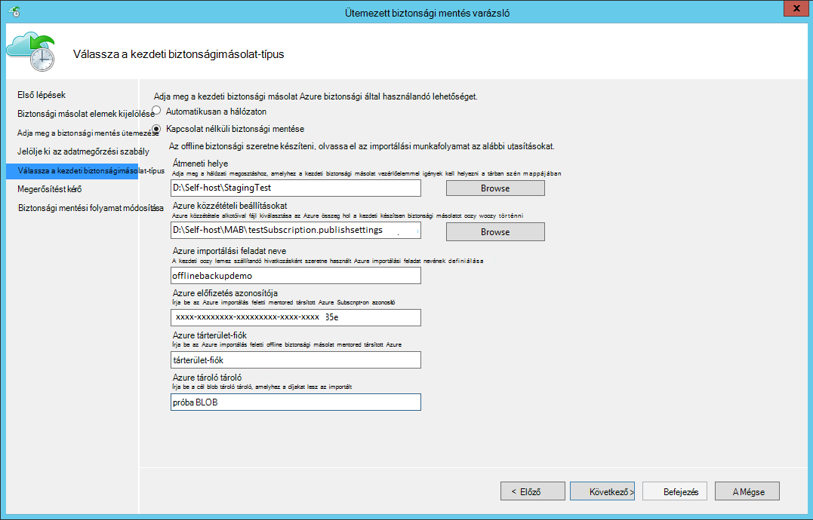

    Az alábbiakban a megfelelő képernyő System Center adatok védelme Manager programban:  
    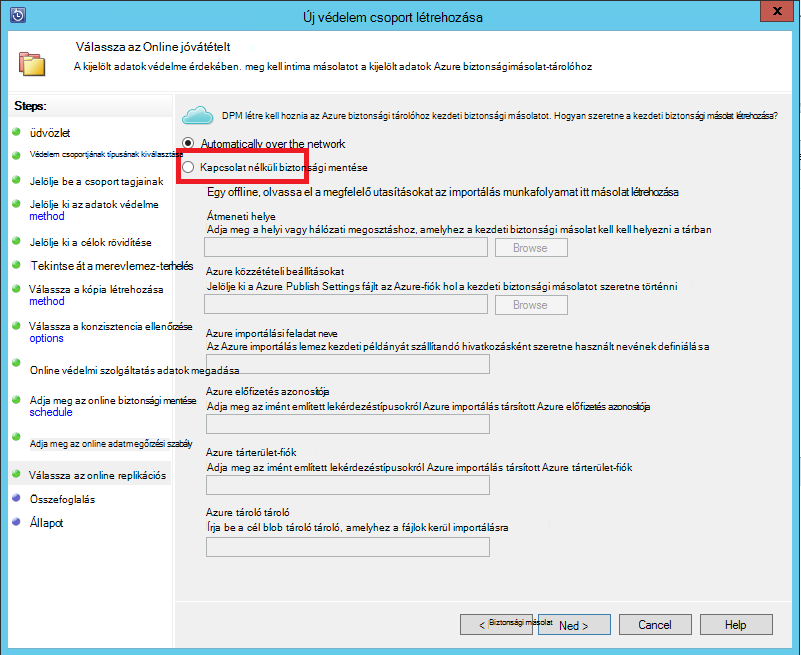

    A ráfordítások leírását a következőképpen történik:

    - **Átmeneti helye**: az ideiglenes tárolóhelyen, amelyhez a kezdeti biztonsági másolat készül. Ez lehet egy hálózati megosztáson vagy helyi számítógépre. Ha a Másolás számítógép és a forrás számítógép eltérőek, megadhatja, hogy a teljes hálózati hely elérési útját átmeneti tárolásra szolgáló ajánlott.
    - **Azure importálási feladat neve**: mely Azure importálása által szolgáltatás és Azure biztonsági másolat nyomon követéséhez küldött adatok az átadás lemezen Azure egyedi neve.
    - **Azure Publish Settings**: az előfizetés profil adatait tartalmazó An XML-fájlt. Az előfizetés társított biztonságos hitelesítő adatokat is tartalmaz. Azt is megteheti, hogy [letölti-e a fájlt](https://manage.windowsazure.com/publishsettings). Adja meg a helyi fájl elérési útját a közzétételi beállításokat.
    - **Azure előfizetés azonosítója**: az előfizetés, ha azt tervezi, hogy az Azure importálás indítása az Azure-előfizetés azonosítója. Ha több Azure előfizetéssel rendelkezik, használja az előfizetést, az importálás társítani kívánt Azonosítóját.
    - **Azure tároló fiók**: A klasszikus típusa tároló fiókot a megadott Azure-előfizetésben, amely az Azure importálás társítjuk.
    - **Azure tároló tároló**: a cél tároló blob hol a feladat importálhatók adatok az Azure tároló fiók nevére.

    > [AZURE.NOTE] Ha regisztrálta a kiszolgáló egy Azure helyreállítási szolgáltatások tárolóból elemre kattintva az [Azure portált](https://portal.azure.com) a biztonsági másolatok, és nem találhatók meg a felhőben megoldás szolgáltató (CSP) előfizetés, továbbra is klasszikus típus tárterület-fiók létrehozása az Azure portálról és használni szeretné a kapcsolat nélküli biztonsági másolat munkafolyamat.

    Mentse a ezt az információt, mert írja be újra a következő lépéseket kell. Csak a *helye átmeneti tárolására* szükség, ha az Azure lemez előkészítése eszközt használva készítse elő a lemez.    

2. A munkafolyamat befejezése, és válassza **Azonnali biztonsági mentése elemre** kattintva kezdeményezzen a kapcsolat nélküli biztonsági másolatot a Azure biztonsági management Console. A kezdeti biztonsági másolat íródott részeként ebben a lépésben átmeneti területre.

    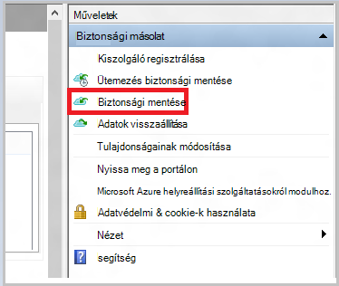

    A megfelelő munkafolyamat a System Center adatok védelme Manager befejezéséhez kattintson a jobb gombbal a **Védelem csoportot**, és válassza a **Create helyreállítási** beállítást. Válassza az **Online védelmi szolgáltatás** lehetőséget.

    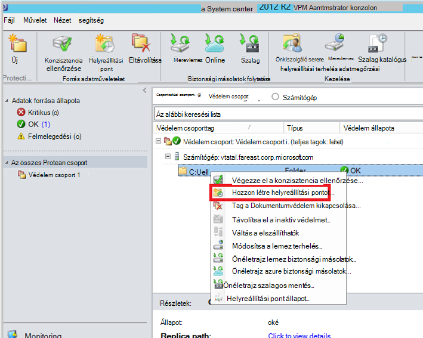

    A művelet befejezése után az átmeneti tárolásra szolgáló helye lemez előkészítéséhez használatra kész.

    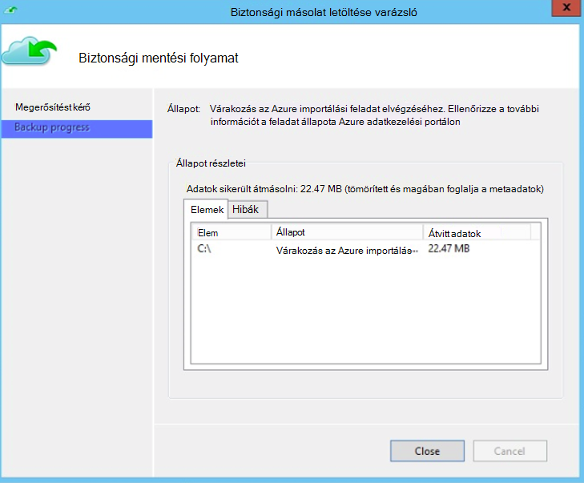

### Egy SATA meghajtó előkészítése, és az Azure importálási feladat létrehozása az Azure lemezen előkészítésére eszközzel
Az Azure lemez előkészítése eszköz érhető el a helyreállítási szolgáltatások Agent telepítési könyvtár (augusztus 2016 frissítése és újabb verzióiban) a következő helyen található.

   *\Microsoft* *Azure* *Helyreállítási* *Szolgáltatások* * Agent\Utils\*

1. Nyissa meg a könyvtár, és másolja a vágólapra a **AzureOfflineBackupDiskPrep** könyvtár egy másolása a számítógépre, amelyen a meghajtók elkészítendő csatlakoztatva van. Győződjön meg róla másolatot számítógép kapcsolatban a következő:

      - A Másolás számítógép is elérhessék a kapcsolat nélküli rendezi munkafolyamat átmeneti tárolásra szolgáló helyét a ugyanazt az elérési utat a **kapcsolat nélküli biztonsági mentése** munkafolyamatban kapott.

      - BitLocker engedélyezve van a számítógépén.

      - A számítógép hozzáfér az Azure-portálra.

      Ha szükséges, a Másolás számítógépen lehet ugyanaz, mint a forrás számítógépen.

2. Nyissa meg a rendszergazda jogú parancssort másolás számítógépen az Azure lemez előkészítése eszköz Directoryval, mint az aktuális könyvtár, és futtassa az alábbi parancsot:

      *.\AzureOfflineBackupDiskPrep.exe* s <*Átmeneti elérési*> [p. <*elérési útját PublishSettingsFile*>]

| Paraméter | Leírás
|-------------|-------------|
|s <*Átmeneti hely elérési út*> | A hely elérési útját az átmeneti tárolásra szolgáló **offline biztonsági mentése** -munkafolyamaton belül a megadott alapú kötelező bevitele. |
|p <*PublishSettingsFile elérési útja*> | Adja meg a fájl elérési útját **Azure Publish Settings** **offline biztonsági mentése** -munkafolyamaton belül a megadott alapú választható bevitele. |

> [AZURE.NOTE] A &lt;elérési útját PublishSettingFile&gt; érték esetén kötelező a számítógép másolás és a forrás számítógép eltérőek.

Amikor a parancsot futtatja, az eszköz kéri, a kijelölés az Azure importálási feladat, amely megfelel a meghajtók elkészítendő van szükség. Ha csak egy egyetlen importálás társítva a megadott átmeneti tárolásra szolgáló helyről, például egymást követő képernyő jelenik meg.

   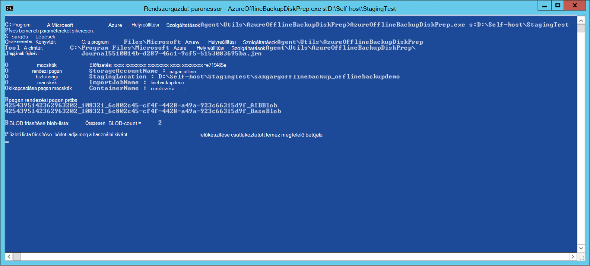  
3. Írja be a csatlakoztatott lemez előkészítése az Azure átvitele kívánt betűjele a záró kettőspont nélkül. Adja meg a megerősítő a meghajtóba, amikor a rendszer kéri a formázást.

Az eszköz ezután megkezdi a lemez biztonsági adatokat tartalmazó előkészítésére. Előfordulhat, hogy további lemezt, amikor az eszköz abban az esetben, ha a megadott lemezen nincs elég helyet enged az adatok biztonsági másolatának csatolhat.  

Az eszköz a sikeres végrehajtás végén egy vagy több lemezre megadott jeleníthetők meg az Azure szállítási. Ezeken kívül az importálás során a **kapcsolat nélküli biztonsági mentése** munkafolyamat megadott nevű hoz létre az Azure klasszikus portálon. Végül jelenít meg a szállítási cím a Azure adatközponthoz, ahol a lemez szükséges szállítandó és a hivatkozásra kattintva keresse meg az importálás az Azure klasszikus portálon.

    
4. A címzett, a eszköz megadott lemezt kiszállítása, és tartsa a jövőbeli hivatkozási nyilvántartási számmal. 
5. Amikor megnyitja a hivatkozást, amely az eszköz jelenik meg, a Azure tárterület-fiókot, amely a **kapcsolat nélküli biztonsági mentése** munkafolyamat megadott látni. Itt láthatja az újonnan létrehozott importálás az **IMPORTÁLÁS/EXPORTÁLÁS** lapon, a tárterület-fiók.

   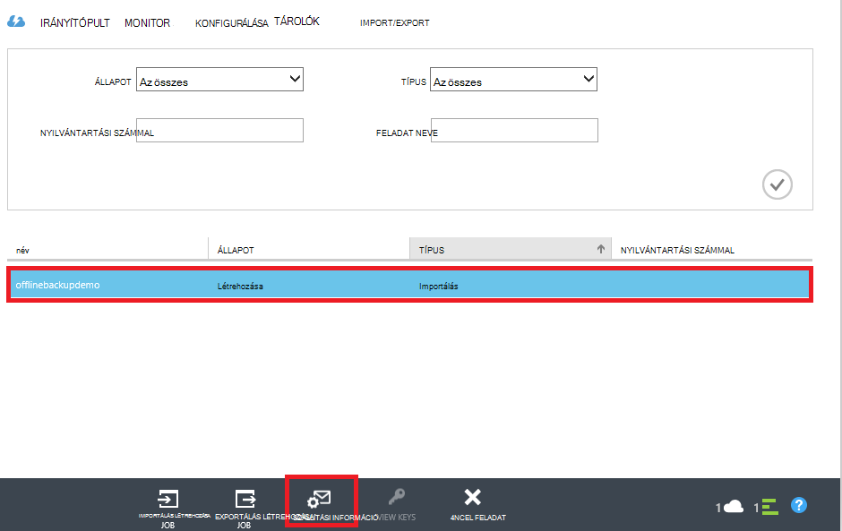 
6. Nyissa meg az **Információ szállítási** a lap alján a névjegy adatainak frissítése, az alábbi képen látható módon. Vissza a lemezt kiszállítása, az importálás befejeződése után a Microsoft Ez az információ használja.

   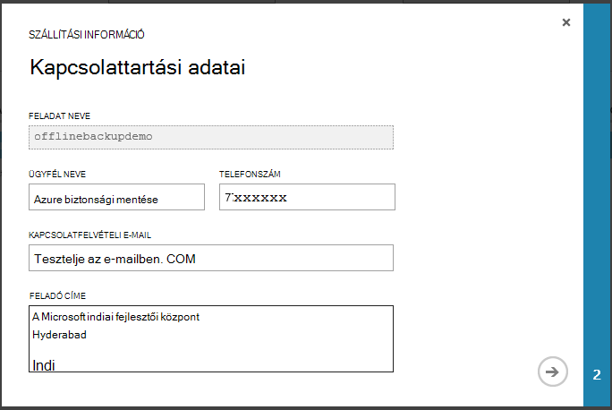 
7. A következő képernyőn adja meg a szállítási részleteit. Adja meg a **Kézbesítés Carrier** és **Nyilvántartási szám** adatait, amelyek megfelelnek a Azure adatközponthoz szállítási lemezt.

   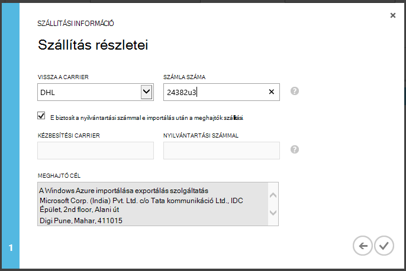 

### A munkafolyamat befejezése
Az importálás befejeződése után kezdeti adatok biztonsági másolatának érhető el a tárterület-fiókjában. A helyreállítási szolgáltatások ügynök, majd a másolatok az adatokat a fiókból a biztonsági másolat tárolóból elemre vagy a helyreállítási szolgáltatások tartalmának vault, amelyik kell alkalmazni. A következő ütemezett biztonsági időpont az Azure biztonsági ügynök fölé a kezdeti biztonsági másolat a növekményes biztonsági másolat hajt végre.

> [AZURE.NOTE] Az alábbi szakaszok Azure biztonsági mentése korábbi verzióiban, akik nem rendelkeznek a hozzáférést az Azure lemez előkészítése eszköz felhasználói vonatkoznak.

### Felkészülés a SATA meghajtó

1. Töltse le a [Microsoft Azure importálás/exportálás eszköz](http://go.microsoft.com/fwlink/?linkid=301900&clcid=0x409) a Másolás számítógépre. Győződjön meg arról, hogy elérhető a számítógépről, amelyben a következő parancsok végrehajtása tervezi átmeneti tárolásra szolgáló helyét. Ha szükséges, a Másolás számítógépen lehet ugyanaz, mint a forrás számítógépen.

2. Bontsa ki a WAImportExport.zip fájlt. Futtassa a WAImportExport eszközt, amely a SATA meghajtót formázza a biztonsági másolat adatot ír a SATA meghajtó és titkosítja azt. A következő parancsot előtt győződjön meg róla, hogy BitLocker engedélyezve van-e a számítógépen.  

    *.\WAImportExport.exe PrepImport /j: <* JournalFile*> .jrn /id: <*munkamenet*> /sk: <*StorageAccountKey*> /BlobType:**PageBlob* * /t: <*TargetDriveLetter*>/formázása / /srcdir titkosítás: <*hely átmeneti*> /dstdir: <*DestinationBlobVirtualDirectory*>/*

    > [AZURE.NOTE] Ha telepítve van a augusztus 2016 frissítés Azure biztonsági mentés (vagy újabb), győződjön meg arról, hogy az átmeneti tárolásra szolgáló megadott helyet, akkor ugyanaz, mint egy, a **Biztonsági másolat készítése most** képernyőn és AIB és az alap Blob-fájlokat tartalmazza.

| Paraméter | Leírás
|-------------|-------------|
| /j: <*JournalFile*>| A fájl elérési útját naplót. Az egyes meghajtók pontosan egy naplófájl kell rendelkeznie. A Jegyzetfüzet-fájlban nem lehet a cél meghajtón. A napló fájlkiterjesztés .jrn és hoz létre, ez a parancs futtatása részeként.|
|/ID: <*munkamenet-azonosító*> | A munkamenet-Azonosítót egy példány munkamenet azonosítja. Megszakított másolása-munkamenet pontos helyreállítási biztosítása szolgál. Fájlok másolása munkamenetben kimásolt után a munkamenet-Azonosítóját a cél meghajtón nevű könyvtárában található tárolja.|
| /SK: <*StorageAccountKey*> | Az adatimportálás a tárterület-fiók fiókkulcs. A kulcs kell ugyanazok, mint biztonsági házirend/védelem csoport létrehozása során megadott.|
| / BlobType | A blob típusát. Ez a munkafolyamat sikeres lesz, csak akkor, ha **PageBlob** meg van adva. Ez nem az alapértelmezett beállítás a és a parancs kell említeni. |
|/ t: <*TargetDriveLetter*> | A példamunkafüzetben a követő kettőspont a cél merevlemez az aktuális példány munkamenet nélkül betűjele.|
|Format | A meghajtó formázása lehetőséget. Adja meg ezt a paramétert, ha a meghajtó kell formázva. egyéb esetben elhagyja azt. Az eszköz a meghajtó formátumok, mielőtt a konzolról megerősítést kéri. A megerősítést kérő mellőzése, adja meg a /silentmode paramétert.|
|/ titkosítása | A meghajtó titkosítására lehetőséget. Adja meg ezt a paramétert, ha a meghajtó BitLocker még nem titkosítva és titkosítani kell az eszköz. BitLocker segítségével már titkosított a meghajtóba, ha ezt a paramétert elhagyja, adja meg a /bk paramétert, és adja meg a meglévő BitLocker billentyűt. Ha a Format paramétert ad meg, meg kell adnia a paraméter titkosítás /. |
|/srcdir: <*SourceDirectory*> | A forrás könyvtár, amely a cél meghajtóra másolni kívánt fájlokat tartalmazza. Gondoskodjon arról, hogy a megadott könyvtár nevét egy teljes, hanem relatív elérési útját.|
|/dstdir: <*DestinationBlobVirtualDirectory*> | A könyvtár elérési útját a cél virtuális Azure tárterület-fiókjában. Ne felejtse el érvényes tároló neveket használják, a cél virtuális könyvtárak vagy BLOB megadásakor. Ne feledje, hogy a tároló nevek kisbetűre cseréli le kell lennie.  A tároló azt, amely a megadott biztonsági házirend/védelem csoport létrehozása során kell lennie.|

  > [AZURE.NOTE] A naplófájl jön létre a WAImportExport mappát, amely jellemzi a teljes információkat a munkafolyamat. Az importálási feladat az Azure-portálon létrehozásakor szüksége ezt a fájlt.

  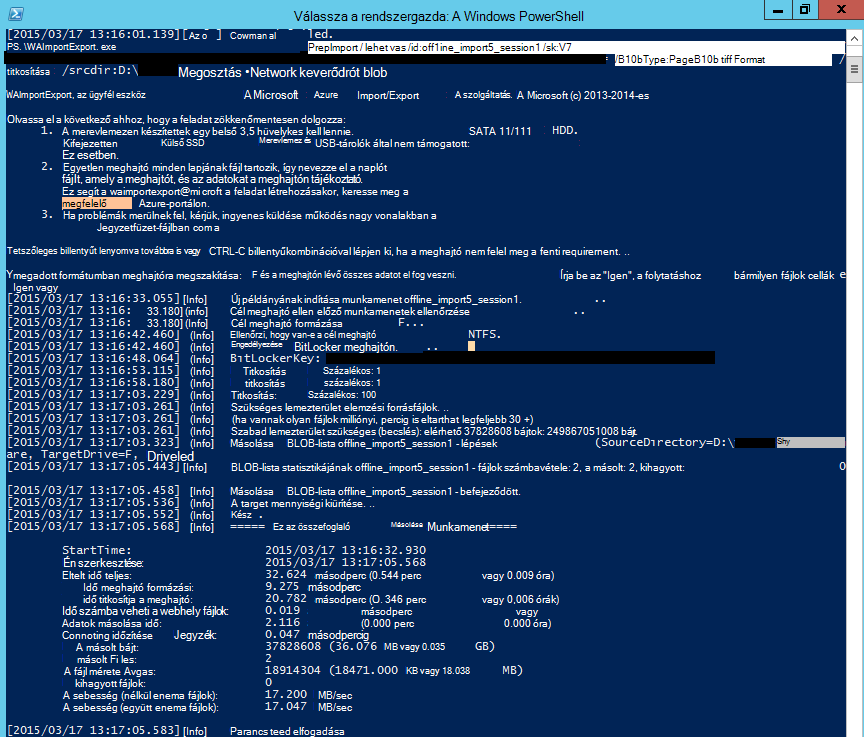

### Az importálási feladat létrehozása az Azure-portálon
1. Nyissa meg az [Azure klasszikus portál](https://manage.windowsazure.com/)tárterület-fiókjába, kattintson az **Importálás/Exportálás**, majd az **Importálási feladat létrehozása** a munkaablakban.

    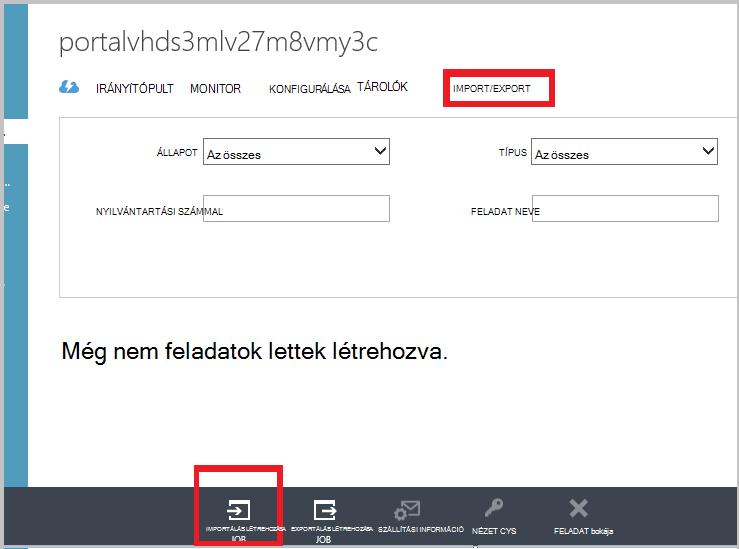

2. Az 1 a varázsló ezzel azt jelzi, hogy van-e készíteni a meghajtóra, és hogy rendelkezik-e a meghajtó naplófájl.
3. A 2 a varázsló az a személy, aki a importálás vállal elérhetőségi adatok megadása.
4. A 3 töltse fel a meghajtó lapjának fájlokat, amely az előző szakaszban szerezte be.
5. Lépés: 4 írja be egy jól értelmezhető nevet az importálás során biztonsági házirend/védelem csoportlétrehozás megadott. A nevet, amelyet a beírt is tartalmazhatnak, csak a kisbetűket, számok, kötőjeleket és aláhúzás karakterek találhatók, egy betűvel kell kezdődnie, és nem tartalmazhat szóközt. A feladatok nyomon követése, amíg ők folyamatban és végrehajtása után azok a nevet, amelyet a kiválasztott szolgál.
6. Ezután jelölje ki a adatközponthoz régió a listából. Az Adatközpont régió adatközponthoz és címet, amelyre a csomagot kell kiszállítása jelöli.

    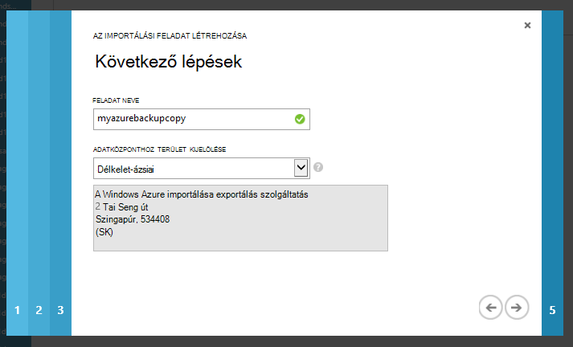

7. Az 5 jelölje be a feladó carrier a listából, és írja be a carrier számla számát. A Microsoft ehhez a fiókhoz használja, az importálás befejeződése után vissza szeretné a meghajtókon szállítandó.

8. A lemez kiszállítása, és adja meg a nyomon követés a szállítmányok állapotának nyomon követéséhez. A lemezt a adatközpontban megérkezik, másolja a tárterület-fiókot, és állapota frissül.

    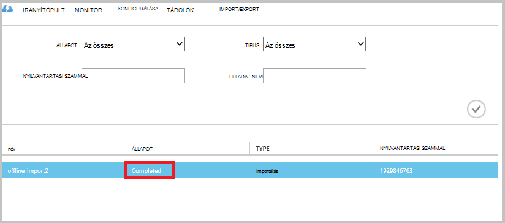

### A munkafolyamat befejezése
Az eredeti adatok biztonsági másolatának a tárterület-fiókjában érhető el, miután a Microsoft Azure helyreállítási szolgáltatási ügynökök átmásolja a tartalmát, az adatok ebben a fiókban a biztonságimásolat-tárolóra vagy helyreállítási szolgáltatások tárolóból elemre, amelyik alkalmazható. Az ütemterv biztonsági legközelebb az Azure biztonsági ügynök fölé a kezdeti biztonsági másolat a növekményes biztonsági másolat hajt végre.

## Következő lépések
- Az importálás/exportálás Azure munkafolyamat kapcsolatos kérdéseket tekintse át [a Microsoft Azure importálás/exportálás szolgáltatással adatátviteli blobtárolóhoz](../storage/storage-import-export-service.md).
- Keresse meg a biztonsági másolat Azure [– Gyakori kérdések](backup-azure-backup-faq.md) a munkafolyamattal kapcsolatos kérdéseit a kapcsolat nélküli biztonsági mentése című szakaszát.
