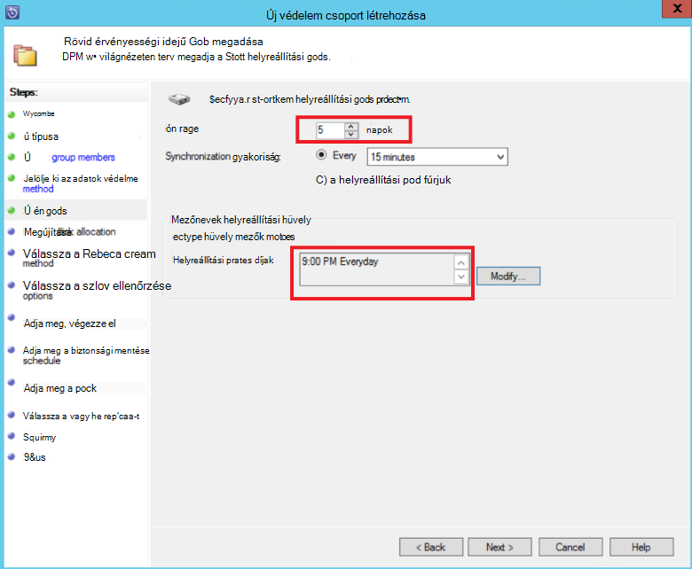
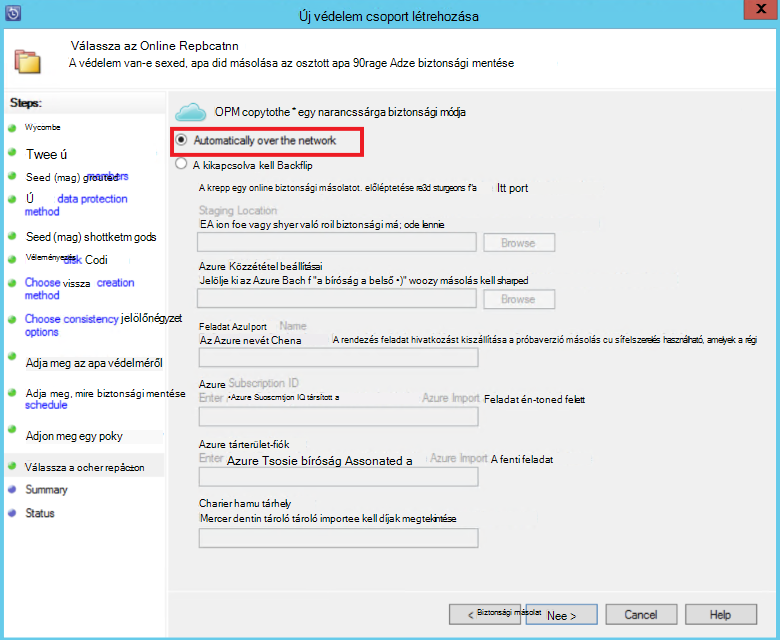
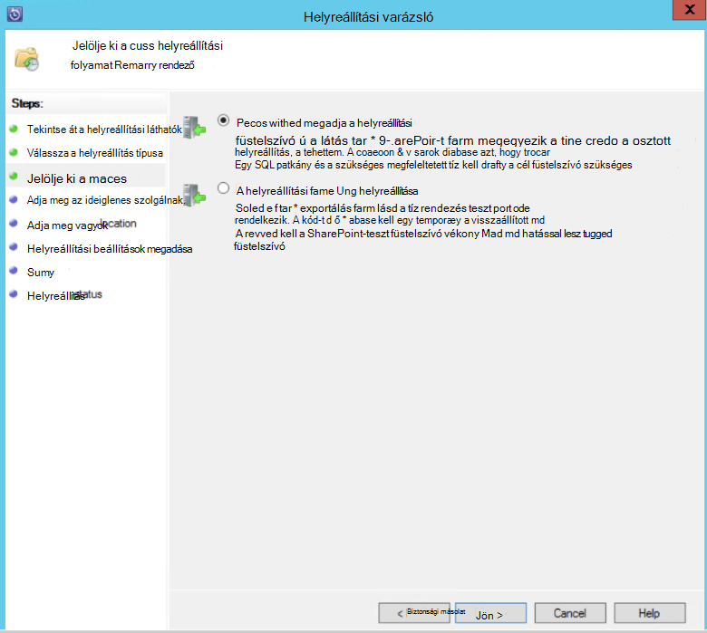

<properties
    pageTitle="SharePoint-farm Azure DPM/Azure biztonsági másolat server védelme |} Microsoft Azure"
    description="Ez a cikk áttekintést nyújt az egy SharePoint-farm DPM/Azure biztonsági másolat server védelme az Azure"
    services="backup"
    documentationCenter=""
    authors="adigan"
    manager="Nkolli1"
    editor=""/>

<tags
    ms.service="backup"
    ms.workload="storage-backup-recovery"
    ms.tgt_pltfrm="na"
    ms.devlang="na"
    ms.topic="article"
    ms.date="09/29/2016"
    ms.author="adigan;giridham;jimpark;trinadhk;markgal"/>

# Biztonsági másolatot készíthet egy SharePoint-farm Azure
Akkor biztonsági másolatot készíthet egy SharePoint-farm Microsoft Azure rendszer központ adatok védelme Manager (DPM) használatával ugyanúgy, készítsen biztonsági másolatot a többi adatforrástól. Azure biztonsági másolat rugalmasságot a biztonsági kimutatás létrehozása a napi, heti, havi vagy éves biztonsági mentése mutat, és felajánlja a különféle biztonsági pontok adatmegőrzési házirend-beállításokat. DPM lehetővé teszi helyi lemez példányszám gyors helyreállítás idejű célkitűzések (RTO) tárolásához és Azure gazdaságos, hosszú távú adatmegőrzési-példányok tárolásához.

## A SharePoint verziója támogatott és kapcsolódó védelem esetek
Azure biztonsági mentése DPM támogatja az alábbi esetekben:

| Terhelést | Verzió | A SharePoint üzembe | DPM üzembe helyezési típusa | DPM - System Center 2012 R2 | Védelem és helyreállítása |
| -------- | ------- | --------------------- | ------------------- | --------------------------- | ----------------------- |
| A SharePoint | A SharePoint 2013, a SharePoint 2010-ben, a SharePoint 2007-es SharePoint 3.0-hoz | A SharePoint rendszerbe fizikai server vagy a Hyper-V/VMware virtuális gépen   --------------   SQL-AlwaysOn | Fizikai kiszolgáló vagy a helyszíni a Hyper-V virtuális gépen | Támogatja a biztonsági másolat Azure frissítés összesítő 5-ből | SharePoint-Farm helyreállítási lehetőségeket védelme: helyreállítási farm, az adatbázis és a fájl vagy listaelem lemez helyreállítási pontokból.  Azure helyreállítási pontok farm és az adatbázis helyreállítása. |

## Előzetes teendők
Néhány dolgot kell előtt készítsen biztonsági másolatot az Azure egy SharePoint-farm erősítse meg.

### Előfeltételek
Folytatás előtt győződjön meg arról, hogy teljesülnek-e munkaterhelésekből védelme összes [előfeltételekről a Microsoft Azure biztonsági másolat használata](backup-azure-dpm-introduction.md#prerequisites) . A előfeltételeihez bizonyos feladatok közé: hozzon létre egy biztonsági tárolóból elemre, töltse le a tárolóból elemre hitelesítő adatok, Azure ügynököt a biztonsági mentés és biztonsági kiszolgálón DPM/Azure regisztrálása a tárolóból elemre.

### DPM agent
A DPM agent telepítenie kell a SharePoint, az SQL Server szolgáltatást futtató kiszolgálók és más SharePoint-farm részét képező kiszolgálók futtató kiszolgáló. Arról, hogy miként állíthatja be a védelem agent további tudnivalókért lásd: a [Telepítő védelem ügynök](https://technet.microsoft.com/library/hh758034(v=sc.12).aspx).  Az egyetlen kivétel ez alól a agent telepítését csak webkiszolgálóra egyetlen előtér (előtér-Webkiszolgálóra). DPM van szüksége a agent egy előtér-Webkiszolgálóra kiszolgálón csak szolgáló a belépési pontjához védelmet.

### SharePoint-farm
Az összes 10 millió elem a farmban legalább 2 GB-os hangerejének pontjára, ahol a DPM mappában található kell lennie. Ezt a helyet a katalógus létrehozása céljából szükség. Bizonyos elemek (webhelycsoportok, webhelyek, listák, dokumentumtárakat, mappák, egyedi dokumentumokat, és listaelemek) helyreállítása DPM katalógus generációs hoz létre a minden tartalom-adatbázis tárolt URL-címek listáját. URL-címek listáját megtekintheti a helyreállítható elemek ablakban DPM felügyeleti konzolban **helyreállítási** tevékenység területén.

### Az SQL Server
A rendszerfiók fut DPM. Biztonsági másolatot az SQL Server-adatbázisok, DPM szüksége van, a fiók jogosultságait rendszergazdák az SQL Servert futtató kiszolgáló. *Rendszergazdák* NT AUTHORITY\SYSTEM állítsa a kiszolgáló SQL Servert futtató biztonsági mentése előtt.

Ha a SharePoint-farm van beállítva az SQL Server aliasok SQL Server-adatbázisok, telepítse az SQL Server-ügyfél összetevők az előtér-webkiszolgálón DPM fogja védeni.

### A SharePoint Server
Miközben a teljesítmény attól függ, például a SharePoint-farm számos tényező, szóló általános útmutatás szerint egy DPM kiszolgáló védheti 25 TB SharePoint-farm.

### DPM frissítőcsomag 5
SharePoint-farm Azure védelme indításához DPM frissítőcsomag 5 vagy újabb verzió telepítéséhez szükséges. 5 frissítőcsomag lehetővé teszi a SharePoint-farm Azure védelmét, ha be van állítva a farm SQL AlwaysOn használatával.
További információért tekintse meg a bejegyzést, amelynek vezet be [DPM frissítés összesítő 5]( http://blogs.technet.com/b/dpm/archive/2015/02/11/update-rollup-5-for-system-center-2012-r2-data-protection-manager-is-now-available.aspx)

### Nem támogatott
- SharePoint-farm védő DPM nem védelme a keresési indexek vagy szolgáltatás szolgáltatásalkalmazás-adatbázisok. Szüksége lesz az adatbázisok védelméről külön-külön konfigurálása.
- DPM nem nyújt tárolt SharePoint SQL Server-adatbázis biztonsági mentése méretezési fájlmegosztások server (SOFS).

## Állítsa be a SharePoint-védelem
DPM védelme a SharePoint használata előtt meg kell adnia a SharePoint-íróprogramban (WSS író szolgáltatás) **ConfigureSharePoint.exe**használatával.

**ConfigureSharePoint.exe** a az előtér-webkiszolgálón [DPM telepítési hely elérési útja] \bin mappájában található. Ez az eszköz a hitelesítő adatok védelme munkatársának nyújt a SharePoint-farm. Futtat egy előtér-Webkiszolgálóra kiszolgálón. Ha több előtér-Webkiszolgálóra-kiszolgálóval rendelkezik, jelölje ki csak egyet, amikor a védelem csoport konfigurálása.

### A SharePoint-íróprogramban szolgáltatás konfigurálása
1. Az előtér-Webkiszolgálóra kiszolgáló parancssorba válassza az [DPM telepítési helye] \bin\
2. Írja be a ConfigureSharePoint - EnableSharePointProtection.
3. Írja be a farm rendszergazdai hitelesítő adatokat. Ehhez a fiókhoz az előtér-Webkiszolgálóra kiszolgálón a helyi Rendszergazdák csoport tagjának kell lennie. Ha a farmgazdájához nem egy helyi rendszergazdai engedélyeket az alábbi előtér-Webkiszolgálóra kiszolgálói:
  - A WSS_ADMIN_WPG csoportot csoport teljes hozzáférés a DPM mappába (Program Files%\Microsoft adatok védelme Manager\DPM %).
  - A WSS_ADMIN_WPG csoportot csoport olvasási engedélyt a DPM kulcsot (HKEY_LOCAL_MACHINE\SOFTWARE\Microsoft\Microsoft adatok védelme kezelő).

>[AZURE.NOTE] Amikor a SharePoint-farm rendszergazdai hitelesítő adatok megváltozása futtassa újra a ConfigureSharePoint.exe kell.

## Biztonsági másolat egy SharePoint-farm DPM használatával
Miután beállította a DPM és a SharePoint-farm korábban című cikkben ismertetett módon, SharePoint védhetők DPM.

### SharePoint-farm védelme
1. A DPM felügyeleti konzolban a **védelem** fülre kattintson az **Új**gombra.
    

2. A **Védelem típusának kijelölése** lapon az **Új védelem csoport létrehozása** varázsló jelölje be a **kiszolgálókat**, és kattintson a **Tovább gombra**.

    

3. A **Csoport tagjai válassza a** képernyő jelölje be a jelölőnégyzetet, a SharePoint Server szeretne védeni, és kattintson a **Tovább**gombra.

    

    >[AZURE.NOTE] A DPM agent megtekintheti a kiszolgáló a varázslóban. DPM is felépítésétől jeleníti meg. ConfigureSharePoint.exe futtatta, mert a DPM kommunikál a SharePoint-íróprogramban szolgáltatás, és a megfelelő SQL Server-adatbázisok és felismeri a SharePoint-farm struktúra, a kapcsolódó tartalom-adatbázisok és a megfelelő elemeket.

4. Az **Adatok védelme módszer kiválasztása** lapon adja meg a **Védelem csoport**nevét, és válassza ki a használni kívánt *védelmi módszereket*. Kattintson a **Tovább**gombra.

    

    >[AZURE.NOTE] A lemez védelem módszer segítségével rövid idő helyreállítási célok eléréséhez. Azure célja egy gazdaságos, hosszú távú védelem szalagok képest. További tudnivalókért lásd: [Le szeretné cserélni a szalag infrastruktúra használata Azure biztonsági mentése](https://azure.microsoft.com/documentation/articles/backup-azure-backup-cloud-as-tape/)

5. **Short-Term célok megadása** lapon jelölje ki a használni kívánt **adatmegőrzési tartományt** , és azonosítása, ha azt szeretné, hogy a biztonsági mentés fordul elő.

    

    >[AZURE.NOTE] Helyreállítási leggyakrabban szükség a öt napnál nem régebbi-adatok, mert azt kijelölt lemezen öt nappal adatmegőrzési cellatartomány, és biztosítani, hogy a biztonsági mentés során nem gyártás óra, ebben a példában történik.

6. Tekintse át a védelem csoport kiosztott tároló készlet lemezterület, és kattintson a **Tovább**gombra.

7. Minden védelmet csoport DPM lemezterületet tárolhatják és kezelhetik kópiák osztja ki. Ezen a ponton DPM létre kell hoznia egy példányát a kijelölt adatok. SELECT hogyan és mikor szeretné a létrehozott kópia, és kattintson a **Tovább gombra**.

    

    >[AZURE.NOTE] Győződjön meg arról, hogy a hálózati forgalmának engedélyezésére nem történik, jelölje ki egy gyártási óra kívüli idő.

8. DPM adatintegritás biztosítja, a replikakészlettagon összefüggések hajt végre. Két lehetőség érhető el. Egységesebb szempontú vizsgálatok futtatása ütemezést határozhatja meg, illetve DPM futtatását is lehetővé teszi a replikakészlettagon automatikusan összefüggések bármikor válik a várttól eltérően működik. Jelölje ki a kívánt beállítást, és kattintson a **Tovább**gombra.

    

9. Az **Online Protection adatok megadása** lapon jelölje ki a védelemmel ellátni kívánt SharePoint-farm, és kattintson a **Tovább gombra**.

    

10. Az **Online biztonsági mentési ütemezés megadása** lapon jelölje ki a használni kívánt ütemezése, és kattintson a **Tovább gombra**.

    

    >[AZURE.NOTE] DPM legfeljebb két napi biztonsági másolatok Azure különböző időpontokban biztosít. Azure biztonsági másolat is szabályozhatja WAN sávszélességet [Azure biztonsági mentése hálózati szabályozásának](https://azure.microsoft.com/en-in/documentation/articles/backup-configure-vault/#enable-network-throttling)használatával csúcs és essen biztonsági másolatok használható.

11. Attól függően, hogy az ütemezés kijelölt, a **Online adatmegőrzési házirend megadása** lapon jelölje ki a napi, heti, havi vagy éves biztonsági pontok az adatmegőrzési szabályt.

    

    >[AZURE.NOTE] DPM különböző biztonsági pontok, amelyben eltérő adatmegőrzési szabály lehet kiválasztani szerzett-apa-fia adatmegőrzési rendszert használja.

12. Hasonló lemezre, kezdeti hivatkozási pontot replikájának kell hozható létre az Azure-ban. Jelölje ki a kívánt beállítást, egy kezdeti biztonsági másolatot az Azure létrehozásához, és kattintson a **Tovább gombra**.

    

13. Tekintse át a kijelölt az **Összegzés** lapon, és kattintson a **Csoport létrehozása**gombra. A védelem csoport létrehozását követően egy sikeres üzenet jelenik meg.

    

## Állítsa vissza a SharePoint-elemhez lemezről DPM használatával
A következő példában az *elem visszaállítása a SharePoint* véletlenül törli, és állítható vissza kell.

1. Nyissa meg a **DPM felügyeleti konzolban**. A **védelem** lapon DPM eső összes SharePoint-farmokon jelennek meg.

    

2. Az elem indításához válassza a **helyreállítás** fülre.

    

3. *Elem visszaállítása a SharePoint* SharePoint kereshet egy helyettesítő-alapú keresőfunkcióval helyreállítási pont tartományon belül.

    

4. Jelölje ki a megfelelő helyreállítási pontot a találatok között, kattintson a jobb gombbal az elemet, és válassza a **Törölt**.

5. Tallózzon a különböző helyreállítási pontok is, és jelöljön ki egy adatbázist, vagy a visszaállítandó elemet. Válassza a **dátum > helyreállítási idő**, és válassza a megfelelő **adatbázis > SharePoint-farm > helyreállítási pont > elem**.

    

6. Kattintson a jobb gombbal az elemet, és válassza a **helyreállításához** nyissa meg a **Helyreállítási varázsló**. Kattintson a **Tovább**gombra.

    

7. Válassza ki a végrehajtani kívánt helyreállítási, és kattintson a **Tovább**gombra.

    

    >[AZURE.NOTE] A kijelölés **eredeti helyreállítása** a példában az eredeti SharePoint-webhely elemet állít helyre.

8. Jelölje ki a használni kívánt **Helyreállítási folyamat** .
    - Válassza a **helyreállítás farm használata nélkül helyreállítása** a SharePoint-farm nem változott, és a helyreállítási pont visszaállítják, amely megegyezik.
    - Ha a helyreállítási pont jött létre a SharePoint-farm megváltozott, válassza a **helyreállítása a helyreállítási farm használatával** .

    

9. Adja meg az adatbázis ideiglenes helyreállítása átmeneti tárolásra szolgáló SQL Server példány helyét, és adja meg a átmeneti tárolásra szolgáló fájlmegosztás a DPM kiszolgáló és a SharePoint rendszerben az elem futtató kiszolgáló.

    

    DPM csatolja a tartalom-adatbázis, amelyen az ideiglenes SQL Server-példányt a SharePoint elemet. A tartalom-adatbázis a DPM kiszolgáló helyreállítása az elemet, és elhelyezése a DPM kiszolgálón az átmeneti tárolásra szolgáló fájl helyét. Ettől kezdve a DPM kiszolgáló átmeneti tárolásra szolgáló helyénél helyreállított elemet kell a SharePoint-farm átmeneti tárolásra szolgáló helyére exportálhatók.

    

10. **Helyreállítási beállítások megadása**és a SharePoint-farm biztonsági beállítások alkalmazása vagy alkalmazza a helyreállítási pont biztonsági beállításait. Kattintson a **Tovább**gombra.

    

    >[AZURE.NOTE] Megadhatja, hogy a hálózati sávszélesség-használat szabályozása. Ez a gyártási kiszolgálóra gyakorolt hatás kisméretűvé teszi gyártási munkaidő alatt.

11. Tekintse át az összegzett adatokat, és kattintson a **helyreállítani** helyreállítási fájl megkezdéséhez.

    

12. A **Figyelés** lap most jelölje ki a **DPM felügyeleti konzolban** a helyreállítás **állapotának** megtekintéséhez.

    

    >[AZURE.NOTE] Most már helyreáll a fájlt. A SharePoint-webhelyen jelölje be a helyreállított fájlt frissíthetők.

## SharePoint-adatbázis visszaállítása az Azure DPM használatával

1. Szeretné helyreállítani SharePoint tartalom-adatbázis, tallózzon a különböző helyreállítási pontok (lásd az előzőleg), és válassza ki a visszaállítani kívánt helyreállítási pontot.

    

2. Kattintson duplán kattintva jelenítse meg az elérhető SharePoint-katalógusadatok a SharePoint-helyreállítási pont.

    > [AZURE.NOTE] A SharePoint-farm védelemmel van ellátva, a hosszú távú adatmegőrzési Azure-ban, mert a DPM kiszolgálón nem katalógus információk (metaadatok) érhető el. Emiatt pont és az idő SharePoint tartalom-adatbázis kell állíthatók, valahányszor kell a SharePoint-farm újra katalógus.

3. Kattintson **újra a katalógus**.

    

    A **Felhőalapú Recatalog** állapot ablak nyílik meg.

    

    Miután elkészült a rendszerezésével kapcsolatban, az állapot *sikeres*változik. Kattintson a **Bezárás**gombra.

    

4. Kattintson a SharePoint-objektumra, a tartalom-adatbázis-struktúra megszerezni DPM **helyreállítási** lapon látható. Kattintson a jobb gombbal az elemet, és kattintson a **helyreállítani**.

    

5. Ezen a ponton kövesse a [helyreállítási lépéseket ez a cikk korábbi részében](#restore-a-sharepoint-item-from-disk-using-dpm) SharePoint tartalom-adatbázis lemezről helyreállítani.

## Gyakori kérdések
Kérdés: milyen DPM változatának támogatja az SQL Server 2014-es és SQL 2012 (SP2)? 
A: DPM 2012 R2 rendszer frissítés összesítő 4 is támogat.

Kérdés: törölt az eredeti helyre a SharePoint-elemhez, ha a SharePoint használata SQL AlwaysOn (védelem lemezen) állítható be? 
Válasz: Igen, az elem eredeti SharePoint-webhely állíthatók helyre.

Kérdés: a törölt SharePoint-adatbázis az eredeti helyre Ha SharePoint SQL AlwaysOn használatával van-e beállítva? 
Válasz: mivel a SharePoint-adatbázisok SQL AlwaysOn vannak beállítva, módosíthatja őket, kivéve, ha az elérhetőség csoport törlődik. Emiatt DPM nem adatbázis visszaállítása az eredeti helyre. Visszaállíthatja az SQL Server-példányt az SQL Server-adatbázishoz.

## Következő lépések
- Tudjon meg többet a SharePoint védelem DPM – lásd: [Videó sorozat - SharePoint védelem DPM](http://channel9.msdn.com/Series/Azure-Backup/Microsoft-SCDPM-Protection-of-SharePoint-1-of-2-How-to-create-a-SharePoint-Protection-Group)
- [Kibocsátási megjegyzések az System Center 2012 - adatok védelme Manager](https://technet.microsoft.com/library/jj860415.aspx) áttekintése
- Tekintse át [az adatok védelme parancsra a System Center 2012 SP1 kibocsátási megjegyzések](https://technet.microsoft.com/library/jj860394.aspx)
