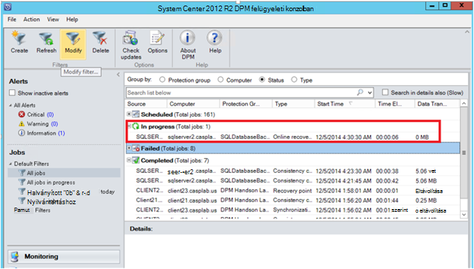

<properties
    pageTitle="Az SQL Server-munkaterhelésekből DPM használatával Azure biztonsági másolat |} Microsoft Azure"
    description="Az Azure biztonsági másolat szolgáltatással SQL Server-adatbázis biztonsági másolatának bemutatása"
    services="backup"
    documentationCenter=""
    authors="adigan"
    manager="Nkolli1"
    editor=""/>

<tags
    ms.service="backup"
    ms.workload="storage-backup-recovery"
    ms.tgt_pltfrm="na"
    ms.devlang="na"
    ms.topic="article"
    ms.date="09/27/2016"
    ms.author="adigan;giridham; jimpark;markgal;trinadhk"/>

# Az SQL Server-munkaterhelésekből DPM használatával Azure biztonsági mentése

Ez a cikk végigvezeti Önt azon Azure biztonsági másolat eszközzel az SQL Server-adatbázis biztonsági másolatának konfigurálási lépéseket.

Biztonsági másolatot készíthet az SQL Server-adatbázisok Azure, Azure-fiók szükséges. Nem rendelkeznek fiókkal, ha a csak néhány percig a létrehozhat egy ingyenes próba-fiókkal. A részletekért lásd: [Azure ingyenes próbaverziót](https://azure.microsoft.com/pricing/free-trial/).

Az SQL Server adatbázis biztonsági másolatának Azure és helyreállítási az Azure irányításának három lépésből áll:

1. Hozzon létre egy biztonsági házirendet, az Azure SQL Server-adatbázis védelmét.
2. Azure az igény szerinti biztonsági másolat készítése.
3. Az adatbázis visszaállítása az Azure.

## Előzetes teendők
Mielőtt elkezdené, győződjön meg arról, hogy teljesülnek-e a Microsoft Azure mentéssel munkaterhelésekből védelme az összes [Előfeltételek](../backup-azure-dpm-introduction.md#prerequisites) . A vonatkozó követelmények vonatkoznak feladatok, például: létrehozása egy biztonsági tárolóból elemre, tárolóra hitelesítő adatok letöltése, telepítése az Azure biztonsági ügynök és a kiszolgáló regisztrálja a tárolóból elemre.

## Az SQL Server Azure adatbázisok védelme biztonsági házirend létrehozása

1. A DPM kiszolgálón kattintson a **védelem** munkaterület.

2. Kattintson az eszköz menüszalagján az **Új** védelem új csoport létrehozása gombra.

    

3. DPM látható, hogy a kezdőképernyőn, az útmutatást a **Védelem csoport**létrehozása. Kattintson a **Tovább**gombra.

4. Jelölje ki a **kiszolgálón**.

    

5. Bontsa ki az SQL Server gépi hol találhatók az adatbázisok másolat készül. DPM adatforrásokkal lehet biztonsági másolatot, a kiszolgáló jeleníti meg. Bontsa ki az **Összes SQL-megosztás** , és jelölje ki az adatbázisok (ebben az esetben azt be van jelölve jelentéskészítő$ MSDPM2012 és a jelentéskészítő$ MSDPM2012TempDB) másolat készül. Kattintson a **Tovább**gombra.

    

6. Nevezze el a védelmet csoportot, és jelölje be a **szeretném online védelmi szolgáltatás** jelölőnégyzetet.

    

7. Írja be a biztonsági másolat pontok lemezre létrehozásához szükséges ráfordítások **Short-Term célok adja meg** a képernyőn.

    Láthatja az alábbi, hogy *5 nap* **adatmegőrzési tartomány** értéke, a **szinkronizálási gyakoriság** értéke egyszer minden *15 percet* , amelynél a biztonsági másolat származik gyakorisága. **Teljes biztonsági Express** *8:00 óráig*értékre van állítva.

    

    >[AZURE.NOTE] (Szerint a képernyő bemeneti) 8:00 du. biztonsági pont hozza létre minden nap módosult adatok átvitele az előző napra 8:00 PM biztonsági helyétől. Ez a folyamat neve **Express teljes biztonsági másolatot készíteni**. A naplók vannak szinkronizálva tranzakció során 15 percenként Ha szükség van az adatbázis helyreállítása a 9:00 PM –, majd a pont hozza létre a naplókat, a legutóbbi ismétlése express teljes biztonsági másolat pont (ebben az esetben 8 du.).

8. Kattintson a **Tovább** gombra

    DPM jeleníti meg az általános tárhely és a lehetséges szabad hely kihasználtsági.

    

    Alapértelmezés szerint DPM létrehoz egy mennyiségi egy adatforrást (SQL Server-adatbázis) a kezdeti biztonsági másolat használt. Ezt a megközelítést használ, a logikai Manager (LDM) korlátozza DPM védelem 300 adatforrásokhoz (SQL Server-adatbázisban). Kerülheti meg ezt a korlátozást, jelölje be a **közös keresse meg az adatok DPM Tárolókészlethez**, lehetőséget. Használja ezt a lehetőséget, ha DPM használja egyetlen kötet több adatforrásból, amely lehetővé teszi, hogy a DPM védelme érdekében akár 2000 SQL-adatbázisait.

    **Automatikusan a kötet nagyobb** beállítás, DPM is figyelembe megnövelt biztonsági hangerejének a termelési adatok növekedésével. Ha **automatikusan a kötet nagyobb** beállítás nincs kiválasztva, DPM korlátozza a védelem csoportjában található az adatforrások biztonsági tárhelyet.

9. A rendszergazdák kapnak a választási lehetőségek, kézzel (kikapcsolása a hálózati) kezdeti biztonsági másolat átvitele sávszélesség túlzsúfolt elkerülése érdekében, és a hálózaton keresztül. Az idő, amelynél a kezdeti továbbított akkor fordulhat elő, azok is beállíthatja. Kattintson a **Tovább**gombra.

    

    A kezdeti biztonsági másolat átvitele az egész adatforrást (SQL Server-adatbázis) gyártási Server (SQL Server-gépen) a DPM server szükséges. Lehet, hogy az adatok nagy, és sávszélességre meghaladja az adatok átvitele a hálózaton keresztül. Emiatt a rendszergazdák választhat adhatja át a kezdeti biztonsági másolat: **manuálisan** (használatával cserélhető adathordozóra) elkerülése érdekében a sávszélesség túlzsúfolt vagy **automatikusan a hálózaton keresztül** (megadott egyszerre).

    A kezdeti biztonsági másolat elkészülte a biztonsági másolatok a többi olyan meg a kezdeti biztonsági másolat növekményes biztonsági. Növekményes biztonsági másolatok gyakran kicsi, és könnyen település a hálózaton keresztül.

10. Válassza ki, ha azt szeretné, hogy a konzisztencia-ellenőrzést futtatni, és kattintson a **Tovább**gombra.

    

    DPM hajthatják végre egy egységesebb így ellenőrzi a biztonsági mentés pont az integritás. A biztonságimásolat-fájl a termelési kiszolgálón (ebben az esetben az SQL Server gépi) és a biztonsági másolatban lévő adatokat, hogy a fájl a DPM ellenőrző számítja ki. Az ütközés, esetében tekinti, hogy a mentett fájlt a DPM megsérült. DPM rectifies a mentett adatokat küld a megfelelő ellenőrző eltérés blokkok. Mivel a konzisztencia ellenőrzése a teljesítmény igénylő művelet, rendszergazdák, hogy az ütemezési a konzisztencia ellenőrzése vagy futtatható automatikusan.

11. Az adatforrások online védelmét, jelölje be az adatbázisok kell védeni Azure, és kattintson a **Tovább**gombra.

    

12. A rendszergazdák választhat biztonsági ütemezésüket és megfeleljen a szervezet házirendek az adatmegőrzési házirendek.

    

    Ebben a példában a biztonsági másolatok egyszer veszik a 12:00 PM és a 8 között (a képernyő alsó részén)

    >[AZURE.NOTE] Tanácsos van néhány rövid érvényességi idejű helyreállítási pontok lemezen gyors helyreállítás. E helyreállítási pontok "műveleti helyreállítási" segítségével. Azure magasabb SLA a jó telephelytől távol helyként szolgál, és garantált elérhetőségét.

    **A legjobb**: Győződjön meg arról, hogy Azure biztonsági másolatok biztonsági másolatok helyi lemez DPM befejezése után van ütemezve. A legújabb biztonsági másolat szeretné átmásolni Azure szolgáltatás lehetővé teszi.

13. Válassza ki az adatmegőrzési házirend ütemtervet. A részletes tudnivalókat az adatmegőrzési működése a [Használata Azure biztonsági másolat le szeretné cserélni a szalag infrastruktúra cikk](backup-azure-backup-cloud-as-tape.md)állnak rendelkezésre.

    

    Ebben a példában:

    - Biztonsági másolatok naponta egyszer kell venni a 12:00 PM és a 8 között (a képernyő alsó részén), és a 180 napig megőrződnek.
    - A biztonsági másolat a 12:00 óráig szombat tárolja az 104 héten
    - A biztonsági másolat a 12:00 óráig utolsó szombat 60 hónapig megőrződnek
    - A biztonsági másolat a 12:00 óráig március utolsó szombat a 10 év megőrződnek

14. Kattintson a **Tovább** gombra, és válassza az Azure a kezdeti biztonsági másolat átvitele a megfelelő beállítást. Megadhatja, hogy **automatikusan a hálózaton keresztül** , vagy a **Kapcsolat nélküli biztonsági másolatot**.

    - **A hálózaton keresztül automatikusan** át az adatok biztonsági másolatának Azure a választott biztonsági másolatának ütemezés szerint.
    - Hogyan működik a **Kapcsolat nélküli biztonsági másolatot** a [kapcsolat nélküli biztonsági másolat munkafolyamat Azure biztonsági másolat](backup-azure-backup-import-export.md)magyarázata.

    Válassza ki a megfelelő átadás mechanizmusa a kezdeti biztonsági másolat küldése Azure, és kattintson a **Tovább**gombra.

15. Miután a házirend részletei az **Összegzés** képernyőn áttekintheti, kattintson a a munkafolyamat végrehajtásához **a csoport létrehozása** gombra. Kattintson a **Bezárás** gombra, és a projekt előrehaladásának figyelés munkaterületen nyomon.

    

## Igény szerinti SQL Server-adatbázis biztonsági mentése
Az előző lépéseket létrehozott egy biztonsági házirendet, míg "helyreállítási pont" jön létre, csak akkor, ha az első biztonsági másolat fordul elő. Nem várja meg a Feladatütemező indítása, a helyreállítás kibocsátása eseményindító alatti lépéseket manuálisan mutat.

1. Várja meg, amíg a védelem csoport állapota **az OK gombra** az adatbázis helyreállítási pont létrehozása előtt.

    

2. Kattintson a jobb gombbal az adatbázist, és válassza a **Create helyreállítási pont**.

    

3. A legördülő menüben válassza a **Online védelmi szolgáltatás** , és kattintson az **OK gombra**. Ez elindítja a helyreállítási pont kibocsátása Azure-ban.

    

4. A projekt előrehaladását a hol találhatók a egy folyamatban lévő **Figyelés** munkaterület megtekintése a következő ábrán kitaláltak hasonló feladatot.

    

## SQL Server-adatbázis visszaállítása az Azure
Az alábbi lépésekkel állíthatja helyre a védett entitás (SQL Server-adatbázis) az Azure szükséges.

1. Nyissa meg a DPM server Management Console. Nyissa meg azt a **helyreállítási** munkaterület, ahol megtekintheti a kiszolgálókat DPM készít biztonsági másolatot. Tallózással keresse meg a szükséges adatbázis (Ez esetben jelentéskészítő$ MSDPM2012). Jelölje be az **Online**végződése **helyreállítása** időpontot.

    

2. Kattintson a jobb gombbal az adatbázis nevét, és kattintson a **helyreállítás**.

    

3. DPM jeleníti meg a helyreállítási pont részleteit. Kattintson a **Tovább**gombra. Az adatbázis felülírásához **helyreállítani kívánt SQL Server-példányt tartson eredeti**helyreállítási típusának kiválasztása Kattintson a **Tovább**gombra.

    

    Ebben a példában DPM lehetővé teszi, hogy az adatbázis helyreállítási SQL Server-példányt vagy egy különálló hálózati mappába.

4. A **helyreállítási adja meg a beállítások** képernyőn választhat a helyreállítási lehetőségeket, például a hálózati sávszélesség-használat szabályozása helyreállítási által használt sávszélesség szabályozása. Kattintson a **Tovább**gombra.

5. Az **összefoglaló** képernyőn a megadott eddig helyreállítási konfigurációk láthatók. Kattintson a **helyreállítás**.

    A helyreállítási állapota az adatbázisban, alatt. **Zárja be** a zárja be a varázslót, és a **Figyelés** munkaterületi megtekinthetővé kattinthat.

    

    Miután a helyreállítás végeztével a visszaállított adatbázist egységes alkalmazás, amely.

### A következő lépéseket:

• [Azure biztonsági – gyakori kérdések](backup-azure-backup-faq.md)
