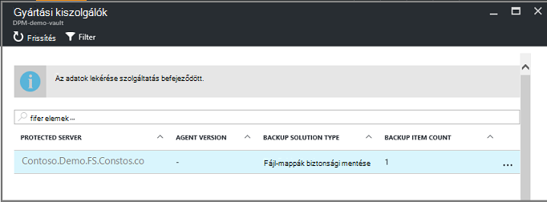

<properties
   pageTitle="Törölje az Azure biztonsági másolat tárolóból elemre |} Microsoft Azure"
   description="Hogyan lehet törölni az Azure biztonsági másolat tárolóból elemre. Hibaelhárítás, hogy miért nem lehet törölni a biztonsági másolat tárolóból elemre. "
   services="service-name"
   documentationCenter="dev-center-name"
   authors="markgalioto"
   manager="cfreeman"
   editor=""/>

<tags
   ms.service="backup"
   ms.devlang="na"
   ms.topic="article"
   ms.tgt_pltfrm="na"
   ms.workload="storage-backup-recovery"
   ms.date="08/29/2016"
   ms.author="markgal;trinadhk"/>

# Törölje az Azure biztonsági másolat tárolóból elemre.

Az Azure biztonsági másolat szolgáltatás kétféle tárolókban – a biztonsági másolat tárolóból elemre, és a helyreállítási szolgáltatások tárolóból elemre. A biztonsági másolat tárolóra első volt. Kattintson a helyreállítás szolgáltatások tárolóra jutott támogatja a kibontott erőforrás-kezelő telepítések. A bővített lehetőségeket, és az adatok függőségek, amely a tárolóból elemre kell tárolni, mert a helyreállítási szolgáltatások tárolóra törlése tűnhet nehezebb, mint a kell.

|**Telepítési típus**|**Portál**|**Tárolóra neve**|
|--------------|----------|---------|
|Klasszikus|Klasszikus|Biztonsági másolat tárolóból elemre|
|Erőforrás-kezelő|Azure|Helyreállítási szolgáltatások tárolóból elemre.|

> [AZURE.NOTE] Biztonsági másolat tárolókban nem védelme megoldások erőforrás-kezelő rendszerbe. A helyreállítási szolgáltatások tárolóból elemre segítségével azonban classically telepített kiszolgálók és VMs védelme.  

Ebben a cikkben a szerződési időszak használjuk tárolóból elemre, ha nézni szeretné a biztonsági másolat tárolóból elemre vagy a helyreállítási szolgáltatások tárolóra általános formájában. A tárolókban megkülönböztetni szükség esetén a hivatalos nevet, a biztonsági másolat tárolóból elemre vagy a helyreállítási szolgáltatások tárolóból elemre, használjuk.

## A helyreállítási szolgáltatások tárolóra törlése

A következő közvetlen áll - *biztosított a tárolóra nem tartalmazza az erőforrások*törlése a helyreállítási szolgáltatások tárolóból elemre. Mielőtt törölhet is egy helyreállítási szolgáltatások tárolóból elemre, el kell távolítania vagy törlése a tárolóból elemre az összes erőforrás. Ha megpróbálja törlése a tárolóból elemre, amely tartalmazza az erőforrásokat, nem sikerül az alábbi képen például.

  

A a tárolóból elemre az erőforrások törléséig ugyanaz a hiba jelentkezik **újra** gombra kattint a eredményez. Ha használja a következő hibaüzenet jelenik meg problémákat tapasztal, kattintson a **Mégse gombra** , és hajtsa végre az alábbi lépéseket a helyreállítási szolgáltatások tárolóból elemre az erőforrások törlése.

### Az elemek eltávolítása a tárolóból elemre egy virtuális védelme

Ha már van a helyreállítási szolgáltatások tárolóra megnyitása, ugorjon a második.

1.  Nyissa meg az Azure portált, és az irányítópult nyissa meg a törölni kívánt tárolóból elemre.

    Ha nincs telepítve a helyreállítási szolgáltatások tárolóból elemre a kiemelt hubhoz menüben az irányítópulton kattintson a **További szolgáltatások** elemre, és az erőforrások listája, írja be a **Helyreállítási szolgáltatások**. Miközben elkezdi beírni, a lista szűrők a megadott feltételeknek. Kattintson a **helyreállítás szolgáltatások tárolókban**.

      

    A tárolókban helyreállítási szolgáltatások listáját jelenik meg. A listában jelölje ki a törölni kívánt tárolóból elemre.

    

2. A tárolóból elemre nézetben tekintse meg a **Essentials** ablakban. Ha törölni szeretne egy tárolóból elemre, bármely védett elemek nem lehet. Ha megjelenik egy számot kerekít, a **Biztonságimásolat-elemek** vagy a **biztonsági másolat kezelési kiszolgálók**, nem el kell távolítania a ezeket az elemeket, mielőtt, törölheti a tárolóból elemre.

    

    VMs fájlok és mappák ilyenként elemek biztonsági mentése és jelennek meg a **Biztonsági másolat elemek** területen a Essentials ablaktábla. A **Biztonsági másolat Management Server** területen a Essentials ablaktábla DPM kiszolgáló szerepel. A webhely-helyreállítás Azure szolgáltatás **Replikált elemek** vonatkoznak.

3. Annak, hogy a védett elemek eltávolítása a tárolóból elemre, az elemek keresése a tárolóból elemre. A tárolóból elemre irányítópulton kattintson a **Beállítások**gombra, és kattintson a **biztonsági másolat elemek** , hogy a lap megnyitásához.

    

    A **Biztonsági mentés elemet** a lap van külön listában láthatók, az elem típusa alapján: Azure virtuális gépeken futó vagy fájlmappák (lásd: a kép). Az alapértelmezett elem típusa listában látható Azure virtuális gépeken futó. A tárolóra fájlmappák elemek listájának megtekintéséhez jelölje ki a **Fájl-mappákat** a legördülő menüből.

4. Elem törlése a a tárolóból elemre egy virtuális védheti, előtt az elem biztonsági mentési feladat leállítása, és törölje a helyreállítási pont adatokat. A tárolóból elemre az egyes tételeihez kövesse az alábbi lépéseket:

    egy. A **Biztonsági másolat elemeket** a lap kattintson a jobb gombbal az elemet, és a helyi menüből válassza ki a **biztonsági másolat leállítása**.

    

    A Stop biztonsági másolat lap megnyitása

    b. A **Biztonsági leállítása** a lap, a **Válasszon a lehetőségek közül** menüből válassza a **Biztonságimásolat-adatok törlése** > írja be a nevét, az elem >, és kattintson a **biztonsági másolat leállítása**gombra.

      Írja be a nevét, ellenőrizze a törölni kívánt elem. A **Biztonsági leállítása** gombra, ellenőrizze, hogy az elemet, ha nem szeretné, amíg nem aktiválja. Ha nem látható a párbeszédpanelen adja meg a biztonsági mentés elem nevét, az **Adatok biztonsági másolatának megőrzése** lehetőséget választotta.

    

      Tetszés szerint adhat meg egy oka, hogy miért törli az adatokat, és megjegyzések hozzáadása. **Állítsa le a biztonsági mentés**gombra kattintás után lehetővé teszi a törlés feladat befejeződése után próbál meg törölni a tárolóból elemre. Ha ellenőrizni szeretné, hogy a feladat befejeződött, jelölje be az Azure-üzenetek .  
   A feladat befejezése után, kapni fog egy üzenet arról leállt a biztonsági mentés és biztonsági adatok törölve lett az elemhez.

    c billentyűkombinációt. Ha töröl egy elemet a listában, kattintson a **Biztonsági másolat elemek** menü után kattintson a **frissítése** a tárolóból elemre a hátralévő elemének megtekintéséhez.

      

      Ha nincs is szerepelnek a listában, görgessen a **Essentials** ablakban kattintson a biztonsági másolat tárolóból elemre a lap. Ne merülnek fel, **biztonsági másolat elemek**, **biztonsági mentése kezelési kiszolgálók**, vagy **replikált elemek** szerepel a listában. Elemek továbbra is megjelennek a tárolóból elemre, ha a fenti három lépést vissza, és egy másik elem típusa listában válassza.  

5. Ha nincs több elemet a tárolóból elemre eszköztáron, kattintson a **Törlés**gombra.

    

6. Ellenőrizze, hogy a tárolóból elemre a törölni kívánt arra kéri, kattintson az **Igen**gombra.

    A tárolóra törlődik, és az **Új** szolgáltatás menü visszatér a portálon.

## Mi történik, ha a biztonsági mentés leállítva, de megmarad az adatokat?

Ha a biztonsági mentés leállította, de véletlenül *tartja meg* az adatokat, mielőtt törölnie kell a biztonsági mentés adatait, törölheti a tárolóból elemre. Az adatok biztonsági másolatának törlése:

1. A **Biztonsági másolat elemeket** a lap kattintson a jobb gombbal az elemet, és a helyi menüben kattintson a **biztonságimásolat-adatok törlése**.

    

    A **Biztonsági másolat adat törlése** a lap megnyitása

2. Kattintson a **Biztonsági másolat adat törlése** a lap írja be annak az elemnek a nevét, és kattintson a **Törlés**gombra.

    

    Miután törölte az adatokat, ugorjon a 4-es c, fent, és folytassa a.

## Törölje a tárolóból elemre védelme DPM kiszolgáló segítségével

Törölhet is egy tárolóra DPM kiszolgáló védelmét, mielőtt bármilyen helyreállítási pontok létrehozott törölje, és az majd unregister a kiszolgáló a a tárolóból elemre.

Az adatok védelme csoporthoz társított törlése:

1. A DPM felügyeleti konzolban kattintson a **Dokumentumvédelem**gombra, válassza ki a védelem csoportot, jelölje be a védelem csoporttag és a eszköz menüszalagján kattintson az **Eltávolítás**gombra. Ki kell választania a tagja jelenjen meg az eszköz menüszalagján az **Eltávolítás** gombra. A példában a tagja **dummyvm9**. Ha több tagok védelem csoportjában található, tartsa lenyomva a Ctrl billentyűt, jelölje be a több tagot.

    

    A **Dokumentumvédelem kikapcsolása** párbeszédpanel megnyitása

2. A **Dokumentumvédelem kikapcsolása** párbeszédpanelen válassza a **Törlés védett adatait**, és kattintson a **Dokumentumvédelem kikapcsolása**gombra.

    

    Nem szeretné megőrizni a védett adatok, mert törölje a jelet a tárolóból elemre annak érdekében, hogy törölni szeretne. Attól függően, hogy hány helyreállítási pontok és hogy mennyi adatot védelem csoportjában található, azt is eltarthat néhány másodperccel néhány perc adatait törölheti. A **Dokumentumvédelem kikapcsolása** párbeszédpanel a állapotjelzője a projekt befejezését.

    

3. Továbbra is ezt a folyamatot minden tag esetén az összes védelem csoportban.

    El kell távolítania az összes védett adatok és a védelem csoportot.

4. A védelem csoportból törlése az összes tag, után váltson az Azure-portálra. Nyissa meg a tárolóból elemre az irányítópult, és ellenőrizze, hogy nincs **Elemek biztonsági mentése**, a **biztonsági másolat kezelési kiszolgálók**sem a **replikált elemek**. A tárolóból elemre eszköztáron kattintson a **Törlés**gombra.

    

    Ha biztonsági másolat kezelési kiszolgálók regisztrált a tárolóból elemre, nem tudja törölni a tárolóból elemre, még akkor is, ha adatokat nem szerepel a tárolóból elemre. Ha Ön gondolatot a biztonsági másolat kezelési kiszolgálók társított a tárolóból elemre volna törölt, de továbbra is vannak a **Essentials** ablakban megjelenítő kiszolgálók, lásd: [Keresse meg a biztonsági másolat kezelési kiszolgálók regisztrált a tárolóból elemre](backup-azure-delete-vault.md#find-the-backup-management-servers-registered-to-the-vault).

5. Ellenőrizze, hogy a tárolóból elemre a törölni kívánt arra kéri, kattintson az **Igen**gombra.

    A tárolóra törlődik, és az **Új** szolgáltatás menü visszatér a portálon.

## A tárolóból elemre egy gyártási kiszolgáló védelme érdekében használt törlése

Mielőtt törölhet is egy tárolóból elemre egy gyártási kiszolgáló védelmét, törlése, vagy unregister a kiszolgáló a a tárolóból elemre.

A gyártási kiszolgáló a tárolóra társított törlése:

1. Az Azure-portálon nyissa meg a tárolóból elemre az irányítópult, és kattintson a **Beállítások** > **Biztonsági másolat infrastruktúra** > **Üzemi kiszolgálók**.

    

    A **Gyártási kiszolgálók** lap megnyílik, és megjeleníti a tárolóból elemre az összes üzemi kiszolgálók.

    

2. A **Gyártási kiszolgálók** lap kattintson a jobb gombbal a kiszolgálón, és kattintson a **Törlés**gombra.

    

    Ekkor megnyílik a **törlése** lap.

    

3. **Törlése** lap erősítse meg a kiszolgáló nevének a törli, és kattintson a **Törlés**gombra. Meg kell adnia a **Törlés** gomb aktiválása-kiszolgáló nevének megfelelően.

    Ha törli a tárolóból elemre, kapni fog egy üzenet arról, hogy törölve lett a tárolóból elemre. Törlése után az összes kiszolgálón a tárolóból elemre, görgessen vissza a Essentials ablakban a tárolóból elemre irányítópulton.

4. A tárolóból elemre irányítópult győződjön meg arról, sem **Elemek biztonsági mentése**, a **biztonsági másolat kezelési kiszolgálók**sem a **replikált elemek**. A tárolóból elemre eszköztáron kattintson a **Törlés**gombra.

5. Ellenőrizze, hogy a tárolóból elemre a törölni kívánt arra kéri, kattintson az **Igen**gombra.

    A tárolóra törlődik, és az **Új** szolgáltatás menü visszatér a portálon.

## A biztonsági másolat tárolóra törlése

Az alábbi lépéseket a biztonsági másolat tárolóból elemre a klasszikus portálon törlésére szolgáló vannak. Biztonsági másolat tárolóból elemre, és a helyreállítási szolgáltatások tárolóból elemre azonosak: Mielőtt törölheti a tárolóból elemre, törölje az elemeket és a megőrzött adatok.

1. Nyissa meg a klasszikus portálon.

2. Biztonsági másolat tárolókban listában jelölje ki a törölni kívánt tárolóból elemre.

    

    Ekkor megnyílik a tárolóból elemre az irányítópult. Nézze meg a számot a Windows-kiszolgálók és/vagy Azure virtuális gépek társított a tárolóból elemre. Is tekintse meg a teljes tárterület felhasznált Azure-ban. Bármilyen biztonsági mentési feladat leállítása, és törölje a meglévő adatokat a tárolóra törlés előtt kell.

3. Kattintson a **Védett elemek** fülre, és kattintson a **Dokumentumvédelem kikapcsolása** gombra

    

    Megjelenik a **"tárolóból elemre a" a Dokumentumvédelem kikapcsolása** párbeszédpanel.

4. **Állítsa le a tárolóra"védelme** párbeszédpanelen jelölje be, **társított biztonsági adatok törlése** , és kattintson .  
   Tetszés szerint válassza ki a védelem leállítása okát, és adja meg a megjegyzés.

    

    A tárolóból elemre a törlés után üres lesz a tárolóból elemre.

    

5. Lapok listájában kattintson a **Registered elemek**. Minden elemhez regisztrált a tárolóból elemre jelölje ki az elemet, és kattintson a **Unregister**.

    

6. Lapok listájában kattintson az **Irányítópult** adott lap megnyitásához. Ellenőrizze, hogy nem regisztrált kiszolgálók, sem a Azure virtuális gépeken futó védett a felhőben. Azt is ellenőrizze a tárhely nincs adat. Kattintson a **Törlés** törlése a tárolóból elemre.

    

    Ekkor megnyílik a tárolóból elemre biztonsági törlése megerősítési képernyőn. Válasszon egy beállítást, miért töröl a tárolóból elemre, és kattintson a .  

    

    A program törli a tárolóból elemre, és a klasszikus portál irányítópult vissza.

### Keresse meg a biztonsági másolat Management kiszolgálók regisztrált a tárolóból elemre

Ha több kiszolgálók regisztrált a tárolóból elemre, ne feledje, hogy azok nehéz lehet. Lásd: a kiszolgálók regisztrált a tárolóból elemre, és törölje őket:

1. Nyissa meg a tárolóból elemre az irányítópult.

2. Az **Essentials** munkaablakban kattintson a **Beállítások** , hogy a lap megnyitásához.

    

3. Kattintson a **Beállítások lap**, a **Biztonsági másolat infrastruktúra**.

4. Kattintson a **Biztonsági másolat infrastruktúra** lap **Biztonsági másolat kezelési kiszolgálók**. A biztonsági másolat kezelési kiszolgálók lap megnyitása

    

5. Kiszolgáló törlése a listából, kattintson a jobb gombbal a kiszolgáló nevét, és kattintson a **Törlés**gombra.
    Ekkor megnyílik a **törlése** lap.

6. Adja meg a kiszolgáló nevének **törlése** lap. Ha egy hosszú nevet, másolja a vágólapra, és illessze be a biztonsági másolat kezelési kiszolgálók listájából. Ezután kattintson a **Törlés**parancsra.  
