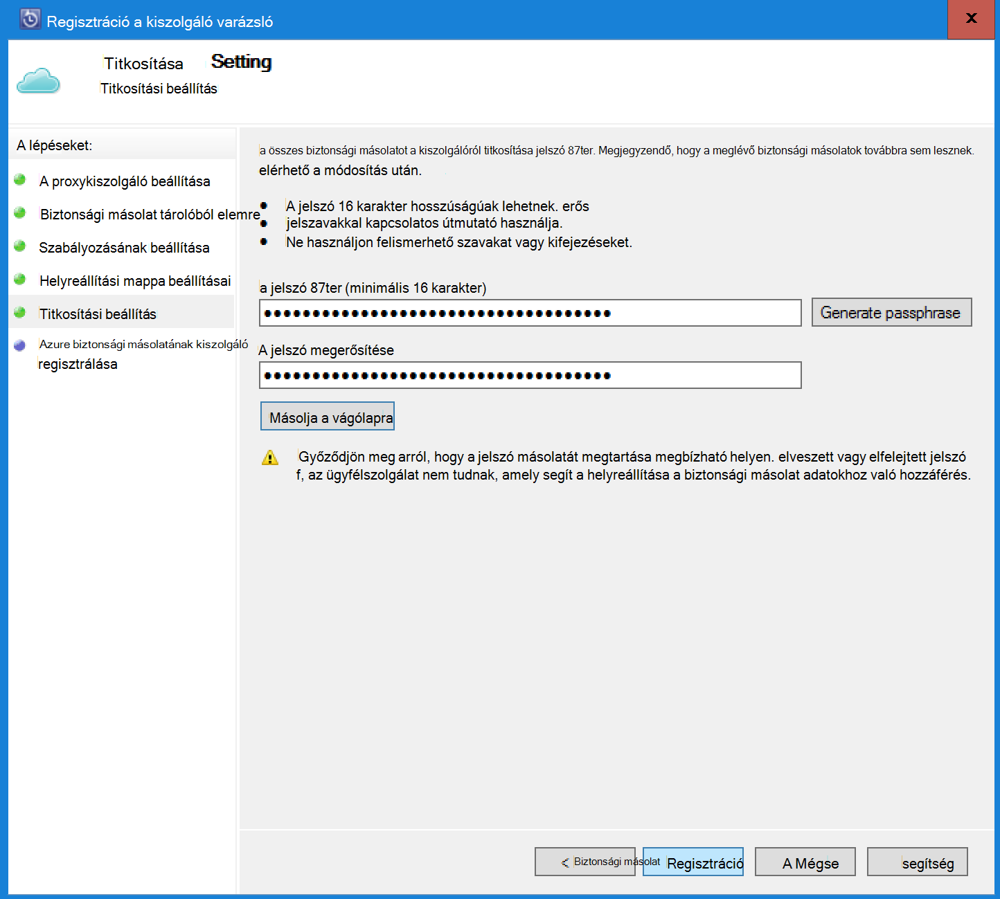

<properties
    pageTitle="Azure DPM biztonsági másolat – bevezetés |} Microsoft Azure"
    description="Az Azure biztonsági másolat szolgáltatással DPM kiszolgálók mentésével bemutatása"
    services="backup"
    documentationCenter=""
    authors="Nkolli1"
    manager="shreeshd"
    editor=""
    keywords="System Center adatok védelme Manager, adatkezelő védelmét, dpm biztonsági mentése"/>

<tags
    ms.service="backup"
    ms.workload="storage-backup-recovery"
    ms.tgt_pltfrm="na"
    ms.devlang="na"
    ms.topic="article"
    ms.date="08/08/2016"
    ms.author="trinadhk;giridham;jimpark;markgal;adigan"/>

# Biztonsági másolat készítése munkaterhelésekből DPM az Azure előkészítése

> [AZURE.SELECTOR]
- [Azure biztonsági kiszolgálón](backup-azure-microsoft-azure-backup.md)
- [SCDPM](backup-azure-dpm-introduction.md)
- [Azure biztonsági Server (klasszikus)](backup-azure-microsoft-azure-backup-classic.md)
- [SCDPM (klasszikus)](backup-azure-dpm-introduction-classic.md)

Ez a cikk a Microsoft Azure mentéssel védelmét, a rendszer központ adatok védelme Manager (DPM) kiszolgálók és a feladatok áttekintése. Azt olvasásával fogja látnia:

- Hogyan működik a Azure DPM kiszolgáló biztonsági mentése
- Egy zökkenőmentes biztonsági élmény érdekében az Előfeltételek
- A szokásos hibák és a velük kezelése
- Támogatott felhasználási területei

> [AZURE.NOTE] Azure magában az erőforrások létrehozásáról és használatáról a két környezetben modellek: [az erőforrás-kezelő és klasszikus](../resource-manager-deployment-model.md). Ebben a cikkben az információkat és eljárásokat az erőforrás-kezelő modell rendszerbe VMs visszaállításához.

System Center DPM biztonsági másolatot készít a fájl- és adatok. Biztonsági másolat DPM adatok lehetnek a lemezen, a szalag-on tárolt vagy biztonsági másolat a Microsoft Azure mentéssel Azure. DPM hogyan kommunikáljon a Azure biztonsági mentése az alábbi képlettel történik:

- **Fizikai kiszolgáló vagy a helyszíni virtuális gép DPM telepítése** – Ha DPM telepítik egy helyszíni a Hyper-V virtuális gép biztonsági másolatot készíthet adatok mellett a lemez és a szalag egy helyreállítási szolgáltatások tárolóból elemre kattintva vagy a fizikai kiszolgáló biztonsági.
- **Az Azure virtuális gép szerint rendszerbe DPM** – a System Center 2012 R2 frissítés 3, DPM telepíthető az Azure virtuális gép szerint. Ha DPM telepítik az Azure virtuális gép biztonsági másolatot készíthet adatok Azure lemezre, a DPM Azure virtuális géphez csatlakoztatott, vagy, adatok tárolására is kiürítése által mögötte felfelé egy helyreállítási szolgáltatások tárolóból elemre.

## Miért biztonsági mentést DPM az Azure?

Azure biztonsági másolat használata DPM kiszolgálók mentésével üzleti előnyei többek között:

- A helyszíni DPM telepítéshez Azure szalag hosszú távú telepítés alternatívájaként is használhatja.
- Azure-ban DPM telepítésekhez Azure biztonsági mentése lehetővé teszi az Azure lemezről tároló kiürítése lehetővé teszi, hogy régebbi adatokat tárolja a helyreállítási szolgáltatások tárolóból elemre, és új lemezen méretezni.

## Előfeltételek
Készítse elő az Azure biztonsági másolat adatok biztonsági mentéséhez DPM az alábbi képlettel történik:

1. **A helyreállítási szolgáltatások tárolóra létrehozása** – a tárolóból elemre létrehozása az Azure-portálon.
2. **Letöltés tárolóra hitelesítő adatait** – töltse le a hitelesítő adatokat, mellyel regisztrálhatja a DPM kiszolgáló helyreállítási szolgáltatások tárolóból elemre.
3. **Telepítse az Azure biztonsági másolat ügynök** – Azure másolatból ügynököt a DPM-kiszolgálókon.
4. **A kiszolgáló regisztrálása** – regisztrálhatja a DPM kiszolgáló helyreállítási szolgáltatások tárolóból elemre.

### 1. a helyreállítási szolgáltatások tárolóra létrehozása
A helyreállítási szolgáltatások tárolóra létrehozása:

1. Jelentkezzen be az [Azure-portálon](https://portal.azure.com/).

2. A központi menüben kattintson a **Tallózás gombra** , és az erőforrások listája, írja be a **Helyreállítási szolgáltatások**. Gépelés megkezdésekor a listában a rendszer kiszűri a megadott feltételeknek. Kattintson a **helyreállítás szolgáltatások tárolóból elemre**.

    

    A tárolókban helyreállítási szolgáltatások listáját jelenik meg.

3. A **helyreállítási szolgáltatások tárolókban** menüben kattintson a **Hozzáadás**gombra.

    

    Megnyílik a helyreállítási szolgáltatások tárolóból elemre a lap, kéri, adja meg **nevét**, **előfizetés**, **erőforráscsoport**és **helyét**.

    

4. A **név**írja be egy rövid nevet, amely azonosítja a tárolóból elemre. A név van szüksége az Azure előfizetés egyedinek kell lennie. Adjon egy nevet, amely a 2 és 50 karakter közötti tartalmazza. Egy betűvel kell kezdődnie, és csak betűket, számokat és kötőjelet is tartalmazhat.

5. Kattintson az **előfizetés** az előfizetések elérhető listájának megjelenítéséhez. Ha nem biztos abban, hogy mely előfizetés használni, használja az alapértelmezett (vagy a javasolt) előfizetés. Lesznek több lehetőség csak akkor, ha a szervezeti fiók társítva több Azure előfizetés.

6. **Erőforráscsoport** a rendelkezésre álló erőforráscsoport listájának megtekintéséhez, vagy hozzon létre egy új erőforráscsoport **Új** gombra. Az erőforrás csoportok átfogó információt a [Azure erőforrás-kezelő áttekintése](../azure-resource-manager/resource-group-overview.md) című témakörben találhat.

7. Kattintson a **hely** jelölje ki a földrajzi régióban esetében a tárolóból elemre.

8. Kattintson a **létrehozása**gombra. Eltarthat egy ideig a létrehozandó a helyreállítási szolgáltatások tárolóból elemre. Figyelje meg a állapotát jelző a portál jobb felső területén.
Amikor létrejött a tárolóból elemre, megnyílik a portálon.

### Tárterület-replikáció beállítása

A tároló replikációs beállítással geo felesleges tároló és a helyi meghajtóra felesleges szolgáltatások közül választhat. Alapértelmezés szerint a tárolóból elemre a geo felesleges tároló tartalmaz. Kilépés a geo felesleges tárolóhoz beállítása, ha ez az elsődleges biztonsági mentése lehetőséget. Válassza a helyi meghajtóra felesleges tárhely, ha azt szeretné, hogy egy olcsóbb beállítást, amely nem igazán tartós. További információk [geo felesleges](../storage/storage-redundancy.md#geo-redundant-storage) és a [helyi meghajtóra felesleges](../storage/storage-redundancy.md#locally-redundant-storage) -tárolási lehetőségek a az [Azure tároló replikációs – áttekintés](../storage/storage-redundancy.md).

A tároló replikációs beállításainak módosítása:

1. Jelölje ki a tárolóból elemre kattintva nyissa meg a tárolóból elemre az irányítópult és a beállítások lap. A **Beállítások** lap nem nyílik meg, ha a tárolóból elemre az irányítópult kattintson a **minden beállításai** parancsra.

2. Kattintson a **Beállítások** lap a **Biztonsági másolat infrastruktúra** > **Biztonsági másolat konfigurációs** a **Biztonsági mentés beállításainak** lap megnyitásához. A **Biztonsági mentés beállításainak** lap válassza a tárterület replikációs lehetőséget a tárolóból elemre.

    

    Miután kiválasztotta a tárolóból elemre a tárolási lehetőség, készen áll a virtuális társítani a tárolóból elemre. A társítási indításához kell Fedezze fel, és regisztráljon az Azure virtuális gépeken futó.

### 2. a tárolóból elemre hitelesítő adatok letöltése

A tárolóból elemre hitelesítő adatok fájl minden biztonsági tárolóból elemre a portál által generált tanúsítvány. A portál majd feltölti a nyilvános kulcshoz az Access vezérlő szolgáltatást (ACS). A titkos kulcs a tanúsítvány elérhetővé válik a felhasználónak a munkafolyamatot, amely meg van adva a gép regisztrációs munkafolyamat-bemeneteként részeként. Ez hitelesíti a gép adatok biztonsági másolatának küldése a biztonsági másolat Azure szolgáltatás egy azonosított tárolóból elemre.

A tárolóból elemre hitelesítő csak a regisztrációs munkafolyamat során használják. Feladata a felhasználó annak érdekében, hogy a tárolóból elemre hitelesítő adatok fájl nem sérül. A pálcikák bármely engedélyezetlen felhasználó tartozik, ha a tárolóból elemre hitelesítő adatok fájlt használható regisztrálása más gépek szemben az azonos tárolóból elemre. Jó helyen jár az adatok biztonsági másolatának egy jelszót, amelyhez tartozik az ügyfélnek titkosított, mint a meglévő adatok biztonsági másolatának nem sérül. Csökkentésében ezt a problémát, tárolóra hitelesítő adatok beállítása 48hrs múlva lejár. Töltse le a tárolóból elemre hitelesítő adatokat a helyreállítási szolgáltatások tetszőleges számú alkalommal – azonban csak a legújabb tárolóra hitelesítő adatok fájl alkalmazható a regisztrációs munkafolyamat során.

A tárolóból elemre hitelesítőadat-fájl letöltése az Azure portálról biztonságos csatornát keresztül. Az Azure biztonsági másolat szolgáltatás tudomása a titkos kulcs a tanúsítvány és a titkos kulcs nem állandó a portálon vagy a szolgáltatás. Kövesse az alábbi lépéseket a tárolóból elemre hitelesítőadat-fájl letöltése a helyi számítógépre.

1. Jelentkezzen be az [Azure-portálon](https://portal.azure.com/).

2. Nyissa meg helyreállítási szolgáltatások tárolóból elemre, amelyhez, amely szeretné DPM regisztrálhatja a gép.

3. Beállítások lap alapértelmezés szerint nyílik meg. Ha meg van nyitva, kattintson a **Beállítások** elemre kattintva nyissa meg a beállítások lap tárolóra irányítópulton. Beállítások lap kattintson a **Tulajdonságok parancsot**.

    

4. A Tulajdonságok lapon kattintson a **Letöltés** **Biztonsági másolat hitelesítő adatok**területén. A portál hoz létre a hitelesítő adatok letöltésre elérhetővé válik tárolóra fájlt.

    

A portál hoz létre egy tárolóból elemre a hitelesítő adatok használata a tárolóból elemre nevét és az aktuális dátumot. Kattintson a **Mentés** töltse le a helyi fiók letöltések mappában a tárolóból elemre hitelesítő adatokat, vagy válassza a Mentés másként parancsot a Mentés adjon meg egy helyet a tárolóból elemre hitelesítő adatokat. A létrehozandó fájl perccé alakít megnyílik.

### Megjegyzés:
- Győződjön meg arról, hogy a tárolóból elemre hitelesítő adatok fájlt mentette olyan helyre, ahol a számítógépről is elérhető. Ha egy fájl megosztás/kis-és Középvállalatok van tárolva, jelölje be a a hozzáférési engedélyek.
- Csak a regisztrációs munkafolyamat során a tárolóból elemre hitelesítő adatok fájlt használ.
- A tárolóból elemre hitelesítő adatok fájl 48hrs után jár le, és a portálról letölthető.

### 3. a biztonsági másolat Agent telepítése

Miután létrehozta a Azure biztonsági másolat tárolóból elemre, ügynökszoftvert egyes a Windows gépek (Windows Server, Windows-ügyfél, System Center adatok védelme Manager kiszolgáló vagy Azure biztonsági másolat Server számítógépen), amely lehetővé teszi, hogy készítsen biztonsági másolatot az adatokat és Azure alkalmazásokat kell telepíteni.

1. Nyissa meg helyreállítási szolgáltatások tárolóból elemre, amelyhez, amely szeretné DPM regisztrálhatja a gép.

2. Beállítások lap alapértelmezés szerint nyílik meg. Ha meg van nyitva, nyissa meg a beállítások lap **Beállítások** parancsára. Beállítások lap kattintson a **Tulajdonságok parancsot**.

    

3. A beállítások lapon kattintson az **Azure biztonsági másolatot ügynök**a **Letöltés** gombra.

    

   A agent letöltése után kattintson duplán az Azure biztonsági másolat ügynök a telepítés elindításához MARSAgentInstaller.exe. Válassza a telepítés és a agent szükséges üres mappát. A megadott gyorsítótár helyét szabad területet, amely az adatok biztonsági másolatának legalább 5 %-át kell rendelkeznie.

4.  Ha a proxykiszolgáló használatával csatlakozik az internethez, a **Proxybeállítások** képernyőn adja meg a proxy kiszolgáló adatait. Ha hitelesítéssel működő proxy használja, a képernyőn írja be a felhasználó nevét és jelszavát adatai.

5.  Az Azure Backup agent .NET-keretrendszer 4.5 és telepítése a Windows PowerShell (Ha még nem szerepel érhető el) a telepítés befejezéséhez.

6.  Miután telepített a agent, **szoros** az ablak.

    

7. **DPM kiszolgáló regisztrálása** a tárolóból elemre, kattintson **a lapra** kattintson az **Online**. Válassza a **regisztráció**. Ennek hatására megnyílik a regisztráció beállítási varázsló.

8. Ha a proxykiszolgáló használatával csatlakozik az internethez, a **Proxybeállítások** képernyőn adja meg a proxy kiszolgáló adatait. Ha hitelesítéssel működő proxy használja, a képernyőn írja be a felhasználó nevét és jelszavát adatai.

    

9. Tallózással keresse meg a hitelesítő adatok képernyőn tárolóból elemre, és jelölje ki a tárolóból elemre hitelesítő adatok fájlt, amely a korábban letöltött.

    

    A tárolóból elemre hitelesítő adatok fájl csak érvényes 48 óra (a portálról letöltés) után. Ha bármilyen hiba az alábbi képernyő (például "tárolóból elemre hitelesítő adatok már lejárt a megadott fájl"), jelentkezzen be az Azure-portál és -tárolóra hitelesítő adatok ismét a fájl letöltése.

    Arról, hogy a tárolóból elemre hitelesítő adatok fájl érhető el a telepítő alkalmazás által elérhető helyen. Ha elérése a kapcsolódó hibák, ezen a számítógépen egy ideiglenes helyre másolja a tárolóból elemre hitelesítő adatok fájlt, és ismételje meg a műveletet.

    Ha érvénytelen tárolóra hitelesítő adatok hiba (például "érvénytelen tárolóra hitelesítő adatok feltéve") a fájl sérült, vagy nem nem a legújabb hitelesítő adatok társított a helyreállítás szolgáltatással. Új tárolóból elemre hitelesítőadat-fájl letöltésével a portálon múlva próbálkozzon ismét. Ezt a hibát jellemzően látható, ha a felhasználó a **Letöltés tárolóra hitelesítő** funkciót, az Azure-portálon rövid egymás után. Ebben az esetben csak a második tárolóra hitelesítő adatok fájl nem érvényes.

10. Használatát a hálózat sávszélessége szabályozhatja a munkáját, és nem munka óra, a **Szabályozásának beállítása** képernyőn közben is sávszélesség-használat korlátokat és a munka definiálása és nem munka óra.

    

11. A **Helyreállítási mappa beállítása** képernyőn keresse meg a mappát, ahová a Azure letöltött fájlokat fog kell ideiglenes előkészített.

    

12. A **titkosítási beállítás** képernyőn készítése egy jelszót, vagy adja meg egy jelszót (legalább 16 karaktert). Ne feledje, hogy a jelszó mentése biztonságos helyen.

    

    > [AZURE.WARNING] Ha a jelszó elveszett vagy elfelejtett; Microsoft súgó nem az adatok biztonsági másolatának visszaállítása. A végfelhasználó tulajdonosa a titkosítási jelszó és a Microsoft nem rendelkezik betekintést kap abba, hogy a felhasználó által használt jelszó. Mentse a fájlt egy biztonságos helyen, mert szükséges a helyreállítási művelet során.

13. A **regisztráció** gombra kattint, a gép regisztrálva van sikeresen a tárolóból elemre, és most már készen áll a kezdésre biztonsági mentést Microsoft Azure.

14. Amikor az adatkezelő védelmet, a **beállítás** parancsra kattintva az **Online** csoportban a **kezelés** fülre kattintva során a regisztrációs munkafolyamat megadott beállítások módosíthatók.

## Követelmények (és érvényes korlátozások)

- DPM fizikai kiszolgáló vagy a Hyper-V virtuális gép System Center 2012 SP1 vagy System Center 2012 R2 rendszeren futtatható. Is futhat-Azure virtuális gépen futó legalább System Center 2012 R2, mint DPM 2012 R2 frissítés összesítő 3-as vagy egy Windows virtuális gép VMWare legalább futó System Center 2012 R2 a frissítés összesítő 5.
- Ha DPM futtat System Center 2012 SP1 telepítenie kell frissítés vihetők a 2 System Center védelem adatkezelő SP1. Szükség, mielőtt telepíthetné az Azure biztonsági másolat ügynök.
- A DPM kiszolgálón van, hogy a Windows PowerShell és a .net keretrendszer 4.5 telepítve.
- DPM biztonsági másolatot készíthet a legtöbb munkaterhelésekből Azure biztonsági másolatot készít. Lásd: Mi támogat teljes listáját a Azure biztonsági mentés támogatja az alábbi elemek.
- Azure biztonsági másolat tárolt adatok nem állíthatók "szalag Másolás" lehetőséggel.
- Az Azure biztonsági mentés funkciót engedélyezve van szüksége lesz az Azure-fiók. Nem rendelkeznek fiókkal, ha mindössze néhány perc is létrehozhat ingyenes próba-fiók. További információ: [Azure biztonsági másolat árak](https://azure.microsoft.com/pricing/details/backup/).
- Azure biztonsági másolat használatához az Azure biztonsági másolat ügynök készítsen biztonsági másolatot szeretne kiszolgálókon telepítve legyen. Minden kiszolgáló másolat készül, amelyekhez helyi ingyenes tárhelyet adatokat méretének legalább 5 %-át kell rendelkeznie. Például 100 GB-nyi adatok biztonsági másolatának szükséges legalább 5 GB szabad lemezterület az üres helyen.
- Adatok az Azure tárolóra tárolója szeretne tárolni. Nincs korlátozás akkor is vissza felfelé az Azure biztonsági másolat vault adatok mennyiségét, de egy adatforráshoz (például egy virtuális gép vagy egy adatbázis) mérete ne haladja meg a 54400 GB.

A következő fájltípusok támogatott Azure felfelé vissza:

- Titkosított (teljes biztonsági másolatok csak)
- Tömörített (növekményes biztonsági támogatott)
- A ritka (növekményes biztonsági támogatott)
- Tömörített és ritka (Sparse kezelt)

És ezek nem támogatott:

- Nem támogatott a fájlrendszerben kis-és nagybetűket kiszolgálóján.
- Rögzített hivatkozások (kihagyott)
- Újraelemzési pontok (kihagyott)
- Titkosított és tömörített (kihagyott)
- Titkosított és ritka (kihagyja)
- Tömörített adatfolyam
- A ritka adatfolyam

>[AZURE.NOTE] A System Center 2012 DPM SP1-től a akkor is készítsen biztonsági másolatot fel a Microsoft Azure biztonsági másolat eszközzel Azure DPM védett munkaterhelésekből.
