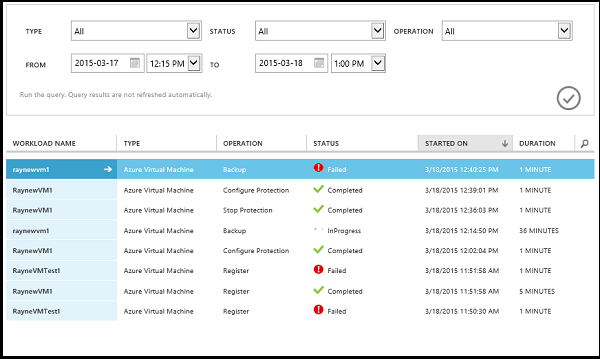
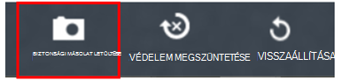
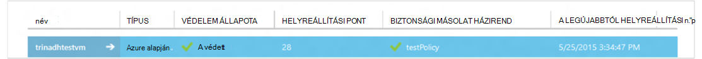

<properties
    pageTitle="Kezelése, és figyelemmel követheti az Azure virtuális gép biztonsági másolatok |} Microsoft Azure"
    description="Megtudhatja, hogy miként kezelheti, és az Azure virtuális gép biztonsági másolatok figyelése"
    services="backup"
    documentationCenter=""
    authors="trinadhk"
    manager="shreeshd"
    editor=""/>

<tags
    ms.service="backup"
    ms.workload="storage-backup-recovery"
    ms.tgt_pltfrm="na"
    ms.devlang="na"
    ms.topic="article"
    ms.date="08/31/2016"
    ms.author="trinadhk; jimpark; markgal;"/>

# <a name="manage-and-monitor-azure-virtual-machine-backups"></a>Kezelése és Azure virtuális gép biztonsági másolatok figyelése

> [AZURE.SELECTOR]
- [Azure virtuális biztonsági másolatok kezelése](backup-azure-manage-vms.md)
- [Klasszikus virtuális biztonsági másolatok kezelése](backup-azure-manage-vms-classic.md)

Ez a cikk gyakori kezelési és a Klasszikus-modell védett az Azure virtuális gépeken futó felügyeleti feladatok információt tartalmaz.  

>[AZURE.NOTE] Azure van két telepítési modellekkel létrehozásáról és használatáról az erőforrások: [az erőforrás-kezelő és klasszikus](../resource-manager-deployment-model.md). Témakörben [a környezet Azure virtuális gépeken futó mentéséről](backup-azure-vms-prepare.md) további információt a klasszikus telepítési modell VMs használata.

## <a name="manage-protected-virtual-machines"></a>Védett virtuális gépeken futó kezelése

Védett virtuális gépeken futó kezelése:

1. Megtekintheti és kezelheti a biztonsági mentés beállításait a virtuális géphez kattintson a **Védett elemek** fülre.

2. Kattintson a védett elemhez, hogy a **Biztonsági másolat** részletekre, amely jelzi, hogy az utolsó biztonsági mentéssel kapcsolatos információkért lásd a nevére.

    

3. Megtekintheti és kezelheti a biztonsági másolat házirend virtuális gép beállításai a **házirendek** fülre kattintva.

    

    A **Biztonsági másolat házirendek** lapon megtekintheti a meglévő házirend. Igény szerint módosíthatja. Ha létre kell hoznia egy új házirendet kattintson a **Létrehozás** gombra a **házirendek** lapon. Ne feledje, hogy ha el szeretne távolítani egy házirendet, ne bármely virtuális gépeken futó társítva.

    

4. További információt a műveletek vagy állapota kaphat a **feladatok** lap virtuális géphez. Kattintson egy feladatra a listában, további részleteket, vagy egy adott virtuális gép feladatok szűréséhez.

    

## <a name="on-demand-backup-of-a-virtual-machine"></a>A virtuális gép igény szerinti biztonsági másolata
Az igény szerinti virtuális gép biztonsági másolatot készíthet, miután védelem be van állítva. Ha a kezdeti biztonsági mentés folyamatban a virtuális gép az igény szerinti biztonsági másolat hoz létre a virtuális gép teljes példányával Azure biztonsági tárolóból elemre. Ha első biztonsági másolat befejeződik, igény szerinti biztonsági fog csak küldés módosításai előző biztonsági másolatból Azure biztonsági másolat vault tehát azt értéke mindig egyre növekvő tendenciát mutat.

>[AZURE.NOTE] Az igény szerinti biztonsági másolat adatmegőrzési cellatartomány a virtuális megfelelő biztonsági házirend napi adatmegőrzési megadott adatmegőrzési értékre van állítva.  

Az igény szerinti virtuális gép biztonsági másolat készítése:

1. A **Védett elemek** lapon keresse meg és jelölje ki a **Azure virtuális gép** **típusa** (Ha még nincs bejelölve), és kattintson a **Kijelölés** gombra.

    

2. Jelölje ki a virtuális gépen, amelyen létre szeretné az igény szerinti biztonsági készíthet, és kattintson a **Biztonsági másolat letöltése** gombra a lap alján.

    

    A kijelölt virtuális gépen ez hoz létre egy biztonsági mentési feladat. A feladat keresztül létrehozott helyreállítási pont adatmegőrzési cellatartomány ugyanaz, mint a házirendet a virtuális gép társított megadott lesz.

    

    >[AZURE.NOTE] A virtuális gép társított házirend megtekintéséhez részletezést virtuális gép **Védett elemek** lapon, és nyissa meg a biztonsági másolat házirend lapon.

3. A feladat jön létre, ha a **feladat megtekintése** gombra a bejelentési sáv megjelenítéséhez a feladatok lapon a megfelelő feladat kattinthat.

    

4. A feladat sikeres befejezését követően a helyreállítási pont hoz létre, amely a virtuális gép visszaállítása is használhatja. Ez is növelik a helyreállítási pont oszlop értéke 1 **Védett elemek** lapon.

## <a name="stop-protecting-virtual-machines"></a>Virtuális gépeken futó védelem megszüntetése
Beállíthatja, hogy le szeretné állítani a jövőbeli biztonsági másolatait virtuális gép, a következő beállításokat:

- Azure biztonsági tárolóból elemre a virtuális gép társított adatok biztonsági másolatának megőrzése
- Virtuális gép társított adatok biztonsági másolatának törlése

Ha be van jelölve a virtuális gép társított adatok biztonsági másolatának megőrzése, az adatok biztonsági másolatának visszaállítása a virtuális gép is használhatja. Az ilyen virtuális gépeken futó vonatkozó árak, kattintson [ide](https://azure.microsoft.com/pricing/details/backup/).

Virtuális gép védelem megszüntetése:

1. **Védett elemek** lapon keresse meg és jelölje ki a **Azure virtuális gép** a szűrő típusa (Ha még nincs bejelölve), és kattintson a **Kijelölés** gombra.

    

2. Jelölje ki a virtuális gép, majd kattintson a **Dokumentumvédelem kikapcsolása** az oldal alján.

    

3. Alapértelmezés szerint Azure biztonsági nem törli a virtuális gép társított adatok biztonsági másolatának.

    

    Ha az adatok biztonsági másolatának törölni szeretne, jelölje be a jelölőnégyzetet.

    

    Válassza ki a biztonsági mentés leállítása okát. Ez a lépés nem kötelező, ok megadása segít Azure biztonsági másolat használata a visszajelzést, és prioritást rendelhet az ügyfél jelenik meg.

4. Kattintson a **Küldés** gombra a **Dokumentumvédelem kikapcsolása** feladat küldhetik. Kattintson a **Feladat megtekintése** a megfelelő a feladatot a **feladatok** lap megjelenítéséhez.

    

    Nem jelölt során a **Dokumentumvédelem kikapcsolása** varázsló, majd a bejegyzés a feladat befejezése **társított biztonsági adatok törlése** beállítást, ha védelem állapotra változik **Védelem leállt**. Az adatok megmaradnak Azure mentéssel marad explicit módon. Mindig törölheti az adatokat, jelölje ki a virtuális gép a **Védett elemek** lapra, és kattintson a **Törlés**parancsra.

    

    Ha be van jelölve a **társított biztonsági adatok törlése** beállítást, a virtuális gép nem része a **Védett elemek** lapon.

## <a name="re-protect-virtual-machine"></a>Virtuális gép újra védelme
**Dokumentumvédelem kikapcsolása**nem választotta a **Törlés társítása biztonsági** lehetőséget, ha ismét megvédheti a virtuális gép hasonló regisztrált virtuális gépeken futó mentésével lépéseket követve. Amikor védett, a virtuális számítógéphez fog védelem megszüntetése előtt tartja meg az adatok biztonsági másolatának és helyreállítási pontok létrehozott után újra védelme.

Után újra védelme a virtuális gép védelem állapot változik a **védett** helyreállítási pontok előtt a **Dokumentumvédelem kikapcsolása**esetén.

  

>[AZURE.NOTE] Amikor újra védheti a virtuális gép, megadhatja, hogy a házirendet, amellyel virtuális gép védett először egy másik szabályt.

## <a name="unregister-virtual-machines"></a>Virtuális gépeken futó unregister

Ha el szeretné távolítani a virtuális gép a a biztonsági másolat tárolóból elemre:

1. Kattintson a lap alján a **UNREGISTER** gombra.

    

    Bejelentési értesítés jelenik meg a megerősítést kérő képernyő alján. Kattintson az **Igen gombra** a folytatáshoz.

    

## <a name="delete-backup-data"></a>Biztonsági másolat adat törlése
Adatok biztonsági másolatának virtuális gép, akár társított törölheti:

- Leállítás védelem feladat közben
- Védelem megszüntetése után feladat befejezése után egy virtuális gépen

Törlése a biztonságimásolat-adatok, amelyek *Védelmet leállt* állapotban van virtuális gépen közzé **Egy leállítása biztonsági mentési** feladat sikeres befejezésétől:

1. Nyissa meg a **Védett elemek** lapot, és jelölje ki az **Azure virtuális gép** *típusa* , és kattintson a **Kijelölés** gombra.

    

2. Jelölje ki a virtuális gépen. A virtuális gép **Védelem leállítva** állapotban lesz.

    

3. Kattintson a lap alján a **Törlés** gombra.

    

4. Az **adatok biztonsági másolatának törlése** varázslóban jelölje ki a törlése (ajánlott) adatok biztonsági másolatának okát, és kattintson a **Küldés gombra**.

    

5. A feladat törlése a kijelölt virtuális gép adatok biztonsági másolatának ez hoz létre. Kattintson a feladatok lapon a megfelelő feladat **feladat megtekintése** gombra.

    

    A feladat befejezése után a szöveg a virtuális gép megfelelő kikerül **védett elemek** lapon.

## <a name="dashboard"></a>Irányítópult
Az **Irányítópult** lapon megtekintheti az Azure virtuális gépeken futó, a tárhely és a feladatok az elmúlt 24 óra a velük társított adatait. Biztonsági másolat állapot és a kapcsolódó biztonsági hibák megtekintése.


>[AZURE.NOTE] Az irányítópult értékek 24 óránként frissülnek.

## <a name="auditing-operations"></a>A naplózás műveletek
Azure biztonsági másolat Itt a "művelet naplók" a biztonsági mentés ezzel leegyszerűsítve látható, pontosan milyen adatkezelési műveletek volt a biztonsági másolat tárolóra végzett ügyfél által indított áttekintése. Műveletek naplók remek utólagos engedélyezése, és a biztonsági mentés támogatása naplózási.

A művelet naplók jelentkezett a következő műveleteket:

- Regisztráció
- Unregister
- Védelem beállítása
- Biztonsági másolat (mindkét ütemezett és igény szerinti biztonsági másolat BackupNow keresztül)
- Visszaállítása
- Védelem megszüntetése
- Adatok biztonsági másolatának törlése
- Házirend beállítása
- Szabály törlése
- Házirend módosítására
- Feladat megszakítása

A biztonsági másolat tárolóra tartozó művelet naplók megtekintése:

1. Nyissa meg az Azure-portálon **szolgáltatások** , és kattintson a **Művelet naplók** fülre.

    

2. A a szűrők területen jelölje be a **biztonsági mentés** másként *Fájltípus-lista* , és adja meg a biztonsági másolat tárolóra nevét a *szolgáltatás neve* , és kattintson a **Küldés gombra**.

    

3. A műveletek naplókban válassza a minden olyan művelet, majd kattintson a **Részletek** művelet megfelelő részletek megtekintéséhez.

    

    A **Részletek varázsló** elindul, a művelet feladat, amelyre ez a művelet induljanak, majd a művelet elindítása erőforrás-azonosító információkat tartalmazza.

    

## <a name="alert-notifications"></a>Értesítések
A feladatok egyéni értesítéseket kaphat portálon. Ez a működési naplók események PowerShell rendszerű riasztási szabályok megadásával érhető el. Használata ajánlott *PowerShell verzió 1.3.0 vagy újabb*.

Egy minta parancs szeretne megadni egy egyéni biztonsági hibák esetében a felhasználó értesítése, miként fog kinézni:

```
PS C:\> $actionEmail = New-AzureRmAlertRuleEmail -CustomEmail contoso@microsoft.com
PS C:\> Add-AzureRmLogAlertRule -Name backupFailedAlert -Location "East US" -ResourceGroup RecoveryServices-DP2RCXUGWS3MLJF4LKPI3A3OMJ2DI4SRJK6HIJH22HFIHZVVELRQ-East-US -OperationName Microsoft.Backup/backupVault/Backup -Status Failed -TargetResourceId /subscriptions/86eeac34-eth9a-4de3-84db-7a27d121967e/resourceGroups/RecoveryServices-DP2RCXUGWS3MLJF4LKPI3A3OMJ2DI4SRJK6HIJH22HFIHZVVELRQ-East-US/providers/microsoft.backupbvtd2/BackupVault/trinadhVault -Actions $actionEmail
```

**ResourceId**:, amely letölthető a műveletek naplók előugró feletti szakaszban leírtak szerint. Részletezés előugró ablakban az során ResourceUri az ezzel a parancsmaggal szállítandó ResourceId.

**OperationName**: Ez a formátum lesz "Microsoft.Backup/backupvault/<EventName>" Ha EventName külső.FÜGGV, Unregister, ConfigureProtection közül, készítsen biztonsági másolatot, StopProtection, DeleteBackupData, CreateProtectionPolicy, DeleteProtectionPolicy, UpdateProtectionPolicy visszaállításához

**Állapot**: támogatott értékek – lépések, amelyek a sikeres és sikertelen volt.

**ResourceGroup**: az erőforrás, amelyen a művelet induljanak ResourceGroup. Ez ResourceId értékből szerezhet be. Mezők */resourceGroups/* és */providers/* ResourceId érték közötti értékkel ResourceGroup érték.

**Név**: a riasztási szabály nevét.

**CustomEmail**: Adja meg az egyéni e-mail címet, amelyre el szeretné küldeni az értesítés

**SendToServiceOwners**: ezt a beállítást értesítést küld a rendszergazdák és a további rendszergazdák az előfizetés. A **New-AzureRmAlertRuleEmail** parancsmag használható

### <a name="limitations-on-alerts"></a>Értesítések korlátozásai
Esemény értesítések van kitéve az alábbi korlátozások vonatkoznak:

1. A figyelmeztetéseket a biztonsági másolat tárolóból elemre az összes virtuális gépeken. Nem szabható testre, hogy értesítéseket kapjon a meghatározott virtuális gépeken futó a egy biztonsági tárolóból elemre.
2. Ez a funkció előzetes verzióban. [tudj meg többet](../monitoring-and-diagnostics/insights-powershell-samples.md#create-alert-rules)
3. Az értesítések kap "alerts-noreply@mail.windowsazure.com". E-mail feladójának jelenleg nem módosíthatók.

## <a name="next-steps"></a>Következő lépések

- [Azure VMs visszaállítása](backup-azure-restore-vms.md)
