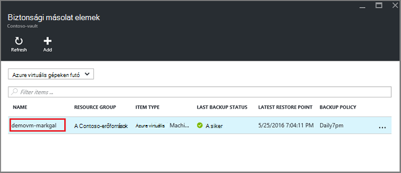
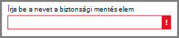
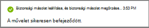

<properties
    pageTitle="Erőforrás-kezelő rendszerbe virtuális gép biztonsági másolatok kezelése |} Microsoft Azure"
    description="Megtudhatja, hogy miként kezelheti, és figyelemmel követheti az erőforrás-kezelő rendszerbe virtuális gép biztonsági másolatok"
    services="backup"
    documentationCenter=""
    authors="trinadhk"
    manager="shreeshd"
    editor=""/>

<tags
    ms.service="backup"
    ms.workload="storage-backup-recovery"
    ms.tgt_pltfrm="na"
    ms.devlang="na"
    ms.topic="article"
    ms.date="08/11/2016"
    ms.author="jimpark; markgal; trinadhk"/>

# Azure virtuális gép biztonsági másolatok kezelése

> [AZURE.SELECTOR]
- [Azure virtuális biztonsági másolatok kezelése](backup-azure-manage-vms.md)
- [Klasszikus virtuális biztonsági másolatok kezelése](backup-azure-manage-vms-classic.md)

Ez a cikk ismerteti a virtuális biztonsági másolatok kezelése, és ismerteti a portál irányítópulton rendelkezésre álló biztonsági figyelmeztetések információkat. Ez a cikk az útmutató vonatkozik a helyreállítási szolgáltatások tárolókban VMs használja. Ez a cikk nem tárgyalja a virtuális gépeken futó létrehozását, és nem nem ismertetik virtuális gépeken futó védelmét. Az erőforrás-kezelő Azure rendszerbe VMs Azure-ban védelmével kapcsolatban: egy helyreállítási szolgáltatások tárolóból elemre az alapozó című [először meg: készítsen biztonsági másolatot egy helyreállítási szolgáltatások tárolóra VMs](backup-azure-vms-first-look-arm.md).

## Tárolókban és védett virtuális gépeken futó kezelése

Az Azure-portálon a helyreállítási szolgáltatások tárolóra irányítópult a tárolóból elemre kapcsolatos tudnivalók hozzáférést biztosít az:

- a legutóbbi biztonsági pillanatkép, amely szintén a legújabb visszaállítási pont < br\>
- a biztonsági másolat házirend < br\>
- teljes méret összes biztonsági pillanatképek < br\>
- a védett a tárolóból elemre a virtuális gépeken futó száma < br\>

Nyissa meg a tárolóból elemre az irányítópulton a sok adatkezelési feladatok egy virtuális gép mentéssel kezdeni. Azonban tárolókban védelme a több elem (vagy több VMs), egy adott virtuális adatainak megjelenítéséhez is használható, mert nyissa meg az elem irányítópult tárolóból elemre. Az alábbi eljárás bemutatja, hogyan nyissa meg az *Irányítópult tárolóból elemre* , és folytassa a *tárolóból elemre az irányítópult elemre*. Nincsenek "Tipp" mindkét eljárások, hogy miként vehet fel a tárolóból elemre, és a tárolóból elemre elem az Azure irányítópult irányítópult parancs a PIN-kód használatával mutatnak. PIN-kód irányítópult a tárolóból elemre vagy elem parancsikon létrehozásának módja. Szintén a parancsikont a gyakori parancsok hajthat végre.

>[AZURE.TIP] Ha több irányítópultok van, és nyissa meg a pengéit, a sötét-kék csúszka segítségével az ablak alján húzza oda-vissza az Azure irányítópult.

### Nyissa meg a helyreállítási szolgáltatások tárolóból elemre az irányítópult:

1. Jelentkezzen be az [Azure-portálon](https://portal.azure.com/).

2. A központi menüben kattintson a **Tallózás gombra** , és az erőforrások listája, írja be a **Helyreállítási szolgáltatások**. Miközben elkezdi beírni, a lista szűrők a megadott feltételeknek. Kattintson a **helyreállítás szolgáltatások tárolóból elemre**.

      

    A tárolókban jelennek meg a helyreállítási szolgáltatások listája.

      

    >[AZURE.TIP] Ha rögzít egy tárolóból elemre az Azure-irányítópult, a tárolóból elemre érhető el azonnal az Azure portál megnyitásakor. Rögzítése a tárolóból elemre kattintva az irányítópulton a tárolóból elemre a listában, kattintson a jobb gombbal a tárolóból elemre, és válassza a **kitűzés irányítópult**.

3. A tárolókban listából válassza ki a tárolóból elemre kattintva nyissa meg az irányítópult. Ha bejelöli a tárolóból elemre, a tárolóból elemre az irányítópult és a **Beállítások** lap megnyitásához. Az alábbi képen a **Contoso-tárolóra** irányítópult kiemelt.

    

### Nyissa meg a tárolóból elemre elem irányítópult

Az előző eljárás megnyitni a tárolóból elemre az irányítópult. A tárolóból elemre elem irányítópult megnyitása:

1. Kattintson a tárolóból elemre irányítópult, akkor a **Biztonsági másolat elemek** csempe **Azure virtuális gépeken futó**.

    

    A **Biztonsági másolat elemek** lap az utolsó biztonsági mentési feladat mindegyik elemhez sorolja fel. Ebben a példában van egy virtuális gép, demovm-markgal, védett a tárolóból elemre.  

    

    >[AZURE.TIP] Esetében könnyű kezelés akkor rögzítheti az Azure irányítópult egy tárolóból elemre elemre. Rögzít egy tárolóból elemre elemre az elem listában tárolóból elemre, kattintson a jobb gombbal az elemet, és válassza az **Irányítópult PIN-kódot**.

2. A **Biztonsági mentés elemet** a lap kattintson a elemre kattintva nyissa meg a tárolóból elemre elem irányítópult.

    

    Elem irányítópult tárolóból elemre, és a **Beállítások** lap megnyitásához.

    

    Az elem tárolóra irányítópult például: elvégezhető sok főbb felügyeleti feladatok:

    - házirendjeinek módosításával, vagy hozzon létre egy új biztonsági házirendet < br\>
    - megtekintheti a visszaállítási pontot, és egységesebb állapotukban < br\>
    - virtuális gép igény szerinti biztonsági másolata < br\>
    - virtuális gépeken futó védelme leállítása < br\>
    - a virtuális gép védelmet folytatása < br\>
    - adatok biztonsági másolatának (vagy helyreállítási pont) törlése < br\>
    - [visszaállítása egy biztonsági mentése (vagy a helyreállítási pont)](./backup-azure-arm-restore-vms.md#restore-a-recovery-point) < br\>

Az alábbi eljárások kiindulási pontként elem irányítópult tárolóból elemre.

## Biztonsági házirendek kezelése

1. Az [elem az irányítópult tárolóból elemre](backup-azure-manage-vms.md#open-a-vault-item-dashboard)kattintson a **Minden beállítás** a **Beállítások** lap megnyitásához.

    

2. Kattintson a **Beállítások** lap a **biztonsági másolat házirendet** , hogy a lap megnyitásához.

    Kattintson a lap a biztonsági másolat gyakoriság és az adatmegőrzési tartomány részletek jelennek meg.

    

3. A **biztonsági házirend kiválasztás** menüből:
    - Házirendek módosításához jelöljön ki egy másik házirendet, és kattintson a **Mentés**gombra. Az új házirendet a program azonnal alkalmazza a tárolóból elemre. < br\>
    - Hozzon létre egy házirendet, jelölje be az **Új létrehozása**.

    

    Biztonsági házirend létrehozása, tanulmányozza [a biztonsági másolat házirend definiáló](backup-azure-manage-vms.md#defining-a-backup-policy).

[AZURE.INCLUDE [backup-create-backup-policy-for-vm](../../includes/backup-create-backup-policy-for-vm.md)]

## A virtuális gép igény szerinti biztonsági másolata
Az igény szerinti virtuális gép biztonsági másolatot készíthet, miután védelem be van állítva. Függőben lévő a kezdeti biztonsági mentés esetén igény szerinti biztonsági másolatot a virtuális gép teljes másolatot készít a helyreállítási szolgáltatások tárolóból elemre. Ha a kezdeti biztonsági mentés befejeződik, az igény szerinti biztonsági mentése csak küld módosításokat az előző pillanatkép a a helyreállítási szolgáltatások tárolóból elemre. További másolatok Ez azt jelenti, hogy mindig egyre növekvő tendenciát mutat.

>[AZURE.NOTE] Az igény szerinti biztonsági másolat adatmegőrzési tartománya a napi biztonsági másolat pontra a házirend megadott adatmegőrzési értéke. Ha nincs napi biztonsági pont ki van jelölve, a heti biztonsági pont használják.

Az igény szerinti biztonsági másolat virtuális gép elindító:

- Az [elem az irányítópult tárolóból elemre](backup-azure-manage-vms.md#open-a-vault-item-dashboard)kattintson a **biztonsági másolat letöltése**.

    

    A portálon meggyőződik arról, hogy szeretne-e az igény szerinti biztonsági mentési feladat kezdeni. Kattintson az **Igen gombra** kattintva indítsa el a biztonsági mentést.

    

    A biztonsági mentési feladat pontot hoz létre helyreállítási. Az adatmegőrzési a helyreállítási pont tartománya ugyanaz, mint a házirendet a virtuális gép társított megadott adatmegőrzési tartományt. A **Biztonsági másolat feladatok** csempére kattintva a tárolóból elemre irányítópulton a projekt haladásának nyomon követése.  

## Virtuális gépeken futó védelem megszüntetése
Ha úgy dönt, hogy egy virtuális gép védelme leállítása, megkérdezi, ha meg szeretné őrizni a helyreállítási pontjait. Kétféleképpen le szeretné állítani a virtuális gépeken futó védelme:
- összes jövőbeli biztonsági mentési feladat leállítása és helyreállítási adatpontjainak törlése vagy
- összes jövőbeli biztonsági mentési feladat leállítása, de hagyja az helyreállítási pontok  

A helyreállítási pontok elhagyása tárolóban lévő társított költség van. Azonban a hagynia a helyreállítási pontok előnye vissza tudja állítani a virtuális gép újabb, ha szükségesnek látja. Információt a költség hagynia a helyreállítási pontok olvassa el a [Részletek árak](https://azure.microsoft.com/pricing/details/backup/)című témakört. Ha úgy dönt, hogy az összes helyreállítási pont törlése, a virtuális gép nem állítható vissza.

Virtuális gép védelem megszüntetése:

1. [Tárolóból elemre az elemek irányítópult](backup-azure-manage-vms.md#open-a-vault-item-dashboard)kattintson a **biztonsági másolat leállítása**gombra.

    

    A Stop biztonsági másolat lap megnyitása

    

2. A **Biztonsági leállítása** a lap válassza ki, hogy megőrzi az adatok és törlése a biztonsági másolat. Az adatai párbeszédpanel a kiválasztott ismerteti.

    

3. Ha azt választotta, hogy az adatok biztonsági másolatának megőrzése, ugorjon a 4. Ha az adatok biztonsági másolatának törölni szeretne, erősítse meg, hogy szeretné-e a biztonsági mentési feladat leállítása, és törölje a helyreállítási pontok - írja be az elem nevét.

    

    Ha nem biztos az elem neve, mutasson a felkiáltójel jelenik meg. Az elem nevét is a **Stop biztonsági mentése** elemre a lap tetején.

4. Tetszés szerint adja meg a **Megjegyzés**vagy egy **miatt** .

5. Az aktuális elem a biztonsági mentési feladat befejezéséhez kattintson a  

    Értesítő üzenet jelzi, hogy a biztonsági másolat feladatok leállt.

    

## A virtuális gép védelem folytatása
Ha a **megőrizni biztonsági mentése** lehetőséget választotta, amikor a virtuális gép védelmének leállt, majd ajánlatos védelmet folytatása. Ha a **Biztonsági másolat adat törlése** lehetőséget választotta, a virtuális gép védelme nem folytatható.

A virtuális gép védelmet folytatása

1. A [tárolóból elemre az elemek irányítópult](backup-azure-manage-vms.md#open-a-vault-item-dashboard)kattintson a **biztonsági másolat Folytatás**parancsra.

    

    A biztonsági másolat házirend lap megnyitása

    >[AZURE.NOTE] Amikor újra védheti a virtuális gép, megadhatja, hogy a házirendet, amellyel virtuális gép védett először egy másik szabályt.

2. Kövesse a [házirendek megváltoztatása vagy a biztonsági mentés új házirend létrehozása](backup-azure-manage-vms.md#change-policies-or-create-a-new-backup-policy), a virtuális gép a házirendet hozzá szeretné rendelni.

    Miután a biztonságimásolat-házirend alkalmazása a virtuális géphez a következő üzenet jelenik meg.

    

## Biztonsági másolat adat törlése
Adatok biztonsági másolatának virtuális gép társított törölheti a **biztonsági másolat leállítása** projekt során, vagy a biztonsági mentés után bármikor feladat befejeződött. Akkor is lehet előnyös várnia napi vagy heti a helyreállítási pontok törlése előtt. Adatok biztonsági másolatának törlésekor a helyreállítási pontok, visszaállításához eltérően adott helyreállítási pontok törlése nem választhatja ki. Ha úgy dönt, hogy az adatok biztonsági másolatának törlése, törölheti az elemhez tartozó összes helyreállítási pont.

Az alábbi eljárás feltételezi, hogy a virtuális gép az biztonsági mentési feladat leállt vagy tiltható le. Miután az biztonsági mentési feladat le van tiltva, a tárolóból elemre elem irányítópulton a **folytathatja a biztonsági mentés** és **biztonsági másolat törlése** elem érhetők el.

A *biztonsági másolat letiltva*virtuális gépen adatok biztonsági másolatának törlése:

1. Az [elem az irányítópult tárolóból elemre](backup-azure-manage-vms.md#open-a-vault-item-dashboard)kattintson a **biztonsági másolat törlése**.

    

    A **Biztonsági másolat adat törlése** a lap megnyitása

    

2. Írja be a nevét az elemet választva erősítse meg a helyreállítási pontok törlése.

    

    Ha nem biztos az elem neve, mutasson a felkiáltójel jelenik meg. Az elem nevét is a **Biztonsági másolat adat törlése** a lap tetején.

3. Tetszés szerint adja meg a **Megjegyzés**vagy egy **miatt** .

4. Az adatok biztonsági másolatának az aktuális elem törléséhez kattintson  

    Értesítő üzenet jelzi, hogy a biztonsági adatok törölve lett.

## Következő lépések

További információkat újra a helyreállítási helyétől virtuális géphez kivétele [Azure VMs visszaállítása](backup-azure-restore-vms.md). Ha segítségre van szüksége a virtuális gépeken futó védheti, olvassa el a [először meg: készítsen biztonsági másolatot a helyreállítási szolgáltatások tárolóra VMs](backup-azure-vms-first-look-arm.md). Információ a eseményeinek figyelése [Azure virtuális gép biztonsági másolatok Monitor értesítéseket](backup-azure-monitor-vms.md)szeretné látni.
